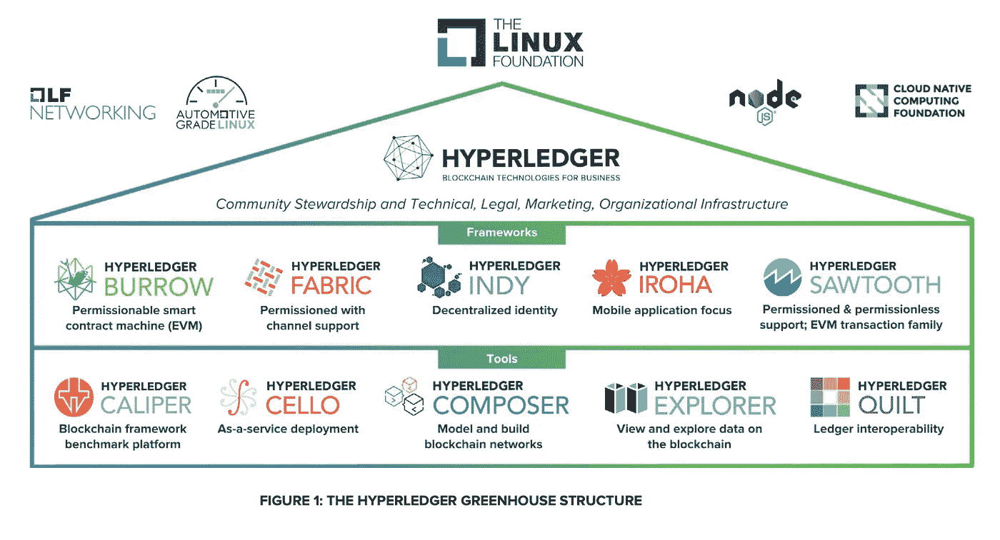

# 作为工具的区块链— Hyperledger

> 原文：<https://medium.com/coinmonks/blockchain-as-a-tool-hyperledger-27be0f1db5cd?source=collection_archive---------35----------------------->

网络泡沫的破灭并没有扼杀互联网。

更好的是，它从市场中剔除了不符合保持健康和生产力要求的投机膨胀的项目。同样的事情现在正在 web3 中发生，这再正常不过了。

没有什么比适者生存更自然的了。当然，你可以通过印钞票让一个垂死的金融体系活得更久一点，但随你怎么想，我们不会全速撞墙。

更不用说我们面临的无数其他宏观和微观问题了。

Taken from Gunshow — By KC Green

就像没有公司吹嘘他们的办公室或网站有 Wi-Fi 一样，区块链注定会成为一种工具，而不是一种身份。

颠覆性技术的技术复杂性使得公司可以利用它们大赚一笔。

但是开源软件文化正在进入它的最佳时代，区块链并不是热爱共享的开发者的最后一个待办事项。

## 超级分类帐

进入一个巨大的开源私有区块链。

Taken from the Hyperledger whitepaper

Hyperledger 是一个区块链解决方案，允许公司建立自己的工具，同时利用大型分散区块链的安全性和小型私人工具的隐私性和模块化。

它通过允许公司创建交换私人信息的私人渠道来实现这一点，同时出于可验证性和安全性的目的，在更大的区块链中进行孵化。

对于公司来说，使用公开的区块链和他们的本土代币有太多的不利之处:就像经历市场的起伏一样，去中心化和隐私问题带来的交易成本——不仅涉及他们的客户，也涉及他们好奇的竞争对手。

另一方面，开发区块链和所有必要的智能合同对中小企业来说可能遥不可及，因为它们既没有时间也没有钱投资于此类活动。

这就是为什么开源解决方案听起来如此之好。

## 二等兵区块链

区块链的基本要素是:

*   交易清单。
*   将信息总结为一串字符的散列，如果对所述信息进行任何改变，该串字符将彻底改变，这保证了数据的完整性。
*   将交易列表分成多个块，以促进和评估挖掘者和验证者的工作，但主要是为了创建一个人工年表，并解决数字货币的重复支出问题。
*   交易列表由多个参与者保存，以进一步确保其完整性。

你猜对了，私有和公共区块链之间的唯一区别是谁保存交易的副本(即谁有权访问它)。

最重要的是，隐私是大规模采用区块链技术的一个最重要的障碍，因为公司不能让他们的财务数据受到公众的审视。

总的来说,《超级账本》和《二等兵区块链》很像是一个解决方案。

## 超级账本方法

Hyperledger 成立于 2015 年，由 Linux 基金会托管，它不是一个区块链，而是一个开发人员协会，在他们的私人区块链“Hyperledger Fabric”上创建工具。

它们提供了创建子网的能力——非常类似于雪崩，或者相反——这些子网被称为通道。

Hyperledger 是用 Go 编码的，但是如果你愿意，你也可以用 java 或 javascript 编码。

他们对每个项目的理念是由无可争议的安全性、模块化、加密货币不可知论和促进集成的 API 组成的。

它更像是一个环境，在这里，区块链的有用特征像模块块一样被构建，这些模块块可以被重复使用和组合，以形成为企业和非营利组织量身定制的完美解决方案。

最棒的是它对非营利组织完全免费。

此外，您没有**拥有**来使用 Hyperledger 解决方案。因为它是开源的，你可以下载他们的全部代码并构建你自己的解决方案。

您“仅仅”需要托管节点的工具和定义共识机制规则的能力。

## 总结想法

为了让您更好地了解该项目的规模，该协会的一些最著名的成员不是别人，正是 IBM、Consensys、美国运通、ripple、西门子、Visa、Input Output、华为或摩根大通。

区块链有一个光明的未来，学习开发这样一个工具可能是一个好主意。

最好的创新发生在紧闭的门后，即使今天这些门由于开源思维而实际上是敞开的。

不要让今天的血战影响了你的判断，只要更深入地去发现那些真正开发 web3 的人所说的话。

一如既往，时间会证明一切。

## 为了更深的潜水

*   [介绍性白皮书](https://www.hyperledger.org/wp-content/uploads/2018/08/HL_Whitepaper_IntroductiontoHyperledger.pdf)
*   [Hyperledger 架构白皮书](https://www.hyperledger.org/wp-content/uploads/2017/08/Hyperledger_Arch_WG_Paper_1_Consensus.pdf)
*   [Hyperledger 的网站](https://www.hyperledger.org/)
*   [成员名单](https://www.hyperledger.org/about/members)

> 加入 Coinmonks [电报频道](https://t.me/coincodecap)和 [Youtube 频道](https://www.youtube.com/c/coinmonks/videos)了解加密交易和投资

# 另外，阅读

*   [AscendEx 保证金交易](https://coincodecap.com/ascendex-margin-trading) | [Bitfinex 赌注](https://coincodecap.com/bitfinex-staking) | [bitFlyer 点评](https://coincodecap.com/bitflyer-review)
*   [Bitget 回顾](https://coincodecap.com/bitget-review)|[Gemini vs block fi](https://coincodecap.com/gemini-vs-blockfi)cmd |[OKEx 期货交易](https://coincodecap.com/okex-futures-trading)
*   [AscendEx Staking](https://coincodecap.com/ascendex-staking)|[Bot Ocean Review](https://coincodecap.com/bot-ocean-review)|[最佳比特币钱包](https://coincodecap.com/bitcoin-wallets-india)
*   [霍比评论](https://coincodecap.com/huobi-review) | [OKEx 保证金交易](https://coincodecap.com/okex-margin-trading) | [期货交易](https://coincodecap.com/futures-trading)
*   [网格交易机器人](https://coincodecap.com/grid-trading) | [Cryptohopper 审查](/coinmonks/cryptohopper-review-a388ff5bae88) | [Bexplus 审查](https://coincodecap.com/bexplus-review)