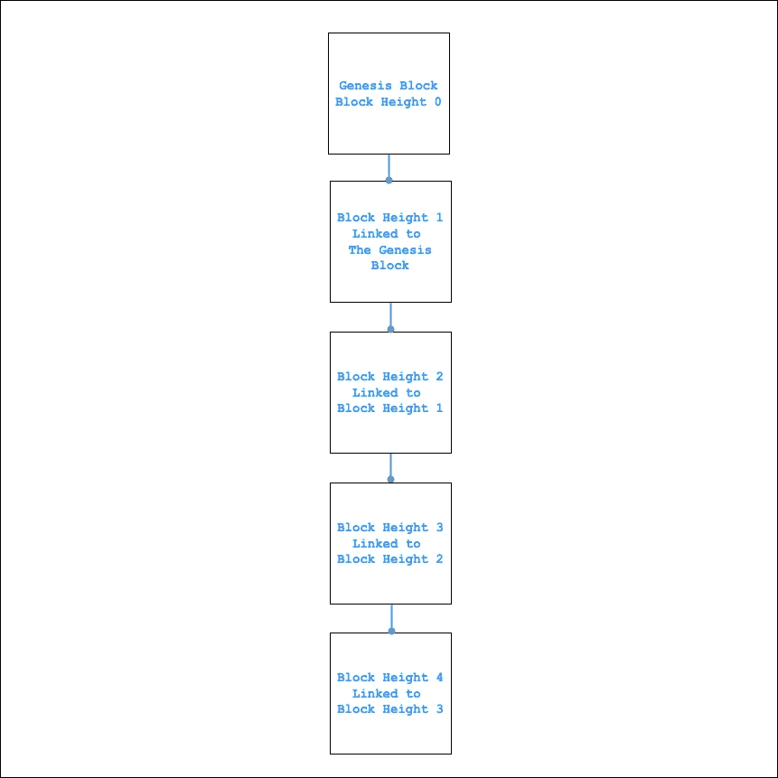
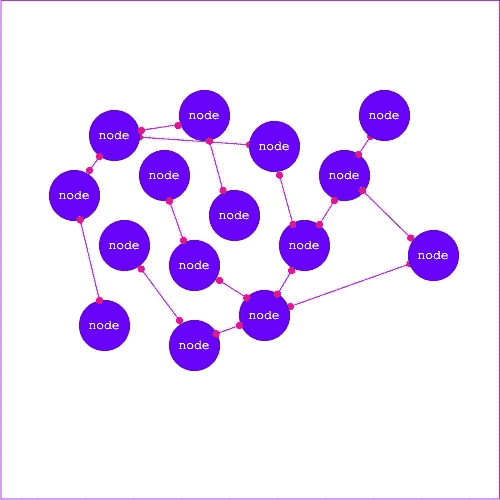

# 区块链，比特币，还有我对中本聪的爱

> 原文：<https://medium.com/coinmonks/blockchain-bitcoin-and-my-love-for-satoshi-nakamoto-136e81fba9c6?source=collection_archive---------11----------------------->


Bitcoin image on forbes.com

区块链技术和比特币是过去十年中人们谈论最多的话题之一，没有一周没有关于区块链或比特币的消息，一些消息是积极的，而另一些是消极的，但该技术继续发展，并获得了更多的采用。区块链技术**比特币**第一次成功并被普遍接受的实施已经有 13 年了，比特币网络始于 2009 年，并且一直在持续增长，我也相信它还会存在很多年。

***在这篇文章中，我会尽可能简单地解释区块链/比特币。***

## **那么什么是区块链呢？**

区块链是经过验证的**区块**的列表，每个区块都链接到其前一个区块，一直到 **genesis 区块**。

## **块**

块是一组带有时间戳的事务和前一个块的散列。块头被散列以产生工作证明，从而验证事务。当区块被成功开采和验证后，它们被**网络共识**添加到区块链中。



Blockchain dummy image

## **创世纪区块**

创世纪板块是用来启动区块链的第一块板块。

当我开始写这篇文章时，比特币的当前块高度是 **722100** ，从高度 **722100** 开始的每个块都链接到前一个块，直到创世纪块高度 0。

## **比特币是什么？**

比特币是一种通货紧缩的虚拟数字货币，俗称加密货币，由一个分散的点对点系统驱动。

对于区块链核心开发者来说，比特币这个词的意义比我最初的定义要多一点，它可以被定义为形成数字货币生态系统基础的概念和技术的集合。

比特币也是一种数字货币单位，用于在比特币网络参与者之间存储和转移价值。

***satoshi 是比特币的最小单位，1 亿 Satoshi(100，000，000)制作一枚比特币。***

比特币是中本聪创造的，我们都不知道聪是谁，或者他们是谁。Satoshi 陈述了他创建比特币项目的原因，你可以在比特币的 [**白皮书**](https://bitcoin.org/bitcoin.pdf) 中阅读，在比特币成功之前，有许多其他失败的数字货币，Satoshi 结合了许多这些失败项目的概念，以及其他密码学材料来构建比特币，这成为了第一种成功的数字货币。

比特币之前的大多数数字货币项目失败的原因之一是集中化和其他问题，如重复支出。因此，中本聪提出并建立了一个分散的系统，使节点(计算机)能够相互通信，并在没有中央机构或单点故障的情况下验证交易。

## **比特币是如何运作的？**

比特币由世界各地的节点提供动力，这些节点形成一个没有中央权威的对等网络，比特币节点可以创建、验证和传播交易，将交易添加到块中，挖掘块，并传播到网络中的其他节点。

比特币用户主要通过互联网使用比特币协议相互通信，尽管也可以使用其他传输网络。作为开源软件，比特币协议栈可以在多种计算设备上运行，包括笔记本电脑和智能手机，这使得该技术易于使用。

比特币是开源的，这意味着每个了解其工作原理的人都可以为该项目做出贡献，比特币的对等网络对每个人都是开放的，这意味着任何人都可以运行比特币节点，只要你有所需的磁盘空间、内存和带宽，交易、地址和块是比特币对等网络上传播的主要数据类型。



bitcoin network illustration

## **比特币节点类型**

*   **完全节点:**完全节点是黄金标准，它们执行所有的共识规则，接收、验证事务和阻塞，并且还将它们传播到网络上的其他节点。完整节点也称为完整验证节点。运行完整节点是使用比特币最安全和最隐私的方式，但你必须有大量的硬盘空间、内存和互联网数据才能运行完整节点。
*   **修剪节点:**修剪节点是比特币全节点，不保留区块链的完整历史，以节省磁盘空间。它们按照节点所有者的清理设置来清理块。想要运行比特币节点，但没有足够的磁盘空间来运行完整节点的用户可以使用这种节点。
*   **SPV(简单支付验证)节点/轻量级客户端:** SPV 节点是完美的磁盘空间和功率受限的设备，例如移动设备，它们下载块报头而不下载块交易，块报头比完整的区块链本身小一千倍。SPV 节点依赖完整节点来验证事务。
*   **挖掘节点:**挖掘节点，传播、验证事务，将事务聚合成块并进行挖掘。为了成功挖掘区块，矿工必须解决比特币的工作证明算法，在成功挖掘区块后，他们将区块传播到网络的其余部分。在 rest 节点验证他们的区块后，它将被添加到区块链，成功挖掘区块的矿工将获得**区块奖励。**

## **比特币是如何产生的？**

比特币有 2100 万(2100 万)的有限供应量，它们将只有 2100 万比特币存在，不像普通货币有无限的供应量。

新的比特币被发放给成功解决工作证明难题的矿工，作为对他用于开采区块的计算工作的激励，这种激励被称为**区块奖励。**发放给获胜矿工的比特币正在以递减的速度减少，大约每四年奖励减半 **210，000 块**具体来说，这个过程被普遍称为**比特币减半，**比特币不能通过印刷/开采新硬币来膨胀，因为它本质上是有限的。目前的**区块奖励为 6.25BTC，****区块奖励将继续减半，直到 2040 年左右开采出最后一个比特币。**

****什么是工作证明？****

**工作证明是一个矿工需要解决的数学难题，以成功开采一个区块。矿工的系统将重复散列(特别是 SHA-256 散列)比特币块的块头，直到它发现一个小于指定值**、**的值。每次重复，**随机数**的值递增，随机数被添加到块头，并被散列。当一个矿工解决难题并成功挖掘出一个区块时，该区块将被传播到比特币网络中的其他节点，其他节点可以很容易地验证该矿工的实际；y 通过向块报头添加随机数并散列它是否产生相同的输出来解决难题，并且该块被共识规则验证为 ok，他们将把新块添加到他们的区块链。**

**比特币**难度**在 2016 块之后重新定位，大约 2 周达到比特币的难度目标，即 10 分钟。这个过程被称为**难度重新定位**，这意味着大约每 10 分钟就会挖掘新的比特币块，这可能需要 10 分钟以上，或者更短时间。10 分钟是难度目标。**

## ****比特币地址和密钥****

**比特币是**密码术的完美实现，c** 密码术可以用来证明知道一个秘密而不泄露那个秘密**(数字签名)**，它还可以证明数据的真实性**(数字指纹)。****

**比特币的所有权通过数字密钥、比特币地址*和数字签名来确认。密钥不存储在比特币网络上，而是由用户钱包创建和存储*，*数字密钥在比特币网络中实现了许多分散的信任和控制。***

**大多数比特币交易要求在区块链中包含有效的数字签名，该数字签名只能通过私钥生成，任何拥有该私钥副本的人都可以控制比特币。**

**有两种主要类型的密钥私人(秘密)密钥和公共密钥，公共密钥类似于银行帐号，而私人密钥类似于可以被看作是一个秘密的个人识别码，或密码，让您进入您的帐户。**

## ****私钥****

**私钥是使用随机数生成的，所有权和对私钥的控制是用户控制与相应比特币地址相关联的比特币的根本。**

*****比特币用户必须确保自己的私钥得到安全保管，比特币网络上任何拥有用户私钥副本的人都可以消费自己的比特币。*****

```
// Private Key ExampleSK = 5J3mBbAH58CpQ3Y5RNJpUKPE62SQ5tfcvU2JpbnkeyhfsYB1Jcn
```

## ****公钥****

**使用 **ECDSA** (椭圆曲线数字签名算法)从私钥生成公钥，ECDSA 是一种单向散列数据的算法，即在使用 ECDSA 散列数据后，它是不可逆的，这确保了用户私钥的安全。即使公钥被暴露，公钥也不能被反转以生成用户私钥。**

```
// Public Key ExamplePK = 04F018792BAE7ED57D2FB57BF93081D5CFCF6F9ED3D3D7F159C2E2FFF579DC341A07CF33DA18BD734C600B96A72BBC4749D5141C90EY8AC328AE52DDFE2E505BDE// Compressed Public Key ExampleCPK = 03E028892BAD7ED5*D2FB57BF34081D5CHCF6F9E03D3D7F159C2E2FFF579DC341B
```

## ****地址****

**比特币地址是一串数字和字符，任何人都可以分享给你一些比特币，有两种流行的比特币地址类型 **P2PKH** (支付给公钥哈希)和 **P2SH** (支付给脚本)**

**P2PKH 是最常见的比特币地址类型**

**P2PKH 地址从 1 开始，任何以数字 **1** 开始的比特币都是 P2PKH 地址，P2PKH 是通过使用单向双哈希函数哈希公钥得到的，公钥将使用 **SHA256、**哈希，然后 SHA256 哈希值将使用 **RIPEMD160 哈希。****

```
// Address Hash ExampleADDRESS = RIPEMD160(SHA256(k))
```

**然后散列结果将被编码为 **base58 格式**，base58 格式是 **base64 编码**的一个子集，开发出来用于比特币，为了用户的可读性，除了一些 base64 字符，像**零(0)和字母 O** 这样的字符看起来非常相似。如果用户想将比特币发送到一个特定的地址，而输入零而不是字母 O，这会使地址不同，使用错误地址发送的比特币可能会永远丢失。**

```
BASE64 = 123456789ABCDEFGHJKLMNPQRSTUVWXYZabcdefghijkmnopqrstuvwxyz// Pay To Public Key Address Example1J7mdg5rbQyUHENYdx39WVWK7fsLpEoXZy
```

**P2SH 是一种为更复杂的交易打开大门的地址，例如**托管**交易，以及比特币网络上的其他交易，他们将比特币交易的受益人指定为脚本的散列。花费 P2SH 交易需要的不仅仅是提供一个公钥散列和一个私钥签名作为所有权证明。要使用发送到 P2SH 地址的比特币，P2SH 地址的创建者需要提供用于创建 P2SH 的脚本。**

**P2SH 地址是根据事务脚本创建的，它定义了谁可以使用事务输出。编码 P2SH 地址时使用了与 P2PKH 地址相同的双哈希函数，但是哈希函数会对事务脚本进行哈希处理，这与对公钥进行哈希处理的 P2PKH 不同，然后哈希结果将被编码在 base58 中，前缀为 **5****

```
// Pay To Script Hash Example3J65t1WtEk25CNmQviecrnyiWadfRhWNLy
```

**P2SH 地址以数字 **3** 开头**

**Segwit 的实现也带来了新型的比特币地址 **P2WPKH** (付费观看公钥哈希)和 **P2WSH** (付费观看脚本哈希)**

## ****比特币交易****

**比特币交易由**输入和**输出组成。输入应被视为借项，而输出则是贷项。比特币交易告知比特币网络，某个比特币价值的所有者已授权将该价值转移给网络上的其他人。币基交易是唯一没有输入的交易类型，它们将第一个交易添加到一个区块中，用于向矿商支付区块报酬。除了 coinbase 交易之外，任何比特币交易都必须有一个或多个输入，以及一个或多个输出。如果不符合这一要求，该交易将无效。**

*****比特币钱包余额是用户 UTXO(未用交易量)的总和。*****

## ****输入****

**交易输入应被视为借项，输入数据具有数字签名 **Scriptsig** 也被称为解锁脚本，用于验证用户是否有权使用交易输出，Scriptsig 是所有权的证明**

## ****输出****

**输出是信用，输出数据有数字签名**scriptpubkey**也称为锁定脚本**

**投入和产出(借方和贷方)的总和不一定相等。相反，产出加起来应该略少于投入，差额将是一笔**交易费**，这是矿工收取的一笔小额付款，他将交易计入总账。**

## ****关于比特币的学习水平****

**根据你学习比特币的动机，所有人可能都想知道如何购买或交易比特币以及如何保护你的私钥和比特币，或者你想成为一名比特币应用程序开发人员，为其他人制作比特币应用程序以轻松进行比特币交易，或者你可能决定像尼日利亚流行歌曲“你想 bam ba！你想和大人物们一起放松”，通过深入学习成为一名比特币核心/协议开发者，你可以学习以下三个层次之一:**

*   ****作为基础用户学习:**要成为基础用户，你要做的就是对区块链和比特币有一个基本的了解，在哪里以及如何购买比特币，如何保护你的比特币和私钥。将你的比特币储存在**冷藏钱包**中是保护你的比特币的好方法，冷藏钱包是不联网的钱包。**
*   ****学习成为一名比特币开发者:**比特币开发者构建比特币解决方案/应用程序他们可以运行他们的比特币节点，然后使用比特币节点[**RPC API *命令***](https://developer.bitcoin.org/reference/rpc/) 与区块链网络交互，或者使用第三方 API 与区块链网络交互**
*   ****学习成为比特币核心开发者:**比特币核心开发者是比特币的协议制定者，他们了解比特币背后的技术细节，以及区块链技术，他们为比特币网络提出建议并进行改进/升级。比特币核心开发者使用 **BIP(比特币改进提案)**对比特币网络提出改进建议，BIP 是用于介绍比特币升级、功能或信息的设计文档。理解比特币和区块链背后的技术细节并不是一件容易的事情，人们必须进行大量的学习、研究和工作。我推荐 **Qala 的比特币项目**如果你是一名想要学习比特币技术和协议的非洲软件工程师，你应该 **v** 访问 [**Qala 网站**](https://qala.dev/) 如果你想成为下一代非洲比特币和闪电开发者之一**

****我为什么爱中本聪****

**就像一句流行的谚语所说的那样:“把荣誉给予该给予的人”我想稍微写一下中本聪。在比特币之前，其他数字货币已经被创造出来，但是他们失败了。他们大多数失败的主要原因是中央集权，其他原因是双重消费，T21 错误，以及欺诈用户金钱的欺诈创造者。**

**Satoshi 用于创建比特币的大多数概念在 Satoshi 开始研究比特币之前就已经在研究了，Satoshi 捡起了那些被遗忘的想法，并通过创建一个不可信的对等网络解决了比特币之前数字货币面临的集中化问题，数字签名的使用也解决了双重支出问题，所有这些概念共同帮助 Satoshi 开发了第一种成功的数字货币。**

**Satoshi 并没有试图欺骗人们来丰富自己，这不是他创造比特币的动机，在比特币早期采用者表示，他挖掘了大量的区块，并获得了高达 100 万美元的比特币作为区块奖励，即使比特币的价值已经升得如此之高。如果 Satoshi 决定出售他的比特币，他今天将成为亿万富翁，但这并没有发生，这些比特币直到今天还没有花掉，这表明他对钱不感兴趣，Satoshi 在 2010 年 12 月离开了比特币项目。在该项目开始在开源社区手中获得成功后，比特币继续由比特币社区改进。自从 Satoshi 离开后，一些人认为离开比特币是他最大的贡献之一。**

**Satoshi 是一个稀罕物，只有极少数人会开发这样一个已经变得如此有价值的项目，并且不希望从中获得任何我们知道的收益，他的行为有助于从用户那里建立更多的信任，也为比特币协议开发人员设定了一个标准，即他们应该做什么。**

**虽然没人知道中本聪是谁，或者他们是谁，但他是一个没有面孔的受欢迎的人物。**

## ****结论****

**区块链技术和比特币已经获得了世界各地用户的赞赏，我相信比特币的包容性将继续增长，随着越来越多的用户和开发者继续对比特币感兴趣，这项技术将继续改进，如果比特币由于一些不可预见的原因而失败，我们有很好的技术知识来建立比我们今天更好的东西，所以我坚信比特币只会变得更好。**

> **加入 Coinmonks [电报频道](https://t.me/coincodecap)和 [Youtube 频道](https://www.youtube.com/c/coinmonks/videos)了解加密交易和投资**

## **也阅读**

**[](/coinmonks/crypto-trading-bot-c2ffce8acb2a) [## 加密交易机器人——19 款最佳免费加密交易机器人

### 2022 年币安、比特币基地、库币和其他密码交易所的最佳密码交易机器人。四进制，位间隙…

medium.com](/coinmonks/crypto-trading-bot-c2ffce8acb2a) [](/coinmonks/best-crypto-signals-telegram-5785cdbc4b2b) [## 最佳 4 个加密交易信号电报通道

### 这是乏味的找到正确的加密交易信号提供商。因此，在本文中，我们将讨论最好的…

medium.com](/coinmonks/best-crypto-signals-telegram-5785cdbc4b2b) [](https://coincodecap.com/bitsgap-review) [## Bitsgap 评论-交易机器人加密信号和套利 2022

### 这篇文章的重点是 Bitsgap 审查，这是一个最终的交易解决方案，并提供交易机器人，信号…

coincodecap.com](https://coincodecap.com/bitsgap-review) [](https://coincodecap.com/best-telegram-channels) [## 40 个最佳电报频道，用于加密、电影、表演和演讲| CoinCodeCap

### 免费下载所有电影。德国免费加密信号。下载讲座。CoinCodeCap 经典，网飞电影等。是……

coincodecap.com](https://coincodecap.com/best-telegram-channels) [](https://coincodecap.com/keevo-wallet-review) [## Keevo 钱包点评:是最安全的硬件钱包吗？2022 | CoinCodeCap

### 在这篇 Keevo Wallet 评论中，我们将讨论他们如何改变我们看待硬件钱包的方式。基沃是…

coincodecap.com](https://coincodecap.com/keevo-wallet-review) [](https://coincodecap.com/best-social-trading-platforms) [## 2022 年 5 大最佳社交交易平台

### 5 个最佳社交交易平台阅读加密产品评论和比较，了解比特币交易和…

coincodecap.com](https://coincodecap.com/best-social-trading-platforms) [](https://coincodecap.com/blockfi-review) [## BlockFi 评论:2022 年的利弊和利率

### 今天，我们提出了一个全面的 BlockFi 评论，这是一个成立于 2017 年的加密贷款平台，拥有其…

coincodecap.com](https://coincodecap.com/blockfi-review) [](/coinmonks/buy-bitcoin-in-india-feb50ddfef94) [## 如何在印度购买比特币？2021 年购买比特币的 7 款最佳应用[手机版]

### 如何使用移动应用程序购买比特币印度

medium.com](/coinmonks/buy-bitcoin-in-india-feb50ddfef94) [](/coinmonks/best-crypto-tax-tool-for-my-money-72d4b430816b) [## 加密税务软件——五大最佳比特币税务计算器[2021]

### 不管你是刚接触加密还是已经在这个领域呆了一段时间，你都需要交税。

medium.com](/coinmonks/best-crypto-tax-tool-for-my-money-72d4b430816b) [](https://coincodecap.com/crypto-to-buy-in-2022) [## 9 个 2022 年最值得购买的密码| CoinCodeCap

### 9 个 2022 年最值得购买的加密产品阅读加密产品评论和比较，了解比特币交易和…

coincodecap.com](https://coincodecap.com/crypto-to-buy-in-2022)**