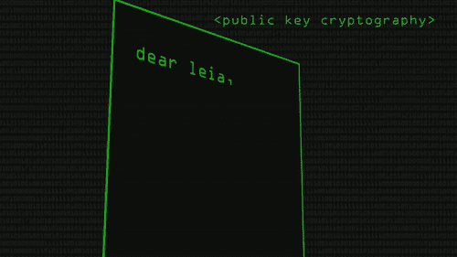
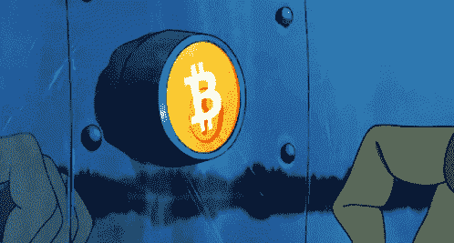

# 区块链博客 06 —密码学、安全性和加密钱包

> 原文：<https://medium.com/coinmonks/blockchain-blog-06-cryptography-sha-and-wallets-438a92921f1c?source=collection_archive---------11----------------------->

自从银行系统建立以来，银行和信用卡公司就帮助我们保护我们的钱。但当涉及到加密货币时，我们需要了解不同的安全方面。

**密码学**是加密货币的核心。在这个新的数字现实中，加密技术将会保护你的钱。

> **密码术**是对安全通信技术的研究，只允许消息的发送者和预定接收者查看其内容。这个词来源于希腊语 kryptos，意思是隐藏的。密码术与加密密切相关，加密是将普通文本加扰为所谓的密文，然后在到达时再返回的行为。如果消息被截获，第三方就拥有了解密和阅读消息所需的一切。(来源:[卡巴斯基](https://www.kaspersky.com/resource-center/definitions/what-is-cryptography#:~:text=Cryptography%20is%20the%20study%20of,word%20kryptos%2C%20which%20means%20hidden.&text=If%20the%20message%20is%20intercepted,decrypt%20and%20read%20the%20message.))

1976 年，马丁·赫尔曼和惠特菲尔德·迪菲发表了一篇论文:密码学的新方向。它引入了一种全新的分发密钥的方法，这种方法极大地解决了密码学中的一个基本问题，密钥分发。它被称为 Diffie-Hellman 密钥交换。这篇文章刺激了一种新的加密算法的发展，这种算法被称为公钥加密和非对称加密。几年后，作为一名大学生，Merkle 设计了 Merkle's Puzzles，这是一种通过不安全的信道进行通信的方案，是班级项目的一部分。这个方案现在被认为是公开密钥加密的早期范例。

相比之下，在公钥系统中，公钥可以广泛公开地传播，只有相应的私钥需要由其所有者保密。

**公钥**就像一个电子邮件地址，通过它你可以发送加密货币。这里的**私钥**就像一个密码，只有你才能访问，才能访问我们的密码。因此，如果有人需要向我发送加密货币，他们需要我的公钥，如果我需要访问已发送给我的加密货币，我需要一个私钥。**公钥**密码术，或**非对称密码术**，是一种使用成对密钥的密码系统。每对密钥由一个公钥(其他人可能知道)和一个私钥(除了所有者之外，其他人可能不知道)组成。这种密钥对的生成依赖于基于称为单向函数的数学问题的加密算法。有效的安全性要求保持私钥的私密性；公钥可以公开分发，而不会危及安全性。如果丢失了公钥，可以通过私钥生成新的公钥，但是如果丢失了私钥，则无法恢复。

现在，当我们谈论加密货币时，最好了解密码学的基础知识，因为每当有计算机编程相关的创新时，总会有与之相关的漏洞，当我们谈论涉及巨额资金的事情时，最好了解上述术语。

## 安全哈希算法

有一种叫做 SHA 的东西代表安全哈希算法。SHA 是安全散列算法的首字母缩写，用于散列数据和证书文件。SHA-256 用于加密安全。加密哈希是文本或数据文件的一种“签名”。

哈希不是“加密”，它不能被解密回原始文本(它是一种“单向”加密函数，对于任何大小的源文本都是固定大小的)。这使得它适合于比较文本的“散列”版本，而不是解密文本以获得原始版本。

**SHA-256** 是 SHA-1(统称为 SHA-2)的后继哈希函数之一，也是目前最强的哈希函数之一。SHA-256 的代码并不比 SHA-1 复杂多少，也没有受到任何损害。该算法是美国国家安全局(NSA)开发的 SHA-2(安全哈希算法 2)的变体。SHA-256 还用于流行的加密协议，如 SSL、TLS、SSH，以及开源操作系统，如 Unix/Linux。哈希算法非常安全。它被美国政府用来保护敏感信息，因为它能够验证数据的内容，而不会因为使用数字签名而泄露数据。此外，它还用于密码验证，因为它方便地不需要存储精确的密码，因为哈希值可以存储并与用户输入匹配，以验证它是否正确。

即使我们改变 1 个文本，整个散列将重新生成。

安全哈希算法(SHA) -256 是比特币协议的哈希函数和挖掘算法，指的是输出 256 位长值的加密哈希函数。它调节地址的创建和管理，也用于交易验证。

> 为文本生成 256 位签名的加密哈希函数，用于比特币**工作证明(PoW)** 。

安全哈希算法(SHA) -256 是比特币协议的哈希函数和挖掘算法，指的是输出 256 位长值的加密哈希函数。它调节地址的创建和管理，也用于交易验证。比特币使用双 SHA-256，这意味着它应用哈希函数两次。从哈希值本身揭示初始数据几乎是不可能的。此外，由于潜在组合的天文数字，暴力攻击极不可能成功。此外，两个数据值(称为冲突)具有相同的散列也是极不可能的。

**加密货币，公钥和私钥**

加密货币钱包的工作原理是生成一个理论数字或随机数，并根据加密货币技术要求的算法大小来使用该数字。然后，使用加密货币加密算法要求的特定要求，将该数字转换为私钥。然后，使用所需的任何加密算法要求，从私钥生成公钥。私钥由所有者用来访问和发送加密货币，并且是所有者私有的，而公钥将与任何第三方共享以接收加密货币。

到目前为止，不需要任何计算机或电子设备，所有密钥对都可以通过数学方法推导出来并手写下来。私钥和公钥对(称为地址)不为区块链或任何其他人所知。区块链将仅在加密货币被发送给它时记录公共地址的交易，从而在区块链总账中记录公共地址的交易。

## 加密货币钱包

我们需要一个钱包来存储法定货币或纸币，同样，我们需要一个钱包来存储加密货币，现在这些加密货币不能存储在所有类型的数字钱包中，有些钱包是为特定的加密货币设计的，有些钱包可以存储多个加密货币。

**冷钱包和热钱包:**

任何可以离线存储的东西都叫冷存储。任何存储在互联网上或需要互联网访问的内容都称为热存储。

我们存储在家中、储物柜中的钱，或者存储在无需互联网接入即可连接到计算机的硬件上的加密货币，可以说是热存储，而在线存储在云存储上的加密货币则称为冷存储钱包。比如****。**加密钱包让你的私人密钥——让你访问加密货币的密码——保持安全和可访问，允许你发送和接收比特币和以太坊等加密货币。它们有许多形式，从硬件钱包如 Ledger(它看起来像一个 u 盘)到移动应用如**比特币基地钱包**，这使得使用加密就像用信用卡在线购物一样简单。**

**使用像比特币基地钱包或 Exodus 这样的应用程序可以让你轻松访问你的密码。您可以:**

*   ****在一个安全的地方管理**您所有的数字资产**
*   ****控制**自己的私钥**
*   ****发送** **和** **接收**往来于世界任何地方的加密货币**
*   **与用户名而不是长的十六进制“公钥”地址交互**
*   ****浏览**dapp(分散式财务应用程序)**
*   **在接受加密货币的商店购物**

**加密货币钱包是存储公钥和/或私钥或加密货币交易的设备、物理介质、程序或服务。除了存储密钥的基本功能之外，加密货币钱包通常还提供加密和/或签名信息的功能。例如，签名可以导致执行智能合同、加密货币交易(参见“比特币交易”图片)、识别或合法签署“文件”**

****

**为什么加密钱包如此重要？与可以存放现金的普通钱包不同，加密钱包从技术上来说不会储存你的密码。您的资产位于区块链，但只能使用私钥访问。您的密钥证明您对数字货币的所有权，并允许您进行交易。如果你丢失了你的私人钥匙，你就失去了存取你的钱的权利。这就是为什么保证你的硬件钱包的安全或者使用像比特币基地这样值得信赖的钱包提供商是很重要的。**

****加密钱包的种类？****

**加密钱包的范围从简单易用的应用程序到更复杂的安全解决方案。您可以选择的主要钱包类型包括:**

*   ****纸质钱包:**钥匙被写在像纸一样的物理介质上，并存放在一个安全的地方。当然，这使得*使用*你的密码更加困难，因为数字货币只能在互联网上使用。**

****

*   ****硬件钱包:**密钥存储在一个拇指驱动设备中，这个设备保存在一个安全的地方，只有当你想使用你的密码时才连接到计算机。这个想法是试图平衡安全性和便利性。**
*   ****在线钱包:**密钥存储在一个应用程序或其他软件中——找一个受两步加密保护的。这使得发送、接收和使用您的加密就像使用网上银行账户、支付系统或经纪人一样简单。**

**每种类型都有其利弊。纸质和硬件钱包更难被恶意用户访问，因为它们是离线存储的，但功能有限，有丢失或毁坏的风险。像比特币基地这样的主要交易所提供的在线钱包是入门加密的最简单方式，并且提供了安全性和易访问性的平衡。(因为你的私人信息是在线的，所以你对黑客的保护只能和你的钱包提供商的安全性一样好——所以确保你寻找像双因素验证这样的功能。)**

**在这一部分中，我们讨论了密码学、安全性以及可用于存储加密货币的加密钱包的类型。在未来的部分，我们将探索**加密交换**。几乎所有今天发生的加密货币交易都是通过加密交易所进行的。
但在探索加密交易所之前，我们最好进一步深入研究**区块链技术、**，并尝试回答**什么是采矿之类的问题。，比特币挖矿是如何发生的？**等。**

*****阅读下一部分:*** [区块链博客 07:区块链技术内幕](https://aaklii.medium.com/blockchain-blog-07-inside-blockchain-technology-part-1-42d91136cc91)**

*****全系列:*** [28 篇关于区块链和加密货币的博客](https://aaklii.medium.com/28days-of-february-blockchain-and-cryptocurrency-research-blogs-4b73c51ce3db)**

> **加入 Coinmonks [电报频道](https://t.me/coincodecap)和 [Youtube 频道](https://www.youtube.com/c/coinmonks/videos)了解加密交易和投资**

## **另外，阅读**

*   **[红狗赌场评论](https://coincodecap.com/red-dog-casino-review) | [Swyftx 评论](https://coincodecap.com/swyftx-review) | [CoinGate 评论](https://coincodecap.com/coingate-review)**
*   **[Bookmap 评论](https://coincodecap.com/bookmap-review-2021-best-trading-software) | [美国 5 大最佳加密交易所](https://coincodecap.com/crypto-exchange-usa)**
*   **[如何在 FTX 交易所交易期货](https://coincodecap.com/ftx-futures-trading) | [OKEx vs 币安](https://coincodecap.com/okex-vs-binance)**
*   **[CoinLoan 评论](https://coincodecap.com/coinloan-review) | [YouHodler 评论](/coinmonks/youhodler-4-easy-ways-to-make-money-98969b9689f2) | [BlockFi 评论](https://coincodecap.com/blockfi-review)**
*   **XT.COM 评论 | [币安评论](https://coincodecap.com/xt-com-review)**
*   **[SmithBot 评论](https://coincodecap.com/smithbot-review) | [4 款最佳免费开源交易机器人](https://coincodecap.com/free-open-source-trading-bots)**
*   **[比特币基地僵尸程序](/coinmonks/coinbase-bots-ac6359e897f3) | [AscendEX 审查](/coinmonks/ascendex-review-53e829cf75fa) | [OKEx 交易僵尸程序](/coinmonks/okex-trading-bots-234920f61e60)**
*   **[如何匿名购买比特币](https://coincodecap.com/buy-bitcoin-anonymously) | [比特币现金钱包](https://coincodecap.com/bitcoin-cash-wallets)**
*   **[币安 vs FTX](https://coincodecap.com/binance-vs-ftx) | [最佳(索尔)索拉纳钱包](https://coincodecap.com/solana-wallets)**
*   **[比诺莫评论](https://coincodecap.com/binomo-review) | [斯多葛派 vs 3Commas vs TradeSanta](https://coincodecap.com/stoic-vs-3commas-vs-tradesanta)**
*   **[Capital.com 评论](https://coincodecap.com/capital-com-review) | [香港的加密借贷平台](https://coincodecap.com/crypto-lending-hong-kong)**
*   **[如何在 Uniswap 上交换加密？](https://coincodecap.com/swap-crypto-on-uniswap) | [A-Ads 评论](https://coincodecap.com/a-ads-review)**
*   **[WazirX vs CoinDCX vs bit bns](/coinmonks/wazirx-vs-coindcx-vs-bitbns-149f4f19a2f1)|[block fi vs coin loan vs Nexo](/coinmonks/blockfi-vs-coinloan-vs-nexo-cb624635230d)**
*   **[本地比特币审核](/coinmonks/localbitcoins-review-6cc001c6ed56) | [加密货币储蓄账户](https://coincodecap.com/cryptocurrency-savings-accounts)**
*   **[什么是融资融券交易](https://coincodecap.com/margin-trading) | [美元成本平均法](https://coincodecap.com/dca)**
*   **[拥护卡审核](https://coincodecap.com/uphold-card-review) | [信任钱包 vs MetaMask](https://coincodecap.com/trust-wallet-vs-metamask)**