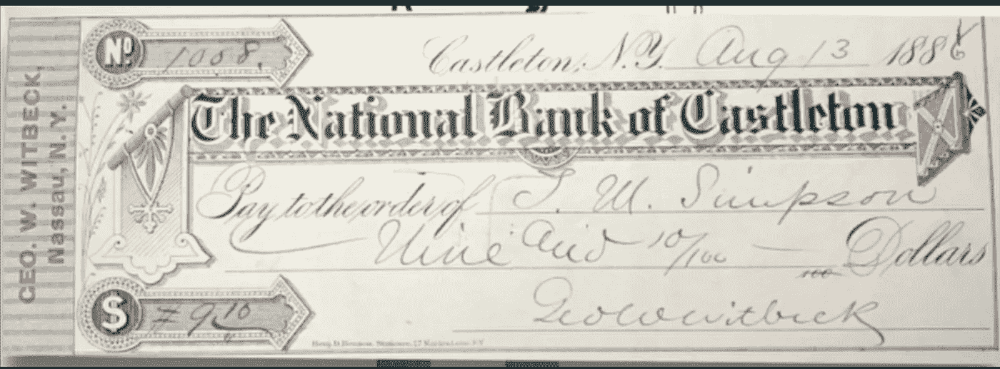
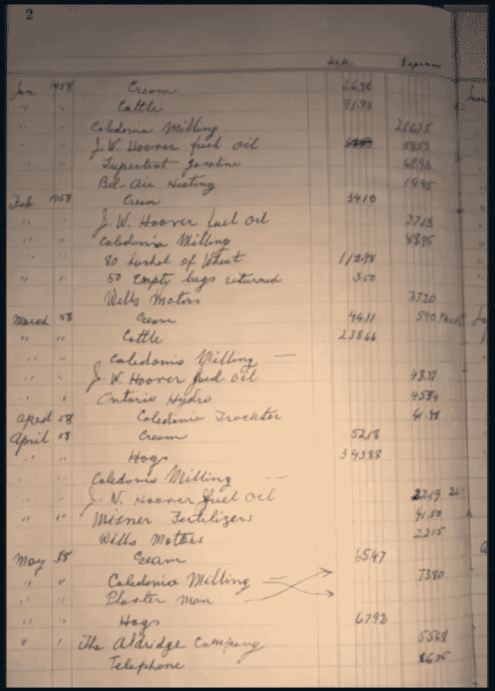
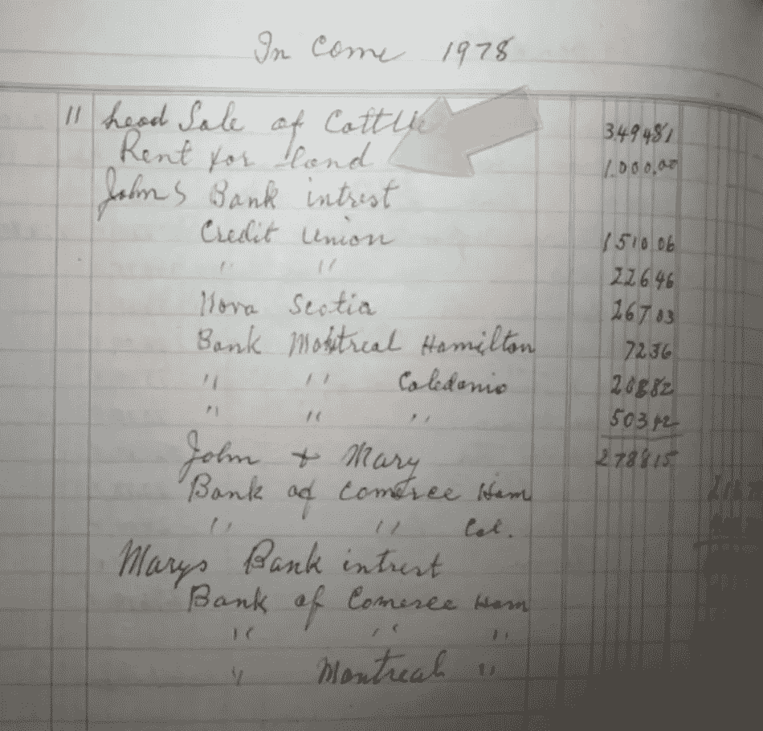
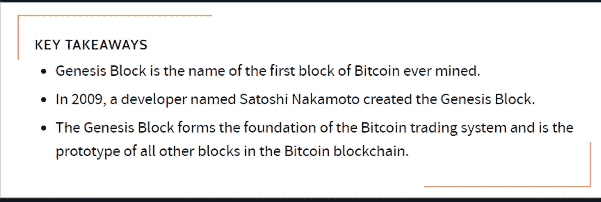
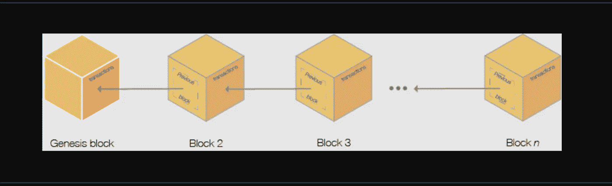
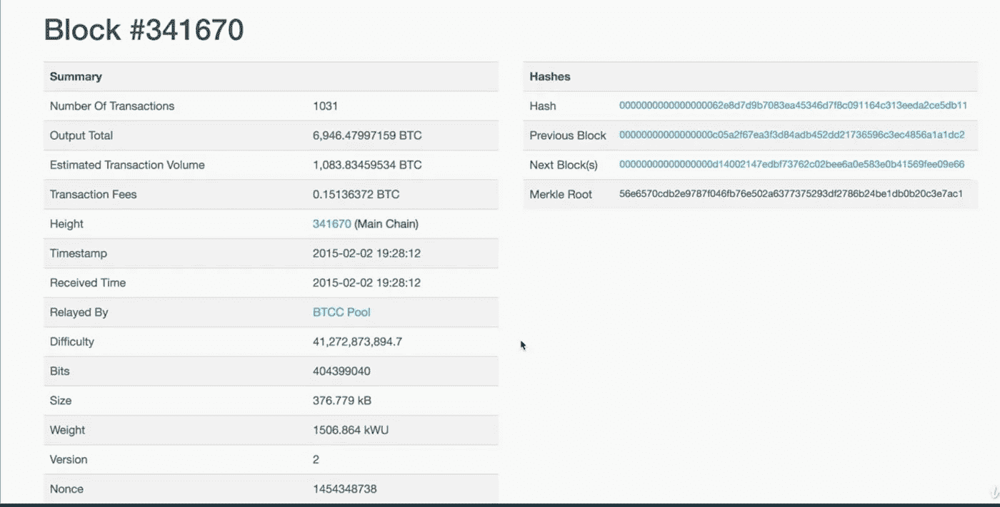
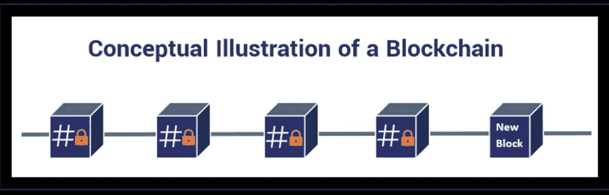
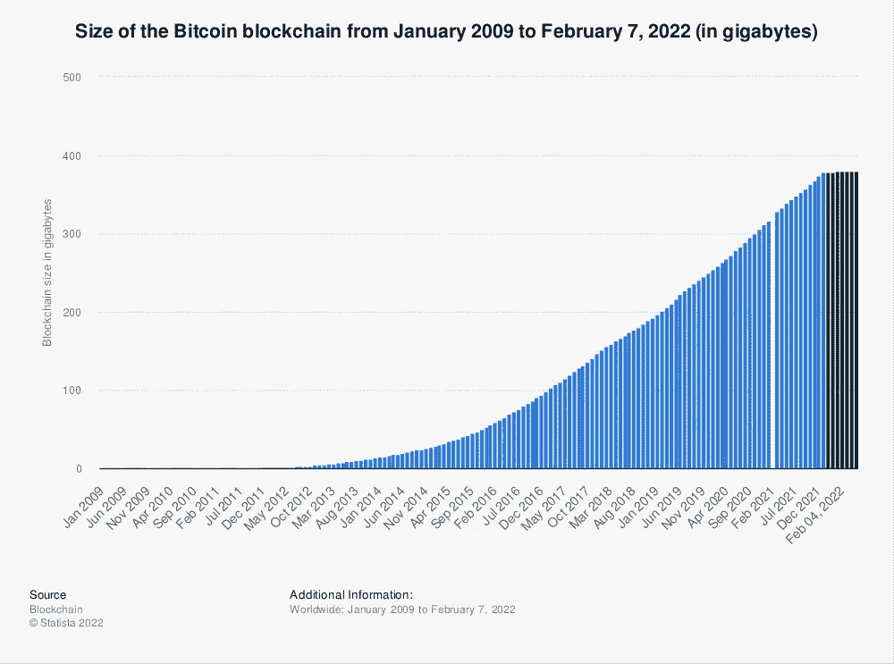

# 区块链博客 07:区块链技术内幕

> 原文：<https://medium.com/coinmonks/blockchain-blog-07-inside-blockchain-technology-part-1-42d91136cc91?source=collection_archive---------28----------------------->

上面这张支票已经有 200 年的历史了，我们看到几乎每张支票都有几个共同点:
1 — 我们有一个日期
2 —银行名称
3 —钱去了哪里
4 —金额
5 —钱从哪里来
6 —一个唯一的支票号码。还有，7 —一些邮票

那么人们如何记录赚了多少钱或者花了多少钱呢？有一个类似账簿的东西。记录会计细节的地方。那么，在我们使用计算机之前，会计明细是这样记入分类账的？

**支出明细是如何记录的？**

上面的例子是一个人的会计明细。在计算机出现之前，银行的会计系统以类似的方式工作，交易记录被一本书接一本书地储存，每一本新书都有前几本书的连续记录。

把它想象成由一本书贴在另一本书上组成的链条。

分类账是记录账户交易的账簿或账户集合。每个账户都有期初或结转余额)，并将交易记录为借方或贷方，分别列为期末或期末余额。

在**加密货币**和 **NFTs(不可替代代币)**领域，账本本质上是一个硬件钱包，是存储加密货币或不可替代代币的最安全方式。如果我们想了解采矿，了解区块链的分类账系统是很重要的。

> 挖掘是将块添加到区块链中以验证事务的过程。也是新比特币或者一些山寨币产生的过程。

> 区块链对于加密货币就像互联网对于电子邮件，或者土地对于农民。

假设下面的块代表我们之前看到的分类账，该块包含加密货币交易的会计详细信息。假设这个块是第一个块，它有第一个事务的细节，后面是其他事务的细节，我们称这个块为 genesis 块。

A **Genesis Block** 是加密货币(如比特币)开采的第一个区块的名称。区块链由一系列所谓的块组成，这些块用于存储与区块链网络上发生的交易相关的信息。每个块包含一个唯一的头，并且每个这样的块由它的块头散列单独标识。这些石块被分层——一个在另一个之上，创世纪石块是基础——它们的高度不断增长，直到到达区块链的尽头，序列完成。**每一个序列的层次和深层历史都是区块，这是区块链加密货币的特质之一。**

数据块实际上是数字容器，其中永久记录了与网络上的事务相关的数据。一个区块记录尚未进入任何先前区块的一些或所有最近的比特币交易。因此，块就像分类账或记录簿的一页。每当一个街区“完工”，它就为区块链的下一个街区让路。因此，数据块是记录的永久存储，一旦写入，就不能更改或删除。

源数据块也称为数据块 0，是区块链中添加额外数据块的第一个数据块。它实际上是每个其他块都可以追溯到的祖先，因为每个块都引用它前面的块。这开始了验证比特币交易和引入新比特币的过程。Genesis 块有 64 个字符长的散列地址，另一个块链接到该地址，依此类推…

现在，即使单个细节或起源块的记录被改变，它也将完全产生一个新的唯一的 64 个字符长的散列地址。你知道为什么吗？下一个块包含前一个块的细节，并且有自己的散列地址。使用 **SHA256** 生成哈希地址

区块链中的信息不仅仅是关于货币交易，它是关于共享信息和合同的更安全和透明的方式。区块链可以包含选举数据、体育合同、法律合同、健康数据、历史数据或任何数字艺术

区块链是一种使分布式系统的共享注册中心概念在许多应用领域成为现实的技术，从加密货币到任何潜在的需要在多利益主体情况下进行分散、稳健、可信和自动化决策的工业系统。

区块链上的所有交易都是永久性的，不像旧的账簿，区块链交易有很多备份。访问[blockchain.com](https://www.blockchain.com/explorer)查看交易。

在下一篇博客中，我们将看看一些关于历史悠久的创世纪街区的有趣事实。

> 加入 Coinmonks [电报频道](https://t.me/coincodecap)和 [Youtube 频道](https://www.youtube.com/c/coinmonks/videos)了解加密交易和投资

## 另外，阅读

*   [雷米塔诺评论](https://coincodecap.com/remitano-review)|[1 英寸协议指南](https://coincodecap.com/1inch)
*   [iTop VPN 审查](https://coincodecap.com/itop-vpn-review) | [曼陀罗交易所审查](https://coincodecap.com/mandala-exchange-review)
*   [40 个最佳电报频道](https://coincodecap.com/best-telegram-channels) | [喜美元评论](https://coincodecap.com/hi-dollar-review)
*   [折叠 App 审核](https://coincodecap.com/fold-app-review) | [StealthEX 审核](/coinmonks/stealthex-review-396c67309988) | [Stormgain 审核](https://coincodecap.com/stormgain-review)
*   [购买 PancakeSwap(蛋糕)](https://coincodecap.com/buy-pancakeswap) | [俱吠罗评论](/coinmonks/coinswitch-kuber-review-1a8dc5c7a739)
*   [瓦济里克斯 NFT 评论](https://coincodecap.com/wazirx-nft-review)|[Bitsgap vs Pionex](https://coincodecap.com/bitsgap-vs-pionex)|[坦吉姆评论](https://coincodecap.com/tangem-wallet-review)
*   [如何使用 Solidity 在以太坊上创建 DApp？](https://coincodecap.com/create-a-dapp-on-ethereum-using-solidity)