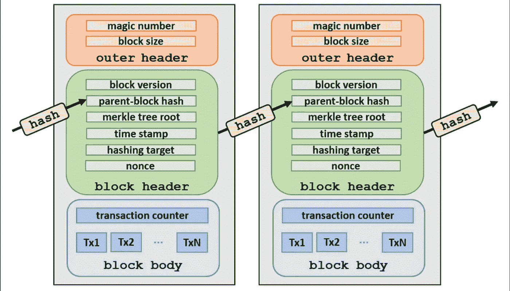
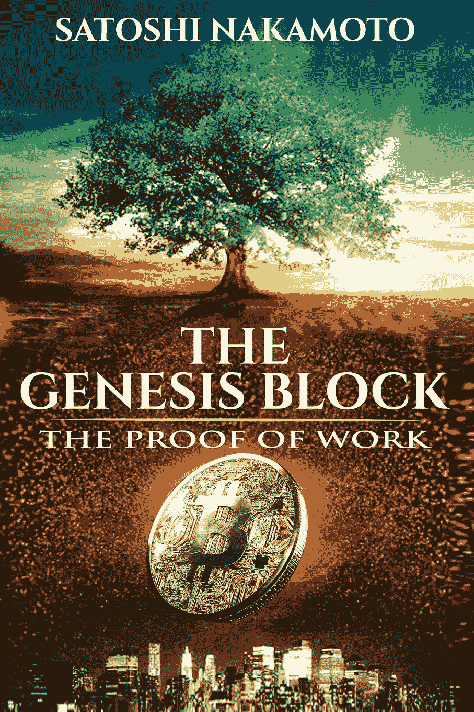
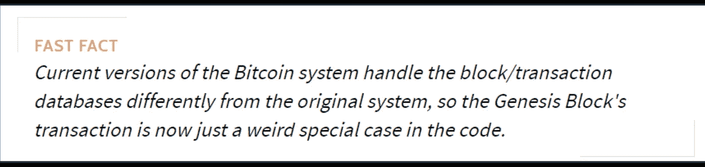
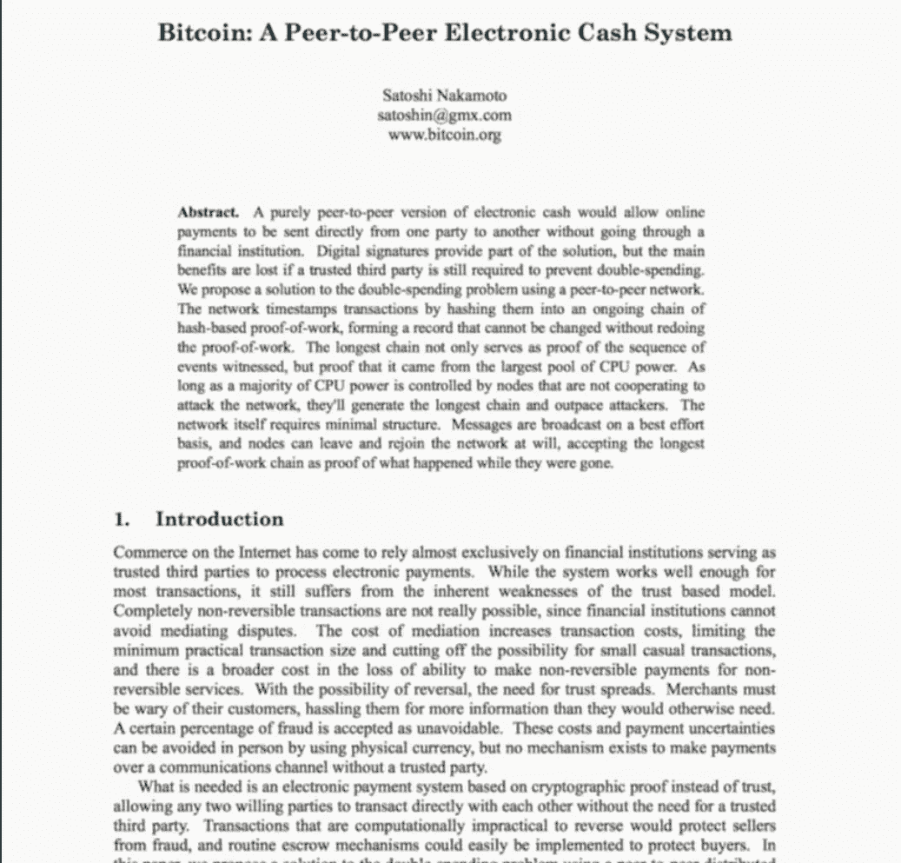

# 区块链博客 08:比特币的创世纪区块

> 原文：<https://medium.com/coinmonks/blockchain-blog-08-bitcoins-genesis-block-23701e879af1?source=collection_archive---------20----------------------->

下一个区块，被称为区块 1，直到第一个区块开采六天后才被开采。这被认为是奇怪的，因为块之间的平均时间戳间隔是 10 分钟。有几个关于延迟的理论:一些理论认为，中本聪花了六天时间挖掘原始区块，以测试比特币系统，以确保它是稳定的(然后回溯时间戳)，而更多的一些狂热追随者认为，Satoshi 打算在六天内创造世界后，重现上帝休息的故事。

Representation of a blockchain structure.

## 比特币基础知识

比特币是一种加密货币，基于中本聪开发的点对点电子现金系统。比特币指的是交易平台的系统和概念，“比特币”——小“b”——指的是交易的虚拟货币。没有真正的硬币，因此在“硬币”之前就有了“比特”——或二进制数字，计算中最基本的数据单位。在数字货币的世界里，块是永久记录比特币网络及其交易数据的文件。每次一个街区完成——也就是说，充满了比特币交易——它就会让位于区块链的下一个街区。将新的加密货币投入流通的唯一方式是通过采矿。所以，“开采比特币”就是“铸造货币”。比特币和黄金一样，不能任意创造。黄金必须从地下开采，比特币(BTC)必须通过数字手段开采。

此外，比特币的创始人规定，像黄金一样，比特币的供应应该是有限的。[总共只能开采 2100 万 BTC](https://www.investopedia.com/tech/what-happens-bitcoin-after-21-million-mined/)。当矿工们解锁了这么多比特币，那么这个星球的供应量将被耗尽，除非有人改变比特币的协议，允许更大的供应量。

## 创世街区的秘密

首先，“中本聪”这个名字本身是一个假名，比特币的起源和创立仍然充满了神秘。比特币推出后不久，这个名叫“中本聪”的人就从地球上消失了，几乎没有留下任何痕迹。这个吉祥的事件为围绕着粉丝们亲切地称之为“街区”的连续谜团铺平了道路。

**前 50 个 BTC 花不完**

创世纪板块的起源笼罩在一场关于其创建细节的争论中:使创世纪板块无法交易的代码是中本聪的意图还是错误？尽管 Genesis 块指向一个 web 地址(写入 Genesis 块的代码中),但该链接在激活时会显示一条错误消息。系统在其数据库中找不到第一笔 50 BTC 的交易，消费交易被拒绝。所以，Genesis Block 的交易并不被最初的比特币客户视为“真实交易”。但是为什么呢？中本聪的意思是第一个比特币不可交易吗？或者，这是一个错误？这成为比特币爱好者和内部人士争论的话题。然而，由于这个开发者的精确性，大多数人认为这几乎不是一个错误。中本聪很可能按照他想要的方式编写了创世纪区块的代码。我们永远不会知道为什么，因为这个怪癖直到中本聪失踪后才被发现。

Satoshi 在一份白皮书上解释了整个蓝图，它解释了什么是加密货币，这类似于企业家在新业务启动时发布的解释公司计划的内容。白皮书对于研究加密货币非常重要。

## 比特币的起源块秘密信息

Genesis 块的另一个令人困惑的方面是中本聪在块的原始数据中灌输的秘密信息:“泰晤士报 03/1/2009 财政大臣处于对银行的第二次救助的边缘。”虽然中本聪从未对这段文字的意义发表评论，但大多数人认为它是比特币本身的使命宣言。

这段文字是伦敦《泰晤士报》2009 年 1 月 3 日一篇文章的标题，内容是关于英国政府在 2007-08 年金融危机后未能刺激经济。众所周知，中本聪讨厌金融机构太大而不能倒闭的想法，并希望比特币在这方面有所不同。大多数人认为，中本聪对《创世纪》代码中那篇文章的引用暗示了比特币与 2008 年需要政府[救助的大型投资银行有何不同。](https://www.investopedia.com/terms/b/bailout.asp)

**创世纪街区的真正遗产**

比特币不能被保释，因为它的过程消除了中间人；在 BTC 和消费者之间没有第三方，没有公司实体。比特币网络通过复杂的数学问题不断检查和反复检查自己，这些问题首先由计算机解决，然后由人类比特币矿工解决。在数学难题得到验证之前，人们无法进行任何比特币交易。另一个万无一失的方法是，由于所有交易都被永久保存，矿工的行为总是可以被追踪，这使得隐藏任何不法行为的证据变得不可能。

2013 年 11 月，中本聪的早期门徒成立了中本聪研究所(SNI)，向公众宣传比特币的历史和愿景。除了其他有趣的细节之外，SNI 还收藏了中本聪网上存在的最大遗迹之一:一份按主题分类的论坛帖子清单，这是这位比特币创造者在从事该项目的时候写的。一些比特币粉丝以一种邪教般的崇敬持有创世纪区块，就像他们持有它的匿名创造者一样。粉丝们被比特币神秘的构造和奇特的词汇所吸引，就像痴迷于复杂的街机游戏一样。

比特币爱好者一直在向创世纪区块捐赠少量 BTC，以此向中本聪致敬。这被视为一种牺牲，因为一旦一枚硬币被移动到创世纪区块，它就再也不能移动了——有点像把一枚 25 美分的硬币扔进喷泉。

***阅读下一部分:*** [区块链博客 09-区块链与矿业](https://aaklii.medium.com/blockchain-blog-09-blockchain-and-the-mining-c4f89db8a9fd)

***全系列:*** [28 篇关于区块链和加密货币的博客](https://aaklii.medium.com/28days-of-february-blockchain-and-cryptocurrency-research-blogs-4b73c51ce3db)

> 加入 Coinmonks [电报频道](https://t.me/coincodecap)和 [Youtube 频道](https://www.youtube.com/c/coinmonks/videos)了解加密交易和投资

## 另外，阅读

*   [3 商业评论](/coinmonks/3commas-review-an-excellent-crypto-trading-bot-2020-1313a58bec92) | [Pionex 评论](https://coincodecap.com/pionex-review-exchange-with-crypto-trading-bot) | [Coinrule 评论](/coinmonks/coinrule-review-2021-a-beginner-friendly-crypto-trading-bot-daf0504848ba)
*   [莱杰 vs Ngrave](/coinmonks/ledger-vs-ngrave-zero-7e40f0c1d694) | [莱杰 nano s vs x](/coinmonks/ledger-nano-s-vs-x-battery-hardware-price-storage-59a6663fe3b0) | [币安评论](/coinmonks/binance-review-ee10d3bf3b6e)
*   [Bybit Exchange 评论](/coinmonks/bybit-exchange-review-dbd570019b71) | [Bityard 评论](https://coincodecap.com/bityard-reivew) | [Jet-Bot 评论](https://coincodecap.com/jet-bot-review)
*   [3 commas vs crypto hopper](/coinmonks/3commas-vs-pionex-vs-cryptohopper-best-crypto-bot-6a98d2baa203)|[赚取加密利息](/coinmonks/earn-crypto-interest-b10b810fdda3)
*   最好的比特币[硬件钱包](/coinmonks/hardware-wallets-dfa1211730c6) | [BitBox02 回顾](/coinmonks/bitbox02-review-your-swiss-bitcoin-hardware-wallet-c36c88fff29)
*   [BlockFi vs 摄氏](/coinmonks/blockfi-vs-celsius-vs-hodlnaut-8a1cc8c26630) | [Hodlnaut 点评](/coinmonks/hodlnaut-review-best-way-to-hodl-is-to-earn-interest-on-your-bitcoin-6658a8c19edf) | [KuCoin 点评](https://coincodecap.com/kucoin-review)
*   [Bitsgap 审查](/coinmonks/bitsgap-review-a-crypto-trading-bot-that-makes-easy-money-a5d88a336df2) | [Quadency 审查](/coinmonks/quadency-review-a-crypto-trading-automation-platform-3068eaa374e1) | [Bitbns 审查](/coinmonks/bitbns-review-38256a07e161)
*   [加密复制交易平台](/coinmonks/top-10-crypto-copy-trading-platforms-for-beginners-d0c37c7d698c) | [Coinmama 审核](/coinmonks/coinmama-review-ace5641bde6e)
*   [印度的加密交易所](/coinmonks/bitcoin-exchange-in-india-7f1fe79715c9) | [比特币储蓄账户](/coinmonks/bitcoin-savings-account-e65b13f92451)
*   [OKEx vs KuCoin](https://coincodecap.com/okex-kucoin) | [摄氏替代品](https://coincodecap.com/celsius-alternatives) | [如何购买 VeChain](https://coincodecap.com/buy-vechain)
*   [币安期货交易](https://coincodecap.com/binance-futures-trading)|[3 commas vs Mudrex vs eToro](https://coincodecap.com/mudrex-3commas-etoro)
*   [如何购买 Monero](https://coincodecap.com/buy-monero) | [IDEX 评论](https://coincodecap.com/idex-review) | [BitKan 交易机器人](https://coincodecap.com/bitkan-trading-bot)
*   [如何在 Uniswap 上交换加密？](https://coincodecap.com/swap-crypto-on-uniswap) | [A-Ads 审查](https://coincodecap.com/a-ads-review)
*   [WazirX vs CoinDCX vs bit bns](/coinmonks/wazirx-vs-coindcx-vs-bitbns-149f4f19a2f1)|[block fi vs coin loan vs Nexo](/coinmonks/blockfi-vs-coinloan-vs-nexo-cb624635230d)
*   [本地比特币评论](/coinmonks/localbitcoins-review-6cc001c6ed56) | [加密货币储蓄账户](https://coincodecap.com/cryptocurrency-savings-accounts)
*   什么是融资融券交易
*   [支持卡审核](https://coincodecap.com/uphold-card-review) | [信任钱包 vs 元掩码](https://coincodecap.com/trust-wallet-vs-metamask)