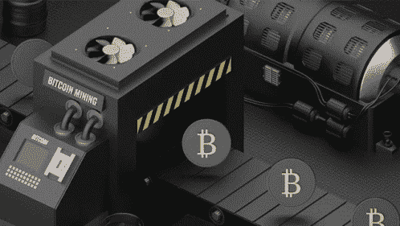
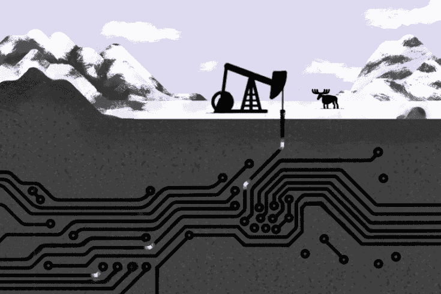
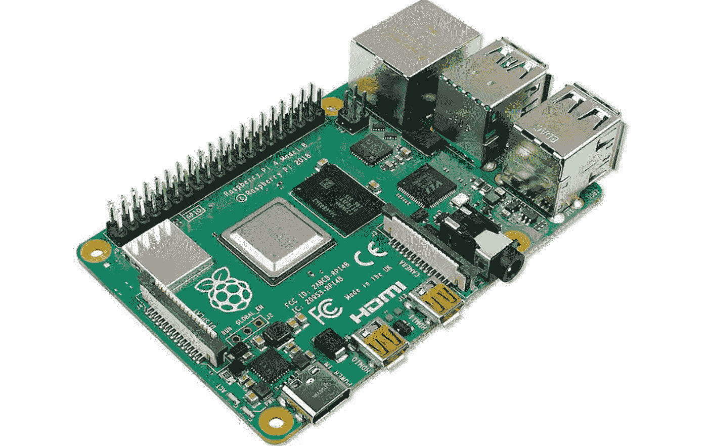
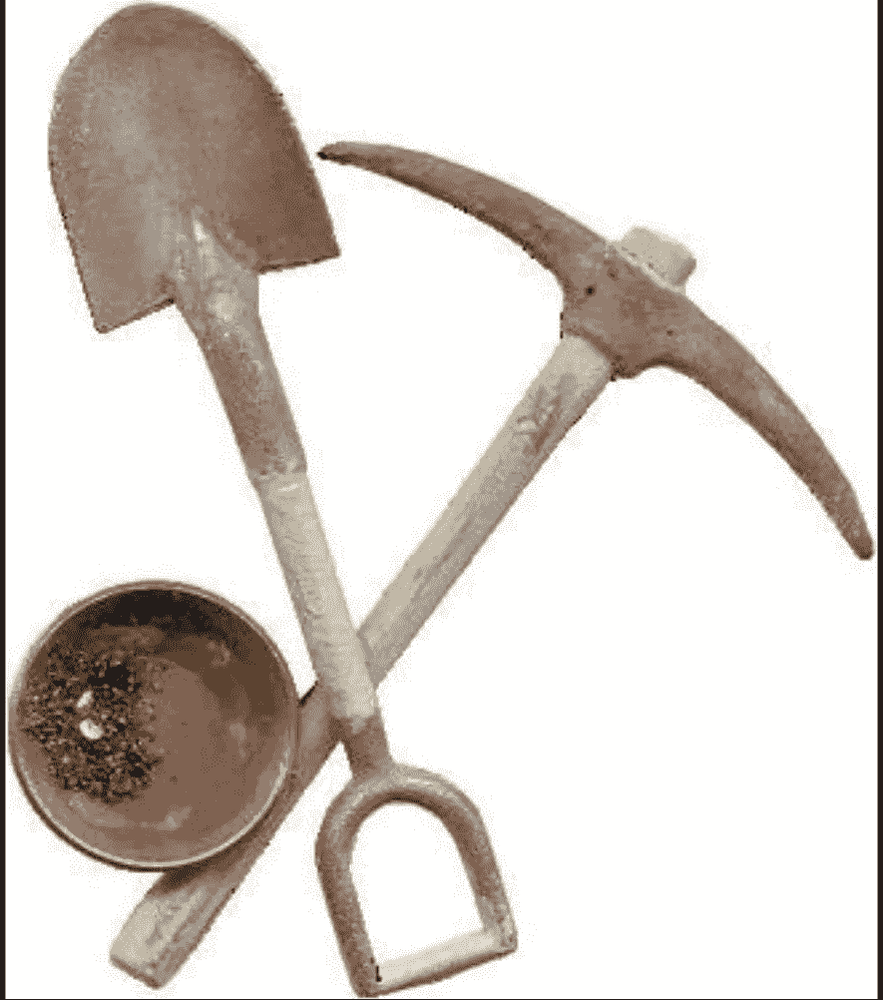
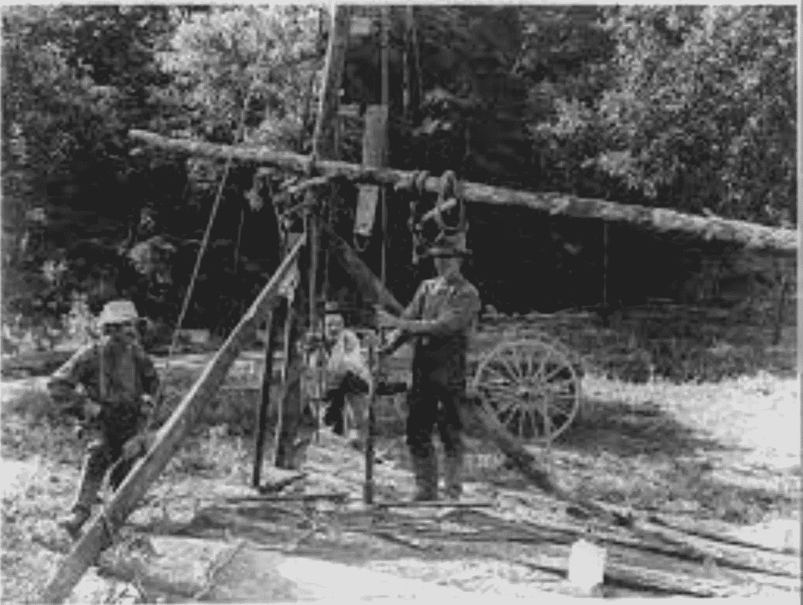
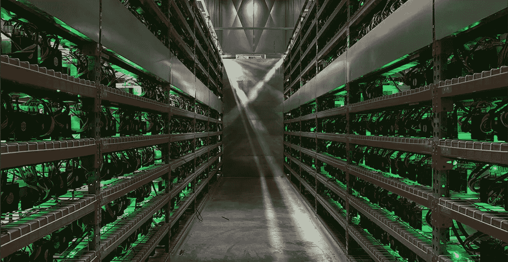
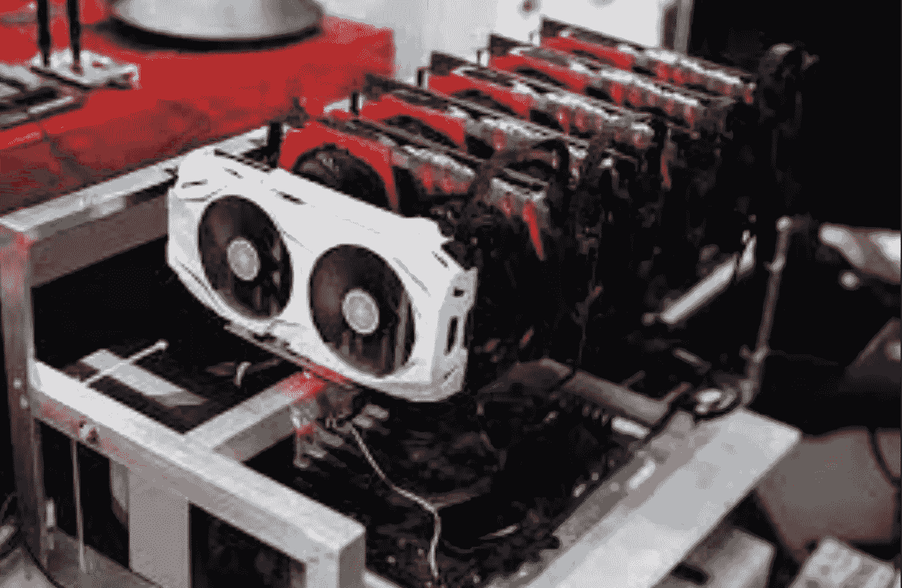
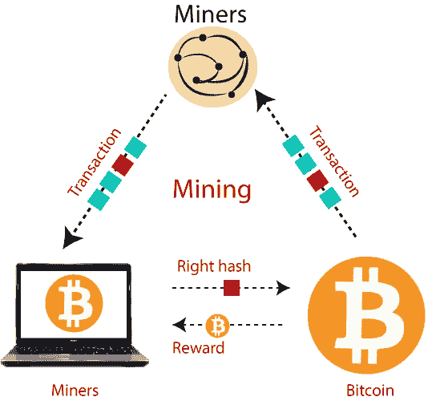
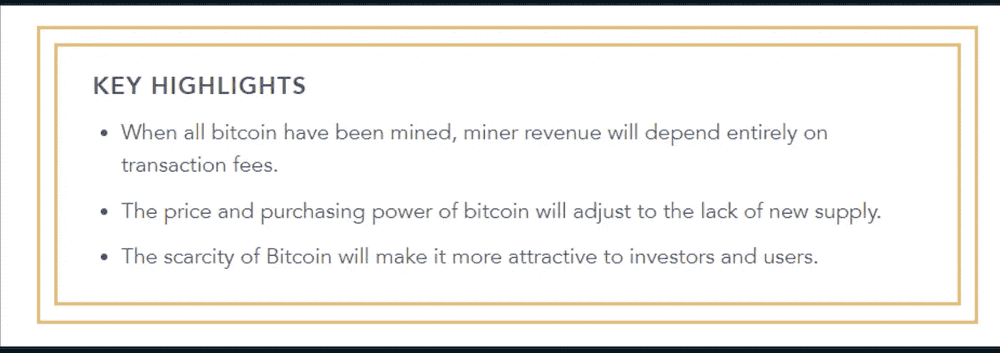

# 区块链博客 09-区块链和采矿

> 原文：<https://medium.com/coinmonks/blockchain-blog-09-blockchain-and-the-mining-c4f89db8a9fd?source=collection_archive---------46----------------------->

从之前的 2-3 篇博客中，我们了解了安全、钱包和区块链。所以现在我们来谈谈采矿。现在在加密货币的世界里，了解挖矿是非常重要的。那么一般来说什么是采矿呢？正如维基百科所示:采矿是从地球上提取有价值的矿物或其他地质材料，通常是从矿床中提取。开采这些矿床作为原材料是基于投资于设备、劳动力和能源的经济可行性，这些设备、劳动力和能源是提取、提炼和运输在矿山发现的材料给能够使用这些材料的制造商所需要的。

在 1848-1855 年的加利福尼亚淘金热期间，据说真正致富的人并不是真正拥有黄金的人，而是那些出售帮助采矿过程的工具的人。同样，当谈到加密货币时，无论你是对投资还是对开采加密货币感兴趣，了解整个过程是如何工作的都很重要，这样你就能够找出赚取大笔财富的实际机会在哪里。

现在，在加密世界采矿类似于挖掘黄金或石油或提取自然资源，在开始时，这是相对容易的，因为没有多少人在寻找它，但当有竞争，商品稀缺，然后采矿过程变得困难久而久之。几年前，当比特币非常新的时候，比特币可以使用像 Raspberry Pi 这样的微控制器来挖掘。它不需要大量的处理能力，采矿过程所需的电力也较少。

Raspberry Pi Micro-controller

在淘金热的最初几天，开采金矿所需的工具并没有那么庞大和特别

类似地，从地壳中抽取石油也不需要在海洋和陆地上建造巨大的钻井平台

在比特币的例子中，大规模的数据中心被用来挖掘比特币，因为现在小的 raspberry pi 就足够了。当大多数人试图进入比特币挖矿时，没有昂贵的计算机设备来挖矿的人没有机会挖矿。比特币挖矿是一个竞争激烈的行业，盈利很难维持。地理、能源成本、天气和政治管辖权等因素都可能损害或有利于比特币矿工。

## 图形处理单元— GPU

GPU 成为这些大规模数据中心的构建模块。图形处理单元(GPU)是一种专门的电子电路，设计用于快速操纵和改变存储器，以加速在帧缓冲器中创建图像，用于输出到显示设备。GPU 用于嵌入式系统、手机、个人电脑、工作站和游戏控制台。

图形处理单元(GPU)已经成为最重要的计算技术之一，无论是个人计算还是商业计算。GPU 专为并行处理而设计，应用广泛，包括图形和视频渲染。尽管 GPU 以其在游戏中的能力而闻名，但它们在创意制作、人工智能(AI)和比特币挖掘中的使用正变得越来越普遍。

# 那么开采一种加密货币意味着什么呢？

如果我们以第一个比特币区块 genesis block 为例，让我们说它不够安全，所以一群人努力让它更安全，所以如果我们激励人们(即矿工)破解代码，那么新增加的安全层比前一层好得多。因此，这是一个矿工必须解决的数学问题，当他们解决了这个问题，安全性就会恢复得更强。所以破解创世纪区块的密码很容易。使用 SHA256 使 genesis 块变得安全，如果您编写一个程序来破解第一块中的特殊代码，您的解决方案将用于保护第一块和下面的其他块。你的解决方案会被用来保护未来的街区。每次一个街区被保护起来，它后面的街区就会比前一个街区更安全。因此，未来的比特币区块将变得越来越安全，无论谁帮助保护区块，都将获得比特币形式的奖励。比特币区块链的这种奖励制度被称为**工作证明(PoW)**

随着越来越多的积木被加入，数学算法变得越来越强大，奖励变得越来越少。每开采 21 万个区块，奖励就会减半。据说到 21 世纪 30 年代，挖矿的奖励将只有 1 比特币。

> 一旦所有比特币的开采完成，人民将在交易费上赚钱。它写在比特币白皮书上。

***阅读下一部分:*** [区块链博客 10:比特币挖矿](https://aaklii.medium.com/blockchain-blog-10-bitcoin-mining-31834fdbb9d5)

***全系列:*** [28 篇关于区块链和加密货币的博客](https://aaklii.medium.com/28days-of-february-blockchain-and-cryptocurrency-research-blogs-4b73c51ce3db)

> 加入 Coinmonks [电报频道](https://t.me/coincodecap)和 [Youtube 频道](https://www.youtube.com/c/coinmonks/videos)了解加密交易和投资

## 另外，阅读

*   [3 商业评论](/coinmonks/3commas-review-an-excellent-crypto-trading-bot-2020-1313a58bec92) | [Pionex 评论](https://coincodecap.com/pionex-review-exchange-with-crypto-trading-bot) | [Coinrule 评论](/coinmonks/coinrule-review-2021-a-beginner-friendly-crypto-trading-bot-daf0504848ba)
*   [莱杰 vs n rave](/coinmonks/ledger-vs-ngrave-zero-7e40f0c1d694)|[莱杰 nano s vs x](/coinmonks/ledger-nano-s-vs-x-battery-hardware-price-storage-59a6663fe3b0) | [币安评论](/coinmonks/binance-review-ee10d3bf3b6e)
*   [Bybit Exchange 审查](/coinmonks/bybit-exchange-review-dbd570019b71) | [Bityard 审查](https://coincodecap.com/bityard-reivew) | [Jet-Bot 审查](https://coincodecap.com/jet-bot-review)
*   [氹欞侊贸易评论](https://coincodecap.com/anny-trade-review) | [CoinSpot 评论](https://coincodecap.com/coinspot-review)
*   [雷米塔诺审查](https://coincodecap.com/remitano-review)|[1 英寸协议指南](https://coincodecap.com/1inch)
*   [iTop VPN 审查](https://coincodecap.com/itop-vpn-review) | [曼陀罗交易所审查](https://coincodecap.com/mandala-exchange-review)
*   [40 个最佳电报频道](https://coincodecap.com/best-telegram-channels) | [喜美元评论](https://coincodecap.com/hi-dollar-review)
*   [折叠 App 审核](https://coincodecap.com/fold-app-review) | [StealthEX 审核](/coinmonks/stealthex-review-396c67309988) | [Stormgain 审核](https://coincodecap.com/stormgain-review)
*   [购买 PancakeSwap(蛋糕)](https://coincodecap.com/buy-pancakeswap) | [俱吠罗评论](/coinmonks/coinswitch-kuber-review-1a8dc5c7a739)
*   [瓦济里克斯 NFT 评论](https://coincodecap.com/wazirx-nft-review) | [比茨盖普 vs 皮奥克斯](https://coincodecap.com/bitsgap-vs-pionex) | [坦吉姆评论](https://coincodecap.com/tangem-wallet-review)
*   [如何使用 Solidity 在以太坊上创建 DApp？](https://coincodecap.com/create-a-dapp-on-ethereum-using-solidity)