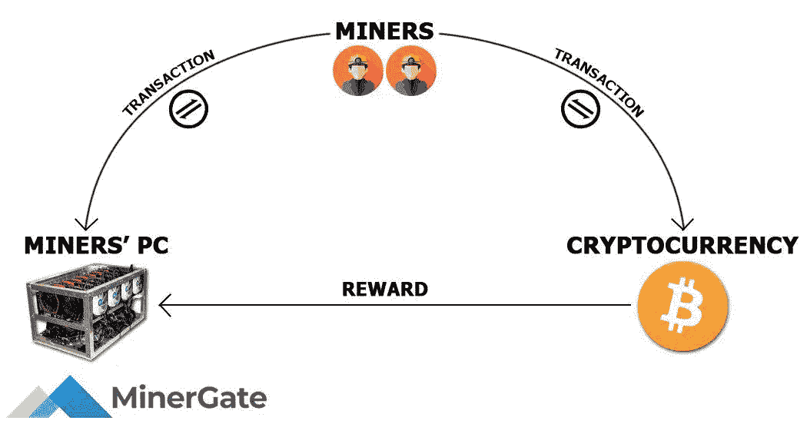

# 区块链博客 10:比特币挖矿

> 原文：<https://medium.com/coinmonks/blockchain-blog-10-bitcoin-mining-31834fdbb9d5?source=collection_archive---------26----------------------->

比特币是历史上第一种具有绝对数学稀缺性的资产。这种稀缺性可以被网络中的任何成员验证，并由比特币源代码中的算法进行监管。这种算法允许创建区块的矿工接收新铸造的比特币。这项补贴帮助矿工支付采矿的高成本。然而，每隔四年，该算法会将补贴减半。这一过程将持续到 2140 年左右，届时新比特币的流量将从每块 1 个 Satoshi(T1)下降到零。

当减半发生时，矿商的收入大约减半。与任何行业一样，收入损失 50%会迫使企业停止运营。就比特币而言，采矿直接为网络提供安全保障，因此矿工逃离网络可能会危及比特币的安全模式。随着大宗补贴趋向于零，比特币怀疑者认为，矿工收入低可能导致安全性降低，比特币本身的价值主张也越来越小。

怀疑论者也表达了对通货紧缩的担忧。随着比特币的通胀率不断下降，一些经济学家声称，将不会有足够的比特币来支撑货币系统，并且由于其高昂的价格，比特币将永远不会支持零售支付。

## 比特币挖矿

通过挖矿放出新的比特币，挖矿是确认比特币交易的过程。当一名矿工发现一个新的区块，他们会得到 6.25 BTC 的奖励。每 21 万块，每新增一块补贴减半。减少每块的补贴使新比特币的供应保持在不断减少的速度，并允许比特币的当前供应总是已知的。比特币的有限供应量略低于 2100 万比特币。当最后一个比特币被开采完，新比特币的生产也就结束了。除非绝大多数矿商和节点运营商能够聚集起来推翻供应约束(鉴于改变区块链框架所需的网络参与者数量，这种可能性极小)，否则不会有新的比特币发行。

矿商花费资源来创建新的交易区块，并在新铸造的比特币中获得回报。与常规的挖矿内涵不同，比特币挖矿是专门的计算机在比特币的区块链上确认交易的过程。这些交易由矿商通过 SHA-256 哈希算法进行处理，这是美国国家安全局发明的一种加密功能。我们在[区块链博客 07:区块链技术内幕](https://aaklii.medium.com/blockchain-blog-07-inside-blockchain-technology-part-1-42d91136cc91)中报道了 SHA-256

该算法用于保护事务，是挖掘过程的基础。从本质上说，全世界的矿工都在运行成千上万的计算机，以生成数十万亿的哈希。当一个挖掘器能够生成一个有效的散列，导致一个新的块被“发现”时，事务被确认

> 当矿工发现一个被整个比特币网络接受的新区块时，它会以新铸造的比特币作为奖励，等待确认的交易会被放入这个新区块，并添加到区块链中。

## 硬币分配

矿工获得新的比特币作为对他们努力的奖励。然而，几乎所有的矿商都必须以当地法定货币支付运营成本——新设备、员工工资，以及最重要的能源成本。这迫使大多数矿商立即清算部分(如果不是全部)新铸造的比特币。这些新硬币在交易所或场外交易柜台出售。因此，矿商是网络上相当一致的卖出压力来源。随着比特币的通胀率继续每四年减半，这种由矿工驱动的抛售压力的影响可能也会下降。此外，如果比特币在能源行业获得采用，矿商可能会开始用比特币支付部分运营成本。

挖矿是保障比特币区块链的两个核心组成部分之一。简单地说，它可以被看作是通过发现新的积木并把它们连接到以前的积木上来建造区块链的过程。另一个组件是跟踪所有事务的历史并验证新事务的节点。
**比特币矿工做什么？**
1 确认交易
2 保护网络
3 发行新币

**什么是比特币挖矿池？**

比特币矿池是分布式比特币矿工的网络，他们合作开采区块，并根据每个实体对矿池的贡献分配报酬。这使得矿商能够以支付给矿库协调员的费用的形式，以轻微的折扣平滑他们的收入。每当矿池中的任何矿工发现一个区块，他们支付区块奖励给矿池协调员。收取少量费用后，协调器根据每个成员的散列率贡献向其支付费用。

对于一个靠自己找到矿块的可能性极低的小型矿商来说，加入矿池将提供稳定的收入来源。这一收入将与矿商的规模成比例，因此仍然很小，但收入的一致性有助于矿商继续覆盖运营成本和利润。

矿池的存在是因为作为一个行业，比特币挖矿具有内在的规模经济。然而，能源，尤其是廉价能源，在地理上是分散的，这意味着采矿发生在全球各地。因此，挖掘操作具有在不同的物理位置操作但合作共享散列率和块奖励的动机。

而比特币矿场则是由大量矿工组成，他们通常被安置在仓库里。建立一个采矿场通常需要非常大的投资以及获得廉价电力的能力，而且今天比许多年前更难做到。

## 经济问题

随着比特币的通胀率每四年减半，它将慢慢成为世界上最硬的货币。在最近的减半期间，当整体补贴从 12.5 BTC 降至 6.25 BTC 时，比特币的通胀率从约 3.7%降至约 1.8%，使其通胀率低于 2%的美元通胀目标。2024 年减半将使比特币的通胀率甚至低于黄金，黄金是一种长期以来因其低库存流量比而受到重视的资产。

从经济角度来看，许多学者担心通货紧缩对经济的影响。他们会辩称，比特币的通缩政策将导致金融体系资金不足，并将利率推高，抑制增长。关于通货紧缩，大多数比特币支持者认为，对比特币造成通货紧缩螺旋并扼杀商品需求的担忧被夸大了。作为通货膨胀的货币，法定货币刺激个人立即花钱，而不是存起来以备将来使用。比特币当然逆转了这些激励，鼓励长期投资而非短期消费。然而，没有人能把他们的消耗降低到零。

## 聪智

为了解决系统中“缺钱”的问题，中本聪创造了一个可以分成 1 亿块的比特币。这些碎片被称为 satoshi，如果比特币价格为 43700 美元，一个 Satoshi 值 0.000437 美元。随着比特币的升值和被采用，越来越小的比特币将带来越来越大的购买力。随着比特币价格上涨，以比特币计价的商品价格会下跌。因此，系统中比特币的总量几乎无关紧要；相反，重要的是每个聪的购买力。

纸币今天仍然存在，20 多亿人没有银行账户的事实是非常不公平的。如果我们考虑金钱的未来，我们会看到更多的人将使用智能手机，整个银行访问都将通过智能手机进行，但随着更多骗局的出现，掌握如何使用技术的适当知识也将变得更加重要。

加密货币将导致政府要么使其货币更加安全，要么监管这些加密货币，因为这些加密货币可能成为国家安全的最大威胁。

***阅读下一部分:*** [区块链博客 11:区块链生态系统——密码分类](https://aaklii.medium.com/blockchain-blog-11-blockchain-ecosystem-crypto-categorization-18a48e4ce291)

***全系列:*** [28 篇关于区块链和加密货币的博客](https://aaklii.medium.com/28days-of-february-blockchain-and-cryptocurrency-research-blogs-4b73c51ce3db)

> 加入 Coinmonks [电报频道](https://t.me/coincodecap)和 [Youtube 频道](https://www.youtube.com/c/coinmonks/videos)了解加密交易和投资

## 另外，阅读

*   [3 商业评论](/coinmonks/3commas-review-an-excellent-crypto-trading-bot-2020-1313a58bec92) | [Pionex 评论](https://coincodecap.com/pionex-review-exchange-with-crypto-trading-bot) | [Coinrule 评论](/coinmonks/coinrule-review-2021-a-beginner-friendly-crypto-trading-bot-daf0504848ba)
*   [莱杰 vs n rave](/coinmonks/ledger-vs-ngrave-zero-7e40f0c1d694)|[莱杰 nano s vs x](/coinmonks/ledger-nano-s-vs-x-battery-hardware-price-storage-59a6663fe3b0) | [币安评论](/coinmonks/binance-review-ee10d3bf3b6e)
*   [币安期货交易](https://coincodecap.com/binance-futures-trading)|[3 commas vs Mudrex vs eToro](https://coincodecap.com/mudrex-3commas-etoro)
*   [如何购买 Monero](https://coincodecap.com/buy-monero) | [IDEX 评论](https://coincodecap.com/idex-review) | [BitKan 交易机器人](https://coincodecap.com/bitkan-trading-bot)
*   [CoinDCX 评论](/coinmonks/coindcx-review-8444db3621a2) | [加密保证金交易交易所](https://coincodecap.com/crypto-margin-trading-exchanges)
*   [红狗赌场评论](https://coincodecap.com/red-dog-casino-review) | [Swyftx 评论](https://coincodecap.com/swyftx-review) | [造币厂评论](https://coincodecap.com/coingate-review)
*   [Bookmap 评论](https://coincodecap.com/bookmap-review-2021-best-trading-software) | [美国 5 大最佳加密交易所](https://coincodecap.com/crypto-exchange-usa)
*   [如何在 FTX 交易所交易期货](https://coincodecap.com/ftx-futures-trading) | [OKEx vs 币安](https://coincodecap.com/okex-vs-binance)
*   [CoinLoan 审查](https://coincodecap.com/coinloan-review) | [YouHodler 审查](/coinmonks/youhodler-4-easy-ways-to-make-money-98969b9689f2) | [BlockFi 审查](https://coincodecap.com/blockfi-review)
*   [XT.COM 评论](https://coincodecap.com/profittradingapp-for-binance)币安评论 |
*   [SmithBot 评论](https://coincodecap.com/smithbot-review) | [4 款最佳免费开源交易机器人](https://coincodecap.com/free-open-source-trading-bots)
*   [比特币基地僵尸程序](/coinmonks/coinbase-bots-ac6359e897f3) | [AscendEX 审查](/coinmonks/ascendex-review-53e829cf75fa) | [OKEx 交易僵尸程序](/coinmonks/okex-trading-bots-234920f61e60)
*   [如何在印度购买比特币？](/coinmonks/buy-bitcoin-in-india-feb50ddfef94) | [瓦济克斯审查](/coinmonks/wazirx-review-5c811b074f5b)
*   [隐料斗替代品](/coinmonks/cryptohopper-alternatives-d67287b16d27) | [HitBTC 审查](/coinmonks/hitbtc-review-c5143c5d53c2)
*   [CBET 评论](https://coincodecap.com/cbet-casino-review) | [库科恩 vs 比特币基地](https://coincodecap.com/kucoin-vs-coinbase)
*   [折叠 App 审核](https://coincodecap.com/fold-app-review) | [Kucoin 交易机器人](/coinmonks/kucoin-trading-bot-automate-your-trades-8cf0ca2138e0) | [Probit 审核](https://coincodecap.com/probit-review)
*   [BigONE 交易所评论](/coinmonks/bigone-exchange-review-64705d85a1d4) | [电网交易机器人](https://coincodecap.com/grid-trading)
*   [南非的加密交易所](https://coincodecap.com/crypto-exchanges-in-south-africa) | [BitMEX 加密信号](https://coincodecap.com/bitmex-crypto-signals)
*   [MoonXBT 副本交易](https://coincodecap.com/moonxbt-copy-trading) | [阿联酋的加密钱包](https://coincodecap.com/crypto-wallets-in-uae)
*   [雷米塔诺评论](https://coincodecap.com/remitano-review)|[1 英寸协议指南](https://coincodecap.com/1inch)
*   [iTop VPN 审查](https://coincodecap.com/itop-vpn-review) | [曼陀罗交易所审查](https://coincodecap.com/mandala-exchange-review)
*   [40 个最佳电报频道](https://coincodecap.com/best-telegram-channels) | [喜美元评论](https://coincodecap.com/hi-dollar-review)
*   [折叠 App 审核](https://coincodecap.com/fold-app-review) | [StealthEX 审核](/coinmonks/stealthex-review-396c67309988) | [Stormgain 审核](https://coincodecap.com/stormgain-review)
*   [购买 PancakeSwap(蛋糕)](https://coincodecap.com/buy-pancakeswap) | [俱吠罗评论](/coinmonks/coinswitch-kuber-review-1a8dc5c7a739)
*   [瓦济里克斯 NFT 评论](https://coincodecap.com/wazirx-nft-review) | [比茨盖普 vs 皮奥克斯](https://coincodecap.com/bitsgap-vs-pionex) | [坦吉姆评论](https://coincodecap.com/tangem-wallet-review)
*   [如何使用 Solidity 在以太坊上创建 DApp？](https://coincodecap.com/create-a-dapp-on-ethereum-using-solidity)