# 区块链博客 11:区块链生态系统——加密分类

> 原文：<https://medium.com/coinmonks/blockchain-blog-11-blockchain-ecosystem-crypto-categorization-18a48e4ce291?source=collection_archive---------12----------------------->

像互联网一样，它是今天所有基于互联网的解决方案的基础，区块链是许多创新的分散解决方案的基础。我们仍处于区块链的早期阶段，但根据区块链原则创建的解决方案是可列举的，并在所有主要部门中创建，无论是分散金融还是任何核心领域。

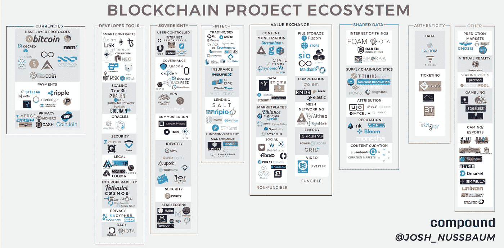

现在有超过**2000 种不同的加密货币在流通**，那么**为什么有比比特币更多的加密货币？**
当比特币最初被创造出来的时候，它的初衷是作为一种数字现金。随着时间的推移，这一焦点已经从分散的支付硬币转移到与黄金相媲美的价值储存手段。虽然由于其通缩协议，比特币作为价值储存手段表现良好，但比特币在许多方面表现不佳。区块链技术的发展带来了新的创新和使用案例。加密货币使用案例的扩展使得旨在解决现实世界问题的各种硬币项目得以发展。

由于我们没有将基于互联网的解决方案的两个用例放在一个伞下，同样，我们将根据它们解决的问题对加密货币进行分类。稍后，我们将更详细地深入探讨一些加密货币。在这篇博客中，我们将从加密货币的分类开始

加密货币可以根据不同方面进行分类，例如:

*   市场资本化
*   区块链网络
*   交换媒介
*   稳定的硬币
*   区块链先知
*   区块链桥
*   侧链
*   叉
*   共享硬币
*   还有其他人…

## 市场资本化

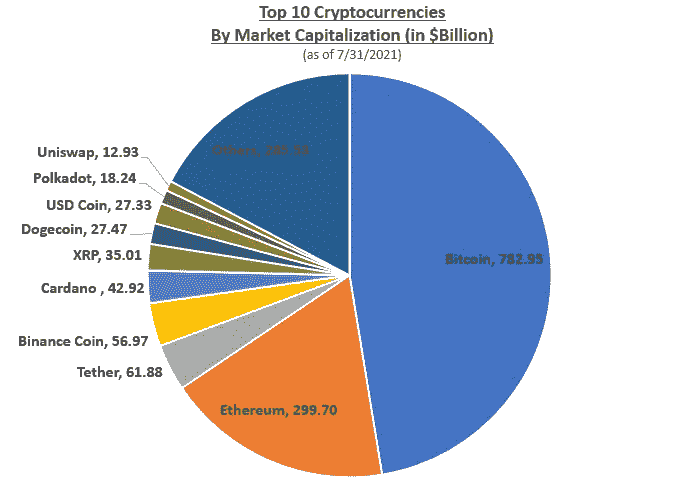

投资者通常根据加密货币的市值对其进行查看和分类。

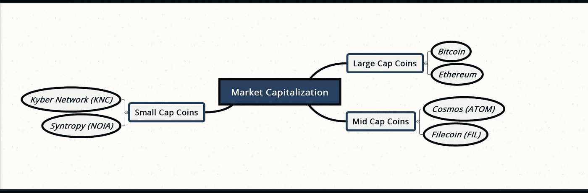

**大盘币:**这些币包括比特币和以太币。他们的市值超过 100 亿美元。这些投资可以被认为是低风险的，因为它们有增长的记录，并且有更高的流动性。这意味着更多的人可以在不显著影响价格的情况下销售。
**中盘币:**这些币的市值在 10 亿美元到 100 亿美元之间。这些硬币可以被认为有一定的增长空间，但仍然比大型硬币有更高的风险。
**小盘股:**这些小盘股的市值不到 10 亿美元，通常是这个领域的新品种。这些硬币很容易受到市场市值大幅上升或下降的影响，因此，价格可能会大幅波动。

## 区块链网络

有许多主要的区块链网络允许创建生态系统，其中多个硬币/项目/代币可以在同一个网络上运行。

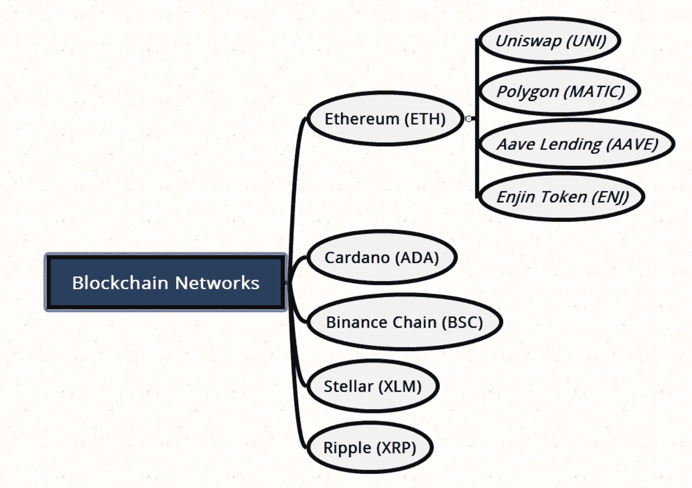

**以太坊生态系统**

以太坊网络能够通过使用智能合约来托管具有不同用途的各种各样的令牌。以下是区块链以太坊主办的一些代币示例:

*   **UNI WAP(UNI)**—以太坊区块链上流行的分散式交易所。
*   **Polygon (MATIC)** — Polygon 是以太坊的多链伸缩解决方案。
*   **Aave Lending (AAVE)** — Aave 是一个运行在以太坊区块链上的分散式借贷平台。
*   **金恩令牌(ENJ)**——金恩是一个软件项目，它让开发者能够在以太坊网络上创建和管理数字资产。

## 支付硬币/交易媒介

交换媒介是一种工具，用于实现交易双方之间的商品销售、购买和交易。

## 稳定的硬币

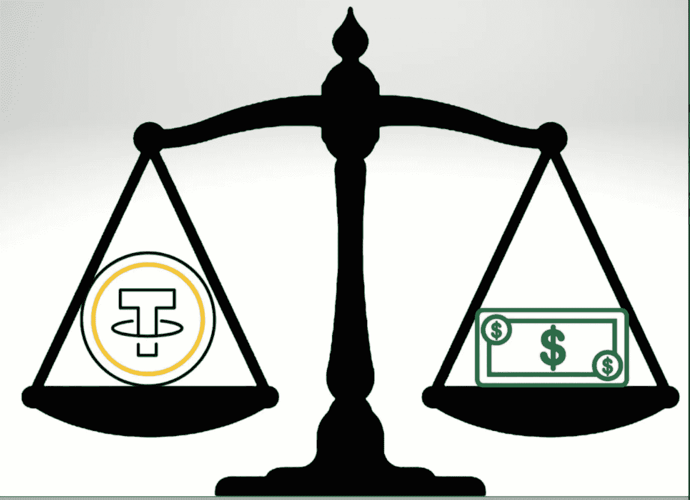

稳定硬币是模仿美元或欧元等法定货币的价值而创建的数字资产。它们允许用户在全球范围内快速、廉价地转移资金，同时保持稳定的价值。大多数稳定的硬币是由 1:1 的美元对硬币的比率支持的。像 Tether 这样的项目都有抵押品，以法定货币、密码或其他储存在储备中的商品的形式支持他们的硬币。

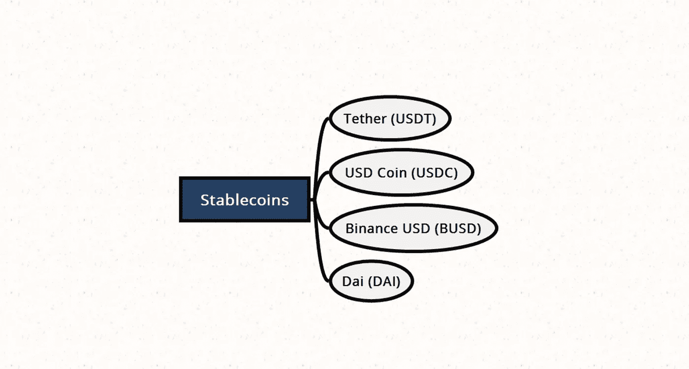

## 隐私币

加密货币大多是假名，这意味着尽管真实姓名和位置不会被记录到区块链中，但钱包地址和交易 id 实际上是被记录的。

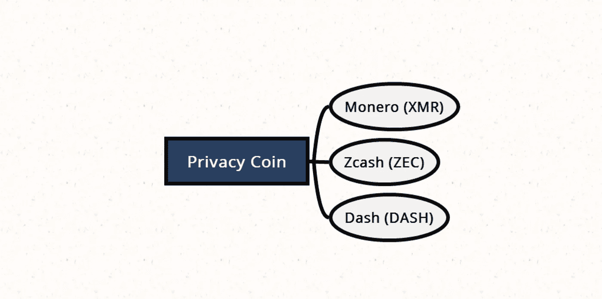

理论上，人们可以搜索交易历史，并尝试将用户与钱包地址和交易历史的组合相关联。隐私币旨在通过掩盖交易信息来消除这一潜在缺陷。

## 区块链先知

Oracles 是从外部来源向智能合约发送信息的第三方服务。区块链网络本身只能从网络上的数据中获取信息。神谕充当了一个中继站，在那里，外链信息可以提供给各种区块链网络。

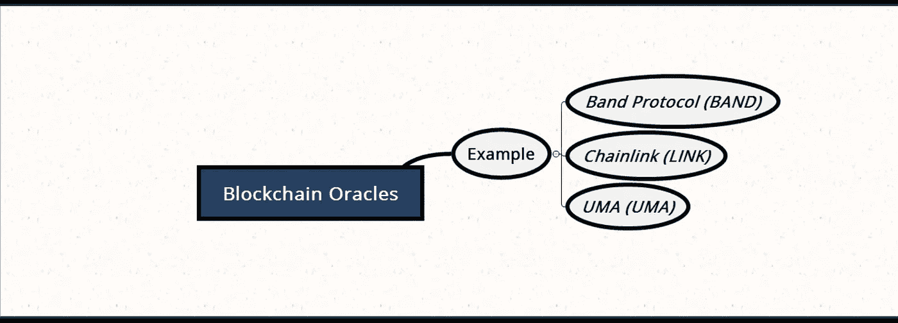

## 区块链桥

虽然以太坊和 Cardano 等主要的区块链网络旨在使用他们自己版本的区块链技术来促进交易和信息验证，但这些独立的网络通常彼此不兼容。没有中介，信息不容易共享和传递。一些项目旨在建立跨链桥梁，这基本上是弥合差距的数字途径，并促进这些生态系统之间更容易地传递信息。

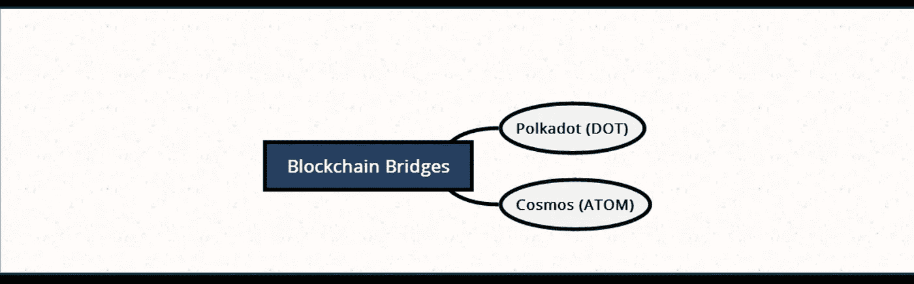

*   Polkadot (DOT): Polkadot 是致力于创建跨链桥的最大项目之一。它的目标是建立一个区块链的区块链，任何和所有的区块链网络可以通过波尔卡多特网络连接和桥接。
*   **Cosmos (ATOM):** Cosmos 是另一个试图在网络间传输更多数据的项目。

## Sidechians

当区块链发现网络活动增加(事务和使用增加)时，它可能会遇到网络拥塞扩展困难。

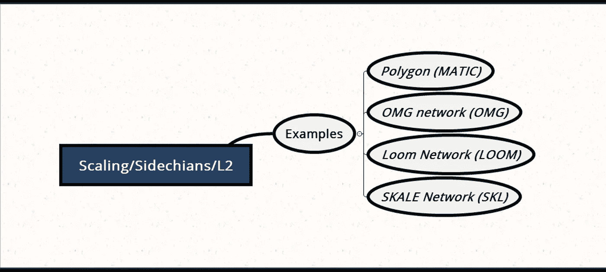

第 2 层扩展解决方案指的是可以帮助缓解网络拥塞和提高交易速度的次级链。

## 叉

区块链中的分叉本质上是一个分裂，第二个项目从原始项目中出现。这可能是开发团队成员对原始项目的方向有分歧的结果。可以提议对网络的运作方式进行重大改变，将区块链一分为二，一个网络遵循旧的做事方式，一个新的遵循一套新的规则。团队中的一部分人可能会决定带着他们的另一个愿景前进，复制区块链到那时的历史，然后带着他们的新方向前进。

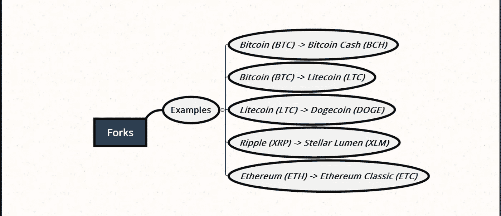

## 共享硬币

某些加密货币项目旨在通过使用分散式区块链技术来革新数字数据存储和文件共享。数据存储的分散化可以为所有人提供更便宜的存储速率，并在全球范围内实现更高效的数据传输。

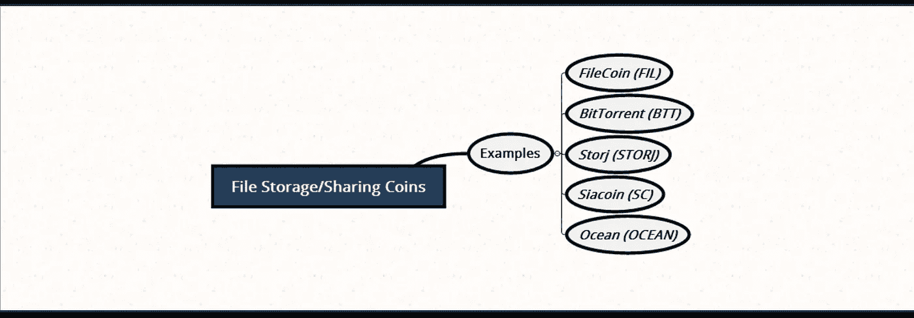

## 借贷平台

租借平台允许用户向其他用户租借密码。

*   贷方将资金存入该平台支持的资金池时将获得奖励。
*   借款人可以通过存放抵押品从平台获得安全贷款而受益。

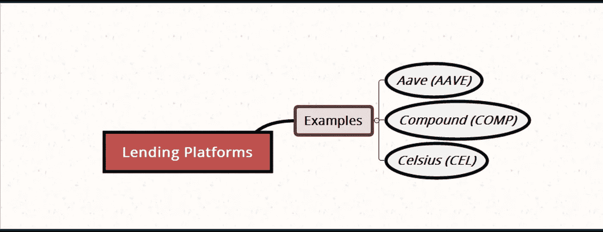

贷方通过赚取存款利息而受益，借方通过拥有获得贷款的流动性来源而受益。APYs 可能会根据需求或稀缺性等因素上下波动。

## 集中式交换令牌

一些交易所决定开发自己的代币用于各种用途。这些令牌的使用案例从充当保证金交易的流动性池的令牌，到用于其内部区块链网络的令牌。

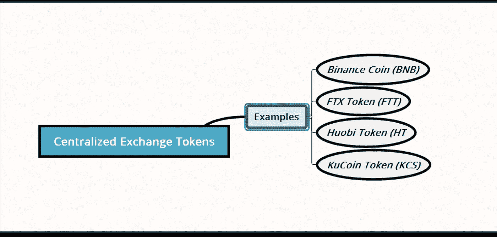

## 分散交易所

智能合约的使用允许创建分散的交易所。这些交易所不同于典型的集中式交易所，因为它们不受单一实体或集团的控制。

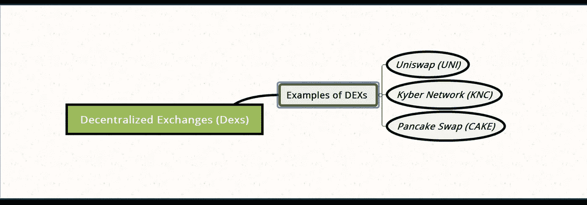

当你投资和购买密码时，集中的交易所持有你的资金，而在分散的交易所，资金直接存储在区块链上。

## 分散自治组织

分散式自治组织(DAO)是一种将治理引入分散式协议的方式，而不会损害分散式的任何好处。

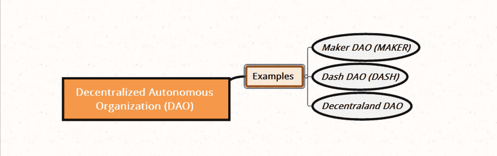

Dao 允许用户/令牌持有者有权投票决定对网络和网络整体未来的提议更改。没有来自中央权威的影响。我们将在以后的博客中更详细地探讨关于 Dao 的更多信息。

## 迷币

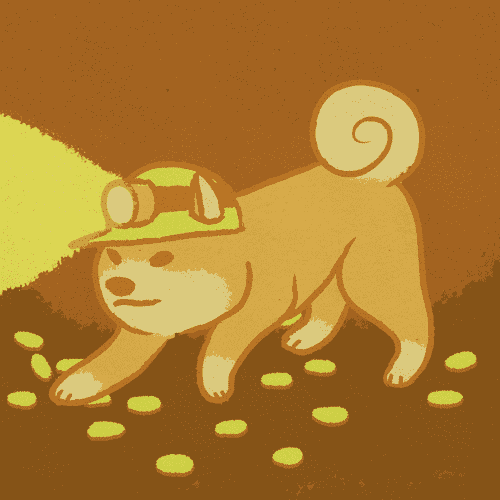

Dogecoin 的兴起和流行带来了一种新的加密货币:memecoins。迷因币通常基于互联网迷因(笑话、幽默、搞笑图片)，如柴犬、dogecoin 和其他各种人物。

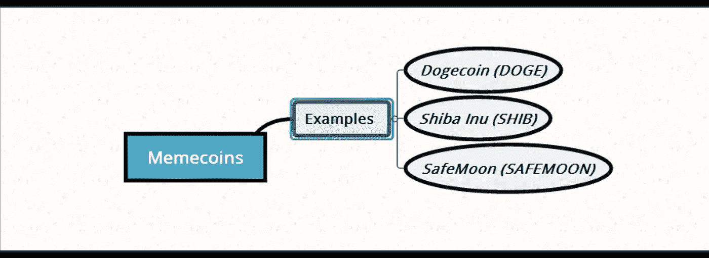

这些硬币在整个 2021 年主导了投资社交媒体圈，一些如 Dogecoin 已经在主流媒体上流行起来。虽然潜在投资者可能会从早期采用者那里听到极端利润的故事，但极端收益的可能性等于极端损失的可能性。大多数 memecoins 没有用例，这意味着与其他加密货币相比，它们没有特定或独特的功能。它们的目的不是解决现实世界的问题或提供金融服务。不建议投资 Doge 或其他 memecoins，这被视为高风险投资

很多人在投资加密货币时，并没有考虑他们实际投资的是什么。每家真正的加密货币公司都有自己的解决方案，它们正在解决整个区块链生态系统中的一个特定问题。人们不能根据市场上的炒作盲目投资任何加密货币，而是要彻底研究加密货币支持公司正在解决的实际问题。我们稍后将了解在投资任何加密货币之前可以遵循的研究结构，但在此之前，我们将进一步探索更多关于**分散金融(DeFi)** 和**分散自治组织(DAO)** 的信息，因为它们是整个区块链解决方案的重要组成部分。

***阅读下一部分:*** [区块链博客十二:去中心化金融(DeFi)](https://aaklii.medium.com/blockchain-blog-12-decentralize-finance-defi-bc679132fafc)

***全系列:*** [28 篇关于区块链和加密货币的博客](https://aaklii.medium.com/28days-of-february-blockchain-and-cryptocurrency-research-blogs-4b73c51ce3db)

> 加入 Coinmonks [电报频道](https://t.me/coincodecap)和 [Youtube 频道](https://www.youtube.com/c/coinmonks/videos)了解加密交易和投资

## 另外，阅读

*   [MoonXBT 副本交易](https://coincodecap.com/moonxbt-copy-trading) | [阿联酋的加密钱包](https://coincodecap.com/crypto-wallets-in-uae)
*   [雷米塔诺审查](https://coincodecap.com/remitano-review)|[1 英寸协议指南](https://coincodecap.com/1inch)
*   [iTop VPN 审查](https://coincodecap.com/itop-vpn-review) | [曼陀罗交易所审查](https://coincodecap.com/mandala-exchange-review)
*   [40 个最佳电报频道](https://coincodecap.com/best-telegram-channels) | [喜美元评论](https://coincodecap.com/hi-dollar-review)
*   [折叠 App 审核](https://coincodecap.com/fold-app-review) | [StealthEX 审核](/coinmonks/stealthex-review-396c67309988) | [Stormgain 审核](https://coincodecap.com/stormgain-review)
*   [购买 PancakeSwap(蛋糕)](https://coincodecap.com/buy-pancakeswap) | [俱吠罗评论](/coinmonks/coinswitch-kuber-review-1a8dc5c7a739)
*   [瓦济里克斯 NFT 评论](https://coincodecap.com/wazirx-nft-review) | [比茨盖普 vs 皮奥克斯](https://coincodecap.com/bitsgap-vs-pionex) | [坦吉姆评论](https://coincodecap.com/tangem-wallet-review)
*   [如何使用 Solidity 在以太坊上创建 DApp？](https://coincodecap.com/create-a-dapp-on-ethereum-using-solidity)