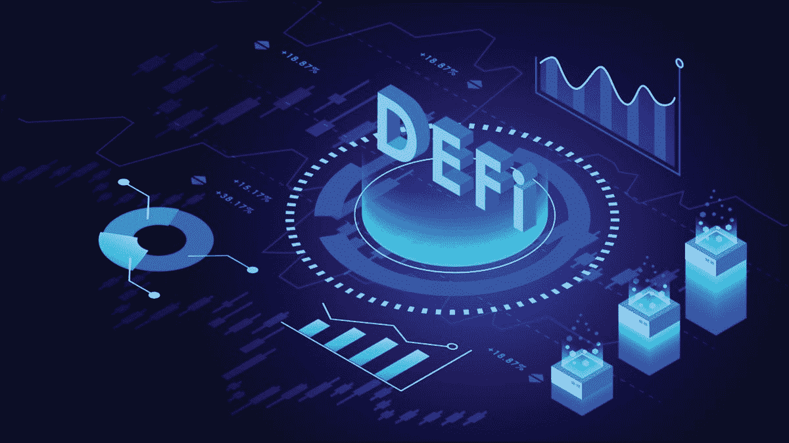
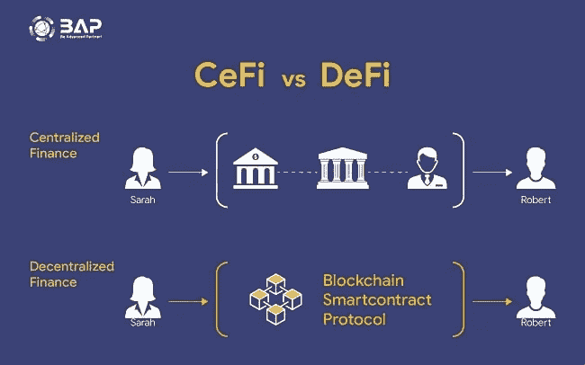
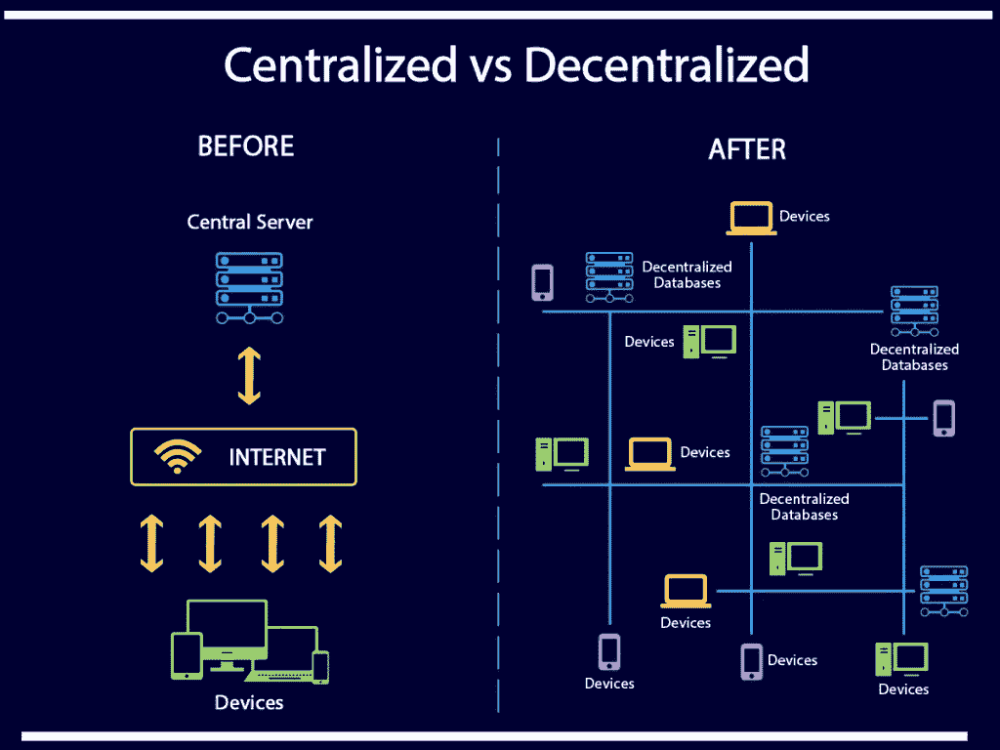
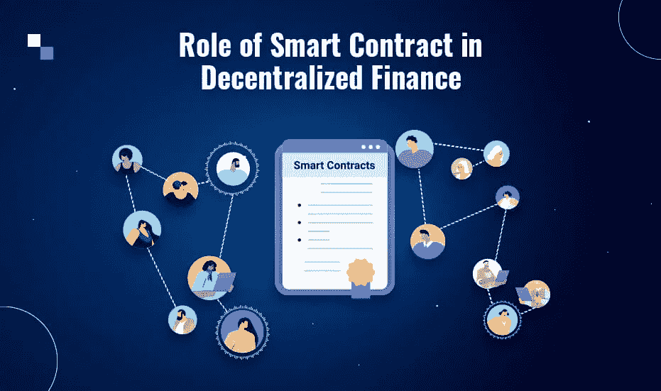
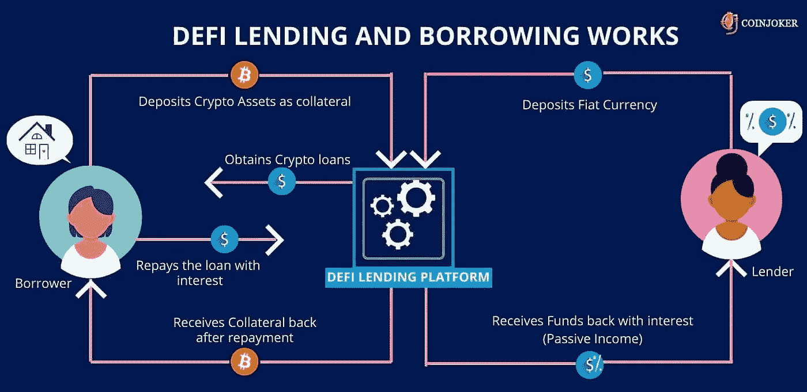
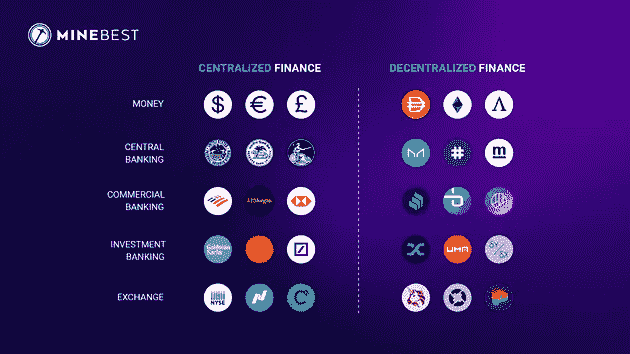
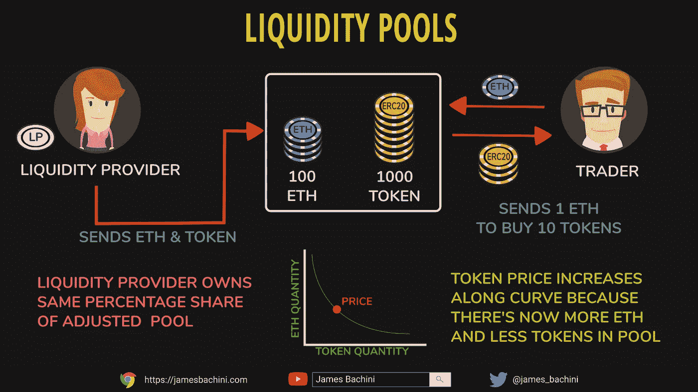
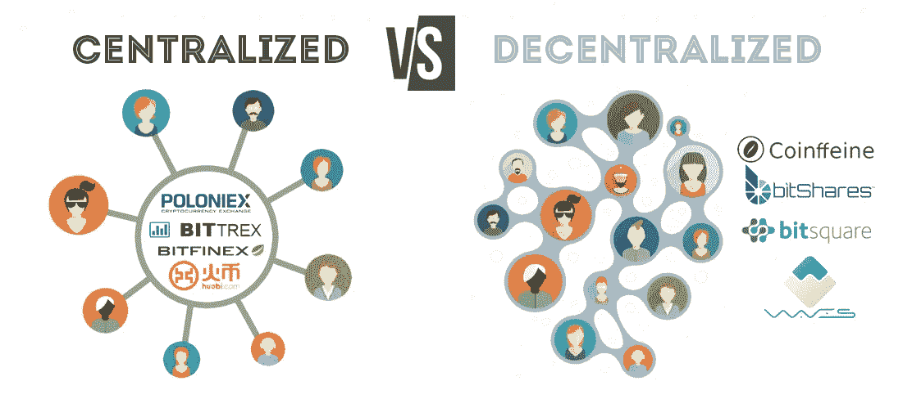
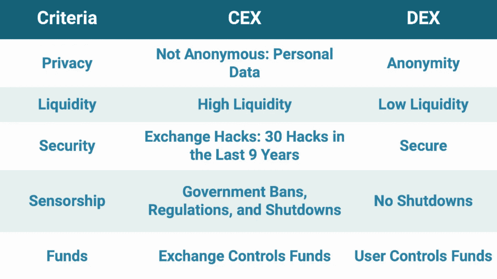
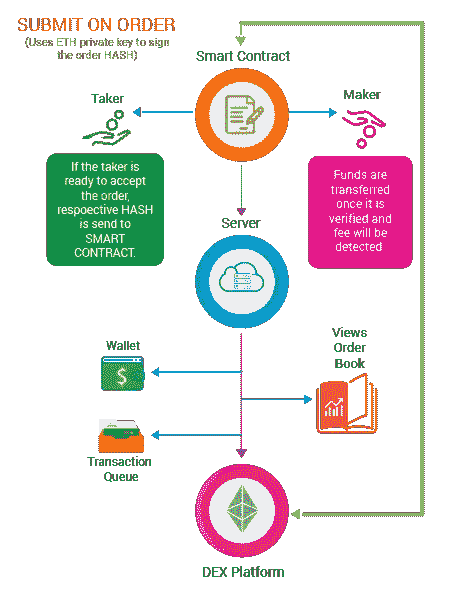

# Blockchain Blog 12:分散财务(DeFi)

> 原文：<https://medium.com/coinmonks/blockchain-blog-12-decentralize-finance-defi-bc679132fafc?source=collection_archive---------17----------------------->

我们通过了解几千年前存在的[易货系统](https://aaklii.medium.com/blog-1-cryptocurrencies-is-it-needed-part-1-33d51eecd6fa)在 Blockchain 和 Cryptocurrency 上创建了这些 [28 博客。我们仔细观察了自己是如何从易货系统转变为数字货币的。然后我们谈到了我们的](https://aaklii.medium.com/28days-of-february-blockchain-and-cryptocurrency-research-blogs-4b73c51ce3db)[经济体系](https://aaklii.medium.com/blog-2-cryptocurrencies-is-it-needed-part-2-fa5a7b14e220)是如何不断变化以跟上现代创新和技术的。我们向[区块链](https://aaklii.medium.com/blog-3-blockchain-for-the-data-age-b43e801a0e6e)介绍了自己，以及为什么它被认为是未来时间的[希望](https://aaklii.medium.com/blog-04-bf1e72bf0f29)。也许我们谈论的一切只是为了理解区块链的一个特定应用的革命性实现，即**分散金融**，或 **DeFi** 。

因此，在了解 **DeFi** 之前，让我们来谈谈自货币首次被引入以来，我们在经济体系中使用的中央财政系统。

## 中央财政

几乎贷款、银行和交易的每个方面都由中央系统和政府机构管理。银行充当第三方中介，可以批准或拒绝交易和取款。纽约证券交易所(NYSE)控制着哪些资产可以在美国购买，并且可以对不遵守指导方针的公司进行退市和纪律处分。美联储、美国财政部、国内收入署(IRS)和证券交易委员会(SEC)等监管机构制定了集中式金融机构应遵循的指导方针和规则。这些中介团体降低了公共空间获得资本和金融服务的便利性。

## 那么，什么是分散式金融(DeFi)？

分散式金融(DeFi)是一种金融应用生态系统，对中央管理机构控制金融服务的理念提出了挑战。这是一场全球范围的分权运动，旨在创建开放、透明和无争议的金融服务系统，供全球任何人使用，无需中央监管或授权。DeFi 应用和服务建立在公共区块链的基础上，例如 Ethereum。他们可以复制现有的集中金融服务，甚至提供考虑到 DeFi 系统而创造的新的创新服务

那么，为什么要将 DeFi 视为集中融资系统的一种选择呢？我们在[区块链消除贫困中已经讲过现行金融体系的弊端？](https://aaklii.medium.com/blog-05-f3add0f865e5)

## 那么 DeFi 有什么好处呢？

使用分散式金融系统的一些好处是:
与当前金融系统隔离的个人、地区或国家容易获得金融服务。这可以包括获得银行服务和贷款。DeFi 是使用以太坊等区块链技术建造的。这些基于公共区块链的应用程序提供了传统金融服务所不具备的透明度。传统金融系统依赖机构(银行、信用卡公司等)在交易过程中充当中介。人们依赖法院和其他监管机构来解决金融纠纷。DeFi 应用不需要任何第三方实体来解决交易或争议。协议以智能合同的形式签订，不能更改。金融交易中第三方监督的取消降低了提供和使用这些服务的总成本，并允许建立一个更具流动性的金融系统。

## DeFi 和智能合同

智能合同是自动执行的合同，买卖双方之间的协议条件直接写入代码行。此代码和协议一旦创建就不能更改，并且可以在以太坊等公共区块链上访问。任何人都可以查看和验证智能合同，并且交易总是可跟踪和不可逆转的。智能合约是分散融资背后的基础。它们编码了不同分散应用程序(DApps)的特定条款、协议和活动。这些项目不仅仅是发送和接收资金。这方面的一个例子可以在双方之间的贷款中找到。将创建智能合同，对贷款的具体细节进行编码，并且一旦创建就不能更改。如果借款人不满足某些条件，他们的抵押品可能会被清算。这些协议是由智能合约背后的编码执行的，而不是由银行等第三方机构执行的。

## 定义借贷

在传统的金融体系中，你可以考虑将钱存入储蓄账户，并享受 0.5%的存款利率。然后，银行可以以 3%的利率将这笔钱借给另一位客户，自己收取 2.5%的利率，0.5%的利率留给储蓄账户所有人。在 DeFi 中，用户可以直接借出投资，省去了中间人，并从他们的钱中获得 3%的利息回报。像 Compound 和 Aave 这样的借贷应用程序允许你存放你的密码，以此作为抵押，并以此进行借贷。你也可以选择把你的密码存起来借出去，从你的投资中获得被动收入/利息。智能合同用于确保资金的安全性，自动匹配借款人和贷款人，并根据供求关系主动调整利率。

## 流动性池

流动性池是锁定在智能合约中的资本集合。这些流动资金池(资金)用于促进分散式贷款、交易和 DeFi 生态系统中使用的其他 DApps。智能合约不是由中央机构为贷款提供资本，而是用来为借贷双方分配和筹集资本。流动性池的所有活动都由智能合约代码管理，消除了处理大型基金时的人为错误和干预风险。

## 高产农业

智能合约允许投资者将其资本投资于流动性池，而无需第三方监督。随着储户将资金投入这些资金池，他们通常有资格获得基于资金池锁定金额和存款期限的回报。收益农业是投资者从投资于流动性池的利息中获利的过程。将资金存入流动性池的用户称为流动性提供者。这些池为出借、借用或交换代币的应用程序和市场提供动力。使用这些应用程序会产生费用，这些费用根据流动性提供商在资金池中的份额支付给他们。

# 分散和集中的市场

## 集中式交易所是如何工作的？

在典型的集中交易中，资金被存入一个账户，用于购买加密货币。当 crypto 被购买并存储在一个集中的交易所时，你就放弃了对它的控制权。你仍然可以交易、出售或提取货币，但你不能在区块链上使用它。您不拥有在中央交换机上购买/存储的加密私钥。当您撤销 crypto 时，您实际上是要求交易所代表您授权一项交易。当交易开始时，它们不会在链上发生。交易所在自己的数据库中向用户分配资金。

许多集中的交易所已经简化了他们的操作，从而提高了交易速度和易用性。尽管许多集中式交易所有着良好的历史记录，但还是存在一定程度的风险。交易所可以在任何时候以任何理由拒绝取款，这意味着有时你不能将你的密码送出交易所。还有一种风险是交易所在没有警告的情况下关闭，或者数据泄露可能导致黑客抽走交易所的资金。只有使用久经考验的信誉良好的交易所才能降低这种风险。

## **分散市场**

许多人会认为分散式交易所是最重要的 DeFi 应用之一。分散交易所是模仿典型的集中交易所的功能的平台。最大的区别之一是 dex 的**后端只存在于区块链上。**集中交易会保管您的资金/硬币，并要求一定程度的信任，交易会兑现您的交易。dex 不保管资金/硬币，因为交易是直接在用户之间完成的

## 分散式交易所是如何运作的？

dex 是通过使用智能合约来提供动力的，智能合约被编码编程到定义交易条款的区块链中。与集中交易不同，订单的执行和处理不需要用户在任何时候放弃对资金的保管。

大多数流行的指数都集中在单一区块链的资产上，如以太坊，但也有跨链指数在开发中。交易是 P2P(点对点)和直接的，没有任何中介。一些 dex 利用流动性池为某些市场提供交易对和流动性，消除了对实际买方/卖方的需求。

## dex 的优势

否 KYC:KYC/反洗钱(了解您的客户和反洗钱)是一项要求，您必须向 CEXs 提供身份证明文件和地址证明才能访问和使用它们。随着这些个人信息数据库的安全性受到质疑，这对用户来说是一个隐私问题。dex 使用时不需要您的个人信息。没有交易对手风险:使用 DEX 的主要动机之一是用户仍然控制着他们的资金。没有可能面临数据泄露风险的中央数据库。对未上市资产的访问:集中式交易所选择在其平台上可以使用哪些令牌。dex 提供了投资未上市资产的机会，没有进入壁垒

## dex 的缺点

没有与银行/借记卡的直接链接:dex 只能与加密货币一起工作，不能与 fiat(美元/欧元)直接交互和交换。您必须已经拥有加密货币才能使用 DEX。便利性:与集中式交换相比，dex 使用起来不够用户友好和直观。集中式平台显示实时交易和订单，不受封锁时间的影响。没有客户服务:如果您忘记了 CEX 的密码，您可以随时重置。dex 上没有客服。如果你忘记/丢失了你的私人钥匙，你的钱就会丢失，而且无法找回。交易量和流动性:CEXs 的交易量和流动性比 dex 大得多。流动性是你以一个公平可行的价格买卖资产的难易程度。在一个流动性市场中，出价(买方价格)和要价(卖方价格)在价格上几乎没有差别。在流动性差的市场中，买价和卖价之间有很大的差异。这也可能是一个供需问题，因为 dex 仍然是利基市场。费用:使用 DEX 时，费用并不总是更高，但在网络活动频繁和网络拥塞时，费用可能会增加。

***阅读下一部分:*** [区块链博客 13:加密货币借贷](https://aaklii.medium.com/blockchain-blog-13-cryptocurrency-lending-16c7d5370d5e)

***全系列:*** [28 篇关于区块链和加密货币的博客](https://aaklii.medium.com/28days-of-february-blockchain-and-cryptocurrency-research-blogs-4b73c51ce3db)

> 加入 Coinmonks [电报频道](https://t.me/coincodecap)和 [Youtube 频道](https://www.youtube.com/c/coinmonks/videos)了解加密交易和投资

## 另外，阅读

*   [3 商业评论](/coinmonks/3commas-review-an-excellent-crypto-trading-bot-2020-1313a58bec92) | [Pionex 评论](https://coincodecap.com/pionex-review-exchange-with-crypto-trading-bot) | [Coinrule 评论](/coinmonks/coinrule-review-2021-a-beginner-friendly-crypto-trading-bot-daf0504848ba)
*   [莱杰 vs n rave](/coinmonks/ledger-vs-ngrave-zero-7e40f0c1d694)|[莱杰 nano s vs x](/coinmonks/ledger-nano-s-vs-x-battery-hardware-price-storage-59a6663fe3b0) | [币安评论](/coinmonks/binance-review-ee10d3bf3b6e)
*   [Blockfi vs 比特币基地](https://coincodecap.com/blockfi-vs-coinbase) | [BitKan 点评](https://coincodecap.com/bitkan-review) | [Bexplus 点评](https://coincodecap.com/bexplus-review)
*   [南非的加密交易所](https://coincodecap.com/crypto-exchanges-in-south-africa) | [BitMEX 加密信号](https://coincodecap.com/bitmex-crypto-signals)
*   [MoonXBT 副本交易](https://coincodecap.com/moonxbt-copy-trading) | [阿联酋的加密钱包](https://coincodecap.com/crypto-wallets-in-uae)
*   [雷米塔诺审查](https://coincodecap.com/remitano-review)|[1 英寸协议指南](https://coincodecap.com/1inch)
*   [iTop VPN 审查](https://coincodecap.com/itop-vpn-review) | [曼陀罗交易所审查](https://coincodecap.com/mandala-exchange-review)
*   [40 个最佳电报频道](https://coincodecap.com/best-telegram-channels) | [喜美元评论](https://coincodecap.com/hi-dollar-review)
*   [折叠 App 审核](https://coincodecap.com/fold-app-review) | [StealthEX 审核](/coinmonks/stealthex-review-396c67309988) | [Stormgain 审核](https://coincodecap.com/stormgain-review)
*   [购买 PancakeSwap(蛋糕)](https://coincodecap.com/buy-pancakeswap) | [俱吠罗评论](/coinmonks/coinswitch-kuber-review-1a8dc5c7a739)
*   [瓦济里克斯 NFT 评论](https://coincodecap.com/wazirx-nft-review)|[Bitsgap vs Pionex](https://coincodecap.com/bitsgap-vs-pionex)|[丹吉尔评论](https://coincodecap.com/tangem-wallet-review)
*   [如何使用 Solidity 在以太坊上创建 DApp？](https://coincodecap.com/create-a-dapp-on-ethereum-using-solidity)