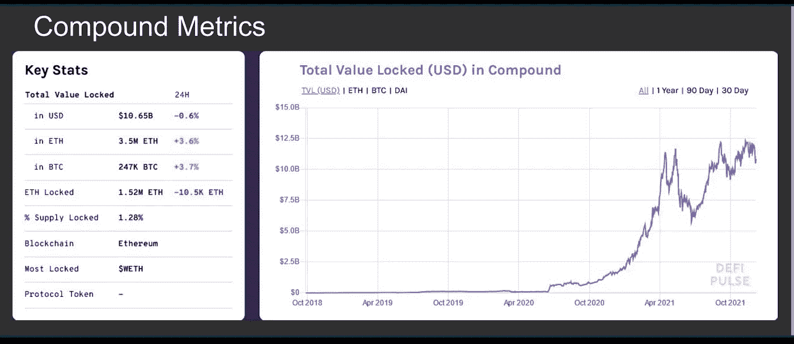

# 区块链博客 13:加密货币借贷

> 原文：<https://medium.com/coinmonks/blockchain-blog-13-cryptocurrency-lending-16c7d5370d5e?source=collection_archive---------14----------------------->

在这篇博客中，我们将继续我们在上一篇博客中开始的 DeFi 探索。但在我们开始探索加密货币贷款之前，让我们先来谈谈分散式游戏。

# DeFi 游戏

去中心化的技术已经允许去中心化的游戏模式的产生，正如我们所知道的，这挑战了游戏产业。今天，大多数网络游戏都遵循一种集中的模式，所有的数据都存储在由游戏开发者完全控制的服务器上。由于数据库由一家公司所有，玩家对他们的账户和物品没有真正的所有权。

今天游戏行业的不利因素包括:
-导致服务器故障的技术问题
-黑客通过一个入口点渗透中央系统的威胁
-不当禁止帐户和 IP 地址
-关于游戏内机制和掉线率的不透明
-开发者操纵游戏内经济
-游戏关闭，用户丢失所有游戏内数据

## 分散游戏的好处

真实所有权:玩家可以永久拥有并完全控制游戏中的物品。项目可以表示为 NFT，它可以在任何时候与其他用户进行交易。
**精简支付:**区块链技术具有降低费用、提高交易速度的力量。它还可以作为一种激励，直接向开发商付款，而不是通过多个中间商和出版商。
**透明性:**区块链科技的使用允许创建开放源代码和透明的游戏服务器。所有用户都知道游戏中的机制，因为他们总是可以在网络上找到它。
**分散市场:**建立在区块链网络基础上的游戏可以创建分散市场，玩家可以在那里直接相互购买、出售和交易游戏中的物品

## 分散土地

《分散王国》可能是最受欢迎和最成功的分散式视频游戏之一，它是一个位于区块链的虚拟世界，由以太坊区块链提供动力。分散的土地允许用户在虚拟世界中建立他们自己的游戏、工具、市场和内容。它本质上是在虚拟环境中运行的《我的世界》的分散版本。分散土地中的虚拟土地永久归社区成员所有，这允许他们控制和拥有自己的创作。他们也可以选择向其他用户出售、交易和购买虚拟土地和分散土地上的任何其他创造。分散土地中的土地被编码为不可替代、可转让的稀缺数字资产(NFT)。这种技术与智能合约一起促进了虚拟环境中的货币、商品和服务的交易。

现在，当我们开始探索元宇宙和 NFT 时，我们将谈论更多关于分散土地的内容。
我们将回到讨论加密货币借贷的正轨。

# 加密货币借贷

在过去的几年里，加密货币领域已经形成了一个全新的借贷市场。借款人可以选择使用他们的加密资产作为抵押品来获得贷款。贷款人可以选择使用他们的加密资产来推动贷款，并从他们的投资中获得利息。

## 为什么使用加密贷款平台

想象一个场景，你需要一笔短期购买贷款，但没有现成的资金。假设你有 5 BTC，但你不想卖掉它，因为你希望它增值。如果你现在卖出，价格上涨，当你以更高的价格回购时，你的总 BTC 会减少。**加密货币借贷平台允许用户使用他们的硬币作为抵押来获得贷款，通常以稳定硬币的形式(基于法定价值的硬币)**

一些用户可能会选择“借入”资金，而不是出售他们的资产，以推迟支付从加密到法定转换的资本利得税。加密货币形式的贷款可以更容易地转移到交易所进行交易。

> 加密贷款以稳定币的形式支付，稳定币是一种数字资产，固定在选定的法定货币如 USDT 或 USDC 的价值上。如果需要，贷款也可以用加密资产支付，如 BTC。

**加密贷款用例**

●单一资产借贷
●免税流动性
●利率套利(在一个利率较低的平台上借贷，然后在另一个利率较高的平台上借贷)
●保证金交易/杠杆交易
●闪贷
●清算人(运行机器人程序以识别低于抵押率的贷款)

## 清算

许多贷款平台的部分协议是使用抵押品，用户必须提供一定价值的资本/资产才能获得贷款。

抵押贷款的一个例子是，如果用户想通过 Aave 借贷协议借入价值 1000 美元的 USDT。用户将需要提供价值 1500 美元的资产(这可能是 BTC，联邦理工学院，或其他资产)来支付他们的贷款。如果抵押品的价值下降到低于 1500 美元的估价，该资产将立即出售，以弥补贷款人的贷款。这被称为清算事件。每个贷款平台都有不同的贷款抵押比率条款，所以在贷款前，确保你了解所有的协议条款。

## 加密贷款

## 集中贷款计划

中央金融平台(CeFi)的运作与银行类似。存款资产由银行托管，然后贷给其他客户，包括对冲基金、做市商、机构贷款和零售用户。储户根据投资规模和存款期限获得回报。重要的是要知道，大多数集中贷款平台都有用户必须遵守的 KYC/反洗钱政策，这意味着您必须提供身份证明并通过背景调查才能使用他们的服务。例子:○ BlockFi ○ Celsius ○ Nexo ○币安、库币等交易所

## CeFi 贷款的缺点

虽然 CeFi 贷款系统运行良好，但可能存在一些问题，如:
● **信任** -你必须信任该机构与你的资金
● **隐私** -在 CeFi 贷款或借款时需要个人数据
● **盗窃** -该组织可能会收取你的存款，并在协议结束时不予归还
● **安全** -集中式机构可能容易出现安全故障，比分散式协议更容易受到黑客攻击

## 定义借贷

分散金融(DeFi)贷款协议提供加密货币贷款，而不需要不可信系统中的第三方。通过使用智能合同，条款和协议在以太坊等公共区块链上被编码。区块链理工大学和智能合同的数字本质有助于在世界任何地方使用这些 DeFi 协议，而不必将个人数据委托给一个集中的人物。
违约贷款协议的例子包括:○ AAVE ○复合○制造商○曲线

## DeFi 贷款协议如何工作——贷方

在理解贷款协议时，有两个角度需要考虑:贷款人和借款人。希望成为贷款人的人将他们的资产(硬币)存入由智能合同驱动的贷款池。用户将他们的代币发送到智能合同地址，智能合同地址保存硬币并帮助将硬币借给借款人。智能合约充当自动化中介，在这种情况下取代银行等中央机构。智能合约然后根据累计利息向储户发送代币。奖励的代币基于所使用的平台。
**举几个例子:**
**制造者**——制造者利用戴令牌
**——利用令牌**

****

****DeFi 贷款协议如何运作——借款人****

**大多数贷款项目被认为是超额抵押的，借款人必须向贷款项目提供等于或大于贷款总额的资产。这可能因平台而异。假设有人想借价值 30，000 美元的加密货币，而他们刚好有 1 个 BTC 和 BTC，刚好每个都值 30，000 美元。他们可以将他们的 BTC 作为抵押品存入借贷平台，他们将获得他们所要求的贷款。这通常是以稳定密码的形式，但也可以是 BTC 或其他密码的形式。重要的是要记住，总体而言，比特币和加密货币的价值仍然不稳定。在贷款期间，抵押品和贷款的价值可能会增加或减少。**

## **DeFi 贷款的好处**

****无权限:**任何拥有加密货币和钱包的人都可以参与借贷计划，无论他们在世界的哪个角落。
**透明:**所有信息和记录都存储在借贷平台使用的区块链上(最常见的是以太坊)。通过使用区块链探索者，公众可以看到每一笔交易。
**一致性:**贷款平台的访问和使用由支持平台的智能合同中使用的编码决定。通过使用自动化消除了审查申请人和创建协议时的人为错误。
**速度:** DeFi 借贷平台在计算贷款期限和风险时，利用自动化系统进行分析、欺诈检测和其他辅助措施。与传统的贷款方式相比，这可以实现更快、更简化的流程。**

## **贷款限制**

**一个人可以贷款的金额主要取决于所提供的抵押品的数量。假设有人想用复利(COMP)借贷平台，想借以太坊(ETH)。
○以太坊有 75%的复合抵押品系数，这意味着您最多只能借入所提供抵押品价值的 75%。
○如果你提供价值 1000 美元的 ETH 作为抵押，你只能借价值 750 美元的 ETH。
需要记住的一件重要事情是，贷款的总价值必须低于/高于担保系数。如果 ETH 有 75%的抵押品系数，那么你的贷款金额必须保持在抵押品价值的 75%以下。**

## **利息回报和费用**

**在以太网上，一些利息会随着街区的不同而波动。这意味着利率可以根据协议签订时的借贷需求而变化。
○如果对借款人有更大的需求，就会有更大的贷款动机。
○如果借款人很多，但贷款人/流动性不够，可能会有更多贷款人参与的动力。**

**这因平台而异。有些利率在整个贷款期间是稳定的。稳定的 apy 的例子有:○ AAVE ○制造商**

## **快速贷款**

**快速贷款是通过 DeFi 贷款平台获得的无抵押贷款。借款人可以在不使用抵押品的情况下获得贷款，但他们必须在同一笔交易中偿还全部金额。
●智能合同用于确保借款人立即归还资金。如果借款人没有偿还贷款，智能合同可以回滚交易，并将贷款归还给贷款人。**

****这种立即归还贷款的能力降低了贷款人发放贷款时的风险。** ○不需要信用评分/背景调查，因为付款是自动执行的
○在快速贷款中对借款金额没有限制。**

**Aave lending protocol 是第一个在 DeFi 领域提供快速贷款的贷款服务。Aave 闪贷有一个直截了当的条件:在交易完成前还贷。如果不满足此条件，贷款将被作废，默认情况下，与贷款相关的所有交易都将被作废。
**Aave 闪贷可以分解为 3 个部分:**
○用户从 Aave 借贷池借代币
○在以太坊区块链上满足贷款标准
○用户必须偿还贷款加上 Aave 的 0.09%服务费。**

# **DeFi 贷款示例**

****************

# **风险(定义)**

**虽然 DeFi lending 可能没有集中式贷款平台可能有的风险和缺点，但有一些重要的事情要记住。一些借款年利率在贷款期间会有波动，贷款利率会大幅上升，导致不得不偿还比预期更多的贷款。
○这出现在 2020 年，当时某些加密货币借款 APYs 上涨超过 40%。
**●抵押品价值:**
○借款人必须确保他们的贷款与抵押品比率保持在可接受的范围内，否则他们的资产有被清算的风险。
○该系统确保贷款人不会冒失去投资的风险。
●通用钱包和密钥管理的相同规则也适用于 DeFi 部门。
○确保在安全的地方写下并保存私钥信息。
○确保您在转账时输入了正确的钱包/地址信息。
○如果你把你的资产送错了地址，没有客服可以帮你。**

****非永久性损失:**非永久性损失发生在当流动性池中锁定的资产的价值在存款后发生变化，并导致与流动性提供者仅持有资产而不存款相比的价值损失(法定价值)时。
○这可能是由于流动性池改变代币的价值以保持平衡比率而发生的。
**闪贷攻击:**闪贷攻击简单来说就是恶意用户利用闪贷借入大量资金，并试图操纵市场或利用漏洞。
**信任:**
○虽然与集中式实体相比，DeFi 平台需要的信任要少得多，但你还是要确保项目背后的创作者/团队是合法的。
○所有流程背后的智能合约中可能会使用错误代码，这可能会导致漏洞和利用。
○未经审核的开发商可以创建新的代币和借贷平台，从已经建立的平台窃取资金。重要的是，在你希望投资或利用的任何平台上，都要做好自己的研究。**

**这些贷款平台都不是联邦政府担保的机构。**监管风险:**
○许多 DeFi 平台在没有执照和 KYC/反洗钱措施的情况下运营，这可能是未来监管机构的目标。**

## **管理赤字风险**

**虽然使用这些类型的程序可能存在风险，但人们总是可以通过各种方式管理风险，例如:
●研究平台及其背后的团队。这可能包括查找团队成员的历史和相关项目。
●通读项目白皮书以确保准确性和合法性。
●自己翻翻智能合约编码或者研究一下是否经过可信的第三方审计。
●对回报的现实预期。吹嘘难以置信的回报和无与伦比的年度利润的项目应该亮起红灯。**

****

**这就是目前所有关于 T21 的事情。我们将在下一篇博客中探讨更多关于区块链的其他应用，如**分散自治组织(DAO)** 。**

*****阅读下一部分:*** [区块链博客 14:去中心化自治组织](https://aaklii.medium.com/blockchain-blog-14-decentralized-autonomous-organizations-dao-5aa6cd1c15de)**

*****全系列:*** [28 篇关于区块链和加密货币的博客](https://aaklii.medium.com/28days-of-february-blockchain-and-cryptocurrency-research-blogs-4b73c51ce3db)**

> **加入 Coinmonks [电报频道](https://t.me/coincodecap)和 [Youtube 频道](https://www.youtube.com/c/coinmonks/videos)了解加密交易和投资**

## **另外，阅读**

*   **[如何购买瑞波(XRP)](https://coincodecap.com/buy-ripple-india) | [非洲最好的加密交易所](https://coincodecap.com/crypto-exchange-africa)**
*   **[非洲最佳加密交易所](https://coincodecap.com/crypto-exchange-africa) | [Hoo 交易所评论](https://coincodecap.com/hoo-exchange-review)**
*   **[eToro vs robin hood](https://coincodecap.com/etoro-robinhood)|[MoonXBT vs by bit vs Bityard](https://coincodecap.com/bybit-bityard-moonxbt)**
*   **[Blockfi vs 比特币基地](https://coincodecap.com/blockfi-vs-coinbase) | [BitKan 评论](https://coincodecap.com/bitkan-review) | [Bexplus 评论](https://coincodecap.com/bexplus-review)**
*   **[南非的加密交易所](https://coincodecap.com/crypto-exchanges-in-south-africa) | [BitMEX 加密信号](https://coincodecap.com/bitmex-crypto-signals)**
*   **[MoonXBT 副本交易](https://coincodecap.com/moonxbt-copy-trading) | [阿联酋的加密钱包](https://coincodecap.com/crypto-wallets-in-uae)**
*   **[Remitano 审查](https://coincodecap.com/remitano-review)|[1 英寸协议指南](https://coincodecap.com/1inch)**
*   **[iTop VPN 审查](https://coincodecap.com/itop-vpn-review) | [曼陀罗交易所审查](https://coincodecap.com/mandala-exchange-review)**
*   **[40 个最佳电报频道](https://coincodecap.com/best-telegram-channels) | [喜美元评论](https://coincodecap.com/hi-dollar-review)**
*   **[折叠 App 审核](https://coincodecap.com/fold-app-review) | [StealthEX 审核](/coinmonks/stealthex-review-396c67309988) | [Stormgain 审核](https://coincodecap.com/stormgain-review)**
*   **[购买 PancakeSwap(蛋糕)](https://coincodecap.com/buy-pancakeswap) | [俱吠罗评论](/coinmonks/coinswitch-kuber-review-1a8dc5c7a739)**
*   **[瓦济里克斯 NFT 评论](https://coincodecap.com/wazirx-nft-review)|[Bitsgap vs Pionex](https://coincodecap.com/bitsgap-vs-pionex)|[Tangem 评论](https://coincodecap.com/tangem-wallet-review)**
*   **[如何使用 Solidity 在以太坊上创建 DApp？](https://coincodecap.com/create-a-dapp-on-ethereum-using-solidity)**