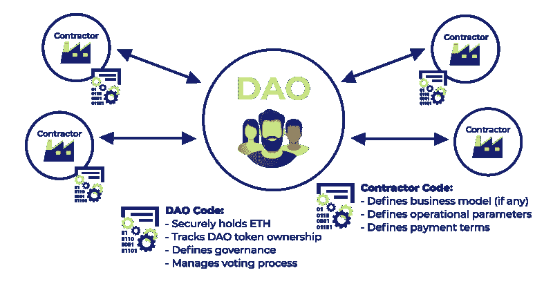
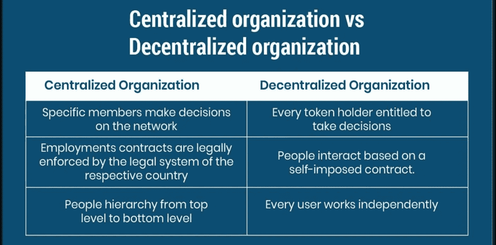
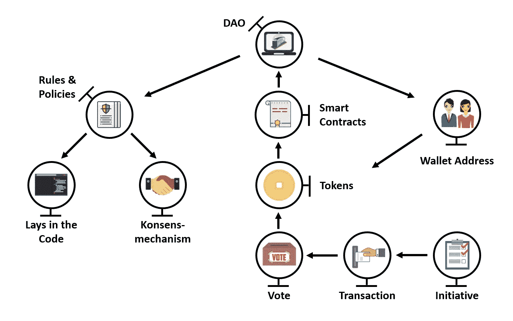
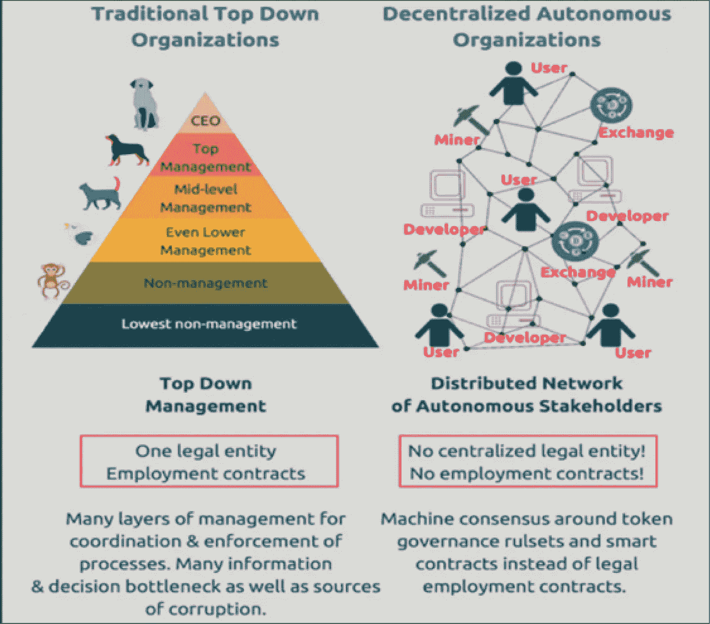
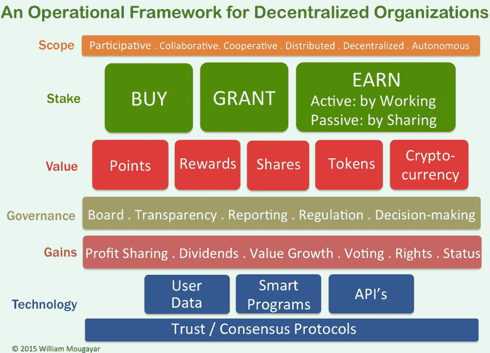
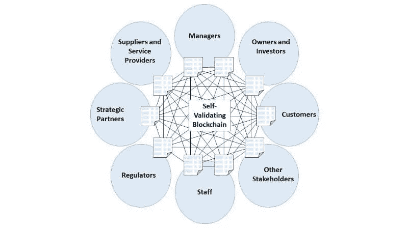

# 区块链博客 14:去中心化自治组织(DAO)

> 原文：<https://medium.com/coinmonks/blockchain-blog-14-decentralized-autonomous-organizations-dao-5aa6cd1c15de?source=collection_archive---------11----------------------->

分散式自治组织(DAO)是一种基于使用智能合同的分散式组织管理系统。这些组织不受政府或中央银行等单一实体的控制。本质上，该组织将通过投票表决规则和程序更新来运行和管理区块链协议。这些区块链协议可以以交易所的形式存在，如 Uniswap，流动性池，甚至贷款协议，如 AAVE 和 Maker。

Dao 使大型社区能够参与组织的决策过程和整体治理。决定由成员投票表决。可以进行投票来决定如何分配资金和资源。为了做出决定，需要有最低百分比的投票者达成一致或同意。一旦投票被计数和验证，规则/更新通过使用智能合约被编码到区块链本身中。

## 它们是如何工作的？

智能合同消除了中介参与更新/规则/决策的实施的必要性。当满足指定条件时，会自动引入规则和预设更新。这可能是一个预定的日期，也可能是在达到特定的砌块高度之后。所有的决定、投票和执行都记录在区块链中，所有人都可以看到。这些记录不能通过使用分散的区块链理工大学篡改，在那里块历史被记录到在世界各地操作的节点上。

**一个 DAO 有 3 个关键部分:
智能合约:**必须首先创建和审计 DAO 背后的编码。这包括正式发布前的所有初步规则集。一旦 DAO 上线，规则只能通过治理提案(投票)来更改。
**资本:**一旦智能合约到位，DAO 就必须获得资金并填充成员。通常，出售治理令牌(股份)来筹集资金。然后，这些令牌赋予购买者在组织中投票的能力。
**部署:**在建立了智能合同和资金之后，可以将 DAO 部署到区块链上。在这一点上，DAO 是活动的，对 DAO 的控制不再仅仅掌握在开发人员手中。代币持有者现在通过投票负责提案和决策

## 治理令牌

DAOs 将提供治理令牌来吸引投资者和资本到它的协议/组织中。这些治理令牌代表了 DAO 中的成员资格和投票权。拥有更多治理令牌将使用户在 DAO 中拥有更多股份和更多投票权，类似于上市公司的股东。

## DAO 用法的可能示例

利用 DAO 管理系统的一些可能的情况包括:自由职业者群体，他们整合资金来支付软件订阅和其他数字必需品。慈善团体可以让成员/捐助者以透明的方式批准资金分配。金融公司可以使用 DAO 功能来允许成员对投资和其他金融决策进行投票。

**道的例子:** 大院
向往.金融
Uniswap
破折号
制造者道[https://makerdao.com/en](https://makerdao.com/en)火神道[https://www.molochdao.com/](https://www.molochdao.com/)

## Dao 的优势

**信任:**在传统组织中，投资者和管理集团决策/资金的人之间有很大的信任。Dao 消除了双方之间这种信任的必要性，因为编码确保了决策的准确实施。○只有编码需要被信任，才能按照广告的方式运行。
**效率:** DAOs 有助于加快网络决策，无需第三方参与决策过程。一旦作出决定，智能契约编码确保采取所需的行动，而无需进一步考虑。
**一致性:**决策制定过程的自动化和流程化确保了 Dao 在执行决策和更新时的一致性。○人为错误和不一致被排除在等式之外，有利于公平的决策和实施。
**透明性:**通过使用分散的区块链理工学院，组织做出的所有财务决策对所有成员都是可见的。投票机制背后的底层代码和智能契约也可用于审计。由于区块链记录了所有交易，阿道的财务也可以被审计。

## 委托代理问题

Dao 能够解决一个称为委托代理问题的问题，其中一个人/团体(代理人)可以为另一个人/团体(委托人)作出决定并采取行动。如果代理人为了自己的利益而采取行动，就可能对委托人不利。如果代理人和委托人之间存在信息脱节，委托人可能不知道自己被利用，也无法准确核实代理人的行为，这一问题可能会恶化。

例子:
○代表日常公民的民选官员
○代表投资者的经纪人
○代表股东的企业高管。

DAO 可以消除这种困境，区块链技术提供的透明性使用户能够完全识别 DAO 采取的所有操作。

***阅读下一部分:*** [区块链博客 15:区块链共识协议](https://aaklii.medium.com/blockchain-blog-15-blockchain-consensus-protocols-ac07d35bce4c)

***全系列:*** [28 篇关于区块链和加密货币的博客](https://aaklii.medium.com/28days-of-february-blockchain-and-cryptocurrency-research-blogs-4b73c51ce3db)

> 加入 Coinmonks [电报频道](https://t.me/coincodecap)和 [Youtube 频道](https://www.youtube.com/c/coinmonks/videos)了解加密交易和投资

## 另外，阅读

*   [印度的秘密税](https://coincodecap.com/crypto-tax-india) | [altFINS 审查](https://coincodecap.com/altfins-review) | [Prokey 审查](/coinmonks/prokey-review-26611173c13c)
*   [赢取注册奖金——10 大最佳加密平台](https://coincodecap.com/earn-sign-up-bonus)
*   [Blockfi vs 比特币基地](https://coincodecap.com/blockfi-vs-coinbase) | [BitKan 评论](https://coincodecap.com/bitkan-review) | [Bexplus 评论](https://coincodecap.com/bexplus-review)
*   [南非的加密交易所](https://coincodecap.com/crypto-exchanges-in-south-africa) | [BitMEX 加密信号](https://coincodecap.com/bitmex-crypto-signals)
*   [MoonXBT 副本交易](https://coincodecap.com/moonxbt-copy-trading) | [阿联酋的加密钱包](https://coincodecap.com/crypto-wallets-in-uae)
*   [雷米塔诺审查](https://coincodecap.com/remitano-review)|[1 英寸协议指南](https://coincodecap.com/1inch)
*   [iTop VPN 审查](https://coincodecap.com/itop-vpn-review) | [曼陀罗交易所审查](https://coincodecap.com/mandala-exchange-review)
*   [40 个最佳电报频道](https://coincodecap.com/best-telegram-channels) | [喜美元评论](https://coincodecap.com/hi-dollar-review)
*   [折叠 App 审核](https://coincodecap.com/fold-app-review) | [StealthEX 审核](/coinmonks/stealthex-review-396c67309988) | [Stormgain 审核](https://coincodecap.com/stormgain-review)
*   [购买 PancakeSwap(蛋糕)](https://coincodecap.com/buy-pancakeswap) | [俱吠罗评论](/coinmonks/coinswitch-kuber-review-1a8dc5c7a739)
*   [瓦济里克斯 NFT 评论](https://coincodecap.com/wazirx-nft-review)|[Bitsgap vs Pionex](https://coincodecap.com/bitsgap-vs-pionex)|[Tangem 评论](https://coincodecap.com/tangem-wallet-review)
*   如何使用 Solidity 在以太坊上创建 DApp？