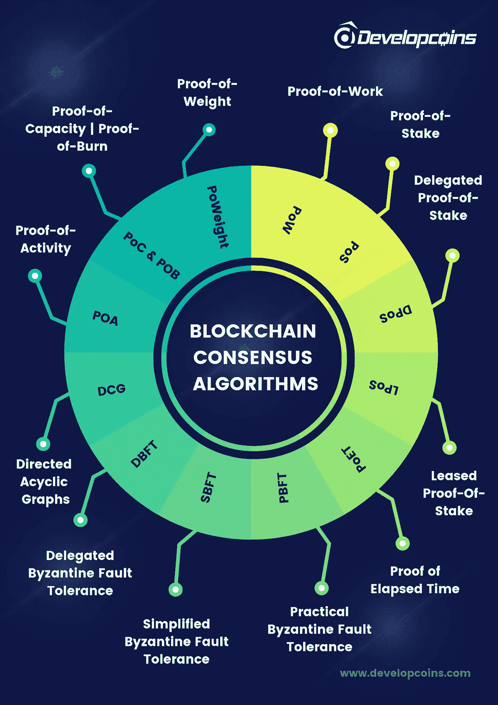
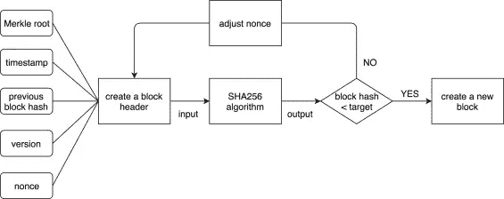
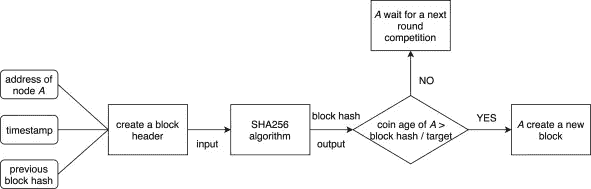
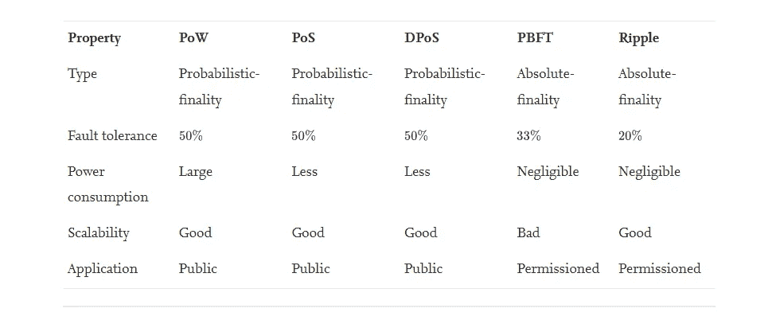
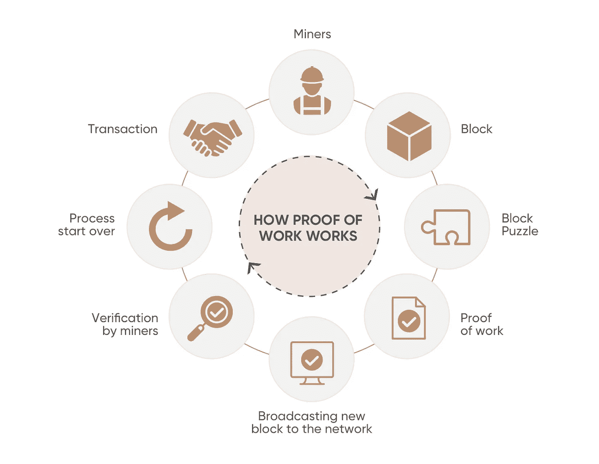
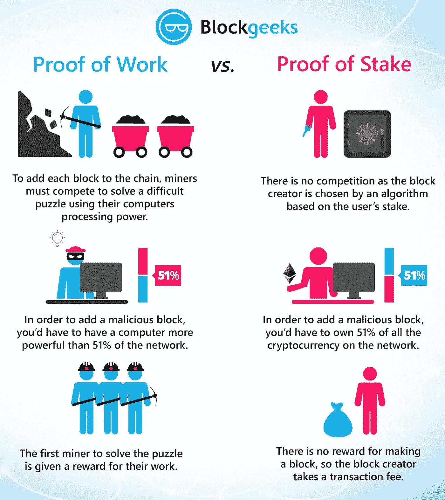
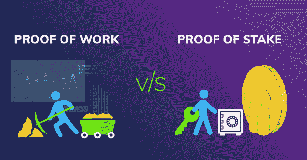
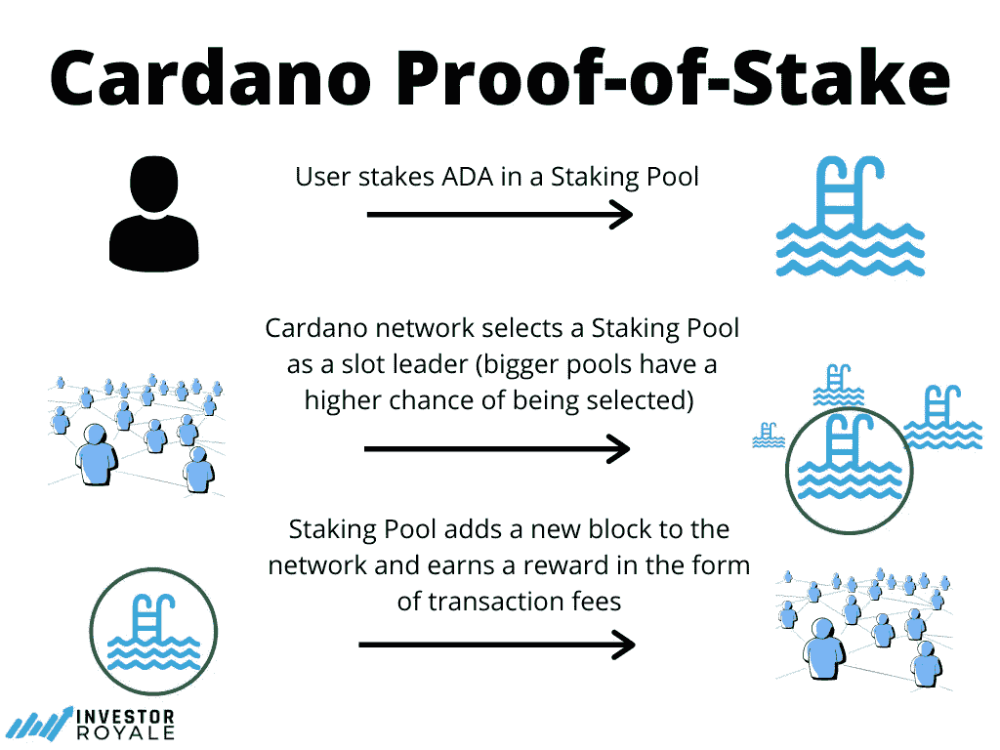
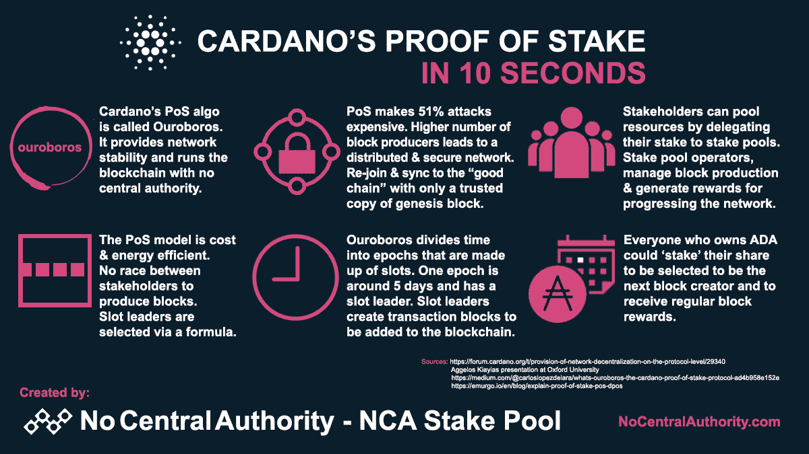

# 区块链博客 15:区块链共识协议

> 原文：<https://medium.com/coinmonks/blockchain-blog-15-blockchain-consensus-protocols-ac07d35bce4c?source=collection_archive---------10----------------------->

[区块链](https://www.sciencedirect.com/topics/engineering/blockchain)是很多[加密货币](https://www.sciencedirect.com/topics/computer-science/cryptocurrency)的核心技术。区块链作为一种分布式账本技术受到了广泛的研究关注。除了[密码术](https://www.sciencedirect.com/topics/engineering/cryptography)和 P2P(点对点)技术，共识协议也是区块链技术的基本组成部分。一个好的一致性协议可以保证区块链系统的容错性和安全性。

[区块链](https://www.sciencedirect.com/topics/engineering/blockchain)最早出现在中本聪的[比特币](https://www.sciencedirect.com/topics/computer-science/bitcoin)白皮书中，描述了一种新的去中心化[加密货币](https://www.sciencedirect.com/topics/computer-science/cryptocurrency)。比特币将区块链技术发挥到了极致，引起了人们的广泛关注。随后，许多基于区块链的加密货币和项目应运而生。区块链因此成为热门话题。有趣的是，区块链采用的技术并不新鲜。区块链只是简单地结合了[密码学](https://www.sciencedirect.com/topics/engineering/cryptography)，分布式系统技术，对等网络技术，以及其他众所周知的技术。此外，区块链还为加密货币提供了一个安全框架，任何人都不能篡改交易内容，所有节点匿名参与交易。因此，区块链技术可以广泛应用于各个领域，如金融领域、医疗系统、供应链和[物联网](https://www.sciencedirect.com/topics/computer-science/internet-of-things) (IoT)。

Flow of PoW.

然而，在应用区块链技术的过程中，会遇到许多挑战和问题，其中如何设计一个合适的一致性协议是一个大问题。区块链的共识是所有节点维护相同的分布式分类帐。在传统的[软件架构](https://www.sciencedirect.com/topics/computer-science/software-architecture)中，由于中心服务器的存在，一致性几乎不成问题，因此其他节点只需要与服务器保持一致。然而，在像区块链这样的分布式网络中，每个节点既是主机又是服务器，它需要与其他节点交换信息以达成共识。有时一些节点会宕机或离线，也会有一些恶意节点，严重影响或破坏共识的进程。因此，一个优秀的共识协议能够容忍这些现象的发生，将危害降到最低，从而不影响最终的共识结果。此外，系统采用的共识协议还需要适合系统使用的区块链类型。区块链有三种基本类型:公立区块链、财团区块链和私立区块链。每种区块链都有不同的应用场景。因此，所采用的一致性协议需要适合特定应用场景的需求。本文介绍了区块链的一些主要共识协议，并分析了它们的性能和应用场景。

Flow of PoS.

## 共识协议

在分布式系统中，没有完美的一致性协议。共识协议需要在一致性、可用性和分区容错性之间进行权衡。此外，共识协议还需要解决**拜占庭将军问题**即会有一些恶意节点故意破坏共识过程。在这一节中，我们详细描述了一些流行的[区块链](https://www.sciencedirect.com/topics/engineering/blockchain)共识协议，它们可以有效地解决拜占庭将军问题。

## **PoW(工作证明):**

PoW 被[比特币](https://www.sciencedirect.com/topics/computer-science/bitcoin)，以太坊等采用。PoW 通过计算能力竞争，在每轮共识中选择一个节点创建一个新块。在比赛中，参赛节点需要解决一个密码难题。首先解决难题的节点可以有权利创建新的块。很难解决一个功率难题。节点需要不断调整 nonce 的值来获得正确的答案，这需要很大的计算能力。恶意攻击者推翻链中的一个块是可行的，但是随着链中有效块的增加，工作量也在累积，因此推翻长链需要大量的计算能力。PoW 属于概率-最终一致性协议，因为它保证了最终的一致性。

分散式区块链网络依靠被称为共识机制的系统来处理交易和认证信息。比特币和以太坊等加密货币利用了一种被称为工作证明(PoW)的共识机制，俗称挖矿。工作证明系统利用采矿产生的大量处理能力来处理事务并防止重复支出。PoW 系统的一些问题和主要抱怨与这些极端的功率要求有关，这些功率要求可能不总是来自可再生和环境友好的来源。

**秘密采矿的弊端**

**昂贵的初期投资:**高昂的计算机硬件成本和其他物理成本(设施、管理等)。)作为进入秘密采矿领域的威慑和障碍。许多人批评采矿实践是为一小撮人保留处理交易的权力和控制权的一种方式。

能源成本高:一些人认为采矿过程(如比特币采矿)的能源成本过高。一些能源消耗跟踪器显示，采矿每年消耗约 77.78 太瓦时。这个数字相当于荷兰等整个国家的总能耗

**碳足迹:**许多批评都是针对秘密采矿对化石燃料发电的依赖。众所周知，许多大型地下采矿设施使用煤和其他“不干净”的燃料。2019 年的研究估计，比特币采矿每年产生 2200 万至 2300 万公吨的二氧化碳排放。

**PoS(股权证明):**

虽然基于电力的区块链已经成功运行了多年，但许多专家发现基于采矿的系统在网络可扩展性和能效方面效率低下。分散共识机制的新方法导致了利益证明(PoS)或简单的赌注的产生。PoS 具有与 PoW 系统类似的目的，在 PoW 系统中，网络参与者被选择来将最新的交易块添加到区块链中并接收奖励。参与者可以选择将他们的硬币锁定(或“下注”)到网络中(他们在网络中的股份)，并定期获得帮助保护网络和处理交易的奖励，而不是“挖掘”解决谜题以获得奖励。

在 PoS 中，选择每一轮节点，谁创建一个新的块取决于持有的股份，而不是计算能力。尽管节点仍然需要解决一个 SHA256 难题:

PoS 系统与 PoW 的不同之处在于，参与者不是使用计算硬件来处理交易，而是使用他们自己的代币作为网络中的“赌注”,从而有机会向区块链添加新的区块。本质上，加密货币被锁定以获得奖励。参与者被激励用来自网络的奖励来下注他们的硬币，以成功验证交易。每隔一段时间，协议将指定一个参与者来验证区块链的下一个区块。每个 PoS 系统处理有关奖励时间间隔的细节是不同的。被提名的机会与下注的硬币数量有关，用户下注的硬币越多，被选中和获得奖励的机会就越高。这刺激用户投入大量硬币。

因此，PoS 是一种节能的共识协议，它利用一种内部货币激励的方式，而不是消耗大量的计算能力来达成共识。注意[以太坊](https://www.sciencedirect.com/topics/computer-science/ethereum)计划从 PoW 过渡到 PoS。

## 工作证明与利益证明

加密领域的一个热门话题是区块链的**环境后果**使用了区块生产和验证所需的**工作证明** (PoW)共识机制。

除了每年消耗**大量电力**超过**波兰的比特币**和**奥地利的以太坊**之外，这两个区块链还产生数量惊人的**电子垃圾**，比特币每年产生**25060 吨**，堪比荷兰**小型 IT 设备垃圾**。这是由采矿场造成的，这些采矿场经常**更换损坏的设备**。来自[数字经济学家](https://digiconomist.net/bitcoin-energy-consumption)的数据。

相反，凭借其**利害关系证明** (PoS)共识机制， **Cardano 的网络不依赖处理能力**进行块验证。现在需要的是一个稳定的互联网连接(T21)和足够的股份来生产积木。也有一些 spo 在树莓 Pi 上运行他们的股份池，消耗大约 5 瓦的能量。

这就是为什么卡尔达诺经常被称为生态友好的区块链生态系统的原因。

## 赌注的好处——奖励

在 PoS 中下注硬币通常以新创造的同类型硬币的形式支付奖励。例如，赌注卡达诺(ADA)将奖励新创建的 ADA 令牌。块奖励的大小取决于多个因素，包括:
**池的大小:**池越大，越有可能被选择来填充时段的槽。资金池越大，获得奖励的机会就越多。
**赌注池条款:**不同的池会有不同的激励和奖励结构。有些人会比其他人奖励更高的百分比。

## 赌注和风险

了解您希望参与的每个项目的必要要求和协议非常重要，因为它们可能互不相同。
一些项目有锁定期或授权期，在锁定期或授权期内，被锁定的密码在一段时间内不能移动。这可能是一个问题，因为即使代币的价格改变，用户也不能交易被押的代币。

只有时间才能证明卡尔达诺或其他区块链将统治加密领域，尽管更现实的是我们将有一个区块链互联网，卡尔达诺背后的开发者很清楚这一点。这一点可以从他们建造带有以太坊的 [NFT 桥](https://en.cryptonomist.ch/2021/10/22/cardano-bondly-nft-bridge-ethereum/)和 [ERC-20 转换器](https://en.cryptonomist.ch/2021/08/30/cardano-launching-the-erc20-converter-on-testnet-to-create-a-bridge-with-ethereum/)的努力中得到证明。区块链之间的**互通**和**合作**至关重要。最终，共同的目标是**创造一个任何地方的任何人都可以进入的经济体系**，允许没有银行账户的人开始建立一个没有中介的**金融声誉，这在历史上一再让我们失望。**

***阅读下一部分:*** [区块链博客 16:密码交易所](https://aaklii.medium.com/blockchain-blog-16-crypto-exchanges-4dfa7f4a7cd7)

***全系列:*** [28 篇关于区块链和加密货币的博客](https://aaklii.medium.com/28days-of-february-blockchain-and-cryptocurrency-research-blogs-4b73c51ce3db)

> 加入 Coinmonks [电报频道](https://t.me/coincodecap)和 [Youtube 频道](https://www.youtube.com/c/coinmonks/videos)了解加密交易和投资

## 另外，阅读

*   [WazirX vs coin dcx vs bit bns](/coinmonks/wazirx-vs-coindcx-vs-bitbns-149f4f19a2f1)|[block fi vs coin loan vs Nexo](/coinmonks/blockfi-vs-coinloan-vs-nexo-cb624635230d)
*   [本地比特币审核](/coinmonks/localbitcoins-review-6cc001c6ed56) | [加密货币储蓄账户](https://coincodecap.com/cryptocurrency-savings-accounts)
*   什么是融资融券交易
*   [维护卡审核](https://coincodecap.com/uphold-card-review) | [信任钱包 vs MetaMask](https://coincodecap.com/trust-wallet-vs-metamask)
*   [去中心化交易所](https://coincodecap.com/what-are-decentralized-exchanges)|[Bitbns FIP](https://coincodecap.com/bitbns-fip)|[Bingbon 评论](https://coincodecap.com/bingbon-review)
*   [用信用卡购买密码的 10 个最佳地点](https://coincodecap.com/buy-crypto-with-credit-card)
*   [加拿大最佳加密交易机器人](https://coincodecap.com/5-best-crypto-trading-bots-in-canada) | [Bybit vs 币安](https://coincodecap.com/bybit-binance-moonxbt)
*   [阿联酋 5 大最佳加密交易所](https://coincodecap.com/best-crypto-exchanges-in-uae) | [SimpleSwap 评论](https://coincodecap.com/simpleswap-review)
*   购买 Dogecoin 的 7 种最佳方式
*   [最佳期货交易信号](https://coincodecap.com/futures-trading-signals) | [流动性交易所评论](https://coincodecap.com/liquid-exchange-review)
*   [南非的加密交易所](https://coincodecap.com/crypto-exchanges-in-south-africa) | [BitMEX 加密信号](https://coincodecap.com/bitmex-crypto-signals)
*   [MoonXBT 副本交易](https://coincodecap.com/moonxbt-copy-trading) | [阿联酋的加密钱包](https://coincodecap.com/crypto-wallets-in-uae)
*   [Remitano 审查](https://coincodecap.com/remitano-review)|[1 英寸协议指南](https://coincodecap.com/1inch)
*   [iTop VPN 审查](https://coincodecap.com/itop-vpn-review) | [曼陀罗交易所审查](https://coincodecap.com/mandala-exchange-review)
*   [40 个最佳电报频道](https://coincodecap.com/best-telegram-channels) | [喜美元评论](https://coincodecap.com/hi-dollar-review)
*   [折叠 App 审核](https://coincodecap.com/fold-app-review) | [StealthEX 审核](/coinmonks/stealthex-review-396c67309988) | [Stormgain 审核](https://coincodecap.com/stormgain-review)
*   [购买 PancakeSwap(蛋糕)](https://coincodecap.com/buy-pancakeswap) | [俱吠罗评论](/coinmonks/coinswitch-kuber-review-1a8dc5c7a739)
*   [瓦济里克斯 NFT 评论](https://coincodecap.com/wazirx-nft-review)|[Bitsgap vs Pionex](https://coincodecap.com/bitsgap-vs-pionex)|[Tangem 评论](https://coincodecap.com/tangem-wallet-review)
*   如何使用 Solidity 在以太坊上创建 DApp？