# 区块链博客 16:加密交换

> 原文：<https://medium.com/coinmonks/blockchain-blog-16-crypto-exchanges-4dfa7f4a7cd7?source=collection_archive---------23----------------------->

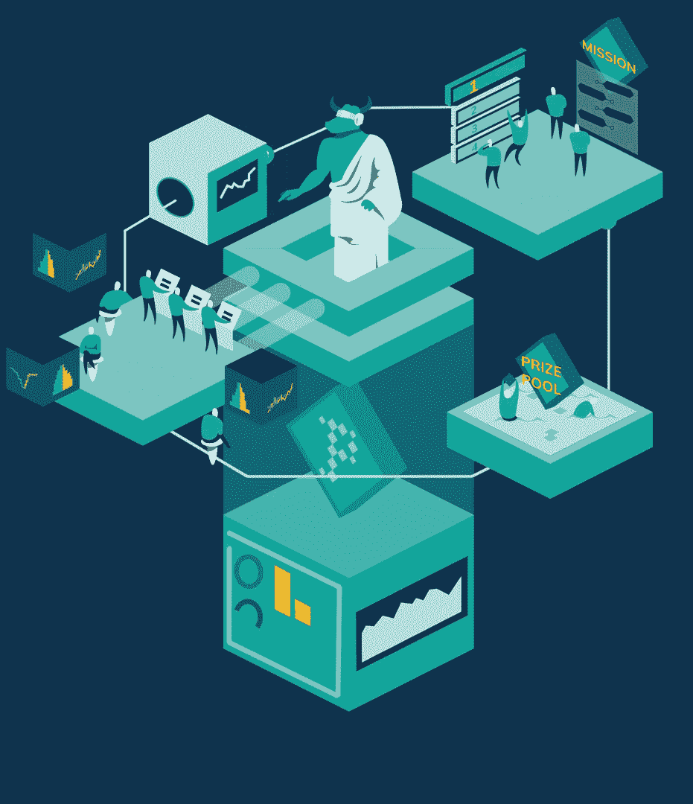

我们已经在以下内容中介绍了加密钱包:[区块链博客 06 —加密、安全和加密钱包](https://aaklii.medium.com/blockchain-blog-06-cryptography-sha-and-wallets-438a92921f1c)
，在这里我们探讨了**冷钱包**、**热钱包、**和不同类型的加密钱包。在这篇博客中，我们将讨论**加密交换。**

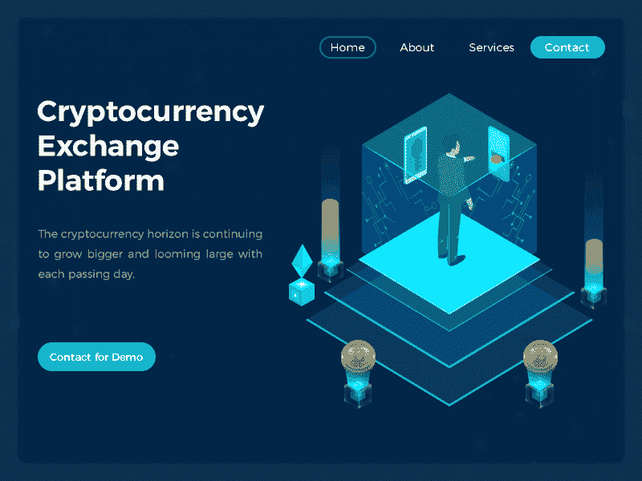

加密货币交易所是你可以购买和交易加密货币的数字市场。

你不能只从你的银行或投资公司购买密码。一旦你决定购买比特币、以太币或其他加密货币，你需要在加密交易平台上创建一个账户，将你的美元(或其他货币)兑换成数字资产。

你可以使用交易所将一个密码换成另一个——例如，将比特币转换成莱特币——或者使用普通货币(如美元)购买密码。交易所反映了他们提供的加密货币的当前市场价格。您还可以在交易所将加密货币兑换回美元或其他货币，以现金形式留在您的账户中(如果您希望以后再兑换回加密货币)，或者提取到您的常规银行账户中。

交易所的主要作用之一是在安全有序的交易环境中提供流动性。流动性只是衡量一项资产买卖的难易程度。交易所充当交易者和投资者的中介，用户可以在交易所轻松买卖他们的资产，而不必自己寻找买家/卖家。

# 在交换中寻找什么

## 易接近

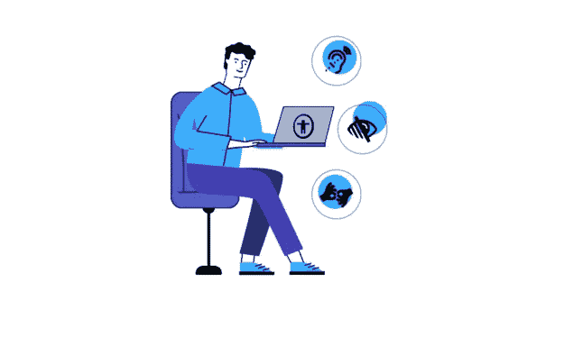

**由于州或国家法规，您所在的位置可能会阻止您在某些交易所买卖 crypto。有些国家，比如中国，已经完全禁止公民访问加密交易所。在美国，围绕加密货币有很多[监管不确定性](https://time.com/nextadvisor/investing/cryptocurrency/us-treasury-crypto-stance/)，一些州已经制定了自己的法规。您经常可以在其网站或服务条款中找到有关交易所的地理限制的信息，以及相关的可访问性因素，如接受的国家货币。**

## 安全性

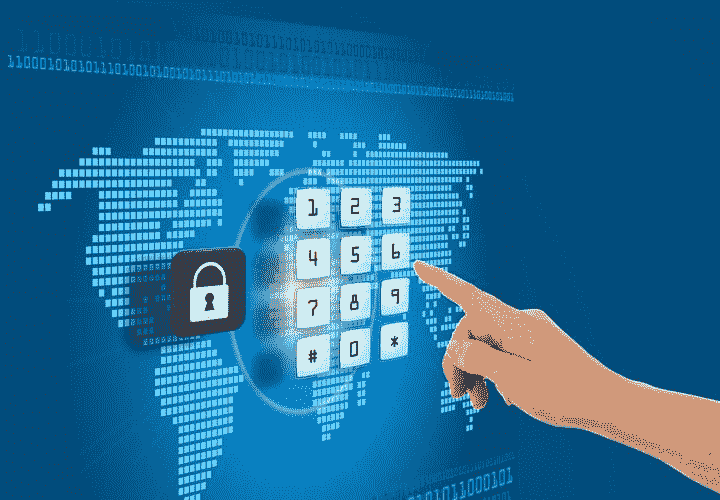

加密货币没有任何中央机构的支持，你持有的加密货币不会像银行存款或传统投资那样受到保护。一些交易所，如比特币基地、T2 和双子星，将你持有的美元余额保存在联邦存款保险公司保险的银行账户中。但 FDIC 保险不适用于加密货币余额。

无论您计划将您的加密资产保存在一个交易所内，还是在将它转移到您自己的钱包之前只在那里保存一段时间，交易所的安全性都应该是最重要的。例如，看看该交易所有多少离线资产存储在硬盘中。

您还可以在其他平台上寻找您可能已经熟悉的一般在线安全措施，例如双因素身份验证。这意味着，除了您的用户名和密码，您还必须使用额外的方法来验证您的身份，比如每次登录时输入您通过短信收到的代码。

总的来说，你可能会觉得最安全的是坚持使用已经拥有庞大客户基础的更受欢迎的交易所。与较小或较新的交易所做生意，你可能会冒更大的风险，这些交易所没有在网上清楚地说明它们的安全措施和产品。

## 资产流动性

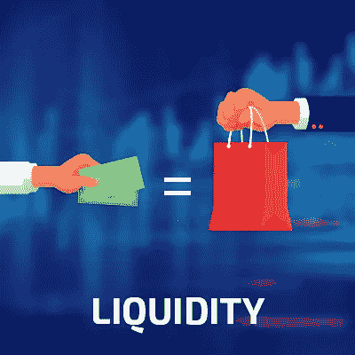

如果你打算购买、出售或交易你的密码，你选择的交易所应该有足够的交易量，以确保你持有的相对流动性，这意味着你可以在你想要的时候出售它们。同样，这也是尺寸很重要的一个例子。通常，更受欢迎的交易所也是那些交易量最大的交易所。

蒙哥马利说，当一个交易所在任何给定时间发生大量交易时，这意味着你有更大的机会以最佳价格买入或卖出你持有的密码。加密价格波动非常快，所以当你使用一个交易量不大的交易所时，你可能会比在更受欢迎的交易所支付更高的价格。例如，假设你决定在比特币价格跌破 32000 美元时买入比特币。如果你在一个交易量很低的交易所，如果你的购买直到价格回升后才真正成交，你最终支付的价格可能与你想象的不同。

CoinMarketCap，一个加密货币的价格追踪网站，持续地[追踪数百家运营中的交易所的交易量](https://coinmarketcap.com/rankings/exchanges/)。目前，它将币安、比特币基地和上海证交所列为全球交易量最大的交易所。

## 做市商和市场接受者

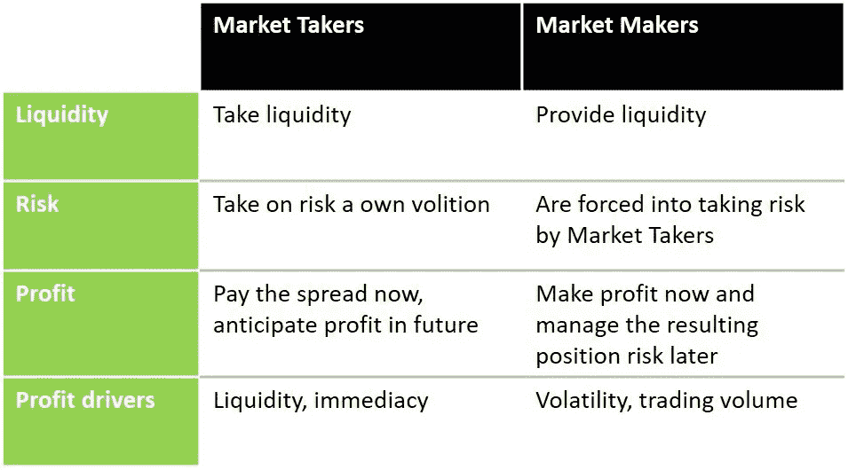

比特币基地专业版和北海巨妖专业版等交易交易所采用一种叫做“做市商费”和“做市商费”的收费结构。
做市商是在交易所下单但没有立即成交的用户。如果你想以比现在更低的价格购买 BTC，你可以按你想要的确切价格下单。如果价格降到那个水平，你的订单将被满足。
市场接受者是指下订单后立即成交的人。他们本质上是接受一个由做市商创造的订单并履行它。交易所通常会根据你的交易是被视为做市商还是接受者而收取不同的费用。

## 加密交换费用的类型

加密货币交易所对不同类型的用户行为收取费用:

交易费是交易所的主要收入来源。他们通常既被指控进行法定加密交易，也被指控进行加密交易。

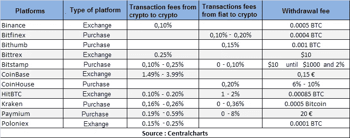

虽然交易所可以向加密货币用户提供各种服务，但在使用他们的平台时，每项服务往往都要收费。交易所对每一笔加密货币的购买、销售或转换(将一种加密货币转换成另一种加密货币)收取费用。费用可能基于您的位置、支付方式、转账金额和其他条件。不同交易所的费用可能不同，因此了解您使用的每个交易所的费用结构非常重要。

**存款/取款费** —一些交易所对存款和/或取款收取费用。存款费因存款类型而异，但不如取款费常见，因为交易所希望激励用户向账户注资。对于加密货币取款，许多交易所将费用限制在任何区块链交易成本(通常是固定费用，无论取款金额多少)，但有些交易所将根据您的国家或取款类型收取额外费用(加密与法定)

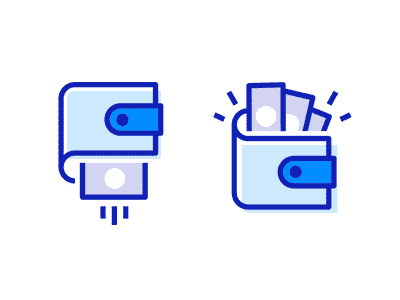

大部分时间是没有押金的。例如，币安不收押金。对于每次取款，用户都要支付一笔固定费用，以支付将加密货币从他们的币安账户转出的交易成本。
[查看此来源，了解更多不同交易所的存取款手续费。](https://www.cointracker.io/blog/2019-crypto-exchange-fee-comparison)

提款率由区块链网络决定，可能会因网络拥塞等因素而波动，恕不另行通知。

**利息/借款/清算费用**——一些交易所如北海巨妖、波洛涅克斯和 Bitfinex 提供[加密保证金交易](https://www.cointracker.io/blog/defi-yield-farming-crypto-tax-guide):借入或综合借入额外资金以增加你的头寸并创造[杠杆](https://www.investopedia.com/terms/l/leverage.asp)的能力。这些交易所通常会根据保证金借款额和由可用资金供应决定的利率收取额外费用。此外，如果你的交易颠倒，头寸被清算，你可能会被收取额外的费用。

## 冻结资金

冻结资金是指您最近存款的法定货币价值以及用这些存款购买的密码。一些交易所可能允许您立即向帐户存款，并允许您立即使用这些资金购买密码，但可能会暂停这些资金/密码，直到交易得到完全确认和结算。这意味着，虽然您可以立即用新存入的资金购买和交易 crypto，但您可能无法将其从您的帐户中转出，因为交易所可能会暂停交易，直到他们完成购买。

## KYC(了解你的客户)

KYC 是交易所用来验证客户身份和位置的过程。KYC 是所有资产类别和受监管机构的强制性做法，是世界各国政府采取的更广泛的反洗钱(AML)政策的一部分。KYC 的做法可能因交易所而异，但通常都包括这些政策:
**客户身份识别计划:**身份验证，包括用户的全名、出生日期、地址、社会保险、驾照和护照。
**客户尽职调查:**可以对新用户进行背景调查，以评估交易所与他们做生意可能承担的任何风险。
**持续监控/风险管理:**金融服务部门长期持续监控和监督其用户的行为和交易。

## 美国的税收

美国国税局将加密货币归类为财产，而不是货币。这导致使用适用于财产交易的税收规则，例如计入价值随时间的增值。一些例子:出售一辆老爷车或一个老式漫画书收藏。如果您已经出售、转换、捐赠、支付或赚取了任何数量的加密数据，并且需要缴纳美国税收，您必须向美国国税局报告当年的损益。国税局要求每个人负责报告他们的所有收入和交易。一些交易所可能会向美国居民发送一份年度总损益的税单。其他交易所可能仅仅提供可用于这些目的的全部交易历史。

## 应税事件

应税事件是记录的可能导致欠政府税款的行为。
以下是一些应纳税密码事件的例子:
○出售密码换取现金
○为商品或服务付款
○用另一个密码购买一个密码
○接收开采的密码
○由雇主支付密码
○空投(空投类似于免费赠品)
○接收赌注和利息奖励

## 免税加密事件

免税事件可以包括:
○向合格的免税慈善机构或非盈利机构捐赠密码
○用现金购买并持有密码
○在钱包/地址之间转移密码
○在交易所账户之间或从钱包向交易所转移密码

## 提供的硬币

不是每个交易所都能提供现存的数千种加密货币。

如果你对像[比特币或以太坊](https://time.com/nextadvisor/investing/cryptocurrency/ethereum-vs-bitcoin/)这样的流行硬币感兴趣，你可能会在你考虑的任何一家交易所找到它。但较新的替代币、市值非常小的币或迷因币可能需要多逛逛。

请记住，这些类型的硬币往往是在已经高度投机、更成熟的加密货币之上的更高风险的赌博。这就是为什么许多专家建议坚持使用像比特币和以太坊这样的大牌。对于你考虑在交易所购买的任何加密硬币，[只交易你准备损失的现金价值。](https://time.com/nextadvisor/investing/cryptocurrency/how-much-your-portfolio-should-be-crypto/)

## 教育工具

当选择交易所时，加密初学者的一大优先事项是有机会了解更多关于不同的硬币，数字资产和区块链技术。例如，比特币基地通过其“比特币基地挣”计划为学习新硬币的人提供奖励。作为观看视频和完成与不同硬币相关的测验的交换，比特币基地将奖励你一小部分密码，然后你可以持有或转换成其他东西。其他人在网站上提供课程和文章，帮助您了解密码市场、历史和创新，如双子座的密码百科全书或币安的币安学院。

## 帐户报表

账户对账单是你账户活动的总结。这可以基于您选择的特定日期范围。声明可以包括有关您的交易历史、购买加密的价格以及您是否出售加密以获利或亏损的信息。出于税务和其他原因，帐户报表对于记录您的交易非常有用。始终建议保留您自己的自制报表，以便与您的 exchange 中记录的内置报表进行比较。

## 秘密监管

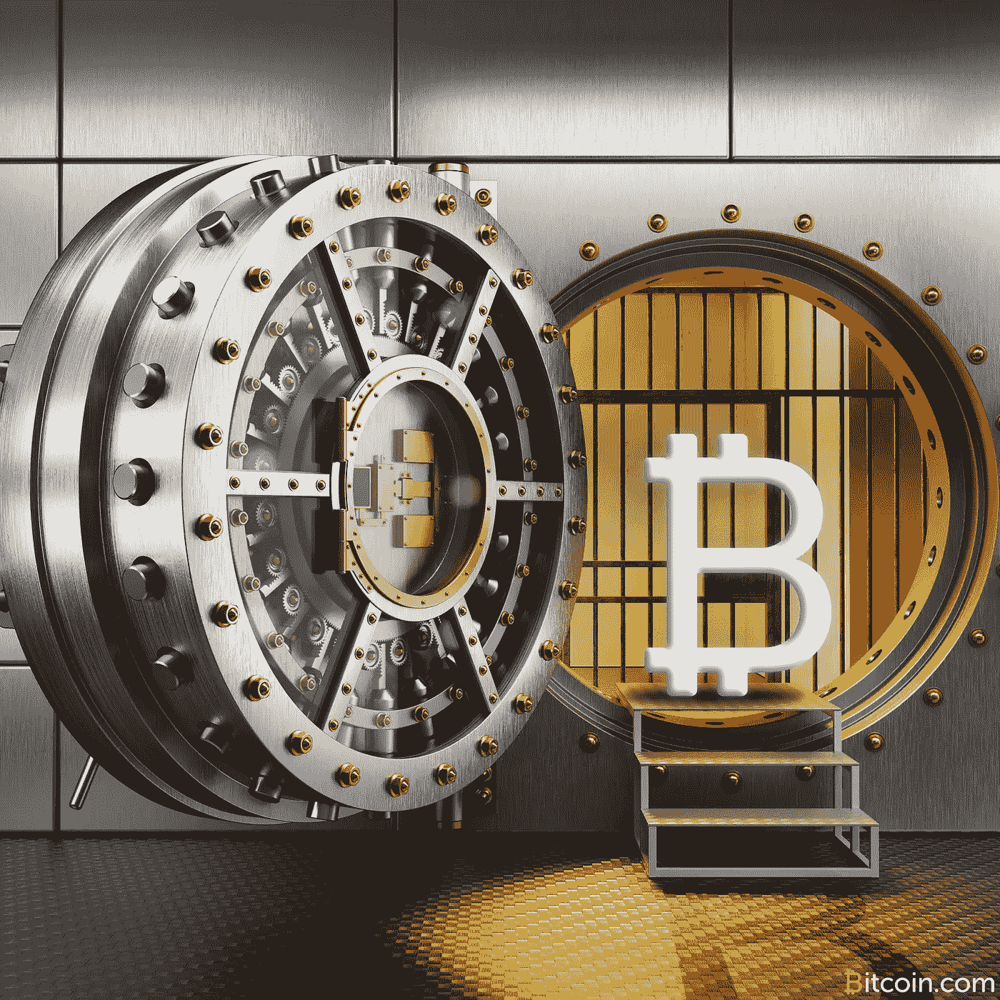

当你把钱存入银行时，银行在技术上控制着你的资金。银行可以限制你每天取多少钱，如果他们认为有必要的话，可以停止交易。如果你试图买东西或给某人汇款，而银行不希望你这样做，他们可以也将会停止交易。硬币保管是指对硬币的完全所有权和控制权。您可以控制您的资金，并且可以不受第三方限制地提取和发送您想要的金额。

## 控制

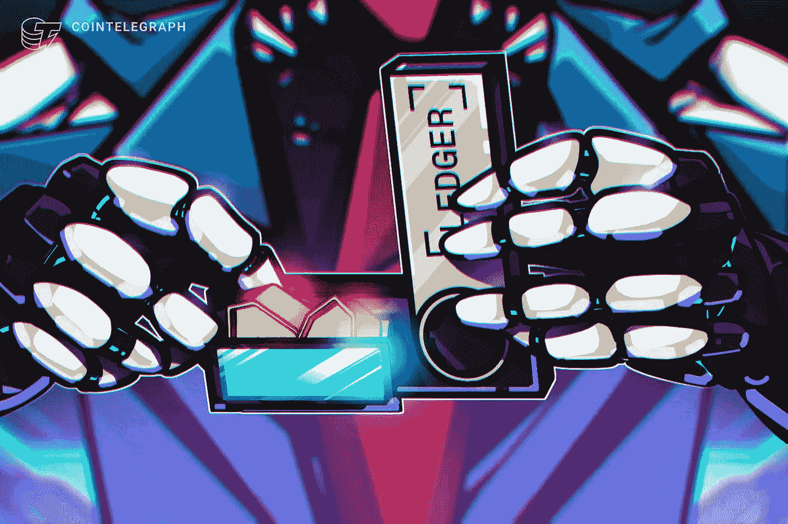

加密货币和去中心化的世界是基于财务独立的概念，用户完全控制他们的资产。用户可以充当自己的银行，随时随地利用资金，而无需请求许可或使用第三方。虽然完全控制你的账户可能很诱人，但也可能很危险，因为账户安全的全部责任都在你身上。如果你丢失了你的私人钥匙，没有客户服务可打

## 集中

大多数加密货币交易所都基于中央系统，由比特币基地或币安等私人公司作为中介，负责监管所有交易、交易和持有。如果您选择将您的加密货币保存在交易所，您相信该交易所会代表您保护您的加密货币的安全。他们保管或持有你的货币以及他们所有客户的资金。

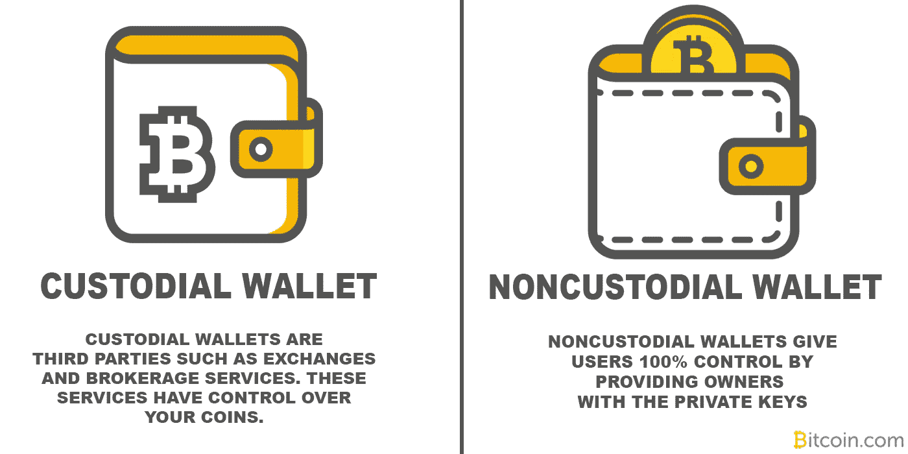

## **在交易所储存硬币的好处**

在交易所存储硬币的一些好处包括:
**易于使用-** 许多交易所都设计有易于使用的用户界面，使任何人都可以清楚地使用
**流动性/流动性市场-** 可能想购买、出售或用自己的硬币交换另一种加密货币的用户会发现，主要交易所通常有大量的各种硬币和用户进行交易。这使得购买/出售/交易你已经拥有的硬币变得更容易，因为有更多的用户以合理的价格交易硬币。在流动性差的市场上，可供交易的硬币变少了，卖家要价可能也不合理。

## **在交易所储存硬币的缺点**

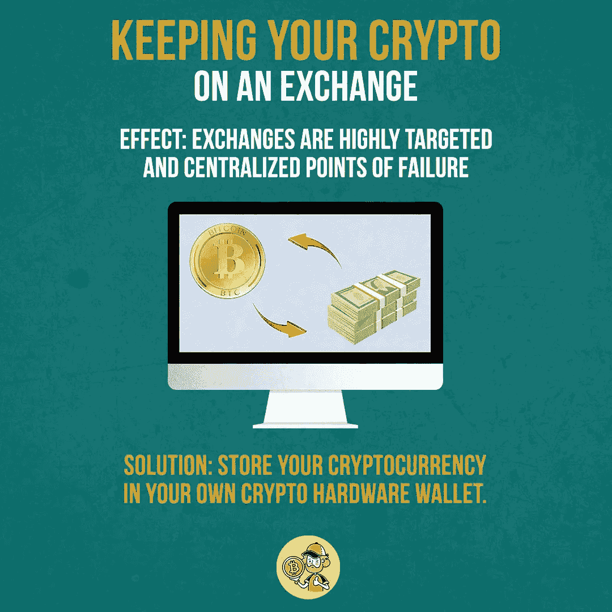

硬币保管:“不是你的钥匙，不是你的硬币”。对于大多数加密货币用户来说，将资金放在值得信赖的交易所不是问题。但是对于那些想真正拥有自己资产的人来说，把他们的密码留在交易所可能会有问题。交易所会保留您的加密货币密钥，直到您选择将其送出交易所。一些交易所，如 Robinhood，甚至不提供从其交易所转移加密资金的能力。

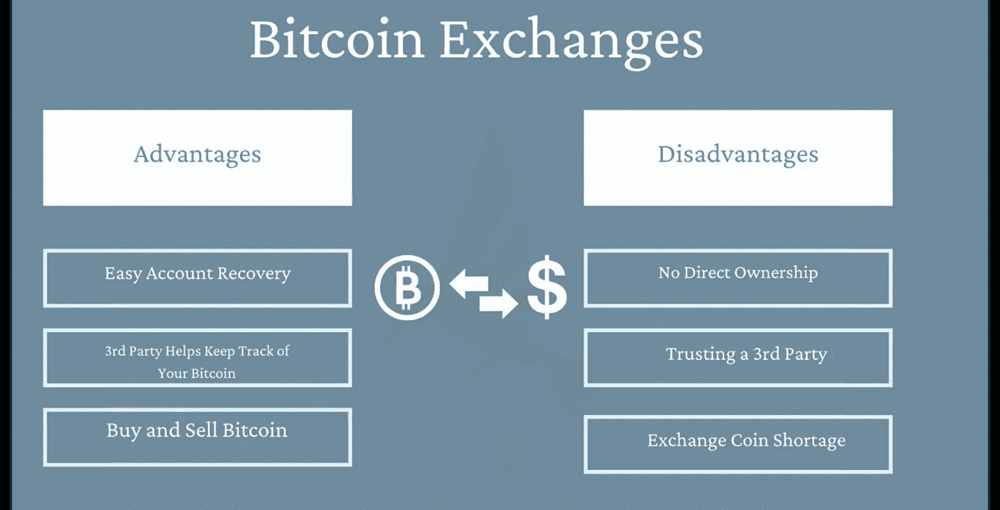

# 区块链探索者

比特币和以太坊等区块链公共网络上的所有交易都是可见的，任何人都可以浏览。诸如[https://www.blockchain.com/explorer](https://www.blockchain.com/explorer)和[https://etherscan.io/](https://etherscan.io/)的块浏览器允许您搜索各种链上信息(链上指标)，例如:
○历史价格
○市值
○最近挖掘的块
○未确认交易的内存池大小
○最新交易的数据(大小、时间、地址等。)
○哈希率
○气价
○开采难度

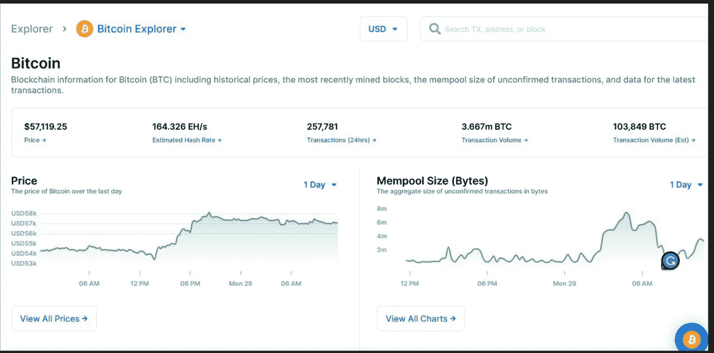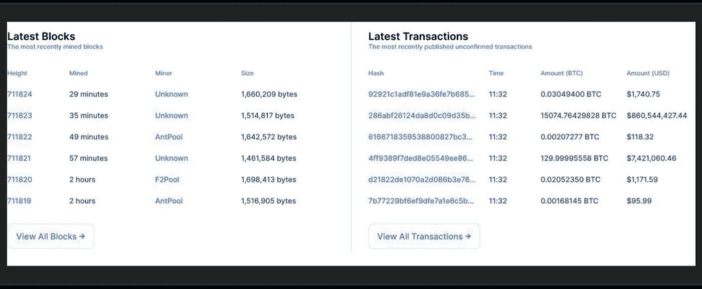

## 如何在区块链上查找交易

块浏览器为用户提供了一种视觉上吸引人且易于使用的方式来导航加密货币区块链。要查找比特币交易，用户可以去[https://www.blockchain.com/explorer](https://www.blockchain.com/explorer)并使用搜索栏来查找特定的地址、交易散列或区块号。

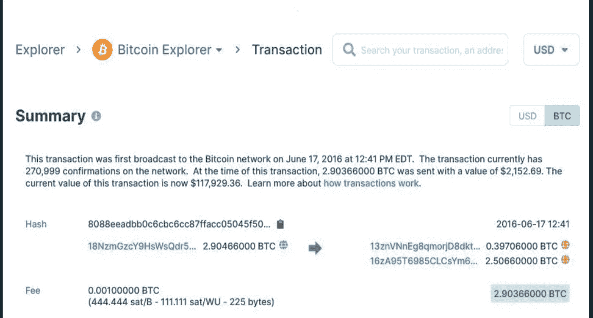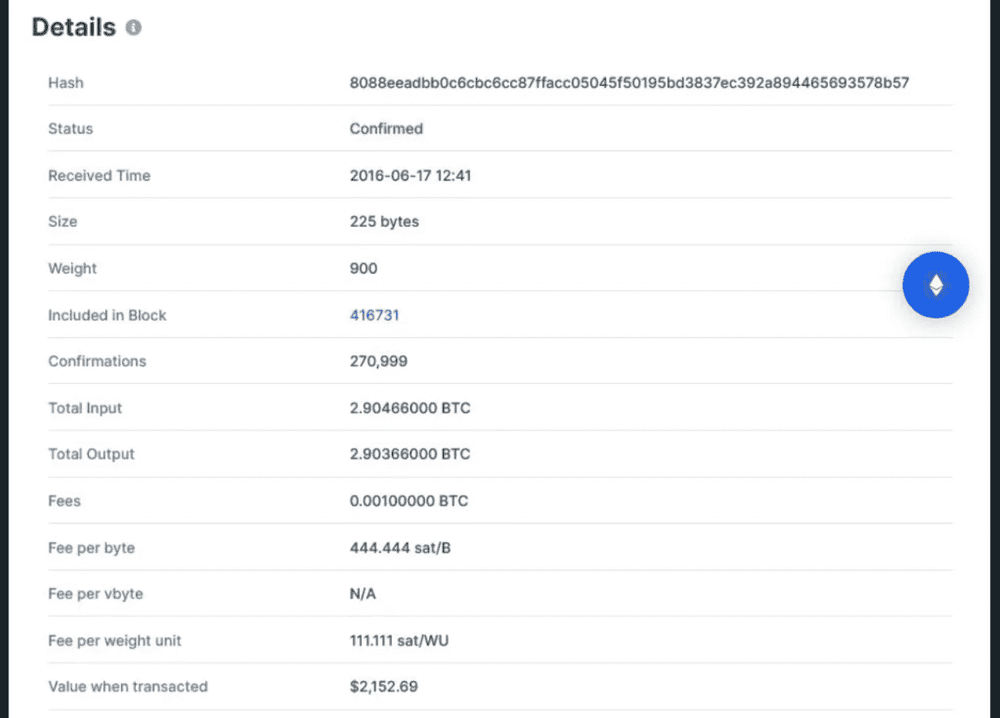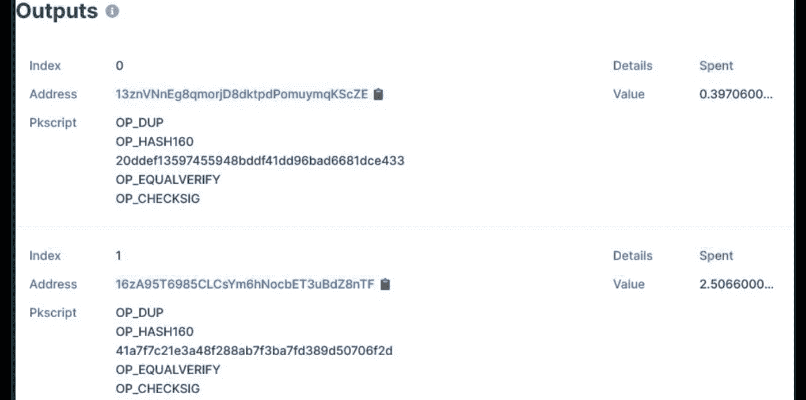

## 发送/接收加密货币

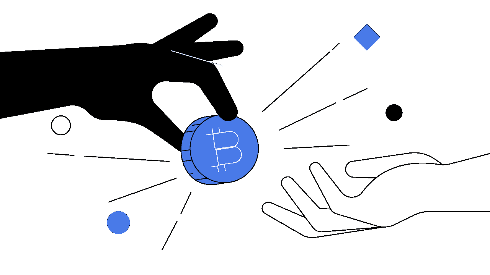

只要你小心输入的信息，从交易所账户发送和接收加密货币可能相对简单。在您的外汇账户/投资组合中，您应该看到一个存款/取款选项。在那里，您应该看到一个选项，专门选择您希望存入/提取的资产类型，如 BTC、瑞士联邦银行或美元。

## 网络费用

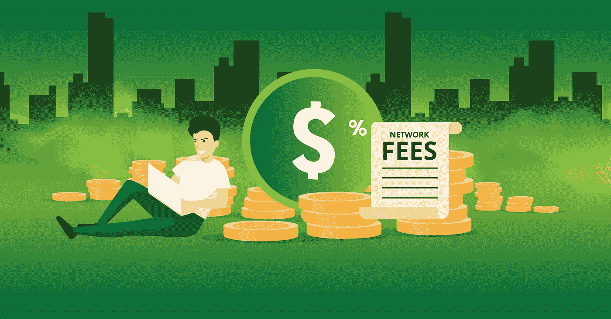

网络费用是从一个地址向另一个地址发送加密货币的交易费用。这些费用支付给矿工和验证者，他们通过处理和验证交易来帮助维护网络的完整性。根据发送的网络/密码，费用会有所不同。与以太坊(ETH)相比，诸如 XLM(Stellar Lumen)网络之类的某些网络以交易费用低和处理速度快而著称，以太坊(ETH)通常由于拥塞而具有较慢的处理速度和较高的汽油费用。

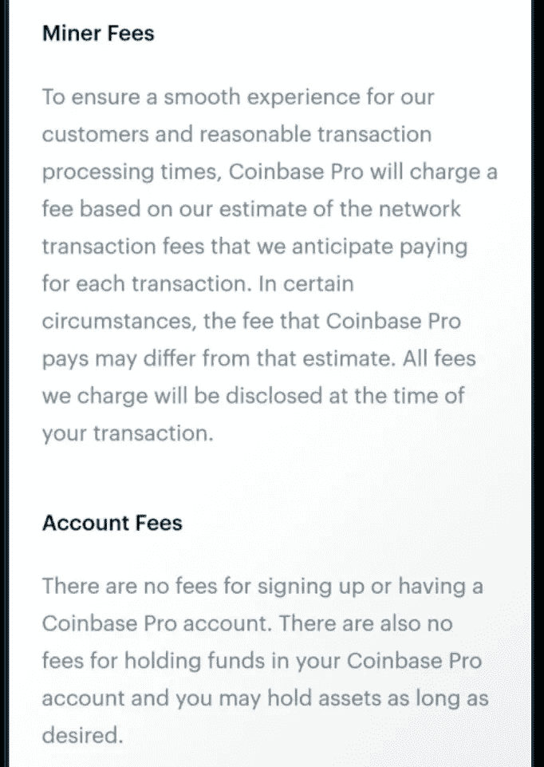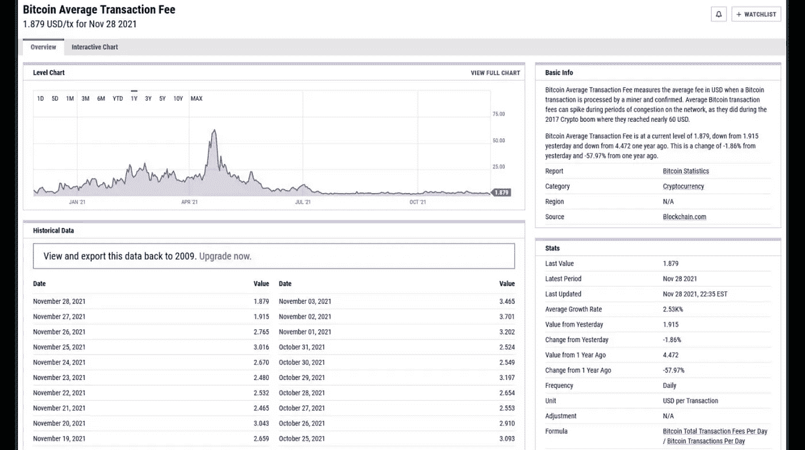

# 结果

Boneparth 补充说，根据你自己的偏好，你还可以考虑其他因素，如客户支持，你对该平台的移动应用程序的喜欢程度，以及 exchange 总体上的易用性。但是[就像我们一次又一次从专家那里听到的那样](https://time.com/nextadvisor/investing/cryptocurrency/questions-to-ask-before-buying-cryptocurrency/)当谈到加密时，在你把钱投入加密之前花时间尽可能多的学习是你能做的最有用的事情之一。

想想你能接受的费用结构和安全措施，你会采取什么额外的步骤来储存你的硬币，以及你的目标。

“你可能应该花更多的时间来了解这个空间，”Boneparth 说。“在一个相当疯狂的环境中，你是在拿自己的钱冒险。随意将资金投入更稳定的市场是一回事，将资金投入动荡的市场则完全是另一回事。因此，接受教育很重要，尤其是当你要应对可能比其他风险资产更不稳定的东西时。”

***阅读下一部分:*** [区块链博客 17:元宇宙之根——博彩业](https://aaklii.medium.com/blockchain-blog-17-roots-of-metaverse-gaming-industry-5313ccfdcef8)

***全系列:*** [28 篇关于区块链和加密货币的博客](https://aaklii.medium.com/28days-of-february-blockchain-and-cryptocurrency-research-blogs-4b73c51ce3db)

> 加入 Coinmonks [电报频道](https://t.me/coincodecap)和 [Youtube 频道](https://www.youtube.com/c/coinmonks/videos)了解加密交易和投资

## 另外，阅读

*   [印度的秘密税](https://coincodecap.com/crypto-tax-india) | [altFINS 审查](https://coincodecap.com/altfins-review) | [Prokey 审查](/coinmonks/prokey-review-26611173c13c)
*   [赢取注册奖金——10 大最佳加密平台](https://coincodecap.com/earn-sign-up-bonus)
*   [Blockfi vs 比特币基地](https://coincodecap.com/blockfi-vs-coinbase) | [BitKan 点评](https://coincodecap.com/bitkan-review) | [Bexplus 点评](https://coincodecap.com/bexplus-review)
*   [南非的加密交易所](https://coincodecap.com/crypto-exchanges-in-south-africa) | [BitMEX 加密信号](https://coincodecap.com/bitmex-crypto-signals)
*   [MoonXBT 副本交易](https://coincodecap.com/moonxbt-copy-trading) | [阿联酋](https://coincodecap.com/crypto-wallets-in-uae)的加密钱包
*   [雷米塔诺审查](https://coincodecap.com/remitano-review)|[1 英寸协议指南](https://coincodecap.com/1inch)
*   [iTop VPN 审查](https://coincodecap.com/itop-vpn-review) | [曼陀罗交易所审查](https://coincodecap.com/mandala-exchange-review)
*   [40 个最佳电报频道](https://coincodecap.com/best-telegram-channels) | [喜美元评论](https://coincodecap.com/hi-dollar-review)
*   [折叠 App 审核](https://coincodecap.com/fold-app-review) | [StealthEX 审核](/coinmonks/stealthex-review-396c67309988) | [Stormgain 审核](https://coincodecap.com/stormgain-review)
*   [购买 PancakeSwap(蛋糕)](https://coincodecap.com/buy-pancakeswap) | [俱吠罗评论](/coinmonks/coinswitch-kuber-review-1a8dc5c7a739)
*   [瓦济里克斯 NFT 评论](https://coincodecap.com/wazirx-nft-review) | [比茨盖普 vs 皮奥克斯](https://coincodecap.com/bitsgap-vs-pionex) | [坦吉姆评论](https://coincodecap.com/tangem-wallet-review)
*   [如何使用 Solidity 在以太坊上创建 DApp？](https://coincodecap.com/create-a-dapp-on-ethereum-using-solidity)