# 区块链博客 17:元宇宙的根——游戏产业

> 原文：<https://medium.com/coinmonks/blockchain-blog-17-roots-of-metaverse-gaming-industry-5313ccfdcef8?source=collection_archive---------14----------------------->

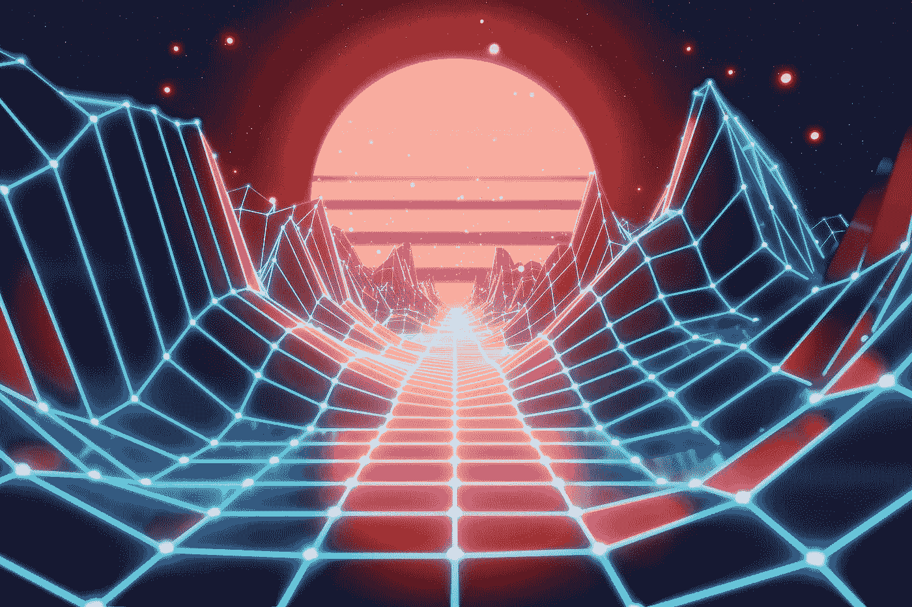

视频游戏的历史始于 20 世纪 50 年代和 60 年代，当时计算机科学家开始在大型计算机上设计简单的游戏和模拟，麻省理工学院的太空战！1962 年作为第一个用视频显示器玩的游戏之一。到 20 世纪 70 年代中期，低成本可编程微处理器取代了早期硬件的分立晶体管、晶体管逻辑电路，第一批基于 ROM 盒式磁带的家用控制台问世，包括 Atari 视频计算机系统(VCS)。20 世纪 90 年代初，技术发生了两次重大转变，一次是通过 CD-r om 引入光学介质，另一次是通过计算机微处理器的进一步发展实现实时多边形 3D 图形渲染的能力。这两个方面都很容易融入到个人电脑中，并为图形卡创造了市场。索尼在 1994 年推出的第一款 PlayStation 阻碍了任天堂和世嘉的游戏机大战，也让新公司难以进入市场。PlayStation 不仅带来了 CD-ROM 媒体的革命，还带来了对多边形 3D 图形渲染的内置支持。

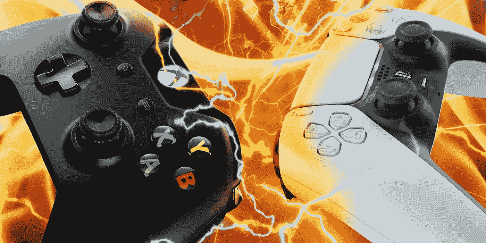

21 世纪初，索尼在游戏机市场的主导地位导致了市场的重大转变。在新的十年里，人们对开发下一代游戏机的可能性越来越感兴趣，这种开发符合五年游戏机生命周期的传统行业模式。然而，在行业中，人们认为缺乏另一个种族生产这种游戏机的愿望。微软和索尼都在 2013 年发布了他们的下一代游戏机，T2 Xbox One 和 T4 PlayStation 4。两者都扩展了其先前控制台的功能，增加了对高分辨率图形的支持，并通过额外的存储空间更多地支持内容的数字分发。

在个人电脑中，显卡市场集中在行业领导者 NVidia 和 AMD 取得的进展上，他们也为新的游戏机提供 GPU。从 2010 年代末开始，这些 GPU 卡的功能被[加密货币](https://en.wikipedia.org/wiki/Cryptocurrency)“矿工”使用，因为它们比用于相同目的的其他计算硬件成本相对较低。

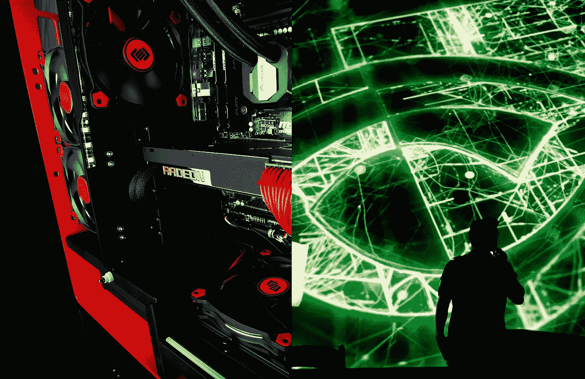

AMD vs NVidia

从 2000 年到 2010 年，随着[智能手机](https://en.wikipedia.org/wiki/Smartphone)和[平板电脑](https://en.wikipedia.org/wiki/Tablet_computer)上的[手机游戏](https://en.wikipedia.org/wiki/Mobile_game)取代了掌上游戏机，以及[休闲游戏](https://en.wikipedia.org/wiki/Casual_game)成为越来越大的市场份额，该行业已经见证了人口结构的转变。直到 2010 年代，大多数平台的在线游戏仅限于同一平台的玩家。第一个[云游戏](https://en.wikipedia.org/wiki/Cloud_gaming)服务出现在 2009 年。这些服务允许玩家在托管位置的计算机系统上玩游戏，同时游戏的输出和玩家的输入通过互联网发送到该系统，使用[云计算](https://en.wikipedia.org/wiki/Cloud_computing)的能力。这消除了玩家对昂贵的控制台或专用游戏计算机的需求。像 OnLive 和 Gaikai 这样的早期服务表明，云游戏是可行的，但与玩家的延迟有很大关系，因为慢速网络很容易拖延游戏的性能。

## 视频游戏的新收入模式

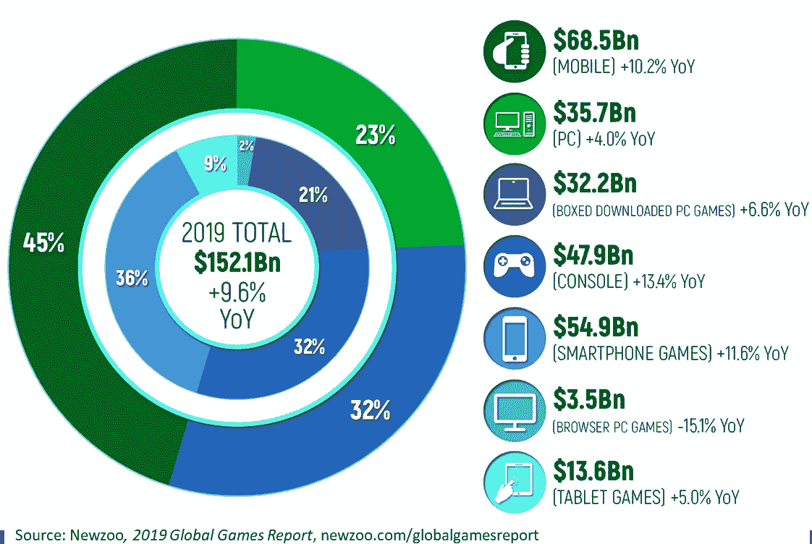

随着 3a 游戏的游戏开发预算越来越大，开发者和发行商正在寻找在游戏首次销售之外获得额外收入的方法。过去十年的多种因素，包括移动游戏市场的增长和应用内购买的引入、MMOs 等基于订阅的游戏以及数字发行市场，通过将[游戏视为服务](https://en.wikipedia.org/wiki/Games_as_a_service) (GaaS)，带来了新的经常性收入渠道。

## 混合、虚拟和增强现实游戏

视频游戏的虚拟现实(VR)系统早就被视为虚拟现实技术的目标，早在 20 世纪 90 年代就已经开始开发，但一直受到高成本和对消费者销售不切实际的阻碍。

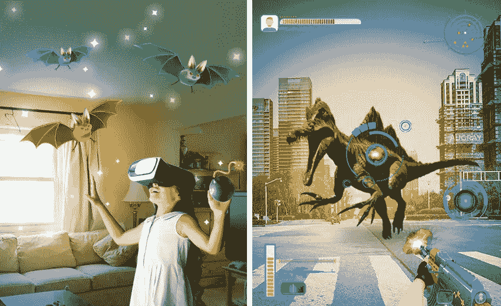

消费级虚拟现实硬件的突破出现在 2010 年代初，伴随着 Oculus Rift 的开发。裂缝在 2013 年的贸易展上展示过，并被证明足够受欢迎，导致 [**脸书**](https://en.wikipedia.org/wiki/Facebook) 在 2014 年以 20 亿美元收购了该公司和技术。不久之后，Valve 和 [HTC](https://en.wikipedia.org/wiki/HTC) 公布了 2015 年首次发布的 [**HTC Vive**](https://en.wikipedia.org/wiki/HTC_Vive) ，而索尼则在 2016 年发布了其 [PlayStation VR](https://en.wikipedia.org/wiki/PlayStation_VR) 。

增强现实(AR)游戏在 2010 年代之前也存在过，这种游戏采用实时视频游戏图像，并在其上渲染额外的图形。一些 PlayStation 主机游戏使用了 [EyeToy](https://en.wikipedia.org/wiki/EyeToy) 、 [PlayStation Eye](https://en.wikipedia.org/wiki/PlayStation_Eye) 或 [PlayStation Camera](https://en.wikipedia.org/wiki/PlayStation_Camera) 作为游戏的一部分，还有使用 Kinect 的 [Xbox 360](https://en.wikipedia.org/wiki/Xbox_360) 和 [Xbox One](https://en.wikipedia.org/wiki/Xbox_One) 游戏。大多数游戏都是实验性的，因为摄像机是固定的，限制了可以进行的互动。基于 AR 的游戏随着 2016 年 [*Pokémon Go*](https://en.wikipedia.org/wiki/Pok%C3%A9mon_Go) 的发布而腾飞，该游戏将 AR 与[基于位置的游戏](https://en.wikipedia.org/wiki/Location-based_game)相结合。玩家将使用他们的移动设备引导他们到可能找到虚拟神奇宝贝的地方，他们搜索并试图使用设备摄像头顶部的 AR 捕捉虚拟神奇宝贝。

## 光线跟踪和真实感图形

NVidia 和 AMD 在 2020 年推出了支持实时[光线追踪](https://en.wikipedia.org/wiki/Ray_tracing_(graphics))的显卡， [Xbox 系列 X/S](https://en.wikipedia.org/wiki/Xbox_Series_X_and_Series_S) 和 [PlayStation 5](https://en.wikipedia.org/wiki/PlayStation_5) ，这两款显卡都将于 2020 年 11 月发布。

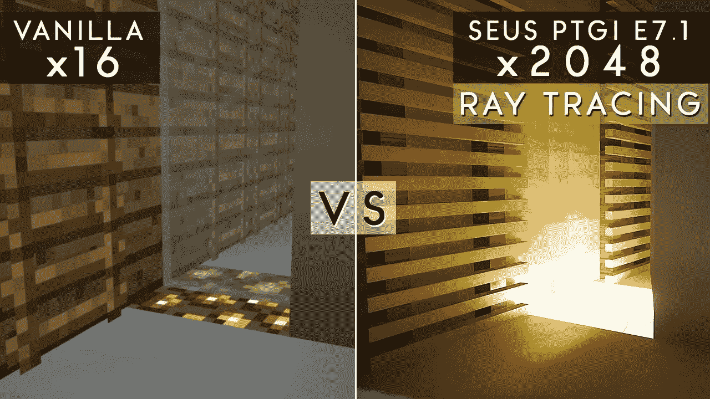

技术上的重大进步也进一步增强了显示高度细节纹理的能力，允许在高分辨率和高帧率下呈现视频游戏场景中的[照片真实感](https://en.wikipedia.org/wiki/Photorealism)。这些变化需要硬件上更大的纹理存储器存储空间和存储存储器与图形处理器之间更大的带宽。两款新游戏机都包括专门的 SSD 选项，旨在提供高带宽存储选项，这有一个额外的好处，即在许多游戏中几乎消除了加载时间，特别是那些具有开放世界游戏的[游戏内流](https://en.wikipedia.org/wiki/In-game_streaming)的游戏。

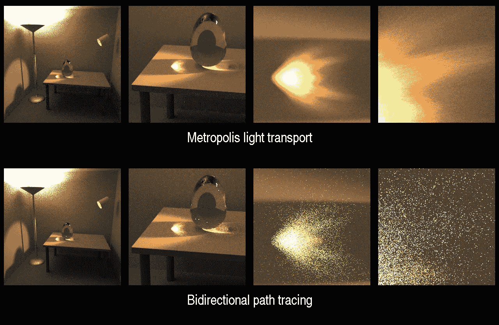

# 元宇宙和游戏

进入 21 世纪 20 年代，[元宇宙](https://en.wikipedia.org/wiki/Metaverse)的概念越来越流行。在本质上类似于 [*Second Life*](https://en.wikipedia.org/wiki/Second_Life) 的社交空间，元宇宙的概念基于使用虚拟和增强现实等更先进的技术来创建沉浸式世界，不仅可用于社交和娱乐功能，还可用于个人和商业目的，使用户能够从参与元宇宙中获利。

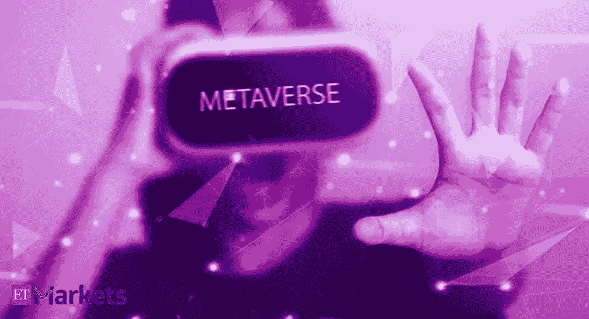

21 世纪 20 年代初的元宇宙还没有得到很好的定义，但那些开发新兴技术的人认识到，金融系统将与这些系统联系在一起。为了避免之前游戏货币系统的缺陷，基于[加密货币](https://en.wikipedia.org/wiki/Cryptocurrency)的游戏和使用分散[区块链](https://en.wikipedia.org/wiki/Blockchain)技术的系统开始流行起来。这些[区块链游戏](https://en.wikipedia.org/wiki/Blockchain_game)经常基于[不可替代代币](https://en.wikipedia.org/wiki/Non-fungible_token)的交易，玩家通过游戏创造和改进这些代币，模仿元宇宙内容的运作方式。游戏一直是虚拟现实的主要候选对象。即使是 2D 早期的沉浸式游戏，如《《我的世界》》和《第二人生》，也融入了现在正在制作的《元宇宙》的元素——如 3D 化身、世界构建和游戏性观察。

当我们现在谈论元宇宙时，就像在谈论和讨论 90 年代的互联网。自从脸书在 2021 年 10 月下旬更名为 Meta 以来，我们在任何地方都能听到元宇宙。现在，像 Meta(脸书)和 Epic Games 这样的公司试图建立一个虚拟现实的互联世界，游戏有了一个新家。

## 元宇宙的游戏是什么样子的？

元宇宙可以定义为一个统一的、可互操作的虚拟现实空间，用户可以通过高级人机交互(HCI)硬件和软件与彼此以及他们周围的数字世界进行交互。

这将 VR 游戏带到了令人难以置信的新高度。

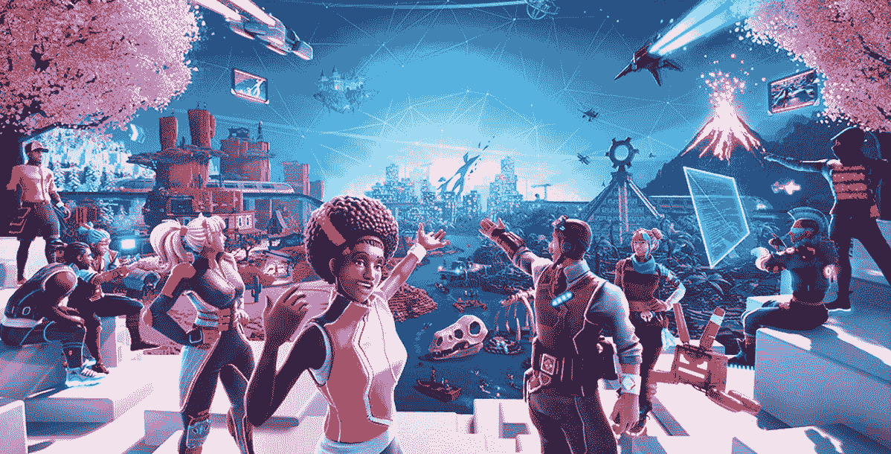

目前，VR 游戏作为独立的应用程序提供，你可以安装在你的桌面，VR 设备或手机上，以沉浸式的方式再现传统的视频游戏。

主要的区别是，游戏中的宇宙现在是一个三维的 VR 世界，你可以 360 度观看，几乎可以通过逼真的感知“触摸”。

元宇宙(首次出现在 1992 年的科幻小说《冰雪奇缘》中)进一步扩展了这一概念。它假设你可以连接多个虚拟现实游戏——事实上，任何虚拟现实应用或空间——为用户创建一个单一的可互操作的环境。

他们将能够进出游戏应用程序，在多个空间与相同的玩家互动，甚至可以在不摘下 VR 耳机的情况下移植他们的胜利。

在这种背景下，游戏将具有以下特征:

*   游戏即平台 —游戏体验将变得更加灵活。用户可以添加到虚拟世界中，创建自己的内容，在游戏中构建子游戏，并从本质上将游戏环境视为其他活动的类似平台的空间。
*   **社交游戏**——《元宇宙》天生就是社交游戏，这一特点让它有别于传统的单人虚拟现实体验。随着玩家能够从现实世界中邀请朋友，与其他玩家互动，建立关系等，多人游戏将呈现出额外的维度。
*   **玩赢**——这将是元宇宙博彩的一个重要元素。除了遵循线性故事和规则，玩家还可以从事有利可图的活动。一个简单的例子:他们可以将他们在游戏中赢得的资产卖给其他用户进行加密。
*   可移植游戏资产的可能性——元宇宙的互操作架构允许资产的可移植性。在一个游戏中获得的武器或化身增强可以移植到不同的环境，NFT 规则将管理持久的所有权。
*   **混合现实体验** —元宇宙利用 AR 和 MR 来提供更加有机的体验。元宇宙的游戏可以融入混合现实，用户可以在无缝的工作流程中从 AR 中的群组文本转移到 MR 棋盘游戏，再到成熟的 VR 世界。

# 塑造元宇宙游戏未来的公司

尽管如此，在早期阶段，元宇宙已经吸引了来自游戏公司、科技巨头和风投的大量投资。毫无疑问，元宇宙是游戏的未来。

像分散的土地、沙盒、Epic Games 和 Meta 这样的公司是你应该注意的一些关键先行者:

## 分散土地

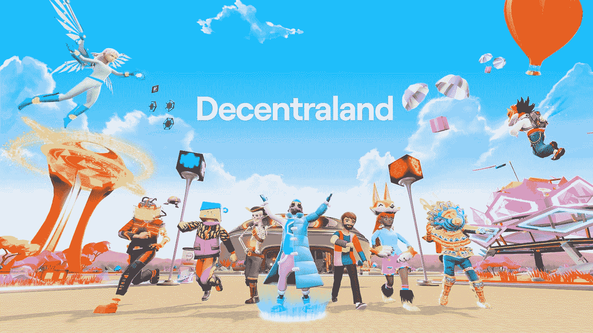

分散公司是第一批明确尝试建造元宇宙的公司之一。它有一个可测量房地产的 3D VR 平台，一种基于以太坊的加密货币，以及用于多人游戏的离散空间。

分散王国还投资了一家名为分散游戏的公司，以进一步发展其游戏功能。

## 沙箱

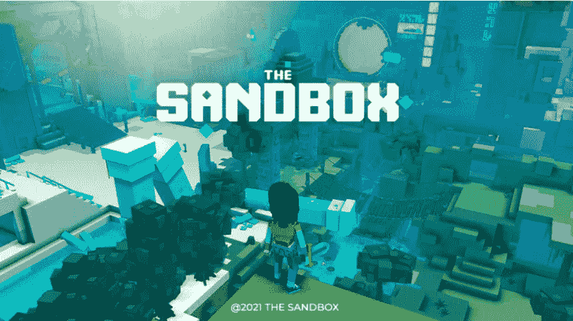

沙盒是另一个元宇宙本土的视频游戏，允许你玩，创建，拥有和管理一个虚拟空间。沙盒的经济是基于用户生成的加密和 NFT 资产，它与全球品牌合作，提供独特和丰富的体验。

沙盒市场有 20，000 多个 NFT，你可以购买并整合到你的 VR 世界中。

## 史诗游戏

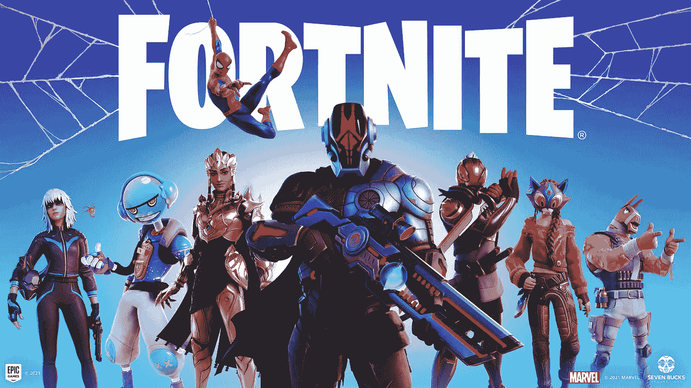

Epics Games 最出名的是堡垒之夜，这是一款集虚拟现实游戏和活动目的地于一体的游戏。随着堡垒之夜越来越受欢迎，来自世界各地的艺术家已经利用这款游戏类似元宇宙的功能举办了音乐会。

最近，Epic Games 宣布将投资 10 亿美元建立自己的以游戏为中心的元宇宙。

## 梅塔(前脸书)

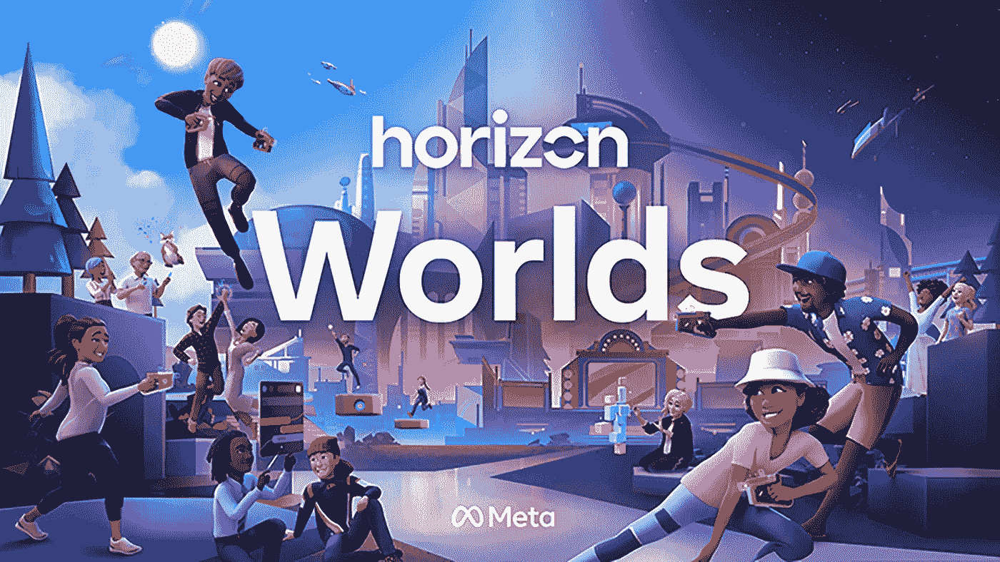

Meta 在元宇宙市场相对较新，但它在虚拟现实创新方面有着令人印象深刻的记录。脸书围绕其 Oculus 系列产品构建了一个强大的体验世界，这些创新将继续为该公司的元宇宙愿景提供信息。

开发者可以通过 Meta 利用 Horizon Worlds 来创建游戏，并在元宇宙内部发布。

当然，一般来说，虚拟现实和视频游戏总是不得不应对法律和道德问题，这同样适用于元宇宙。

有三个主要问题需要解决:

*   **适合儿童的服务和控制** —很难监控儿童的活动，也很难区分儿童和成人是否有大量的虚拟角色定制。游戏必须有足够的控制，以确保适合年龄的体验。
*   **NFT 所有权**——管辖游戏内资产所有权的法律仍然模糊不清。在游戏中赢得的非功能性桌面游戏可能无法普遍移植。此外，必须定义所有权的范围，以便用户确切地知道他们如何与 NFTs 进行交互、进行交易以及从中获利。
*   **基础设施不足**——建设游戏元宇宙所需的大规模互操作性尚未实现。科技巨头和专利持有者将不得不合作，不同的国家必须在元宇宙法律的单一主体上合作，我们纯粹的技术还有很长的路要走。

记住这些因素，我们可以估计，我们离在元宇宙赌博还有 5 到 10 年的时间。我们将在接下来的博客中进一步探索元宇宙。

我将给你们留下一个关于游戏产业的信息视频:

***阅读下一部分:*** [区块链博客 18:元宇宙——一个 3D 互联网](https://aaklii.medium.com/blockchain-blog-18-metaverse-a-3d-9d6d042ce264)

***全系列:*** [28 篇关于区块链和加密货币的博客](https://aaklii.medium.com/28days-of-february-blockchain-and-cryptocurrency-research-blogs-4b73c51ce3db)

> 加入 Coinmonks [电报频道](https://t.me/coincodecap)和 [Youtube 频道](https://www.youtube.com/c/coinmonks/videos)了解加密交易和投资

## 另外，阅读

*   [Blockfi vs 比特币基地](https://coincodecap.com/blockfi-vs-coinbase) | [BitKan 评论](https://coincodecap.com/bitkan-review) | [Bexplus 评论](https://coincodecap.com/bexplus-review)
*   [南非的加密交易所](https://coincodecap.com/crypto-exchanges-in-south-africa) | [BitMEX 加密信号](https://coincodecap.com/bitmex-crypto-signals)
*   [MoonXBT 副本交易](https://coincodecap.com/moonxbt-copy-trading) | [阿联酋的加密钱包](https://coincodecap.com/crypto-wallets-in-uae)
*   [Remitano 审查](https://coincodecap.com/remitano-review)|[1 英寸协议指南](https://coincodecap.com/1inch)
*   [iTop VPN 审查](https://coincodecap.com/itop-vpn-review) | [曼陀罗交易所审查](https://coincodecap.com/mandala-exchange-review)
*   [40 个最佳电报频道](https://coincodecap.com/best-telegram-channels) | [喜美元评论](https://coincodecap.com/hi-dollar-review)
*   [折 App 评论](https://coincodecap.com/fold-app-review) | [StealthEX 评论](/coinmonks/stealthex-review-396c67309988) | [Stormgain 评论](https://coincodecap.com/stormgain-review)
*   [购买 PancakeSwap(蛋糕)](https://coincodecap.com/buy-pancakeswap) | [俱吠罗评论](/coinmonks/coinswitch-kuber-review-1a8dc5c7a739)
*   [瓦济里克斯 NFT 评论](https://coincodecap.com/wazirx-nft-review)|[Bitsgap vs Pionex](https://coincodecap.com/bitsgap-vs-pionex)|[坦吉姆评论](https://coincodecap.com/tangem-wallet-review)
*   [如何使用 Solidity 在以太坊上创建 DApp？](https://coincodecap.com/create-a-dapp-on-ethereum-using-solidity)