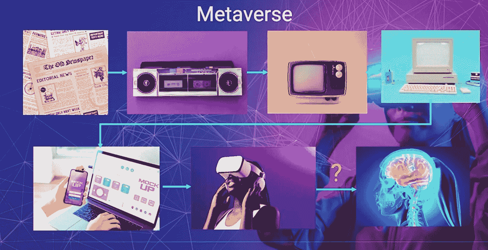
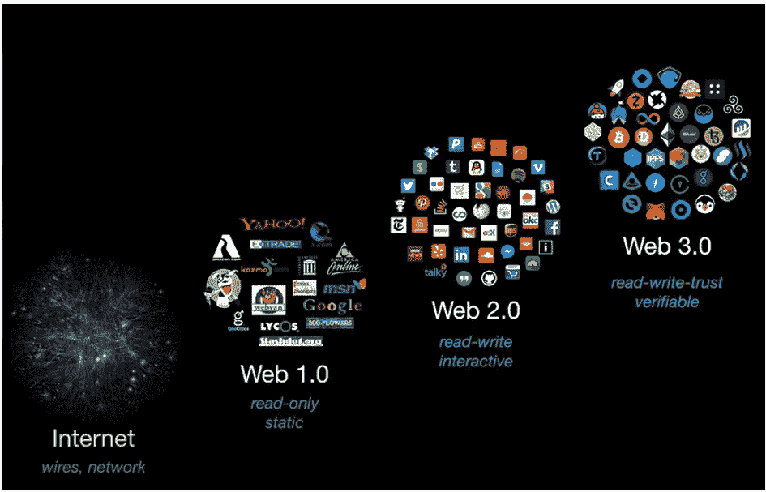

# 区块链博客 18:元宇宙——3D 互联网

> 原文：<https://medium.com/coinmonks/blockchain-blog-18-metaverse-a-3d-9d6d042ce264?source=collection_archive---------9----------------------->

自从马克·扎克伯格宣布他们要把名字从脸书改成梅塔，每个人都在谈论元宇宙，但是元宇宙这个词已经很老了。它实际上是在一本名为《冰雪奇缘》的书中创造的。

多亏了一些技术，如 Web3、混合现实、区块链和 NFT，元宇宙是可能的。

## 什么是元宇宙？

元宇宙这个词是尼尔·斯蒂芬森于 1992 年在他的书《雪灾》中创造的。

> " **Meta** "来自希腊语 Meta，意思是跨越或之后或超越的东西，**诗句**这个词来自宇宙。

元宇宙是一种数字现实，结合了社交媒体、在线游戏、增强现实和虚拟现实以及加密货币的各个方面，允许用户进行虚拟互动。

> 一种利用 Web 3.0、区块链和计算机界面的社会结构，个人在其中建立习俗、习惯和价值观，允许他们在虚拟世界中使用他们的数字身份、虚拟角色花费时间和进行社交。它与现实世界共存。恩里克·森蒂埃罗

元宇宙现在就像是 90 年代的互联网，而此刻的元宇宙更像是一个社会建构。我们相信，这将是一种使用 Web 3.0 和区块链的东西，允许你拥有自己的数字身份和你的元宇宙物品。它将被用于社交。你可以玩游戏，但是你也可以开工作会议，你可以使用你自己的数字身份，它与现实世界共存，你可以把这看作是互联网的发展。

如今，你在网上什么都不拥有。你在互联网上唯一能拥有的就是一个 DNS 域名。但除此之外，你别无所有。例如，你上传一个 YouTube 视频到 YouTube，或者一张照片到 Instagram，或者一个社交媒体帖子。你拥有这些内容吗？不，你并不拥有拥有这些内容的公司，他们可以随时删除这些内容。

Image Source: [https://medium.com/geekculture/the-4-key-stages-of-the-metaverse-84d34cce6f6f](/geekculture/the-4-key-stages-of-the-metaverse-84d34cce6f6f)

但是现在在元宇宙的 Web 3.0 区块链上，你可以拥有自己的内容。或者你可以购买其他人的内容，你真正拥有它，而不是其他人，你没有一个集中的政党拥有它。互联网大部分还是像二维界面。但非常值得注意的是，如果你在 30 年前告诉任何人，你的口袋里会有一个设备，可以访问世界上所有的信息，世界上所有的音乐，世界上所有的视频，所有的报纸，这将是令人难以置信的。

互联网的下一代可能是元宇宙。在这个元宇宙，你将能够拥有你的身份和你的资产，数字资产。元宇宙就像一个三维互联网。

所以直到现在，比如你网购的时候，就像看杂志一样。你看着你点击的产品，你选择一个产品，选择数量和大小，你有一个篮子。

现在想象一下，在元宇宙，你有一个购物中心，就像一个真正的购物中心，你可以四处走走，走进商店，把产品从货架上拿下来，放在你的篮子里。在元宇宙这是可能的！

# XR、游戏、Web3 和区块链

XR、游戏、Web 3.0 和区块链。将这些技术放在一起，可以让我们做一些美妙的事情，比如拥有你的数字资产，以一种更加分散和可互操作的方式建立元宇宙。
**阅读以下博客了解区块链和博彩:**区块链的核心[博客 06 —密码学、安全和加密钱包](https://aaklii.medium.com/blockchain-blog-06-cryptography-sha-and-wallets-438a92921f1c)
[博客 07:区块链技术的内幕](https://aaklii.medium.com/blockchain-blog-07-inside-blockchain-technology-part-1-42d91136cc91)
[博客 08:比特币的创世纪区块](https://aaklii.medium.com/blockchain-blog-08-bitcoins-genesis-block-23701e879af1)
[博客 09—区块链和挖矿](https://aaklii.medium.com/blockchain-blog-09-blockchain-and-the-mining-c4f89db8a9fd)
[博客 10:比特币](https://aaklii.medium.com/blockchain-blog-10-bitcoin-mining-31834fdbb9d5)

## 扩展现实

**扩展现实** ( **XR** )是一个术语，指所有由计算机技术和可穿戴设备产生的真实与虚拟结合的环境和人机交互。例如包括[增强现实](https://en.wikipedia.org/wiki/Augmented_reality)(AR)[混合现实](https://en.wikipedia.org/wiki/Mixed_reality)(MR)[虚拟现实](https://en.wikipedia.org/wiki/Virtual_reality) (VR)等代表性形式以及它们之间插值的区域。虚拟的层次从部分感官输入到沉浸式虚拟，也称为 VR。

XR 是一个超集，包括从“完全真实”到“完全虚拟”的整个范围。然而，其内涵在于人类经验的延伸，特别是与存在感(以虚拟现实为代表)和认知获得(以增强现实为代表)有关的经验。随着[人机交互](https://en.wikipedia.org/wiki/Human%E2%80%93computer_interaction)的不断发展，这个内涵还在不断演变。

XR 是一个快速发展的领域，应用广泛，如娱乐、营销、房地产、培训和远程工作。

## Web3

**Web3** 是基于[区块链技术](https://en.wikipedia.org/wiki/Blockchain)的[万维网](https://en.wikipedia.org/wiki/World_Wide_Web)的一个新迭代，它融合了包括[去中心化](https://en.wikipedia.org/wiki/Decentralization)和基于令牌的经济学的概念。

[Web 1.0](https://en.wikipedia.org/wiki/Web_1.0) 和 [Web 2.0](https://en.wikipedia.org/wiki/Web_2.0) 是指万维网历史上的时代，它通过各种技术和格式发展而来。Web 1.0 大致指的是 1991 年到 2004 年这段时间，当时大多数网站都是静态网页，绝大多数用户都是内容的消费者，而不是生产者。Web 2.0 基于“网络作为平台”的理念，以上传到社交媒体、网络服务、博客、维基以及其他服务的用户创建的内容为中心。Web 2.0 通常被认为始于 2004 年左右，并持续至今。

**Web3** 围绕着去中心化的理念，经常融合[区块链](https://aaklii.medium.com/blockchain-blog-07-inside-blockchain-technology-part-1-42d91136cc91)的技术，比如各种加密货币和[不可替代代币](https://en.wikipedia.org/wiki/Non-fungible_token) (NFTs)。彭博将 Web3 描述为一种理念，即“将金融资产以代币的形式构建到你在网上做的几乎任何事情的内部运作中”。有些愿景是基于[分权自治组织](https://aaklii.medium.com/blockchain-blog-14-decentralized-autonomous-organizations-dao-5aa6cd1c15de)的概念。[分散金融](https://aaklii.medium.com/blockchain-blog-12-decentralize-finance-defi-bc679132fafc)是另一个关键概念；在其中，用户在没有银行或政府参与的情况下兑换货币。[自主权身份](https://en.wikipedia.org/wiki/Self-sovereign_identity)允许用户在不依赖认证系统(如 [OAuth](https://en.wikipedia.org/wiki/OAuth) )的情况下识别自己，在认证系统中，必须联系受信任方才能评估身份。[【21】](https://en.wikipedia.org/wiki/Web3#cite_note-21)技术学者认为，Web3 可能会与 [Web 2.0](https://en.wikipedia.org/wiki/Web_2.0) 网站同时运行，Web 2.0 网站可能会采用 Web3 技术，以保持其服务的相关性。

元宇宙还有一个组成部分，没有它，它就不完整，也不具有革命性。那就是 NFT，这是一个需要一个单独博客的大话题，但是在下一篇博客中，我们将探索非功能性思维是如何与元宇宙联系在一起的。

**文章灵感来自:**[https://medium . com/geek culture/the-4-key-stages-of-the-the-元宇宙-84d34cce6f6f](/geekculture/the-4-key-stages-of-the-metaverse-84d34cce6f6f) **作者:** [恩里克·森特耶罗](https://medium.com/u/fb7a5e85e951?source=post_page-----9d6d042ce264--------------------------------)

***阅读下一部分:*** [区块链博客 19:元宇宙与 NFTs](https://aaklii.medium.com/blockchain-blog-19-metaverse-and-nft-5165f06671f2)

***全系列:*** [28 篇关于区块链和加密货币的博客](https://aaklii.medium.com/28days-of-february-blockchain-and-cryptocurrency-research-blogs-4b73c51ce3db)

> 加入 Coinmonks [电报频道](https://t.me/coincodecap)和 [Youtube 频道](https://www.youtube.com/c/coinmonks/videos)了解加密交易和投资

## 另外，阅读

*   [有哪些交易信号？](https://coincodecap.com/trading-signal) | [比特斯坦普 vs 比特币基地](https://coincodecap.com/bitstamp-coinbase)
*   [ProfitFarmers 点评](https://coincodecap.com/profitfarmers-review) | [如何使用 Cornix Trading Bot](https://coincodecap.com/cornix-trading-bot)
*   [如何在势不可挡的域名上购买域名？](https://coincodecap.com/buy-domain-on-unstoppable-domains)
*   [印度的秘密税](https://coincodecap.com/crypto-tax-india) | [altFINS 审查](https://coincodecap.com/altfins-review) | [Prokey 审查](/coinmonks/prokey-review-26611173c13c)
*   [赢取注册奖金——10 大最佳加密平台](https://coincodecap.com/earn-sign-up-bonus)
*   [Blockfi vs 比特币基地](https://coincodecap.com/blockfi-vs-coinbase) | [BitKan 点评](https://coincodecap.com/bitkan-review) | [Bexplus 点评](https://coincodecap.com/bexplus-review)
*   [南非的加密交易所](https://coincodecap.com/crypto-exchanges-in-south-africa) | [BitMEX 加密信号](https://coincodecap.com/bitmex-crypto-signals)
*   [MoonXBT 副本交易](https://coincodecap.com/moonxbt-copy-trading) | [阿联酋的加密钱包](https://coincodecap.com/crypto-wallets-in-uae)
*   [雷米塔诺评论](https://coincodecap.com/remitano-review)|[1 英寸协议指南](https://coincodecap.com/1inch)
*   [iTop VPN 审核](https://coincodecap.com/itop-vpn-review) | [曼陀罗交易所审核](https://coincodecap.com/mandala-exchange-review)
*   [40 个最佳电报频道](https://coincodecap.com/best-telegram-channels) | [喜美元评论](https://coincodecap.com/hi-dollar-review)
*   [折叠 App 审核](https://coincodecap.com/fold-app-review) | [StealthEX 审核](/coinmonks/stealthex-review-396c67309988) | [Stormgain 审核](https://coincodecap.com/stormgain-review)
*   [购买 PancakeSwap(蛋糕)](https://coincodecap.com/buy-pancakeswap) | [Coinswitch 俱吠罗评论](/coinmonks/coinswitch-kuber-review-1a8dc5c7a739)
*   [瓦济里克斯 NFT 评论](https://coincodecap.com/wazirx-nft-review)|[Bitsgap vs Pionex](https://coincodecap.com/bitsgap-vs-pionex)|[坦吉姆评论](https://coincodecap.com/tangem-wallet-review)
*   [如何使用 Solidity 在以太坊上创建 DApp？](https://coincodecap.com/create-a-dapp-on-ethereum-using-solidity)