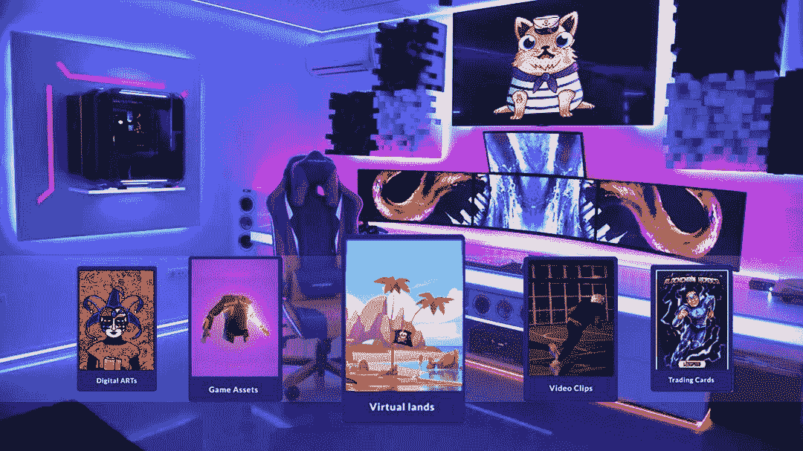
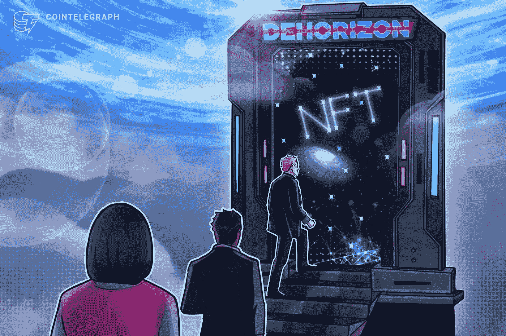
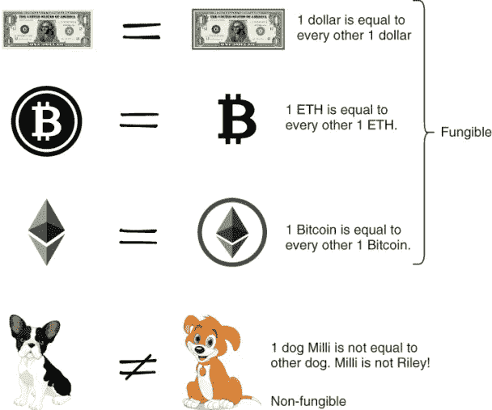
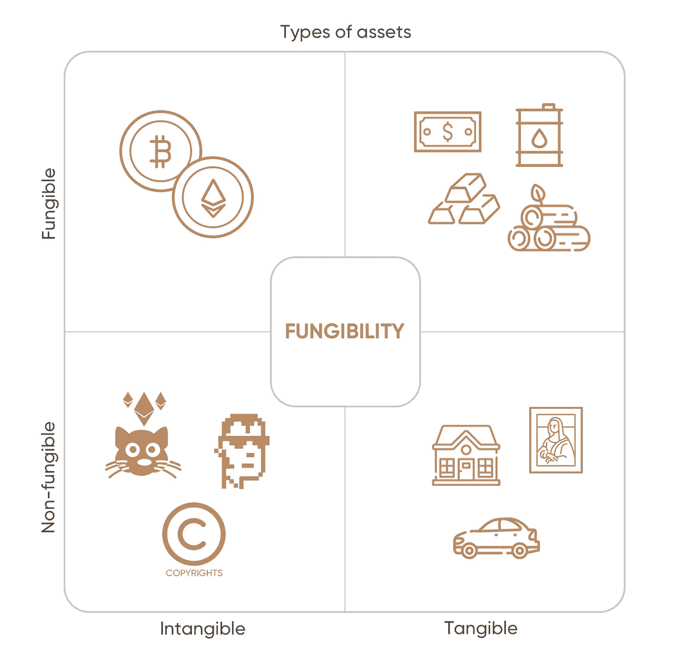
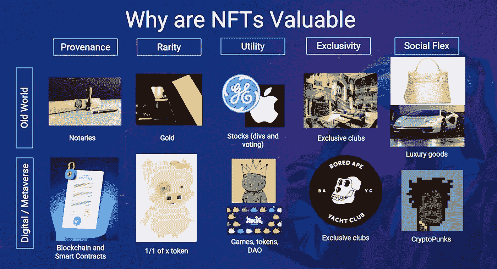
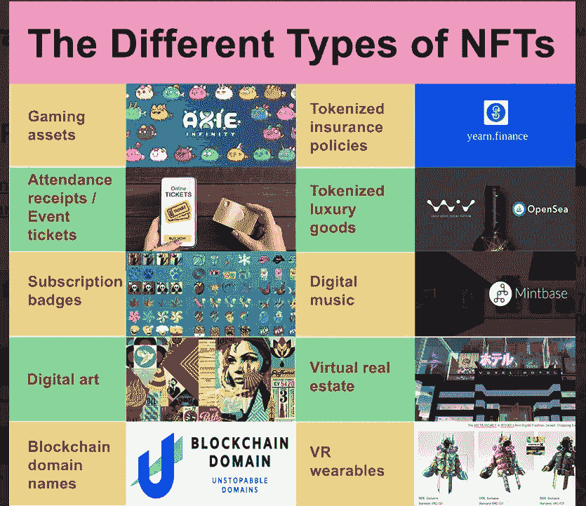
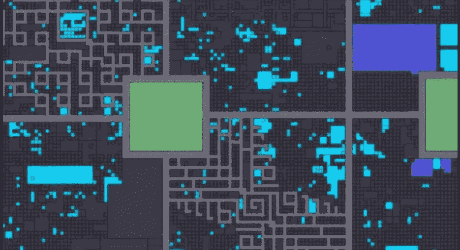

# 区块链博客 19:元宇宙和 NFTs

> 原文：<https://medium.com/coinmonks/blockchain-blog-19-metaverse-and-nft-5165f06671f2?source=collection_archive---------18----------------------->

当人们没有任何东西的时候，他们会投入大量的金钱来购买游戏中的物品。Web 3.0 和区块链正通过 NFTs——不可伪造的令牌——来解决这个问题。Web 3.0 是互联网的下一次进化，它由区块链提供动力，在那里你不仅可以在互联网上阅读和写作，你还可以拥有互联网，这对于元宇宙来说非常重要。就像在现实生活中，你可以拥有自己的东西。你也应该能够在网上拥有自己的东西。这个奇迹发生在元宇宙的中部。

区块链、游戏或混合现实并不是强制性的，但元宇宙就在这些技术交汇的中间。这些东西应该是可以互操作的。就像现在，互联网是互通的。如果你有雅虎邮箱，我有谷歌 Gmail 邮箱，你可以给我发邮件。现在想象一下，你生活在一个雅虎用户只能给雅虎发邮件，Outlook 只能给 Outlook 发邮件的世界里。Gmail 只能向 Gmail 发送电子邮件，这就是互联网目前的表现。

**Interoperable:** CS:GO, Valorant or Fortnite

关于元宇宙，如果玩**堡垒之夜**还能送皮肤去**反击岂不是很棒？**

# NFTs 和元宇宙

NFT 是不可替代的令牌，这意味着它们是互联网上记录在区块链上的专有项目。NFT 是这些所有权证书，允许你在互联网上拥有东西。为什么它们对元宇宙很重要？如果你搜索 NFTs 和元宇宙，这两个词经常出现在一起。非功能性测试将是评估元宇宙及其他地区的关键。

元宇宙仍在兴起，但很明显，NFTs 将是解开它的许多部分的关键。NFT 就像去公证处。每次买房子，你都需要去找律师或者公证员做你拥有那套房子的公开登记。现在，如果我们要搬到这些元宇宙世界，或者我们生活的一部分要搬到那里，我们也需要这个公证系统来登记我们的所有权。元宇宙的 NFTs 将使你成为互联网的所有者，而不仅仅是租户。

如果你在 Instagram 上发布了一些东西，你并不真正拥有它。Instagram 公司拥有它，在这种情况下，脸书或 Meta。

全球主要品牌都在尝试非功能性测试和元宇宙。Meta 的元宇宙将支持 NFTs，甚至他们也在探索 NFTs，他们为他们的区块链加密团队雇佣了很多人。

# 为什么 NFT 有价值？

你有时可能会惊讶于这些密码朋克或一些 NFT 被卖到数百万美元，仅仅因为它是排他性和所有权。

CryptoPunks NFTs

例如，下面是文森特·梵高在博物馆的原画《星夜》，

**Starry Night**

下面是在易贝或亚马逊上出售的印刷品，

博物馆里的原作价值数百万，而上面的印刷品价值几美元。
为什么？因为原作是独一无二的。它是由艺术家创作的，它有一个真实性和所有权的证明，而印刷品没有。

人们喜欢原始的东西，而不是复制品，这就是 NFT 允许我们做的。他们允许我们在网上拥有原创的东西。所以不可替代资产是独一无二的，因为它们在价值和属性上不同，与可替代项目相比也不同。

**可替换性**是指两个物体在设计上是等同的，它们的单个单元可以相互替换。

物品是可以互换的，它们是相似的，例如，我可以给你一个比特币，你给我一个不同的比特币。都一样。它们都有相同的价值。但如果我送你一幅毕加索的画，并让你送我一幅侯赛因的画，你可能不会接受，因为它们是不同的东西。

因此，NFT 是数字资产的数字表示，有时也是独特、稀缺和可替代的物理资产。因此，它们可供投资者和收藏家使用。和一个加密收藏品，或 NFT，是唯一的加密。它们是区块链上的代币，存在于智能合约中。他们生活在以太坊或索拉纳或任何其他网络链中。

在现实世界中，你可以通过公证人找到出处，所以你可以去找公证人或律师，在文件上登记，然后人们在文件上签字，从而知道谁拥有什么。

现在在元宇宙，在数字世界 Web 3.0 中，你有区块链和智能合约，拥有一个区块链就像有一千个公证人来验证谁拥有什么。实际上，在区块链验证你是否拥有某些东西比在传统世界要容易得多。

# 非功能性测试的类型

有不同类型的非功能性测试。有可收藏的物品，包括头像图片和个人资料图片。这些对元宇宙很重要。你有虚拟的土地。视频游戏项目、艺术、物理艺术和数字艺术、媒体和音乐、迷因、游戏项目、运动时刻、现实世界资产和域名。

对于元宇宙来说，有两种重要的非功能性物品，你有可收集的物品，包括头像，还有虚拟土地。可收集的物品很重要，因为你可以拥有，比如，你的头像。

对于玩游戏的人来说，他们经常有这些头像，你可以建立你的头像，或者你可以建立你想在游戏中看到的样子，但你不拥有那个头像，游戏拥有那个头像。想象一下，你可以拥有它，你可以在不同的游戏中拥有自己的头像。这将是非常酷的，你拥有它，它由一个 NFT 代表。

然后是虚拟土地。虚拟土地在元宇宙极其重要。你可以看到这张图片，这是在公海上出售的一块土地。OpenSea 是一个 NFT 市场，你可以在元宇宙拥有土地。

观看这段视频，了解如何在分散土地上购买虚拟土地？

狂热分子将 NFT 视为所有权的未来。他们认为，从活动门票到房屋，所有类型的财产最终都会以这种方式体现其所有权地位。对于艺术家来说，NFT 可以解决他们如何将数字艺术品货币化的问题。他们可以从非专利交易中获得更多的收入，因为在首次出售后，每次 NFT 易手，他们都可以获得版税。NFTs 也可以改变音乐。莱昂国王的 NFT 允许买家获得限量版的黑胶唱片或未来音乐会的座位。

**鉴于任何人都可以创造 NFT，每件作品的稀缺性并不能保证价值。如果炒作逐渐平息，损失会越积越多。**在一个许多参与者使用假名的市场中，欺诈也是一种风险。

时间会告诉我们 NFTs 和元宇宙在联合收割机上拥有什么样的未来。我们将在接下来的博客中探索更多关于元宇宙和 NFTs 技术方面的内容。

我将给你们留下[克利奥·亚伯兰](https://medium.com/u/959596deae41?source=post_page-----5165f06671f2--------------------------------)关于 NFT 的视频:

***阅读下一部分:*** [区块链博客 20:元宇宙——未来就在这里](https://aaklii.medium.com/feb-20-metaverse-the-future-is-here-a6366ee1ec40)

***全系列:*** [28 篇关于区块链和加密货币的博客](https://aaklii.medium.com/28days-of-february-blockchain-and-cryptocurrency-research-blogs-4b73c51ce3db)

> 加入 Coinmonks [电报频道](https://t.me/coincodecap)和 [Youtube 频道](https://www.youtube.com/c/coinmonks/videos)了解加密交易和投资

## 另外，阅读

*   [3 商业评论](/coinmonks/3commas-review-an-excellent-crypto-trading-bot-2020-1313a58bec92) | [Pionex 评论](https://coincodecap.com/pionex-review-exchange-with-crypto-trading-bot) | [Coinrule 评论](/coinmonks/coinrule-review-2021-a-beginner-friendly-crypto-trading-bot-daf0504848ba)
*   [莱杰 vs Ngrave](/coinmonks/ledger-vs-ngrave-zero-7e40f0c1d694) | [莱杰 nano s vs x](/coinmonks/ledger-nano-s-vs-x-battery-hardware-price-storage-59a6663fe3b0) | [币安评论](/coinmonks/binance-review-ee10d3bf3b6e)
*   [如何在印度购买比特币？](/coinmonks/buy-bitcoin-in-india-feb50ddfef94) | [WazirX 评论](/coinmonks/wazirx-review-5c811b074f5b)
*   [CryptoHopper 替代品](/coinmonks/cryptohopper-alternatives-d67287b16d27) | [HitBTC 审查](/coinmonks/hitbtc-review-c5143c5d53c2)
*   [CBET 评论](https://coincodecap.com/cbet-casino-review) | [库科恩 vs 比特币基地](https://coincodecap.com/kucoin-vs-coinbase)
*   [折叠 App 审核](https://coincodecap.com/fold-app-review) | [Kucoin 交易机器人](/coinmonks/kucoin-trading-bot-automate-your-trades-8cf0ca2138e0) | [Probit 审核](https://coincodecap.com/probit-review)
*   [如何匿名购买比特币](https://coincodecap.com/buy-bitcoin-anonymously) | [比特币现金钱包](https://coincodecap.com/bitcoin-cash-wallets)
*   [币安 vs FTX](https://coincodecap.com/binance-vs-ftx) | [最佳(SOL)索拉纳钱包](https://coincodecap.com/solana-wallets)
*   [比诺莫评论](https://coincodecap.com/binomo-review) | [斯多葛派 vs 3Commas vs TradeSanta](https://coincodecap.com/stoic-vs-3commas-vs-tradesanta)
*   [Capital.com 评论](https://coincodecap.com/capital-com-review) | [香港的加密借贷平台](https://coincodecap.com/crypto-lending-hong-kong)
*   [如何在 Uniswap 上交换加密？](https://coincodecap.com/swap-crypto-on-uniswap) | [A-Ads 评论](https://coincodecap.com/a-ads-review)
*   [iTop VPN 审查](https://coincodecap.com/itop-vpn-review) | [曼陀罗交易所审查](https://coincodecap.com/mandala-exchange-review)
*   [40 个最佳电报频道](https://coincodecap.com/best-telegram-channels) | [喜美元评论](https://coincodecap.com/hi-dollar-review)
*   [折叠 App 审核](https://coincodecap.com/fold-app-review) | [StealthEX 审核](/coinmonks/stealthex-review-396c67309988) | [Stormgain 审核](https://coincodecap.com/stormgain-review)
*   [购买 PancakeSwap(蛋糕)](https://coincodecap.com/buy-pancakeswap) | [俱吠罗评论](/coinmonks/coinswitch-kuber-review-1a8dc5c7a739)
*   [瓦济里克斯 NFT 评论](https://coincodecap.com/wazirx-nft-review) | [比茨盖普 vs 皮奥克斯](https://coincodecap.com/bitsgap-vs-pionex) | [坦吉姆评论](https://coincodecap.com/tangem-wallet-review)
*   [如何使用 Solidity 在以太坊上创建 DApp？](https://coincodecap.com/create-a-dapp-on-ethereum-using-solidity)