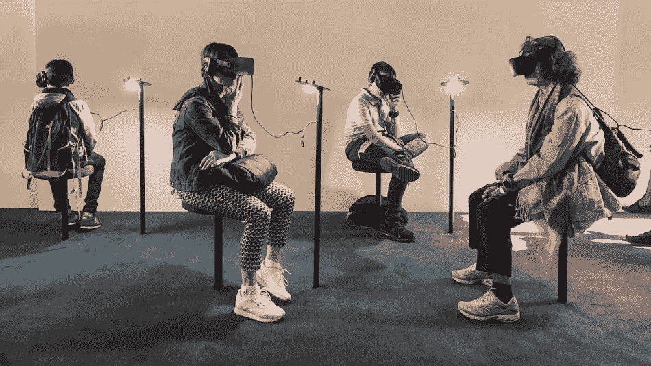
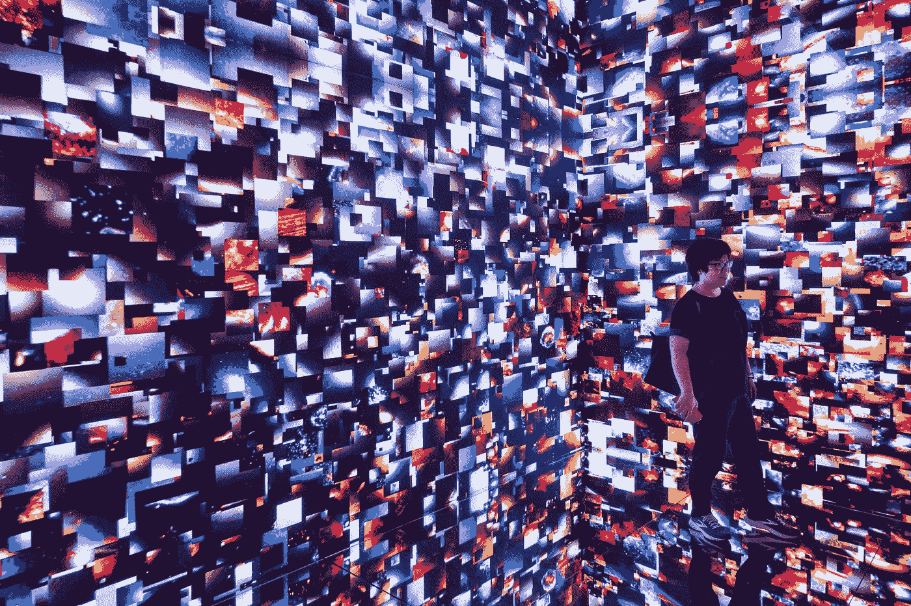
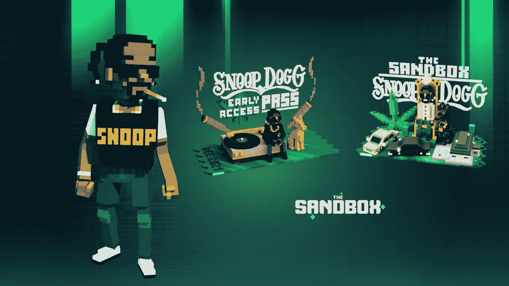
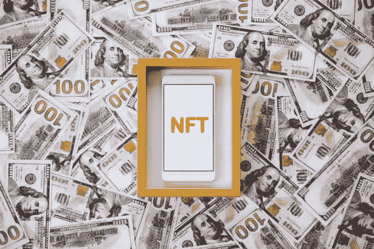
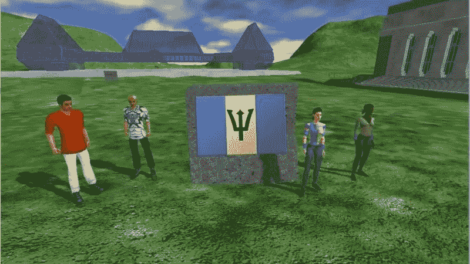

# 区块链博客 21:被元宇宙打乱的行业。

> 原文：<https://medium.com/coinmonks/blockchain-blog-21-industries-disrupted-by-the-metaverse-b1131942419c?source=collection_archive---------22----------------------->

元宇宙将给在这些行业工作的人带来新的机会。所以我们有社交媒体，显然，社交媒体是一个大的。即使是脸书公司 Meta，他们也把名字改成了 Meta，他们计划搬到这些世界去。而 Snapchat 等其他公司，正在大量试验增强现实，Meta 旗下的 Instagram 也在试验增强现实。在所有这些过滤器中，你可以说我们在社交媒体上的过滤器已经有点增强现实了。Tik Tok 也在尝试或准备开始做非功能性博客，内容创作者可以用他们在 Tik Tok 的帖子做一个 NFT。

**游戏:**元宇宙一半的平台都与游戏有关。它们之所以与游戏有关，是因为游戏是一个很大的用例，因为人们花很多时间玩游戏。新一代的 Z 世代和千禧一代花了成千上万甚至上百万个小时玩游戏。

**时尚:**我们仍然处于时尚品牌创造数字服装的早期，但这真的很大，你开始看到大品牌去元宇宙生产数字时装。NFT 也允许创作者，艺术家在以后接受二级市场销售。

人们现在可以在元宇宙上做营销和广告，因为甚至在很多年前，你看到的模拟人生、第二人生和其他游戏都是现成的品牌广告。可口可乐和许多不同的品牌都把总部设在那里，并在这些游戏中投放广告。元宇宙也会一样。

雅达利在沙盒和分散土地上购买土地，他们在这些元诗句中建造东西。所以这对品牌的营销非常重要。

Snoop Dogg Drops 10,000 Playable Sandbox Avatar NFTs

甚至像艺术家，比如，你看这里，史努比·道格，史努比·道格非常喜欢 NFTs 和元宇宙，他在沙盒里有一大块土地，价值可能超过一百万美元。他会举办类似的在线音乐会。

金融:元宇宙的金融将会变得很重要，就像在现实世界中你可以获得贷款一样，例如，在元宇宙世界，你有支付系统，你有这样那样的东西。因此，在这种情况下，你可以用数字资产做同样的事情，用你的数字房子，用你的数字土地，用你的数字 NFT，你可以把它们作为抵押，从中获得贷款。

**建筑**:它也受到元宇宙的影响。现在人们可以在元宇宙建造建筑，我将与你分享这篇文章设计元宇宙建筑在虚拟环境中的作用。元宇宙建筑也很流行，因为如果人们打算在元宇宙度过时光，他们希望拥有漂亮的建筑。

在分散的土地和其他网络世界，你可以炫耀你的数字艺术。最后，国家外交。是的，即使对于国家外交来说，巴贝多也是第一个在元宇宙开设大使馆的国家。

如果元宇宙是一个分散的世界，每个人都可以进入这个世界，那么国家外交在这个数字世界中也有一些存在是非常有趣的，允许他们的公民或其他国家的人与这个国家互动，接触他们的传统，他们的艺术和所有这些东西。

虽然这个博客仅限于几个行业，但我们可以将其扩展到无数行业，包括技术安全、教育、工作场所培训、体育赛事、健身、电影行业、流媒体娱乐行业、艺术、赌博，甚至犯罪现场调查。任何希望让产品更具互动性的企业都会关注元宇宙。

元宇宙不仅会带来一种新的做事方式，还会带来新的业务，提供今天不存在的体验，并提供新类型的工作来满足这些业务需求。

在可预见的未来，元宇宙很可能会与多个行业并行存在，但随着新一代人改变他们的偏好，选择他们希望如何与公司和其他人互动，这可能会终结我们今天所知的传统商业。在那之前，享受物质世界，因为我们看到的现实也可能是幻觉。

你可以看这个视频...

***阅读下一部分:*** [区块链博客 22:NFT——不可替代的令牌](https://aaklii.medium.com/blockchain-blog-22-nft-non-fungible-token-7561e76d4cc8)

***全系列:*** [28 篇关于区块链和加密货币的博客](https://aaklii.medium.com/28days-of-february-blockchain-and-cryptocurrency-research-blogs-4b73c51ce3db)

> 加入 Coinmonks [电报频道](https://t.me/coincodecap)和 [Youtube 频道](https://www.youtube.com/c/coinmonks/videos)了解加密交易和投资

## 另外，阅读

*   [3 商业评论](/coinmonks/3commas-review-an-excellent-crypto-trading-bot-2020-1313a58bec92) | [Pionex 评论](https://coincodecap.com/pionex-review-exchange-with-crypto-trading-bot) | [Coinrule 评论](/coinmonks/coinrule-review-2021-a-beginner-friendly-crypto-trading-bot-daf0504848ba)
*   [莱杰 vs n rave](/coinmonks/ledger-vs-ngrave-zero-7e40f0c1d694)|[莱杰 nano s vs x](/coinmonks/ledger-nano-s-vs-x-battery-hardware-price-storage-59a6663fe3b0) | [币安评论](/coinmonks/binance-review-ee10d3bf3b6e)
*   [Bybit Exchange 审查](/coinmonks/bybit-exchange-review-dbd570019b71) | [Bityard 审查](https://coincodecap.com/bityard-reivew) | [Jet-Bot 审查](https://coincodecap.com/jet-bot-review)
*   [3 commas vs crypto hopper](/coinmonks/3commas-vs-pionex-vs-cryptohopper-best-crypto-bot-6a98d2baa203)|[赚取加密利息](/coinmonks/earn-crypto-interest-b10b810fdda3)
*   最好的比特币[硬件钱包](/coinmonks/hardware-wallets-dfa1211730c6) | [BitBox02 回顾](/coinmonks/bitbox02-review-your-swiss-bitcoin-hardware-wallet-c36c88fff29)
*   [BlockFi vs 摄氏度](/coinmonks/blockfi-vs-celsius-vs-hodlnaut-8a1cc8c26630) | [Hodlnaut 审核](/coinmonks/hodlnaut-review-best-way-to-hodl-is-to-earn-interest-on-your-bitcoin-6658a8c19edf) | [KuCoin 审核](https://coincodecap.com/kucoin-review)
*   [Bitsgap 审查](/coinmonks/bitsgap-review-a-crypto-trading-bot-that-makes-easy-money-a5d88a336df2) | [Quadency 审查](/coinmonks/quadency-review-a-crypto-trading-automation-platform-3068eaa374e1) | [Bitbns 审查](/coinmonks/bitbns-review-38256a07e161)
*   [加密复制交易平台](/coinmonks/top-10-crypto-copy-trading-platforms-for-beginners-d0c37c7d698c) | [Coinmama 评论](/coinmonks/coinmama-review-ace5641bde6e)
*   [印度的加密交易所](/coinmonks/bitcoin-exchange-in-india-7f1fe79715c9) | [比特币储蓄账户](/coinmonks/bitcoin-savings-account-e65b13f92451)
*   [OKEx vs KuCoin](https://coincodecap.com/okex-kucoin) | [摄氏替代度](https://coincodecap.com/celsius-alternatives) | [如何购买 VeChain](https://coincodecap.com/buy-vechain)
*   [币安期货交易](https://coincodecap.com/binance-futures-trading)|[3 commas vs Mudrex vs eToro](https://coincodecap.com/mudrex-3commas-etoro)
*   [如何购买 Monero](https://coincodecap.com/buy-monero) | [IDEX 评论](https://coincodecap.com/idex-review) | [BitKan 交易机器人](https://coincodecap.com/bitkan-trading-bot)
*   [iTop VPN 审查](https://coincodecap.com/itop-vpn-review) | [曼陀罗交易所审查](https://coincodecap.com/mandala-exchange-review)
*   [40 个最佳电报频道](https://coincodecap.com/best-telegram-channels) | [喜美元评论](https://coincodecap.com/hi-dollar-review)
*   [折叠 App 审核](https://coincodecap.com/fold-app-review) | [StealthEX 审核](/coinmonks/stealthex-review-396c67309988) | [Stormgain 审核](https://coincodecap.com/stormgain-review)
*   [购买 PancakeSwap(蛋糕)](https://coincodecap.com/buy-pancakeswap) | [俱吠罗评论](/coinmonks/coinswitch-kuber-review-1a8dc5c7a739)
*   [瓦济里克斯 NFT 评论](https://coincodecap.com/wazirx-nft-review)|[Bitsgap vs Pionex](https://coincodecap.com/bitsgap-vs-pionex)|[坦吉姆评论](https://coincodecap.com/tangem-wallet-review)
*   [如何使用 Solidity 在以太坊上创建 DApp？](https://coincodecap.com/create-a-dapp-on-ethereum-using-solidity)