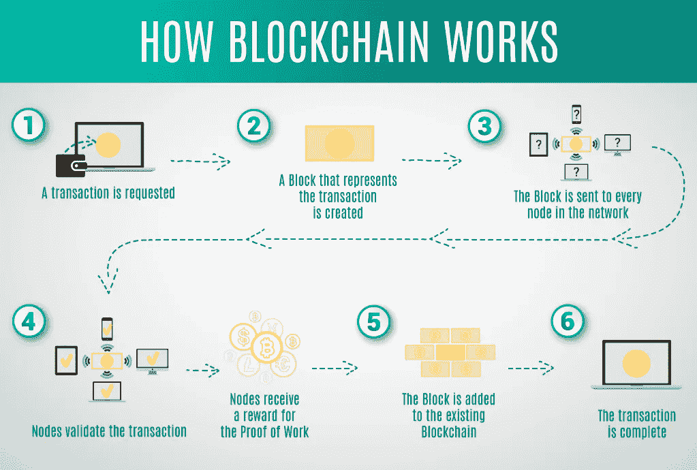
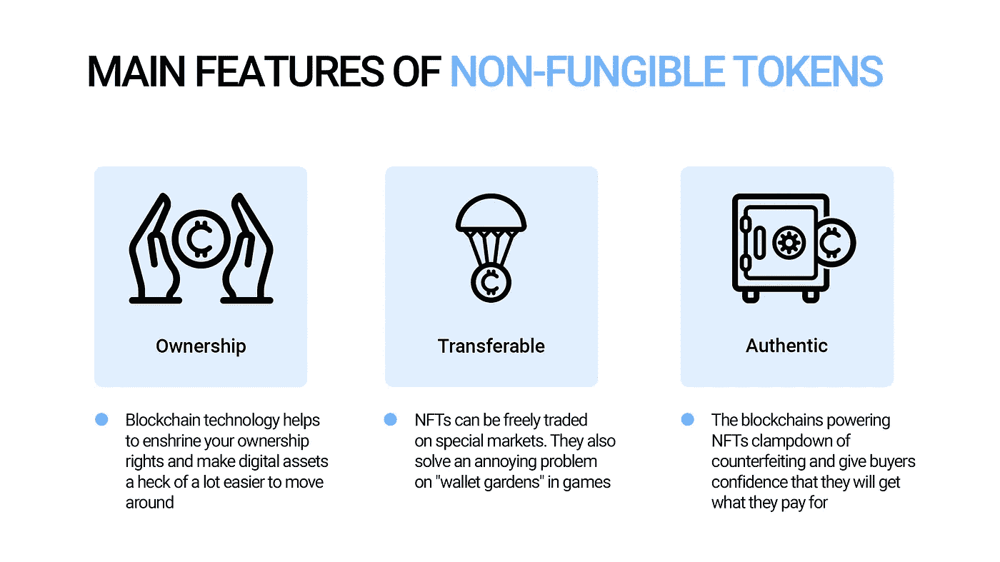
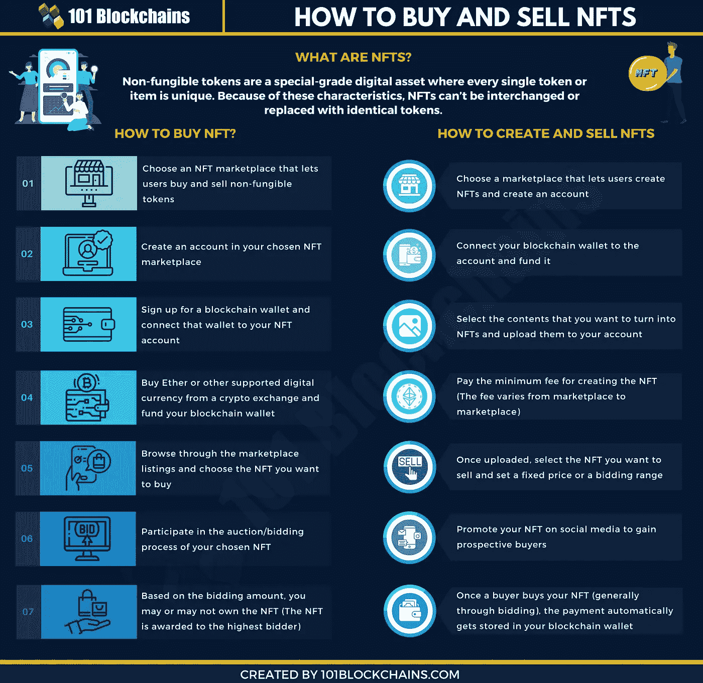
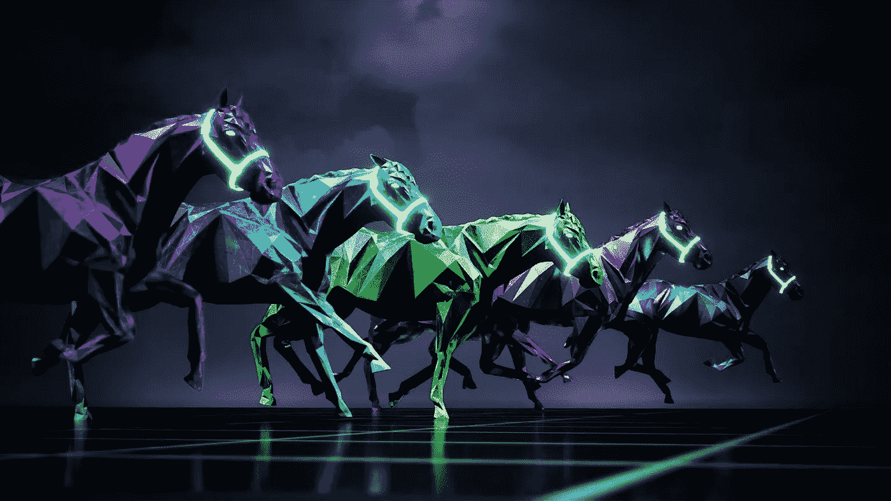
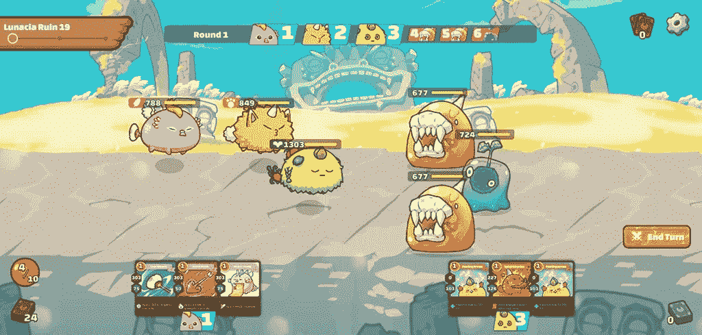

# 区块链博客 22:NFT——不可替代的令牌

> 原文：<https://medium.com/coinmonks/blockchain-blog-22-nft-non-fungible-token-7561e76d4cc8?source=collection_archive---------25----------------------->

我们在下面的博客中介绍了 NFTs 的基础知识:[区块链博客 19:元宇宙和 NFTs](https://aaklii.medium.com/blockchain-blog-19-metaverse-and-nft-5165f06671f2) 并试图回答以下问题:**它是如何与元宇宙联系在一起的？**和**为什么 NFT 很有价值？**我们还看了**种非功能性测试。**今天我们将探讨 NFT 的主要术语和概念。

NFT 是一种数字资产，代表现实世界的对象，如艺术、音乐、游戏中的项目和视频。它们经常与[加密货币](https://www.forbes.com/advisor/investing/what-is-cryptocurrency/)一起在网上买卖，并且它们通常用与许多加密货币相同的底层软件进行编码。

# NFTs 是如何工作的？

NFT 存在于区块链上，使用的技术和你最喜欢的加密货币一样。在很大程度上，NFT 主要存在于以太坊区块链，但是也有其他的区块链网络将很快提供支持 NFT 的能力。

NFT 由代表有形和无形项目的数字对象创建或“铸造”,包括:

**美术
**gif
**视频和体育集锦
**收藏品
**虚拟头像和视频游戏皮肤
**设计师运动鞋
**音乐**************

******甚至推特也算。Twitter 联合创始人杰克·多西以 NFT 身份发布的第一条推文售价超过 290 万美元。******

******本质上，NFT 就像实物收藏家的项目，只是数字。因此，买家得到的不是挂在墙上的真正的油画，而是一个数字文件。******

******他们还获得独家所有权。没错:NFT 一次只能有一个所有者。NFTs 的独特数据使得验证其所有权和在所有者之间转移令牌变得容易。所有者或创建者也可以在其中存储特定的信息。例如，艺术家可以通过在 NFT 的元数据中包含他们的签名来为他们的作品签名。******

## ******NFT 的主要特色？******

************

# ******NFT 是用来做什么的？******

******区块链技术和 NFTs 为艺术家提供了直接将内容货币化的能力。艺术家和音乐家不必依赖画廊和市场来销售他们的作品。他们可以直接向消费者出售他们的内容，而不必向这些第三方中介付费。内容创作者也可以用版税编程，这样无论何时转售 NFT，创作者都可以获得一定比例的销售额。一旦添加，该特征就不能被改变，因为它被编码到资产本身中。这是许多艺术家特别感兴趣的，因为他们中的许多人目前在最初出售他们的内容后没有未来的收入。******

# ******如何购买 NFT******

******你将需要一个数字钱包，允许你存储 NFT 和加密货币。你可能需要购买一些[加密货币](https://www.forbes.com/advisor/investing/best-crypto-exchanges/)，比如以太，这取决于你的 NFT 提供商接受什么货币。你可以使用任何一个密码交易所购买密码。然后你就可以把它从交易所转移到你选择的钱包里。******

************

# ******NFTs 的问题******

******存在版权问题，创作者使用他人的名字、想法和图像来转售以获取利润。例子包括许多迈克尔·乔丹的非专利唱片未经他的同意就被出售，他也没有从销售中得到任何版税。美国政府等管理机构有必要在 NFT 领域提供明确性和指导方针。******

## ******好人******

*   ******像 CryptoPunks、Bored Ape Yacht Club 和 CyberKongz 这样的蓝筹 NFT 项目背后都有很棒的团队和社区。这些 NFT 有某种效用，甚至奖励持有者，这导致了被动收入。******
*   ******密码朋克变得如此受欢迎，以至于佳士得和苏富比拍卖了个人图像。******
*   ******起初，每个人都能进去。我们以 Axie Infinity 为例。它在东南亚非常受欢迎，因为入场费几乎为零，而且你还可以从中赚些钱，这在疫情期间对一些人来说至关重要。******
*   ******NFTs 的未来超越了密码艺术。查看[区块链博客 19:元宇宙和 NFTs](https://aaklii.medium.com/blockchain-blog-19-metaverse-and-nft-5165f06671f2)******

## ******坏事******

*   ******一流的非功能性测试过于昂贵，为模仿者的出现创造了机会。******
*   ******99%的 NFT 会因此归零。******
*   ******炒作带走了常识。******
*   ******NFT 市场流动性不太好。卖家比买家多，导致一夜之间 70%以上的无声崩盘。******
*   ******正如看到的**比特币**和**以太坊**一样，crypto 极其不稳定，和 NFTs 没什么区别。******

## ****丑陋的****

*   ****当有一个快速赚钱的方法时，你肯定会遇到诈骗和加油站。 [**进化而来的类人猿**](https://www.pcgamer.com/evolved-apes-nft-creator-evil-ape-disappears-with-dollar27m/) 就是一个最好的例子。在 Opensea 上发布后，该项目的负责人消失了，带走了 798 以太(大约 270 万美元)。****
*   ****由于这是一个如此新的现象，很多人会因为它快节奏的本质而受伤。没有人真正知道正在发生什么，哪些项目会成功，哪些不会。不管怎样，钱正从左、中、右三个方向涌入。****

****[观看视频了解更多信息。](https://www.youtube.com/watch?v=5SOj4Np0yvQ)****

# ****受欢迎的 NFT 市场****

****OpenSea.io :这个点对点平台标榜自己是“稀有数码物品和收藏品”的供应商要开始，你需要做的就是创建一个帐户来浏览 NFT 收藏。你也可以根据销量对作品进行分类，以发现新的艺术家。****

****[**Rarible**](https://rarible.com/) :类似于 OpenSea，Rarible 是一个民主、开放的市场，允许艺术家和创作者发布和出售 NFT。在该平台上发行的 RARI 代币使持有者能够权衡费用和社区规则等特征。****

****[**基金会**](https://foundation.app/) :在这里，艺术家必须收到“支持票”或来自其他创作者的邀请来张贴他们的艺术作品。该社区的排他性和进入成本——艺术家还必须购买“汽油”来铸造 NFTs——意味着它可能拥有更高质量的艺术作品。例如，Nyan Cat 的创造者 Chris Torres 在基金会平台上出售了 NFT。这也可能意味着更高的价格——假设对 NFT 的需求保持在当前水平，甚至随着时间的推移而增加，这对寻求投资的艺术家和收藏家来说不一定是件坏事。****

****虽然这些平台和其他平台是数以千计的 NFT 创作者和收藏家的主机，但请确保在购买前仔细研究。一些艺术家已经成为冒名顶替者的牺牲品，这些冒名顶替者未经他们的许可就把他们的作品上市出售。****

****此外，创作者和 NFT 上市的验证过程在不同平台上并不一致——有些平台比其他平台更严格。例如，OpenSea 和 Rarible 在 NFT 上市时不要求所有者验证。买家保护似乎充其量只是稀疏，所以当购买非功能性食品时，最好记住一句古老的格言“买者自负”(让买家当心)。****

# ****一些流行的非功能性测试的例子****

## ****泽德赛马****

****虽然有许多形式的不可替代代币，但这项技术最有趣的应用之一是在数字赛马领域。
Zed Run 是一个数字赛马平台，比赛每周 7 天、每天 24 小时
进行。****

********

****Zed Run 平台上的“马”以 NFT 的形式存在，它们的功能
仅仅是数字资产。由澳大利亚的虚拟人类工作室创造，这些 NFT 马作为 ERC-721 代币存在于区块链以太坊。数字马不同于许多其他种类的非功能性测试的地方在于，每匹马都被认为是独一无二的“会呼吸的 NFT”。
每匹马都可以和其他的马繁殖出新的马，并且有自己的血统可以在区块链上追溯。每匹马都可以比赛(它们的比赛历史可以在区块链查看),并且具有可以遗传给后代的属性。****

## ****无限轴****

********

****Axie Infinity 已经迅速成为 DeFi 领域最受欢迎的 NFT 生态系统
和游戏之一。就活跃用户而言，它是最受欢迎的以太坊游戏。250，000 多名每日活跃玩家和 90，000 多名 ETH 在其内部市场上进行交易。这是一个受神奇宝贝启发的游戏，玩家可以互相战斗，收集物品，提高新的“Axies”，并为他们的宠物创建自己的王国。****

****轴是以 NFT 格式创建的数字生物。玩家可以交易持有轴的代币，并以“收集所有轴”为目标。有许多不同种类的轴可用，并且有超过 500 种不同的
身体部位。axie 可以互相战斗来赢得经验值，用来升级 axie 或进化他们的身体部位。主人也可以选择饲养 Axie 来保存自己或者在 Axie 市场上出售。****

****仅仅因为你能买 NFT，就意味着你应该买吗？NFT 是有风险的，因为他们的未来是不确定的，我们还没有很多历史来判断他们的表现。换句话说，投资 NFTs 在很大程度上是个人决定。如果你有多余的钱，它可能值得考虑，尤其是如果一件作品对你有意义的话。****

****但请记住，NFT 的价值完全取决于其他人愿意为它支付的价格。因此，需求将驱动价格，而不是基本面、技术或经济指标，这些指标通常会影响股票价格，至少通常会形成投资者需求的基础。****

****所有这些都意味着 NFT 可能会以低于你的购买价格转售。或者没人要，你可能根本卖不出去。像对待任何投资一样对待 NFTs:做你的研究，了解风险——包括你可能会失去所有的投资。****

*******阅读下一部分:*** [区块链博客 23: NFT |元宇宙——市场机遇](https://aaklii.medium.com/blockchain-blog-23-nft-metaverse-market-opportunity-dd4baca2a6df)****

*******全系列:*** [28 篇关于区块链和加密货币的博客](https://aaklii.medium.com/28days-of-february-blockchain-and-cryptocurrency-research-blogs-4b73c51ce3db)****

> ****加入 Coinmonks [电报频道](https://t.me/coincodecap)和 [Youtube 频道](https://www.youtube.com/c/coinmonks/videos)了解加密交易和投资****

## ****另外，阅读****

*   ****[10 本关于加密的最佳书籍](https://coincodecap.com/best-crypto-books) | [英国 5 个最佳加密机器人](https://coincodecap.com/uk-trading-bots)****
*   ****[ko only Review](https://coincodecap.com/koinly-review)|[Binaryx Review](https://coincodecap.com/binaryx-review)|[Hodlnaut vs CakeDefi](https://coincodecap.com/hodlnaut-vs-cakedefi-vs-celsius)****
*   ****[MoonXBT vs Bybit vs 币安](https://coincodecap.com/bybit-binance-moonxbt) | [硬件钱包](/coinmonks/hardware-wallets-dfa1211730c6)****
*   ****[火币交易 Bot](https://coincodecap.com/huobi-trading-bot) | [如何购买 ADA](https://coincodecap.com/buy-ada-cardano) | [Geco？一次回顾](https://coincodecap.com/geco-one-review)****
*   ****[币安 vs 比特邮票](https://coincodecap.com/binance-vs-bitstamp) | [比特熊猫 vs 比特币基地 vs Coinsbit](https://coincodecap.com/bitpanda-coinbase-coinsbit)****
*   ****[如何购买 Ripple (XRP)](https://coincodecap.com/buy-ripple-india) | [非洲最好的加密交易所](https://coincodecap.com/crypto-exchange-africa)****
*   ****[非洲最佳加密交易所](https://coincodecap.com/crypto-exchange-africa) | [胡交易所评论](https://coincodecap.com/hoo-exchange-review)****
*   ****[eToro vs robin hood](https://coincodecap.com/etoro-robinhood)|[MoonXBT vs Bybit vs Bityard](https://coincodecap.com/bybit-bityard-moonxbt)****