# 区块链博客 23: NFT |元宇宙——市场机遇

> 原文：<https://medium.com/coinmonks/blockchain-blog-23-nft-metaverse-market-opportunity-dd4baca2a6df?source=collection_archive---------6----------------------->

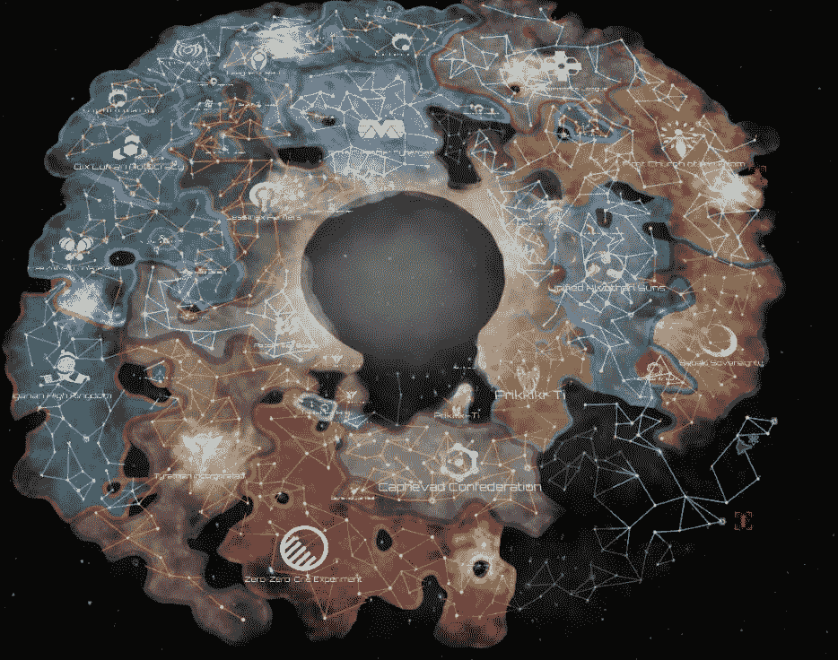

加密云经济是下一个新兴市场投资前沿，元宇宙处于这一 Web 3.0 互联网发展的前沿。元宇宙是一组互联的、体验性的 3D 虚拟世界，在这里，任何地方的人们都可以进行实时社交，形成一个持续的、用户所有的、跨越数字和物理世界的互联网经济。元宇宙仍在兴起，但许多关键部分已经开始成形，并正在彻底改变从电子商务到媒体和娱乐，甚至房地产的一切。

# 元宇宙价值链

当谈到描述元宇宙，定义和意见比比皆是。虽然很难用可量化的术语来描述像元宇宙这样巨大的、概念性的、仍在兴起的事物，但企业家、作家和游戏设计师乔恩·拉多夫在《元宇宙价值链》**中对其进行了逻辑和透彻的分析**

****

**他沿着价值链向上移动，从底层的基础设施到顶层的体验，沿途停留在人机界面、去中心化、空间计算、创造者经济和发现。**

**一个共同的框架对于拉多夫的元宇宙观是必要的。他写道:**

> **“虽然元宇宙将会有许多专有的(非常有趣的)主题公园，但我更为瑞士的机会感到兴奋:一个由强大的创造者经济驱动的元宇宙，这种经济是通过权力下放实现的。”**

# **元宇宙市场**

**元宇宙仍在成形，但 Web 3.0 开启了虚拟世界加密
网络让人们得以一窥互联网的未来。将元宇宙带入生活的市场机会可能价值超过 1 万亿美元的年收入，并可能与今天价值约 15 万亿美元的 Web 2.0 公司竞争。这种潜力吸引了像脸书这样的公司转向元宇宙，这可能会成为其他 Web 2.0 技术巨头和投资者效仿的催化剂。**

**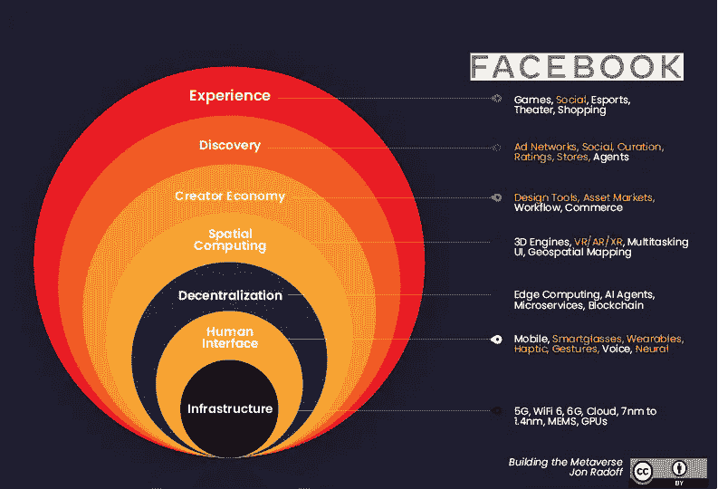**

# **绘制元宇宙地图**

**一位名叫 [**Kaspar**](https://twitter.com/_Kaspar__) 的爱好者，是一位艺术家，也是 Web3 的创作者，他对 NFTs 和元宇宙的未来相当乐观。他在以太坊、迪菲和 NFT 的基础上绘制了元宇宙的地图。**

**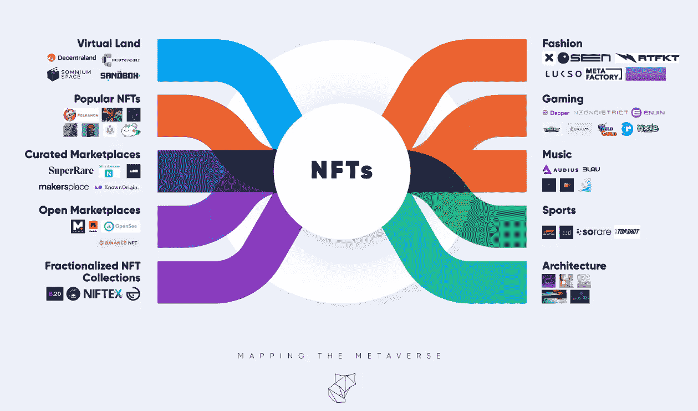**

**他在推特上发布了一个帖子，简化了元宇宙生态系统中的关键术语。[点击此处阅读他的整个线程](https://twitter.com/_Kaspar__/status/1394665206110949386)。**

*****注意:我不同意或不同意其中任何一个，我把它们放在这里只是因为它给出了关于特定术语的一般概念，他还标记了一些加密货币的 Twitter 句柄，这些加密货币是元宇宙生态系统的一部分。*****

# **元论题**

**互联网一直是关于连接人们的。在过去的三十年里
，互联网技术不断发展，我们与互联网互动的方式也随之发展。虽然发生了很大的变化，但基于网络的社区的三个关键时代可以被认为是:
**·Web 1.0—Netscape**将我们在线连接起来
**·Web 2.0—脸书**将我们连接到网络社区中
**·Web 3.0—去中心化**(只是一个例子)将我们连接到一个社区拥有的虚拟世界中**

**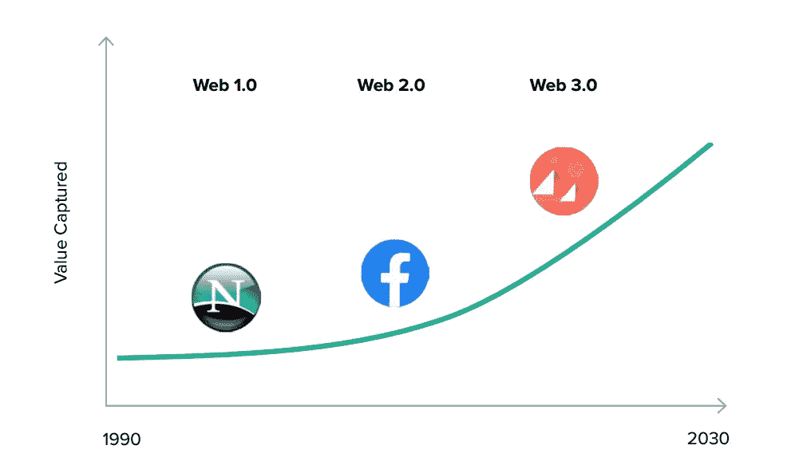**

**随着我们跨越这些时代，我们的互动和我们用来创造互动的媒介扩展了。我们亲身经历了连接我们的组织架构如何转变，我们所依赖的计算基础设施如何成熟，以及对网络的控制如何在社区和大型科技公司之间减弱和流动。**

**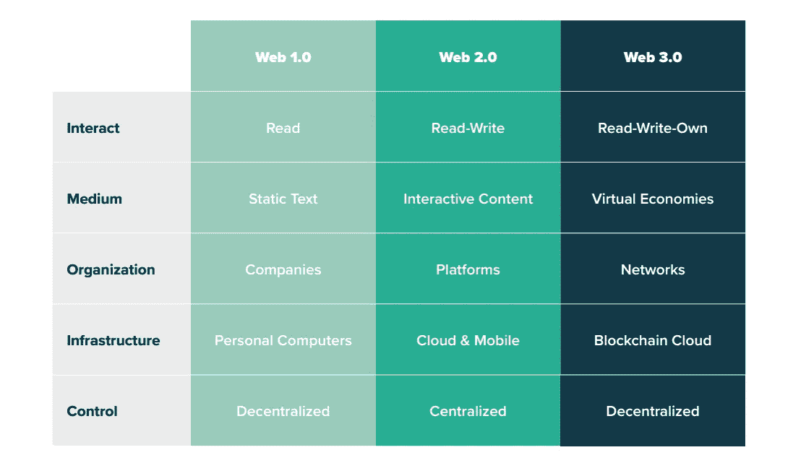**

**Web 2.0 移动互联网改变了我们使用互联网的方式、地点、时间和原因
。反过来，这改变了我们使用的产品、服务和公司，从而改变了我们的商业模式、文化和政治 Web 3.0 元宇宙有潜力做同样的事情。**

# **元市场机会**

**我们越来越关注数字活动，尤其是年轻一代。今天，我们生活的 1/3(8 小时/天)已经花在看电视、玩游戏或社交媒体上了。随着我们在这些数字世界体验中花费更多的时间，我们也在这些数字领域中花费更多的钱来建立我们在这些在线社区中的社会地位。**

**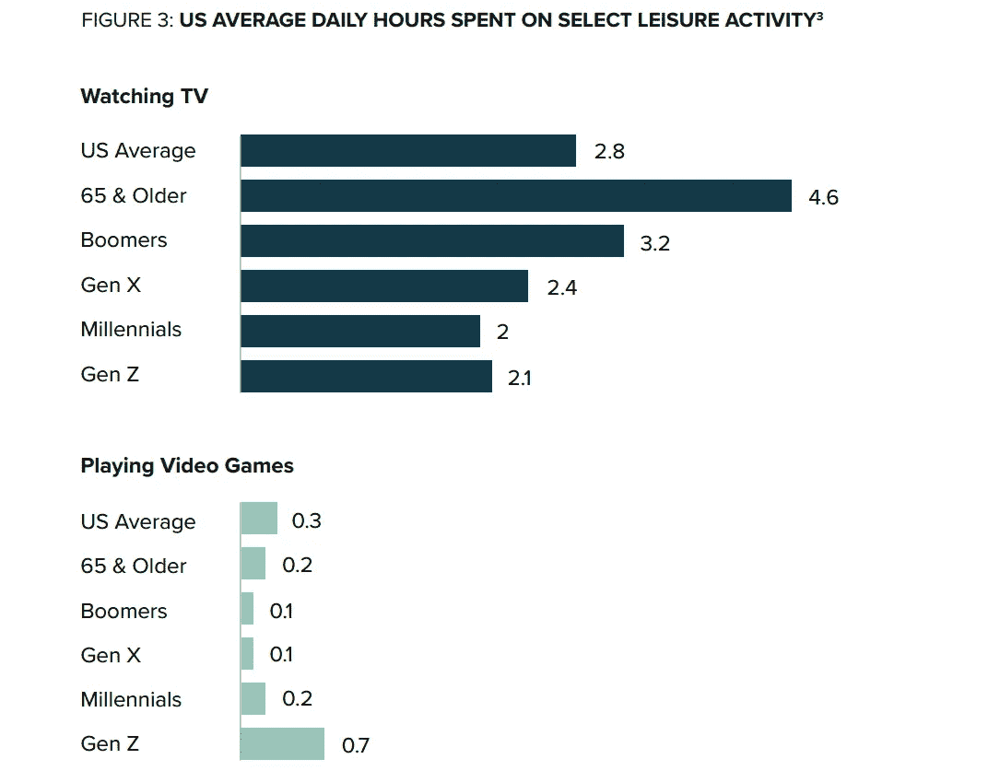****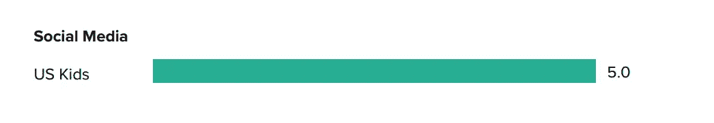**

**我们的社交生活和游戏正在融合，并创造出一个庞大、快速增长的虚拟商品消费经济。据估计，虚拟游戏世界的收入将从 2020 年的 1800 亿美元增长到 2025 年的 4000 亿美元。游戏开发商货币化的持续转变是这一增长趋势中的一个关键动力。玩家越来越多地从付费玩高级游戏转向免费游戏，开发者通过向玩家出售游戏中的物品来提高游戏性或在这些虚拟世界中的社会地位来赚钱。**

**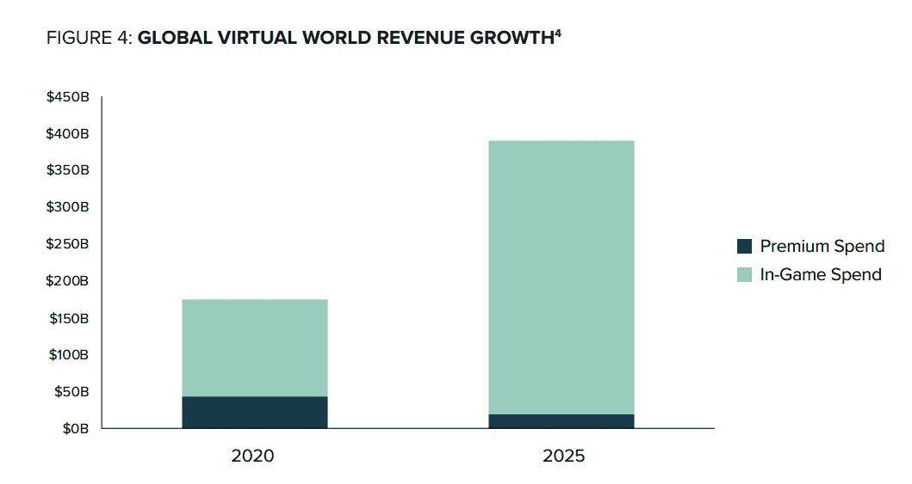**

**随着从 Web 2.0 封闭企业元对抗向 Web 3.0 开放加密元宇宙网络的过渡，这种转变正在进一步加速，这些网络是: **Web 2.0 封闭企业元宇宙:**由大科技公司集中拥有和控制。
**Web 3.0 开放加密元宇宙:**由全球用户民主拥有和控制。**

**如今，许多游戏玩家在 Web 2.0 封闭的元宇宙企业世界中花费金钱和时间来创造数字财富。问题是，大部分游戏开发者都不会让玩家将自己的投入和努力货币化。开发商禁止玩家与其他玩家交易物品，并保持这些世界的封闭，这样玩家就无法将游戏中的财富转移到实体经济中。**

**Web 3.0 开放加密元宇宙网络通过消除 Web 2.0 平台强加给这些虚拟世界的资本控制来解决这个问题。这种新模式允许用户以不可替代代币(NFT)的形式拥有他们的数字资产，在游戏中与他人进行交易，并将其带到其他数字体验中，创造了一个全新的自由市场互联网原生经济，可以在现实世界中货币化。这种“创造者经济”的演变被称为“为挣钱而玩”。**

**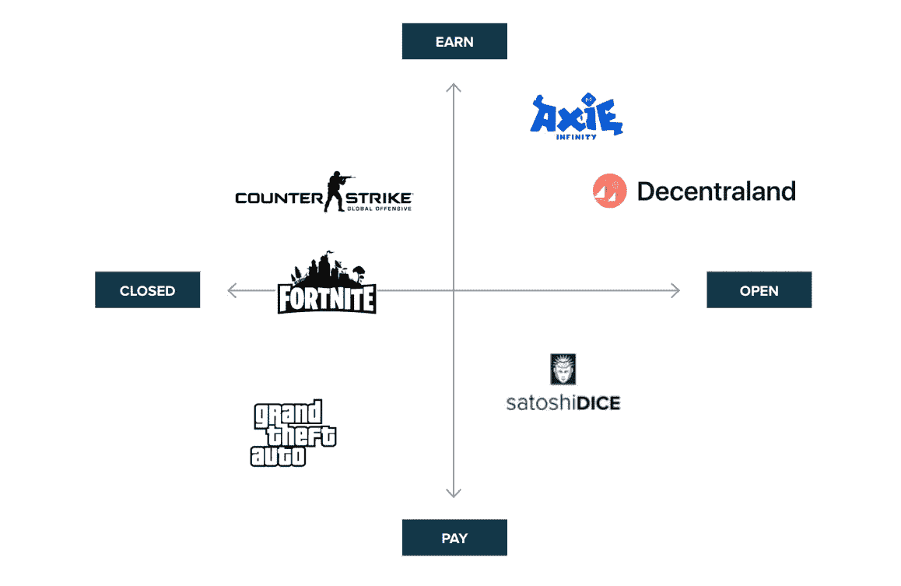**

****ILLUSTRATIVE OPEN VS CLOSED GAMING & METAVERSE EXAMPLES5****

**在元宇宙，用户在数字社区中指定这些类型的无缝、真实世界的相邻交互。相反，与 Web 3.0 开放式加密元宇宙网络相比，Web 2.0 企业元宇宙平台的封闭性可能会使用户处于不利地位。成熟的 Web 2.0 公司需要通过开放生态系统和消除竞争壁垒来打破他们的商业模式。我们还不知道脸书将带着他们的元宇宙雄心走上哪条路，但他们——像其他 Web 2.0 公司一样——将需要在为股东实现季度业绩的压力面前做出这一具有挑战性的转变。游戏只是价值已经开始自然转移到 Web 3.0 的最直接的细分市场之一，但元宇宙的机会远远不止游戏。据估计，元宇宙是一个跨越广告、社交商务、数字活动、硬件和开发者/创作者货币化的万亿美元收入机会。**

**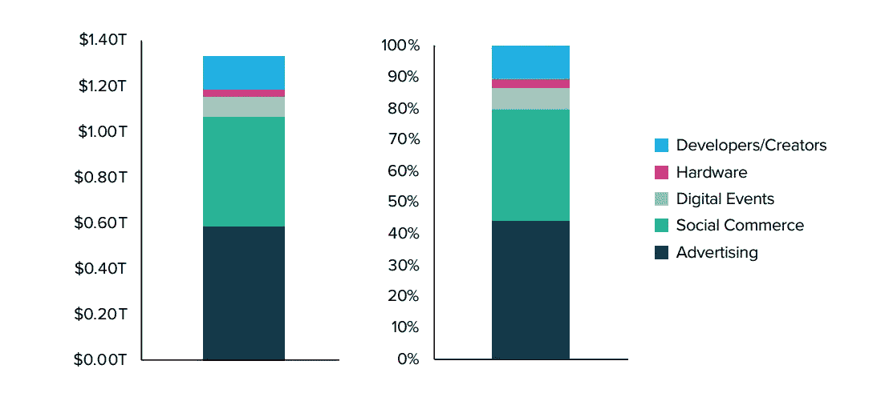**

****GLOBAL METAVERSE POTENTIAL TOTAL ADDRESSABLE MARKET6****

**领先的 Web 3.0 元宇宙加密网络的总市值约为 275 亿美元。相比之下，脸书的市值约为 9000 亿美元，游戏行业的市值约为 2 万亿美元，Web 2.0 公司的市值为 14.8 万亿美元，这些公司可能会转移到元宇宙或面临中断的风险**

**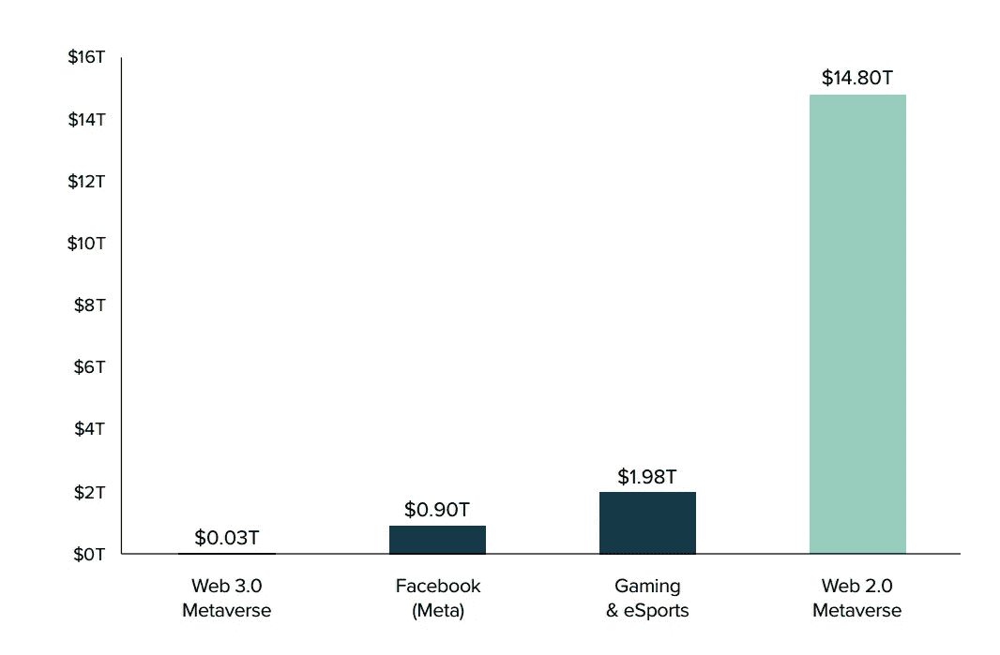**

# **元 Web 3.0 经济**

**Web 3.0 加密元数据是新兴市场虚拟世界经济，不断发展复杂的数字商品、服务和资产组合，为用户创造现实世界的价值。早期的 Web 3.0 元宇宙世界通常建立在区块链计算平台(第一层)之上，有许多参与开发游戏和游戏内物品的各方，这些物品可以在区块链上自由交易。**

**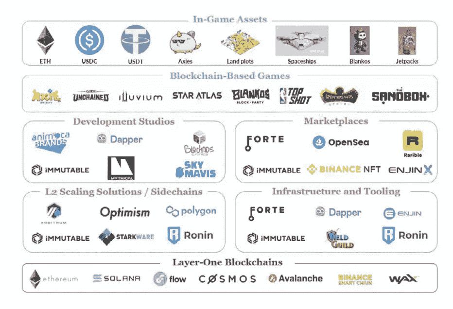**

****BLOCKCHAIN-BASED GAMING STACK****

**购买这些商品的用户开始建立新的电子商务体验。今天，在分散的土地和其他虚拟世界经济中，一些更受欢迎的商业活动的例子是:**

**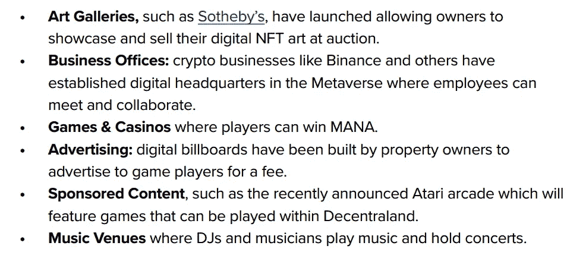******

****METAVERSE EXPERIENCES****

**这些 Web 3.0 元宇宙世界是更大的互联加密云经济的一部分。这些分散的协议相互操作，并提供支持元宇宙虚拟经济的技术基础设施。**

**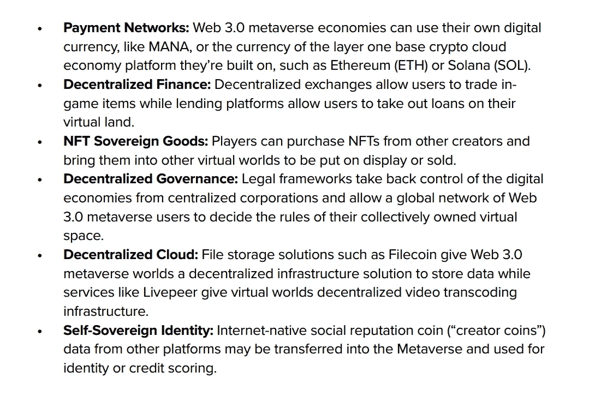****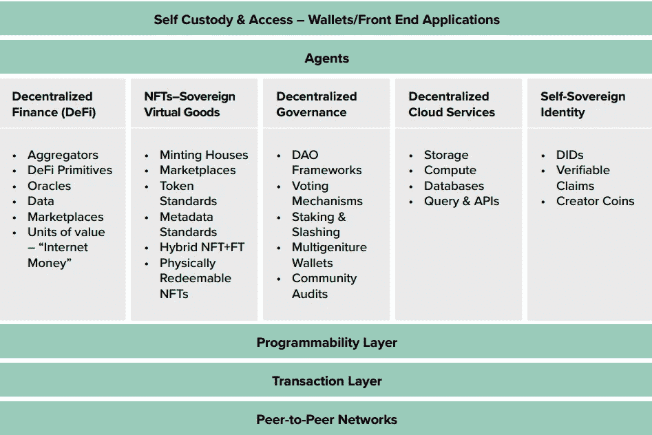**

****BLOCKCHAIN-BASED VIRTUAL ECONOMY SEGMENTS****

# **元 Web 3.0 指标**

**这些创新的结合创造了一种新的在线体验，已经开始吸引用户。Web 3.0 元宇宙虚拟世界用户近年来增长迅速。今天，Web 3.0 元宇宙虚拟世界拥有近 50，000 名全职用户(活跃钱包作为代理)，比 2020 年初增长了约 10 倍。**

**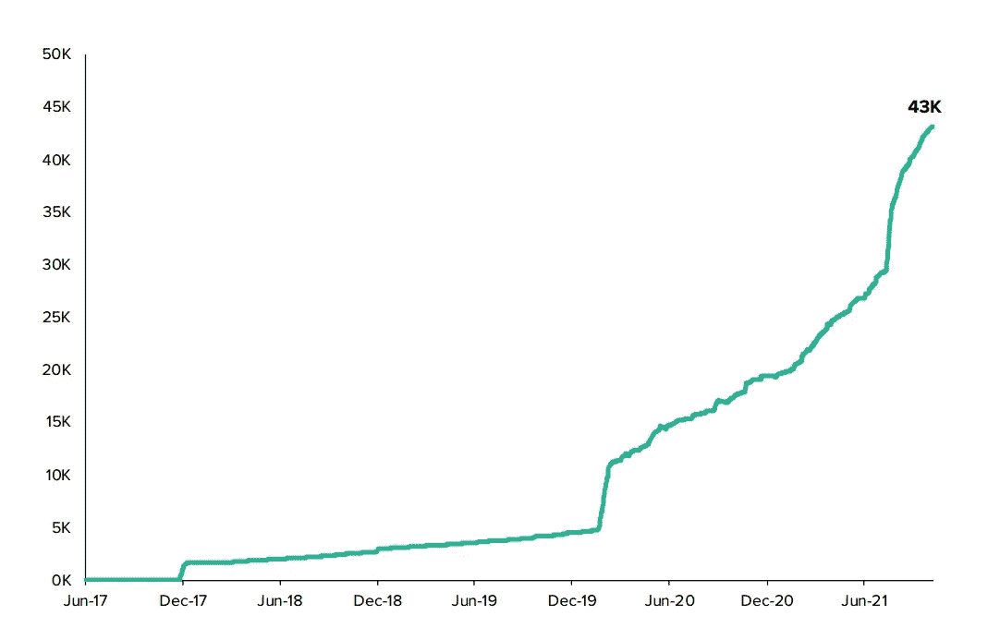**

****GLOBAL ALL-TIME ACTIVE METAVERSE WALLETS****

**与其他 Web 3.0 和 Web 2.0 细分市场相比，元宇宙虚拟世界的用户仍处于早期阶段，但如果当前的增长率保持在当前的轨道上，这一新兴细分市场有可能在未来几年成为主流。**

**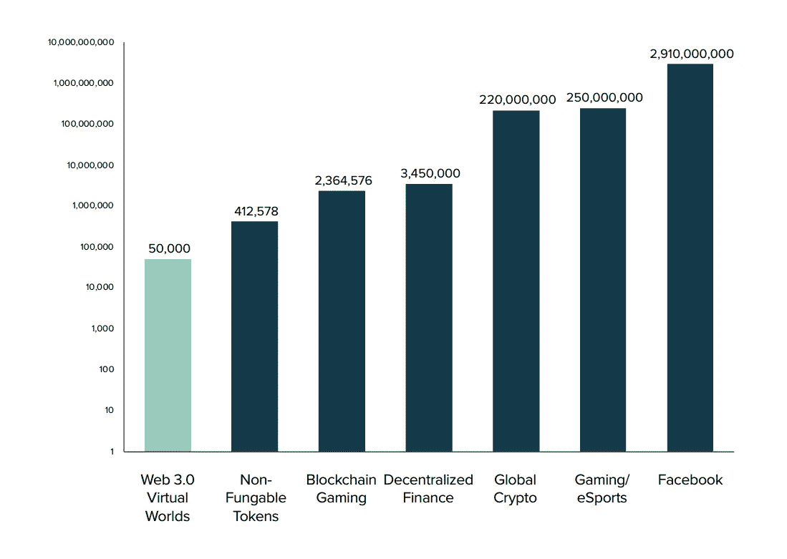**

****GLOBAL USERS PER SELECT CATEGORY****

**Web 3.0 元宇宙虚拟世界正在为开发人员、第三方创作者和用户创造真实世界的价值，构建这些新兴市场的互联网原生加密云经济。花在 Web 3.0 元宇宙项目销售上的空前价值，如虚拟土地、商品和服务，已经超过了 2 亿美元。**

**通过去除历史上控制这些在线空间的 Web 2.0 集中化公司，Web 3.0 元宇宙虚拟世界受益于快速创新和生产率的提高。**

**加密虚拟世界通过消除资本管制和向自由市场资本主义开放数字边界，为创作者和资产所有者创造了一个价值数百万美元的一级和二级市场。**

**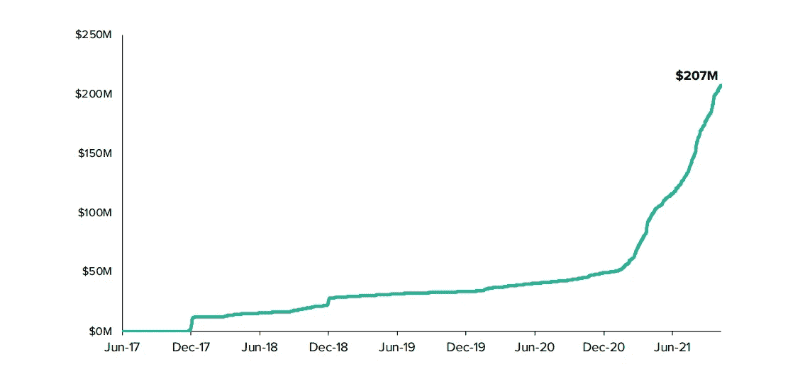**

**在 2021 年第三季度，加密融资总额为 82 亿美元，其中 Web 3.0 和 NFT 部分为 18 亿美元。在 Web 3.0 和 NFT 领域，总部位于区块链的游戏公司通过 14 笔交易吸引了约 10 亿美元的资金，在该领域排名第一。**

**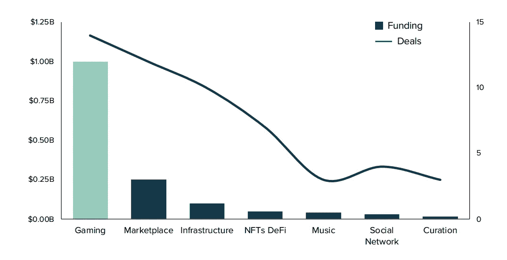**

**对该行业的资本投资最近开始加速，但与脸书等公司计划投资的 100 亿美元，以及其他公司和风险资本家可能跟进的金额相比，元宇宙还处于早期阶段。**

**嗯，我对元宇宙市场相当中立，目前的情况类似于上世纪 90 年代末的****泡沫。如果你读了我以前关于元宇宙的博客，你会觉得它很有前途，同时也不值得。如果你真的对投资 NFTs 或加密货币感兴趣，那么这整个 [**28 个关于区块链和加密货币的博客**](https://aaklii.medium.com/28days-of-february-blockchain-and-cryptocurrency-research-blogs-4b73c51ce3db) 的最后 4 或 5 个博客将专门用于研究和分析。
**元宇宙博客:**
[博客 17:元宇宙之根——博彩业](https://aaklii.medium.com/blockchain-blog-17-roots-of-metaverse-gaming-industry-5313ccfdcef8)
[博客 18:元宇宙——3D 互联网](https://aaklii.medium.com/blockchain-blog-18-metaverse-a-3d-9d6d042ce264)
[博客 19:元宇宙与 NFTs](https://aaklii.medium.com/blockchain-blog-19-metaverse-and-nft-5165f06671f2)
[博客 20:元宇宙——未来就在这里](https://aaklii.medium.com/feb-20-metaverse-the-future-is-here-a6366ee1ec40)
[博客 21:被元宇宙颠覆的产业](https://aaklii.medium.com/blockchain-blog-21-industries-disrupted-by-the-metaverse-b1131942419c)******

****最后，我发现这个 youtube 视频非常有趣，同时有助于从不同的角度看元宇宙。****

*******阅读下一部分:*** [区块链博客 24: NFT |元宇宙—技术洞察](https://aaklii.medium.com/blockchain-blog-24-nft-metaverse-technology-insights-b4154e45635d)****

*******全系列:*** [28 篇关于区块链和加密货币的博客](https://aaklii.medium.com/28days-of-february-blockchain-and-cryptocurrency-research-blogs-4b73c51ce3db)****

> ****加入 Coinmonks [电报频道](https://t.me/coincodecap)和 [Youtube 频道](https://www.youtube.com/c/coinmonks/videos)了解加密交易和投资****

## ****另外，阅读****

*   ****[无聊猿游艇俱乐部(BAYC)回顾](https://coincodecap.com/bored-ape-yacht-club-bayc-review) | [拜比特 vs 比特币基地](https://coincodecap.com/bybit-vs-coinbase)****
*   ****[5 款最佳加密交易终端](https://coincodecap.com/crypto-trading-terminals) | [最佳 DeFi 应用](https://coincodecap.com/best-defi-apps)****
*   ****[比特币基地 vs 瓦济克斯](https://coincodecap.com/coinbase-vs-wazirx) | [比特鲁点评](https://coincodecap.com/bitrue-review) | [波洛涅克斯 vs 比特鲁](https://coincodecap.com/poloniex-vs-bittrex)****
*   ****[德国最佳加密交易所](https://coincodecap.com/crypto-exchanges-in-germany) | [Arbitrum:第二层解决方案](https://coincodecap.com/arbitrum)****
*   ****[币安交易机器人](/coinmonks/binance-trading-bots-d0d57bb62c4c) | [OKEx 评论](/coinmonks/okex-review-6b369304110f) | [Atani 评论](https://coincodecap.com/atani-review)****
*   ****[最佳加密交易信号电报](/coinmonks/best-crypto-signals-telegram-5785cdbc4b2b) | [MoonXBT 评论](/coinmonks/moonxbt-review-6e4ab26d037)****
*   ****[如何在 Bitbns 上购买柴犬(SHIB)币？](https://coincodecap.com/buy-shiba-bitbns) | [买弗洛基](https://coincodecap.com/buy-floki-inu-token)****
*   ****[CoinFLEX 评论](https://coincodecap.com/coinflex-review) | [AEX 交易所评论](https://coincodecap.com/aex-exchange-review) | [UPbit 评论](https://coincodecap.com/upbit-review)****