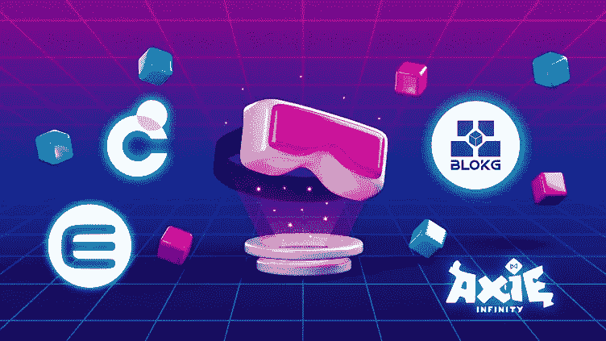

# 区块链博客 24: NFT |元宇宙——技术洞察

> 原文：<https://medium.com/coinmonks/blockchain-blog-24-nft-metaverse-technology-insights-b4154e45635d?source=collection_archive---------7----------------------->

元宇宙金字塔。当我们看元宇宙时，我们可以处理不同的层次。我们首先有基础层，即我们的互联网，然后是基础设施层，它与您的资产所在的区块链协议有关。

基础设施层可以是以太坊区块链、索拉纳区块链、多边形等等。这是允许 Web 3.0 存在的一层。基础设施层基本上是 Web 3.0 的基础层。然后是内容/游戏层。许多这些元诗句或游戏都有一个游戏内令牌。例如，我们有来自 Axie Infinity 的 AXS，来自沙盒的沙子，来自分散之地的法力。这些是代币，这些游戏或这些元经文用作加密货币来买卖物品，买卖土地，买卖角色和皮肤，等等。和元宇宙内的 NFT。

[Top Metaverse Tokens](https://coinmarketcap.com/alexandria/article/top-metaverse-token)

然后我们有元宇宙层。在许多元经文中，你也可以买卖土地，这些也是生活在区块链的资产。土地层可以是符号化的土地，如沙箱、分散土地、Somnium 等。

NFTs

然后你有单独的 NFT 层，所以你可以有不同的 NFT 来代表不同的东西，可以是衣服，可以是枪，可以是 Axie Infinity 角色，或者类似的东西。然后我们有你，你不是区块链的一部分，但是你是在所有这些金字塔顶端的人。

# **基础设施层**

## 区块链与非功能语法和元经文的关系是什么？

区块链是一个分布式数据库，用于记录一些数据、资产、交易等。所以这是一个分布在许多计算机上的数据库。

不像管理堡垒之夜奥运会的史诗公司堡垒之夜那样有一个集中的数据库，他们有一个集中的数据库，区块链是一个分布式数据库。所以你有这个分布在很多很多人中间的数据库。它具有共识、出处、不变性和最终性等特征。数据不变性是通过用散列函数连接块并与许多节点共享数据来实现的。所以每个区块链都有不变性。您不能更改数据。您只能添加新数据或发送交易。您不能返回并更改已经记录在区块链上的数据。这是区块链的一个美丽之处，它是不变的，你可以追踪事物的起源。

它还使用加密技术对交易和数据进行签名。所以你有所有这些密码术、加密和散列使得区块链非常非常安全。区块链的大部分地区都非常安全。以太坊区块链，比特币区块链都非常安全。

你可能听说过有人因为被黑客攻击而丢失了密码、以太坊或比特币。被黑的不是区块链。区块链不能被黑。被黑客攻击的可能是那个人的电脑或手机，以及他或她的电脑中包含加密货币的钱包受到了损害。

## 什么区块链协议用于 NFTs 和元宇宙？

主要是以太坊网络，但以太坊不是唯一的。90%的 NFT 和游戏都在以太坊上运行，但是以太坊的可扩展性不是很高。所以游戏内的事务发生的非常频繁，如果你想在游戏内部每秒有几千个事务，以太坊并不是一个好的选择。所以一些游戏选择了一种不同的区块链。例如，Polygon 和 Solana 以及其他允许创建智能合同的区块链也可以兼容。你有特佐斯，创，卡尔达诺，EOS，蜡，币安智能链，和其他一些。但很可能在你在这张幻灯片上看到的这些产品中，你拥有 99%的市场份额。由于 NFTs 的采用，现在增长相当多的是 Polygon，Solana，Wax，Cardano，币安智能链。但是以太坊还是排名第一的 90%。

# 内容和元宇宙层

因此，基础架构层将会是以太坊 2.0 或索拉纳或多边形等。这就是 Web 3.0 基础设施。除此之外，您还有元宇宙代币、游戏代币或平台代币。因此，在一些平台中，这些代币被用来推动游戏内的经济，或者推动元宇宙、游戏或平台内的生态系统。

让我们看看**法力**，这是一种分散的货币。你可以用法力在分散地购买土地，在分散地购买非战斗单位，在分散地为你的化身购买衣服。我们有**沙**，沙盒货币，基本上非常类似于分散货币。你可以买土地，你可以买广告，你可以买游戏中的物品。 **AXS** 阿希无穷货币，爱丽丝，我的邻居爱丽丝货币。 **GALA** ，GALA 游戏生态圈。这是一个游戏工作室，正在开发一些游戏，其中一些已经上线，可以玩了。和 **PYR** ，火神伪造货币，这也是一个游戏工作室和游戏发射台为区块链的游戏和发挥赚取游戏。

一些额外的元宇宙代币以及如何在 CoinMarketCap.com 找到这些元宇宙代币。你在这里看到 CoinMarketCap.com 网站，向下滚动，你会发现这里有不同的标签，不同的类别。

有德菲、NFT、元宇宙等等。您可以选择元宇宙来查看与元宇宙相关的令牌。如果您选择非功能性交易，并将 NFT 令牌与元宇宙令牌进行比较，您会发现有很多共同点，许多不同的令牌没有共同点，因为基本上许多元宇宙项目也有非功能性交易

您可以访问以下博客了解更多关于元宇宙图层的信息。

 [## 元宇宙价值链

### 数万亿美元正涌入元宇宙。了解市场是如何构成的，以及它的前景…

medium.com](/building-the-metaverse/the-metaverse-value-chain-afcf9e09e3a7) 

不同的 metaverses，如分散的土地，SomniumSpace，CryptoVoxels，或沙盒，都有你可以拥有的资产。游戏中的资产由 NFTs 表示，你可以把它们带到任何地方。我们在以前的博客中讨论过的艺术形式的资产，土地，和许多非物质财富。

你也可以在分散的土地上租一块地。你也可以举办一个聚会。你可以邀请你的朋友，也可以邀请社区。很多人会看到你的作品。

图形看起来有点不现实，但技术正在进步。你可以做几乎所有你在分散式游戏中做的事情，但是这种游戏的采用并没有像分散式游戏那样广泛。开发人员仍然在开发很多不同的功能来开发角色和其他东西。目前，您使用网络浏览器四处走动，稍后您可以使用您的 VR 耳机。

我们已经可以想象未来元宇宙将成为我们生活的一部分。元宇宙可能看起来非常真实，并在未来 10-20 年成为我们生活的一部分，但至少在短期内，我们可以做一些预测。我们知道技术将继续融入我们的生活。这发生得非常缓慢，元宇宙不会突然出现就像个人电脑和手机一样，它们用了 10 年、20 年、30 年来接管我们的生活。这项技术将继续慢慢融入我们的生活。人机界面将继续变得更高效、更小巧。

> **人机交互** ( **HCI** )是对[计算机技术](https://en.wikipedia.org/wiki/Computing)的设计和使用的研究，重点是人([用户](https://en.wikipedia.org/wiki/User_(computing)))和[计算机](https://en.wikipedia.org/wiki/Computer)之间的[接口](https://en.wikipedia.org/wiki/Interface_(computing))。

沉浸式技术、后来在大脑中植入的芯片以及更多未来技术将给人们带来更多的集成和更多的数字包容。

阅读恩里克·森特耶罗的博客:****元宇宙的四个关键阶段****

# ****流行文化中的元宇宙****

****元宇宙在流行文化中，你可以看一些书里的电影，它们提供了一种他们自己对未来元宇宙的设想。****

*   ****雪灾(书)****
*   ****元宇宙流行文化(上册)****

****点击链接了解更多关于元宇宙的 [**书籍**](/building-the-metaverse/books-about-the-metaverse-b73f033f98f4)****

*   ****就绪玩家一(书和电影)****
*   ****创 1982(电影)****
*   ****创遗产(电影)****
*   ****自由人(电影)****
*   ****瓦力(电影)****
*   ****代理人(电影)****
*   ****黑客帝国(电影系列)****

****点击链接了解更多关于元宇宙的 [**电影**](/building-the-metaverse/movies-about-the-metaverse-a0797323e7f6)点击链接了解更多关于元宇宙的 [**电视节目**](/building-the-metaverse/television-shows-about-the-metaverse-98d91c061a77)****

****在 [**的最后 4 篇博客中，28 篇关于区块链和加密货币的博客**](https://aaklii.medium.com/28days-of-february-blockchain-and-cryptocurrency-research-blogs-4b73c51ce3db) 、我们将回来呈现现实。而且，如果到现在为止，你已经下定决心投资加密货币或 NFT，那么我们将看看我们可以遵循的研究方法。****

## ******更新******

****我保留了其余的博客，因为这个系列的目的是了解区块链技术的核心理念和潜力。我相信元宇宙(Web3 +区块链+ XR)将会改变科技世界的很多事情。无论你是消费者还是创造者，你必须对周围发生的事情有一个基本的了解。如果我的博客以任何方式鼓励你只相信区块链或元宇宙相关的东西，那么我会告诉你自己去探索更多。未来可能与我们现在看到的完全不同。此外，区块链并不是我们未来希望看到的一切的唯一解决方案。所以不要在这里下结论，继续探索。****

*******全系列:*** [28 篇关于区块链和加密货币的博客](https://aaklii.medium.com/28days-of-february-blockchain-and-cryptocurrency-research-blogs-4b73c51ce3db)****

> ****加入 Coinmonks [电报频道](https://t.me/coincodecap)和 [Youtube 频道](https://www.youtube.com/c/coinmonks/videos)了解加密交易和投资****

## ****另外，阅读****

*   ****[非洲最佳密码交易所](https://coincodecap.com/crypto-exchange-africa) | [胡交易所评论](https://coincodecap.com/hoo-exchange-review)****
*   ****[eToro vs robin hood](https://coincodecap.com/etoro-robinhood)|[MoonXBT vs Bybit vs Bityard](https://coincodecap.com/bybit-bityard-moonxbt)****
*   ****[有哪些交易信号？](https://coincodecap.com/trading-signal) | [比特斯坦普 vs 比特币基地](https://coincodecap.com/bitstamp-coinbase)****
*   ****[ProfitFarmers 点评](https://coincodecap.com/profitfarmers-review) | [如何使用 Cornix Trading Bot](https://coincodecap.com/cornix-trading-bot)****
*   ****[如何在势不可挡的域名上购买域名？](https://coincodecap.com/buy-domain-on-unstoppable-domains)****
*   ****[印度的秘密税](https://coincodecap.com/crypto-tax-india) | [altFINS 审查](https://coincodecap.com/altfins-review) | [Prokey 审查](/coinmonks/prokey-review-26611173c13c)****
*   ****[赢取注册奖励——10 大最佳加密平台](https://coincodecap.com/earn-sign-up-bonus)****