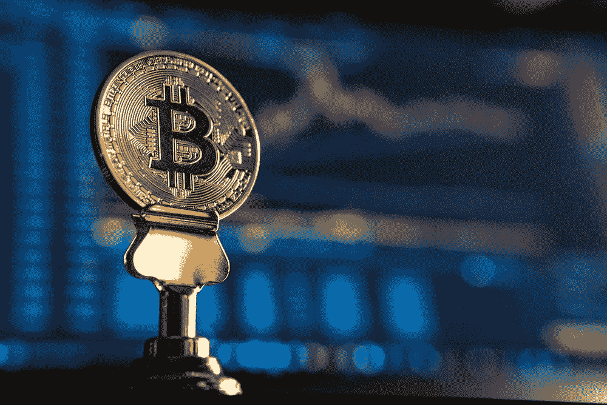

# 10 岁孩子的区块链:比特币，你需要知道的一切

> 原文：<https://medium.com/coinmonks/blockchain-book-101-bitcoin-all-you-need-to-know-f21a7887b18?source=collection_archive---------27----------------------->

Photo by [André François McKenzie](https://unsplash.com/@silverhousehd) on [Unsplash](https://unsplash.com/)

一般来说，比特币被定义为一种不依赖于银行或政府等中央机构的数字货币。与其他数字货币不同，比特币在一个分散的点对点互联网网络上运行，以验证用户之间的交易。

上面的定义对这个题目不够公正。相当多的人仍然从他们习惯的传统金融的角度看待比特币。一些人甚至将比特币视为某种形式的股票或投资选择。事实上，比特币比这些故事切割得更深。

# 什么是比特币，它是如何工作的？用一个相关的现实生活中的例子

作为一个和严厉的父母生活在一起的孩子，大多数人(包括我在内)总是被要求说明他们得到的每一笔钱，并说明这些收入的来源。当时的基本标准是，你必须告诉他们送礼物的人和给你的钱的价值。有时，你会被要求对这笔钱做出解释，并详细说明你是如何花掉这笔钱的。在大多数情况下，这笔钱是从我们这里拿走的，并承诺以后会还给我们。这些承诺大部分都没有兑现，我们对此也无能为力

我们可以承认，虽然你的父母检查你的所有资金似乎没问题，但随着时间的推移，这变得非常令人讨厌。我的意思是，我是一个成年人，我可以从很多地方取钱，我绝对需要我的隐私，没有人窥探我的金融业务。

好吧，你猜怎么着，这正是当前银行系统的样子。我们严厉的父母！为什么想象下面的场景；

假设你去游泳，无意中发现了一件非常罕见的艺术品。你去了一家画廊购买这件艺术品，由于它的独特性，你以 10 万美元的价格卖掉了这件艺术品，并将全部金额存入了你的银行账户。下面列出的是你在银行账户上的一些经历。

1.  您的账户因 [KYC 合规](https://www.thalesgroup.com/en/markets/digital-identity-and-security/banking-payment/issuance/id-verification/know-your-customer#:~:text=KYC%20means%20Know%20Your%20Customer,who%20they%20claim%20to%20be.)被冻结
2.  你可能需要几天甚至几周的时间才能提取这些资金
3.  你必须向银行详细解释这笔钱的来源
4.  某个地方的一些银行家现在知道了你的价值，利用你的 SSN，他们可以通过你的其他银行账户追踪你的价值。

那么，银行和我们父母的区别是什么呢？这是你的钱，你绝对不需要向另一个人解释你是如何赚到你的钱的，只要它不是欺诈性的。

# 比特币的独特之处是什么？

与传统金融不同，比特币不要求你在发送或接收金钱之前泄露任何关于你自己的信息。通过利用[区块链技术，比特币交易是安全的](/coinmonks/blockchain-for-10-year-olds-c2728b94e00e)并且可以被实时监控。

以下是比特币对已知的传统金融系统带来的可能性和好处；

**你的钱包永远不会被封锁或冻结** —与银行电汇不同，比特币交易通常不会被封锁或冻结。无论用户收到或希望发出的比特币的大小或数量，他/她的钱包都将是活跃的，没有人会要求任何 KYC 合规性。

比特币是以这样一种方式建立的，即没有中央权力机构或机构来检查其交易。进行比特币交易不需要任何形式的 KYC 合规。

这本身既是福也是祸。这是一个诅咒，因为不像你的普通银行账户，如果你的账户被黑，你可以要求冻结你的账户，停止交易。如果你丢失了你的私人钥匙，你的比特币钱包被黑了，没有什么能阻止小偷获取你所有的资金并进行交易。

**比特币交易速度更快**——与普通银行交易(尤其是跨境支付)不同，比特币交易几乎是即时的，因为参与各方的验证可能需要数天甚至数周才能完成。

比特币让支付变得又快又容易。假设你把找到的艺术品卖给了美国的一家网店，而你住在非洲，在完成交易协议后，你可以在同一天用比特币收到货款。传统的金融系统并非如此，因为大多数国外转账需要一到四个工作日才能完成。

**没有中央权威** —比特币由[区块链技术提供支持，区块链技术是一种去中心化的分类账，以不变的方式记录交易](/coinmonks/blockchain-for-10-year-olds-c2728b94e00e)，并将它们分布在遍布世界各地的不同计算机节点上。

这意味着没有特定的机构/团体/组织负责比特币及其交易。交易记录公开保存在区块链上，供所有人查看，在节点能够解决一系列复杂方程后，交易会自动获得批准。

无论你的钱包里有多少 BTC，没有人会打电话问你任何问题，没有机构会试图知道你的资金来源或你是如何获得 BTC 的。

这也有其不利之处，因为不良行为者现在已经求助于比特币来进行非法金融交易和洗钱。

**比特币保证 100%隐私**——与常规金融系统不同，获得一个比特币钱包不需要你的姓名、电话号码、家庭住址、SSN 或任何类型的个人信息。你不需要附上自己的照片或任何其他可以直接将你的比特币钱包与你联系起来的细节。

您只需下载一个非保管钱包，安全保存您的私钥，然后开始交易。

所提供的不是普通的账号，而是一个唯一的钱包 id，它不能被追踪到你或任何其他实体。这样，没人能知道你的净资产或跟踪你钱包里的资产。你可以拥有多个比特币钱包，轻松地在不同的钱包之间发送比特币，没有任何限制。

**没有第三方介入**——由于比特币使用区块链技术的 P2P 模式，交易之间没有干扰。

使用传统金融系统进行交易时，需要信任第三方；银行，真诚地处理您的交易。[在进行金融交易时信任第三方会带来一些风险](https://due.com/blog/know-risks-working-third-party-payment-processors/)欺诈、滥用和缺乏安全性。

点对点(P2P)包括在个体参与者之间直接交换任何物品，例如虚拟货币，而不需要中央机构的帮助。比特币是最常用的加密货币，其主要目的是严格的点对点金融交易。

比特币 P2P 模式保证交易是端到端加密的。向另一个用户发送比特币不需要第三方的干预，因为钱包都是建立在区块链上的，这样的交易是直接从钱包到钱包处理的。

**对银行倒闭相关风险的免疫力** —当一家银行无法履行其对储户和其他利益相关者的责任时，它被视为“倒闭银行”，并被某个地理位置内负责此类情况的监管机构关闭。

大多数利益相关者都没有意识到这一点，因为银行的分类账是保密的，因此，客户不知道银行何时因不良投资而出现亏损。

与银行不同，比特币账户是公开的，因此任何人都可以随时查看。不可能有投资失误或银行倒闭的情况，因为你钱包里的钱 100%归你所有和支配。

# 最后的想法

比特币引发的技术突破预示着一个非常光明的未来。尽管比特币预示着光明的未来，但让人们了解比特币是什么以及它是如何工作的非常重要。为此，本文以尽可能简单的方式撰写。像这样的问题；比特币是什么？比特币是如何运作的？以及其他相关问题在本文中已经尽可能简单的回答了。

> 如果你还有任何问题，请留言，或者在推特([*@ lanre _ aderemi*](http://twitter.com/lanre_aderemi)*)上直接给我留言，我会尽快回复。感谢您的阅读，如果您能为我鼓掌，那就太好了！*

不要忘了点击关注按钮来阅读更多像这样的故事；-)

> *加入 Coinmonks* [*电报频道*](https://t.me/coincodecap) *和* [*Youtube 频道*](https://www.youtube.com/c/coinmonks/videos) *了解加密交易和投资*

# 另外，阅读

*   [Bookmap 评论](https://coincodecap.com/bookmap-review-2021-best-trading-software) | [美国 5 大最佳加密交易所](https://coincodecap.com/crypto-exchange-usa)
*   最佳加密[硬件钱包](/coinmonks/hardware-wallets-dfa1211730c6) | [Bitbns 评论](/coinmonks/bitbns-review-38256a07e161)
*   [新加坡十大最佳加密交易所](https://coincodecap.com/crypto-exchange-in-singapore) | [购买 AXS](https://coincodecap.com/buy-axs-token)
*   [红狗赌场评论](https://coincodecap.com/red-dog-casino-review) | [Swyftx 评论](https://coincodecap.com/swyftx-review) | [CoinGate 评论](https://coincodecap.com/coingate-review)
*   [投资印度的最佳密码](https://coincodecap.com/best-crypto-to-invest-in-india-in-2021)|[WazirX P2P](https://coincodecap.com/wazirx-p2p)|[Hi Dollar Review](https://coincodecap.com/hi-dollar-review)
*   [加拿大最好的加密交易机器人](https://coincodecap.com/5-best-crypto-trading-bots-in-canada) | [库币评论](https://coincodecap.com/kucoin-review)