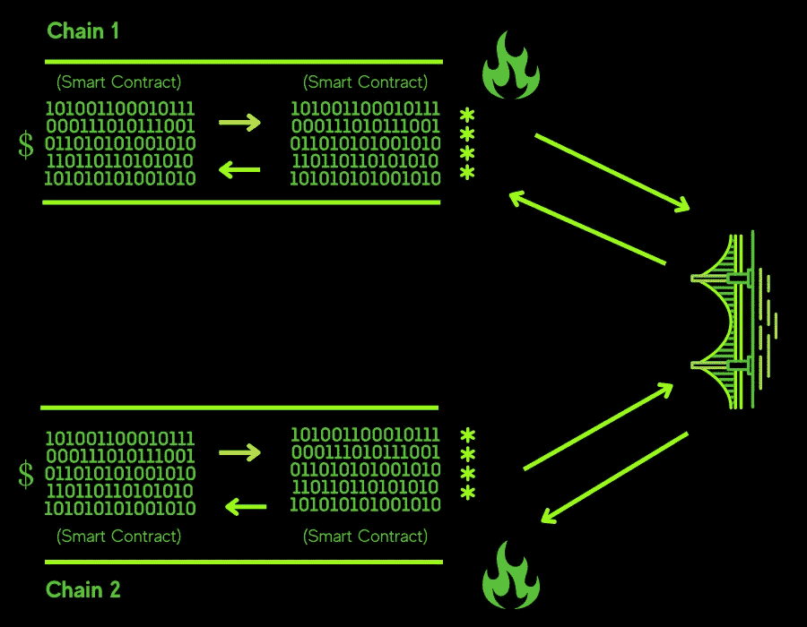

# 区块链桥梁:扩展分散金融和进入多链未来之路

> 原文：<https://medium.com/coinmonks/blockchain-bridges-the-road-to-scaling-decentralized-finance-and-entering-a-multi-chain-future-cac6b8fdca75?source=collection_archive---------39----------------------->

想象一下，你终于利用你的 14 天带薪休假和你的家人去巴哈马度假了。

如果你和我一样，一想到你脚上柔软的沙子，溅到你腿上的凉爽的淡水，以及温暖的阳光照射在你身上，你就会兴奋不已，你的家人会争先恐后地尽快到达热带岛屿。经过几乎半天的旅行，你走出机场，是时候开始放松了。然而，路上的一个小障碍是，要支付食物、饮料、纪念品和其他物品，你必须将你的美元兑换成当地的巴哈马元。简单。你去当地的外币兑换处，取出现金，让乐于助人的客户服务代表进行转账或使用他们的自动取款机。现在你有了本国货币，可以尽情地花钱了。

我想让你采取这种确切的情况，并作出一些虚构的调整。假设你决定在未来的某个时刻进行这次旅行。加密货币至高无上，分散化金融正在世界各地被采用，埃隆·马斯克是美国总统。最后，巴哈马政府要求该国经济按照索拉纳·区块链体系运行。但是，您目前将以太坊资金存储在 MetaMask 加密钱包和以太坊区块链中，但想用您的钱在巴哈马购买食物、饮料和纪念品。

但是你要记住，区块链是一个自给自足的社区。它们被创造出来，是为了比银行或交易所等系统更加孤立。为了在以太坊区块链内进行交易，共享账本需要遵循网络协议，因为区块链内的安全性将只允许相应操作的用户进行操作。网络只需要基于已经存在的分类账中的数据的共识。你现在应该如何转移你的资金？你辛辛苦苦得到的数字资产在这个国家似乎毫无用处，因为以太坊和索拉纳区块链使用不同的网络规则，无法相互通信。伙计，那时候事情简单多了。

说了这么多，我想介绍区块链·布里奇斯。

现在，在我们深入探索区块链十字桥之前，让我们定义一些术语，并了解这些桥存在的原因，以理解区块链社区正在努力实现的总体进步。

我们的目标是扩大分散融资(Defi)的规模，分散融资本质上是区块链公共部门提供的许多金融服务的一个非常小的术语。有了 Defi，银行、交易所或其他第三方通常开展的大多数服务都可以在没有它们的情况下完成，例如交易衍生品、赚取利息、交换资产等等。此外，智能合约、不可替代代币(NFT)和加密货币可以在区块链自由漫游，这让我得出以下结论:去中心化金融是未来；它透明、快速、灵活，没有相关成本，并且只需要您创建一个钱包。给人民更多的权力和公平的金融市场！

让我们从定义区块链桥开始。区块链桥或交叉链桥本质上是一组允许区块链连接的代码，这样用户就可以在它们之间发送数据。该技术试图解决缺乏互操作性的主要问题，因为区块链在某种意义上被设计为隔离的，以增加额外的安全性和可靠性。桥梁创造了数字衍生资产，试图展示自己是来自当前区块链的资产，但实际上是来自另一个区块链。如果一开始这没有意义，我不怪你。

让我们想象一个假想的场景。你生活在这样一个世界里，在一个叫瑞尔威的大都市里，一个半球由像面包一样的生物组成，而在林克斯城，另一半看起来像香肠。一个来自林克斯城的生物想要去瑞尔威，但是没有办法进入，因为他们不符合瑞尔威的规定，而且他们看起来不像面包。有什么解决办法？他们进入一台机器，这台机器会把他们变成一只裹着毯子的猪。机器拿一些面包，把它裹在香肠生物身上，让它毫无问题地进入城市。

类似于面包和香肠的例子，如果你想把一些茄汁转移到以太坊区块链，桥将把茄汁包装在一些代码中，把它变成一个包装的资产，以便它将与目标区块链兼容，在这个例子中，以太坊。

让我们回到我之前提到的术语“数字衍生品”。本质上，桥创建了与您正在使用的当前区块链兼容的资产版本，并且与原始资产价值相同。它们存在的最大原因是击中了互操作性的问题，这反过来导致加密货币、数据资产和区块链都能够协同工作，不管它们是如何创建的，它们原本应该在哪里工作。一般来说，使用包装资产有一些好处，其中之一就是跨各种区块链的交易总容量增加了。随着越来越多的用户开始探索不同的区块链，他们开始购买更多的包装资产来帮助他们的旅程，因为在某些区块链使用特定的加密货币行不通。这类似于当社会的其余部分在各自的国家使用菲亚特时，用棒棒糖来支付资产。它不起作用。然而，如果你拿起棒棒糖，“包装”它，然后产生一个算法来展示它与社会使用的菲亚特具有相同的价值，那么你就可以使用这个棒棒糖。除了增加交易能力，打包资产还有助于增加分散交易所或其他区块链中资产的整体流动性。你可以包装你的资产在不同的区块链上使用，但是它的起源将会保留在你开始铸造过程的区块链上。

为了从技术角度更好地了解该过程是如何工作的，我们可以从两个方面来讨论它。让我们从一个版本开始，当涉及到某些基金时，如果有人在网上偶然发现了区块链桥，他将如何处理互换。假设您想要将一些 USDC 从多边形链转移到币安智能链(BSC)。您首先要确保您的钱包上有 BSC 和 Polygon 远程过程调用(用户与区块链连接的协议),为简单起见，假设您使用元掩码。在 wallet 本身上，确保您选择了正确的网络，因此在多边形到 BSC 的情况下，您将需要使用多边形网络。然后，你可以登录到一个网桥，例如 [Connext](https://www.connext.network) ，选择你想要连接的两个网络，然后选择 USDC。然后，您可以点击按钮，要求进行交易，并确认正确的资金被发送到正确的网络。一旦交换完成，把你钱包里的网络切换到 BSC，你应该有你的资产被转移。恭喜你，你做到了！

然而，对于那些想要稍微更技术性的解释的人，我会尽力而为。我在下面提供并创建了一个简单的图表，希望对你有用。让我们再次说，你想把一些 USDC 从多边形链转移到币安智能链(BSC)。我们称之为多边形链 1 和 BSC 链 2。位于智能合约正前方的是美钞标志，代表您试图发送到连接的区块链的 USDC。智能合约只是区块链上的程序，当满足正确的条件时执行，在这种情况下，当桥包装或烧毁适当的资产时执行。在链 1 上，一个跨链桥为用户创建一个主地址来存放他们的资金。然后链执行它的功能，包装那些资产，然后根据链 2 的需求铸造它们。但是，如果用户想要取回这些资金，包装的资产将被发送到链 1 上的一个地址，连接链 1 和链 2 的桥将烧掉包装的资产，并且桥将原始资产释放回链 1。任一侧显示的火意在显示正在燃烧资产的桥，以及它正在做什么来允许资产在两个链之间移动。网桥使用的各种协议允许在没有任何第三方帮助的情况下进行数字资产交换。

Hope this helps!

区块链使用的包装机制是如何工作的，在这个场景中燃烧意味着什么？当桥包装一个资产时，它正在铸造同一个资产的新版本，以满足另一个链的需求。桥接会锁定您的原始资产，资产的另一个版本可以在您尝试连接的另一个链中自由漫游。然而，当新资产的工作已经完成时，所有者想要回他们的原始资产，并且采用了一种协议，该协议将烧毁或消除新资产，并再次用您的原始资产替换它。为了确保资金安全，一些桥梁使用多签名钱包来确保您使用的资金安全。描述这些钱包如何运作的最佳方式是一扇有多把钥匙的门。钱包需要多把钥匙才能打开，通常大多数钥匙都是为了打开钱包。

需要记住的一点是，当您的原始资产被打包时，您暂时不再拥有它，因为它被锁定了，并且您当前拥有的资产与您的原始资产相似，但根据它试图进入的区块链进行操作，并且它还可以用于赎回您的原始资产。假设，如果许多个人要燃烧某些类似的资产，它可能会导致在其他区块链包装资产的价值损失。如果这种情况发生，那么由于资产价值的非理性本质，市场增长和不同链之间包装的流动性可能会停止。许多资产的燃烧方面可以被确定为在桥内发生的资产价值故障，破坏了包装资产的当前价值。

为了更深入地了解区块链网桥，有不同类型的网桥以其独特的方式通过协议传输信息。第一种是单向网桥，它只允许单向交换。正如所料，还有双向网桥，允许在两个不同的区块链之间双向交换。一些桥如何操作还有另一个方面，即谁控制允许桥铸造其新包装资产所需的代码。第一种类型是可信桥梁，其中一个组织拥有资产，他们负责所有的操作，而用户也必须在此过程中失去对其资金的控制。另一种类型的桥是无信任桥或分散桥，它在区块链上工作，使用智能合同，同时也让用户可以完全控制他们的资金。此外，从操作上来说，桥上的安全机制是根据资金往来的区块链来运作的。

让我们用更简单的现实生活中的例子来打破这些桥梁，以了解它们是如何工作的。让我们假设你在塔吉特百货公司，正在为感恩节晚餐采购一些食品杂货。您已经选择了所有物品，现在是付款的时候了，这样您就可以带着您选择的所有物品离开场所。你可以通过两种方式付款，依靠收银员或自助结账。

让我们选择第一个选项。你走向收银台，发现这个人几乎在工作时间睡觉，他们似乎不太在乎自己的角色。他们刷你所有的食材，给你收据，然而，一旦你到家，你注意到收银员不小心刷了你的一件物品两次，对你没有购买的物品收取额外的钱。这个例子是为了演示可信桥梁的模型，因为你依赖第三方来有效地操作和正确地处理你的财务。从理论上讲，这个系统应该在大部分时间都有效，但是，它很容易出错，发生事故，或者有时被黑客攻击，因为你不能完全控制你的财务。

现在让我们试试另一个选项。你走进自助结账机，扫描你的物品。你回到家发现你多花了一点时间错误地扫描了你的一件物品，并且花了你自己一些额外的钱。这另一个例子是为了显示不可信的桥梁模型，因为技术本身控制着你的财务，没有另一方处理你的钱。这一次，即使你犯了错误，技术也采取了适当的行动，你在整个过程中都控制着你的数据，而不需要依赖任何人。

老实说，虽然在这两种情况下，你应该在离开商店之前检查你的收据，但这不是重点。

那么，为什么使用区块链桥有意义呢？如前所述，从设计上讲，区块链缺乏互操作性，更加封闭，并有其独特的共识机制，只允许根据区块链自身的具体情况转移数据或资金。然而，有了桥，许多解决方案和好处可以被释放出来，包括区块链之间的通信和传输，用户从使用更便宜或更快的链中获得好处，新的平台和桥被构建以允许更高的清晰度，并给予 dapps(分散的应用程序，通常通过智能合同在像区块链这样的系统上运行)访问更多区块链的能力。此外，通过使用桥梁降低交易费用是可能的，包括其他区块链上的 dapps 因此更易航行。总的来说，要实现的主要目标是 Defi 现在可以扩展，因为人们可以以更低的交易费用进入更多的市场，并可以从不同的区块链转移资金。所以区块链大桥不会倒塌，对吗？对不对…？

不完全是。区块链桥修复了区块链之间的通信和传输问题；然而，要记住的概念是，出于安全目的，区块链被设计为隔离的，因为不再需要中间人，如银行或交易所。对于桥，更多的安全问题出现了，因为这些区块链上的分类帐是不一样的，并且为那些特定的区块链建立的共识机制不再有用。这些桥允许资金或信息的转移，其新铸造的包装资产与通常在特定区块链操作的传统代币或代码略有不同。

就其技术首次亮相而言，区块链交叉桥非常早，需要更多的案例研究和改进才能在当前市场中正常工作。目前有太多的错误空间，因为可能有过多的问题，包括可能是恶意的代码，系统中可能导致资金丢失或被盗的错误，以及可信桥中的人为错误。特别是对于受信任的网桥，运营商本身可能怀有恶意，窃取资金或用错误代码破坏网桥序列。黑客更容易实施攻击，而这些问题很难修补，因为区块链依赖于它们自己的机制和节点来安全地运行，这在实施桥接时会被破坏。总的来说，当网桥连接两个链时，网络面积会增加，因为网桥连接两个区块链，它们都具有不同的安全机制。

尽管许多跨链桥梁目前存在潜在问题，但正在采取措施加强安全，确保整个区块链的资金安全。进入多链系统。多重链和交叉链的区别仅仅在于，自定义区块链是在当前区块链的基础上添加的，类似于第二层，我很快就会讲到。这些较小的自定义区块链用于增加安全性，并使传输更加安全，因为所有的共识机制都根据自定义区块链来操作。正在开发这些概念，以便用户不必依赖任何第三方运营商来处理他们的数据，同时也不必担心跨链桥接问题。

对于那些不确定桥梁安全方面的人来说，一些桥梁可以看看，包括[宇宙](https://blog.cosmos.network)、[波尔卡多特](https://polkadot.network)、 [Voltswap](https://voltswap.finance/#/swap) 和[轨道桥](https://bridge.orbitchain.io)。Cosmos 和 Polkadot 是更多的多链网桥模型，而 Voltswap 和 Orbit 网桥更接近于传统的交叉链网桥。所有这些都经过验证，连接不同的区块链，并通过规模化和 dapp 可操作性关注 Defi 市场的安全性和资本化。就目前该领域最大的桥梁而言，对于以太坊来说，它必须是[雪崩](https://bridge.avax.network/login)，对于索拉纳来说，它必须是 [Ren VM 桥](https://renproject.io/)，总的来说，最大的桥梁将是[包装的比特币](https://bridge.umbria.network/bridge/ethereum-polygon/wbtc)，其中创造并锁定了价值约[70 亿](/coinmonks/wrapped-bitcoin-the-bridge-to-decentralised-finance-e5b293742d77)美元的包装资产。

根据德勤[在 2019 年进行的一项调查显示，许多企业和市场正在试图将区块链应用到他们的运营中，因此有必要能够与其他区块链和服务进行沟通。跨链桥梁和多链模型对于数字市场的未来和整个去中心化金融的未来至关重要。对这些服务的投资正在增加，采用方法正在接受测试，以在金融的其他方面(如技术、医疗保健、能源等)转变和创建更多用例。根据这项研究，](https://www2.deloitte.com/us/en/pages/about-deloitte/articles/press-releases/as-adoption-continues-to-rise-companies-race-to-unlock-practical-applications-of-blockchain-technology.html)[德勤](https://www2.deloitte.com/us/en/pages/about-deloitte/articles/press-releases/as-adoption-continues-to-rise-companies-race-to-unlock-practical-applications-of-blockchain-technology.html)发现，40%的高管愿意在未来一年内向不同的区块链应用程序投资至少 500 万美元或更多，注意，这项研究是在 2019 年完成的。

另一个需要考虑的问题是，与其他现有协议或技术(如第 2 层框架)相比，为什么跨链网桥是扩展区块链的更好解决方案。作为参考，第 2 层只是指建立在现有区块链网络之上的附加协议，有助于提高交易速度和解决典型区块链当前面临的其他互操作性问题。关于第 2 层，需要注意的一个有趣的因素是，它们并没有从根本上改变嵌入其中的实际区块链，而是在第 2 层而不是第 1 层(主要的区块链)中单独发生数据事务。这样，主区块链现在可以将其工作委托给第 2 层，同时专注于其他可操作的项目，如安全性或节点结构。但是这个解决方案比交叉链桥更好吗？不完全是，简单来说，它没有解决手头的问题。跨链网桥试图解决互操作性的问题，同时添加第 2 层，甚至在某些情况下添加第 3 层，现在这些网桥独立工作，可以支持第 1 层区块链，但无助于链之间的通信。尽管跨链解决方案目前存在一些问题，但修复加密治理算法和通过桥梁进行交易授权的持续性正在得到改善和深入研究。最终，增加多层链的趋势使用桥接技术与其他区块链通信，这一趋势正由许多集中的团体独立进行，然而，目前他们解决不同的问题。

努力实现所有功能和合法区块链之间的资产的完全互操作性，同时保证我们当前市场中潜在的数十亿美元的完全信任转移是非常遥远的，但未来比大多数人认为的更快接近。人们喜欢更自由和完全控制自己资产的想法，只是因为人们相信个人理财，而不是让银行或交易所运营。很快，区块链实体银行中的银行抢劫和黑客攻击的日子将会结束，全面的安全、不同区块链之间的通信和数字市场增长将会繁荣，这一切都是为了建立通往那里的桥梁…

> *加入 Coinmonks* [*电报频道*](https://t.me/coincodecap) *和* [*Youtube 频道*](https://www.youtube.com/c/coinmonks/videos) *了解加密交易和投资*

# 另外，阅读

*   [有哪些交易信号？](https://coincodecap.com/trading-signal) | [Bitstamp vs 比特币基地](https://coincodecap.com/bitstamp-coinbase) | [买索拉纳](https://coincodecap.com/buy-solana)
*   [ProfitFarmers 回顾](https://coincodecap.com/profitfarmers-review) | [如何使用 Cornix 交易机器人](https://coincodecap.com/cornix-trading-bot)
*   [西班牙 5 大最佳文案交易平台](https://coincodecap.com/copy-trading-spain)
*   [Pionex 双重投资](https://coincodecap.com/pionex-dual-investment) | [AdvCash 审查](https://coincodecap.com/advcash-review) | [支持审查](https://coincodecap.com/uphold-review)
*   [面向开发者的 8 个最佳加密货币 API](https://coincodecap.com/best-cryptocurrency-apis)
*   [十大最佳加密货币博客](https://coincodecap.com/best-cryptocurrency-blogs) | [YouHodler 评论](https://coincodecap.com/youhodler-review)