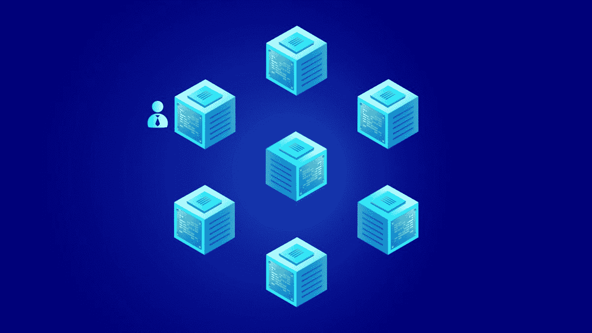
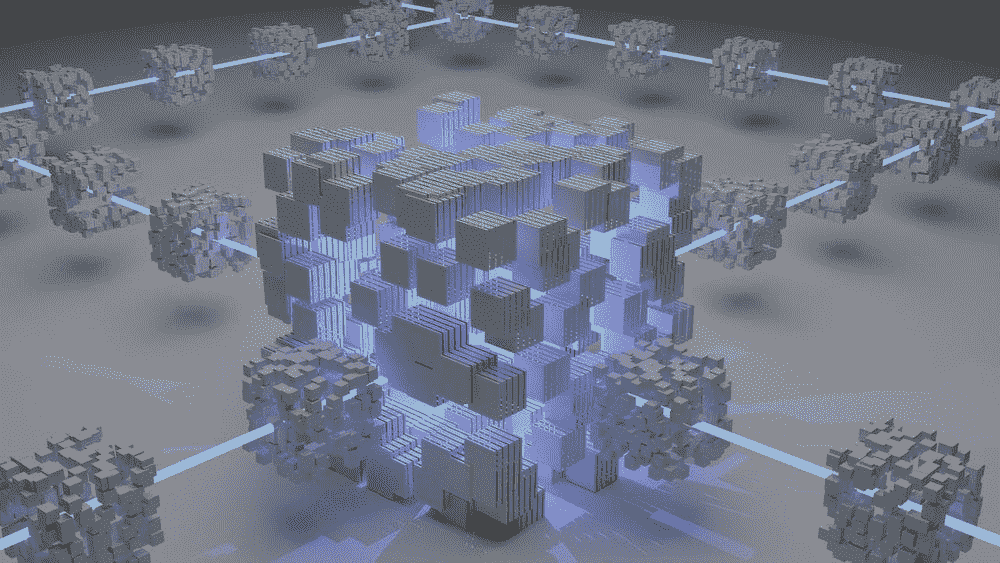

# 区块链基础知识

> 原文：<https://medium.com/coinmonks/blockchain-coding-basics-6b2e3d97c22d?source=collection_archive---------64----------------------->

# 什么是区块链？

如果你一直生活在岩石下，你可能没有听说过**区块链……**

即使区块链理工大学进行了数千小时的研究和实际编码，准确定义区块链可能是一项艰巨的任务。我们希望在今天的博客、播客和 YT 视频中给你“巴尼风格”的区块链和编码的概要。

区块链是一组相互连接的设备(服务器)组成的网络，它们作为一个生态系统协同工作，以可靠、安全的方式处理信息。

目前有许多不同的区块链，每一个都有一些独特之处，与其他区块链相比。

例如，我们可能希望使用币安区块链来发送和接收交易，因为与在以太网上进行相同的交易相比，费用要低得多，而且交易进行得更快。

在我们的上一篇文章“ [Crypto 101: A 初学者指南](/coinmonks/crypto-101-a-beginners-guide-345d440bd163)”中，我们讨论了比特币(它有自己的区块链)如何像数字黄金，嗯，以太坊可以被认为是数字白银。

以太坊，或以太网的一些分支，是大多数利用密码进行交易的主要货币来源。大多数区块链是以太坊主网的“分支”,因此与以太坊主网兼容，使得从以太坊区块链到币安区块链的交易变得相当容易。

**顶级区块链:** - [以太坊](https://ethereum.org/en/)
- [币安](https://www.binance.com/en)
- [索拉纳](https://solana.com/)
- [雪崩](https://www.avax.network/)
- [多边形](https://polygon.technology/)

*其他新兴市场可能包括:*
- [卡达诺](https://cardano.org/)
- [阿尔格兰德](https://www.algorand.com/)
- [埃尔隆德黄金](https://elrond.com/)

如前所述，每个区块链通常都有不同于下一个区块链的东西，这赋予了它独特的销售主张。

这些公开交易的区块链很酷的一点是，你可以立即尝试所有这些产品，几乎没有任何风险。当然，使用任何公开交易的主要区块链都会有一些风险，如上所述。

你可能开始着手你的第一个区块链，以太坊**区块链，很可能利用 EVM(以太坊虚拟机)。你可以围绕[**元掩码**](https://metamask.io/) 或 [**幻影**](https://phantom.app/) 为 [**索拉纳**](https://solana.com/) 网络工作。**

**每个区块链都会给你一个属于他们区块链(网络)的特别钱包。您将接收和发送所有传输到我们的环境的加密进出这个钱包。它就像你的数字身份，所有的交易都会被监控和记录。通常看起来像 0xB5gu6…**

**你可以从比特币基地 T21 开始，然后转移到币安，然后，随着你对区块链的运作方式越来越了解，你可以扩展到其他区块链，看看他们在较小的网络中有什么样的特殊项目，如果我现在加入，这些项目可能会有回报？**

**如果你是区块链的开发者，你基本上也是 web2 的开发者……但是如果你在以太坊环境下写作，你应该听说过**

****这是我们用来为以太网编写程序和开发环境的语言。****

****它与现有的语言如 JavaScript (~75% ) React(前端)齐头并进****

****如果你已经了解 Python，那么了解它也是很有价值的。****

****我会写另一篇关于区块链编码的博文，但我们会回到区块链的基础上…****

********

****每个单独的块都在不断旋转，产生新的“哈希 txn ”,整个块网络也在不断旋转，因此如果有人想要进入我们的网络，他们必须用精确的语言与我们交谈，否则我们将无法与这个特定的区块链通信。我们用 Solidity，Javascript，CSS，HTML 等等…****

****我们用这个区块链购买的每一件东西都被记录在一个特定的哈希标记下，并被记录到区块链的历史中，这是公开的，所有人都可以看到。****

****我们钱包里的每一笔交易都会被永远记录在他们的区块链上。****

****区块链，元宇宙，web3，都只是一个不断转动的机器，记录着它自己的历史，就像我们这些开发者写的一样，就像 Neo…****

****这一次，用户可以选择玩那个游戏，或者任何其他游戏，但只是在不同的区块链上。****

****我们来去自由，因为有无限的区块链可以创造，从而为成为最大和最好的区块链创造竞争。****

****如果我们不喜欢一个区块链对待我们的方式，我们有自由和能力把我们在区块链的所有财富转移到另一个区块链，“跳槽”到另一个区块链。****

****永远会有一个更大更好的新区块链被建设起来，继承了区块链在他们之前所取得的成就。****

****如果您对区块链的工作原理仍有疑问，请通过 Twitter 联系我们，我们很乐意帮助您理解🙏🏼****

********

# ****一定要小心！！！****

****我怎么强调都不为过！保持高度警惕，注意你点击的每一个链接，你做的每一笔交易，以及你接触的每一个人，因为骗子在这个空间里比比皆是，最好看的项目都被取消了。****

*****在点击所有链接之前，要再三检查，确保它们是你要找的官方链接。在把任何有价值的东西寄给别人之前，也要仔细检查所有的钱包地址。*****

******跟随我们的加密/NFT/区块链/元宇宙之旅******

****[*推特*](https://twitter.com/TheDudesCrypto)[*不和*](https://discord.gg/Cv8v2Ert8m)[*YouTube*](https://www.youtube.com/channel/UC7pbtSBs9nRJHK6coMhCR8g)[*抖音*](https://www.tiktok.com/@thedudescrypto)[*insta gram*](https://www.instagram.com/thedudescrypto/)[*Spotify 播客*](https://open.spotify.com/episode/5U8vXE9HDAsGbSbebw9p62?si=2rZIigw-Tw2pCxjxmkbYzQ)****

****请将 polygon matic 发送到我的 eth 地址或 eth:
0x b 53b 3978333 e 11 c 382 ab 619 f 02 f 469 A8 c 70750 af****

 ****干杯，公子哥儿们的密码****

********

> ****加入 Coinmonks [电报频道](https://t.me/coincodecap)和 [Youtube 频道](https://www.youtube.com/c/coinmonks/videos)了解加密交易和投资****

# ****另外，阅读****

*   ****如何使用 MetaMask Wallet 获得 KCC 地址？****
*   ****[如何获得自己的。XYZ 领域？](https://coincodecap.com/xyz-domain)****
*   ****[最佳密码交换平台](https://coincodecap.com/best-crypto-swap-platforms) | [最佳密码交易所](https://coincodecap.com/crypto-exchange)****
*   ****[购买比特币印度](/coinmonks/buy-bitcoin-in-india-feb50ddfef94) | [Pionex 评论](/coinmonks/pionex-review-exchange-with-crypto-trading-bot-1e459d0191ea) | [加密交易机器人](/coinmonks/crypto-trading-bot-c2ffce8acb2a)****
*   ****[n rave ZERO Review](/coinmonks/ngrave-zero-review-c465cf8307fc)|[phe MEX Review](/coinmonks/phemex-review-4cfba0b49e28)|[PrimeXBT Review](/coinmonks/primexbt-review-88e0815be858)****
*   ****最佳[区块链分析](https://bitquery.io/blog/best-blockchain-analysis-tools-and-software)工具| [赚比特币](/coinmonks/earn-bitcoin-6e8bd3c592d9)****