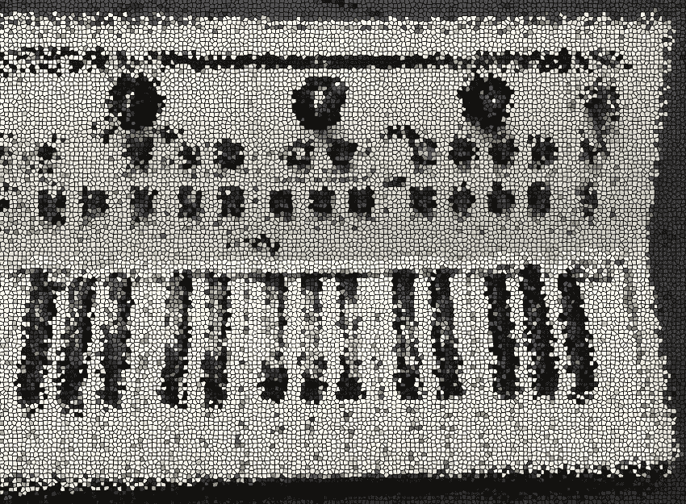

# 区块链、加密、Web3:创意者学习新技术技能的理想空间。

> 原文：<https://medium.com/coinmonks/blockchain-crypto-web3-an-ideal-space-for-creatives-to-learn-new-tech-skills-9eaf2194eca?source=collection_archive---------18----------------------->

作为一名多年来经常站在技术“另一边”的艺术家(意思是软件消费者)，我发现获得更先进的数字技能可以给你更多的选择——即使是在艺术界。

**理解现在**

人们很容易对当前围绕 web3 的狂热不屑一顾，认为这是一种被夸大的异常现象，并不真正值得密切关注。

毕竟，近 20 年来，我们不是一直在用基本的、低维护的、越来越健壮的 web 服务做得很好吗，其中大部分是免费的(当然，如果你不关心数据收集或隐私的话)？

但如果我们作为创意者，从不同的角度——即“1997”心态的角度——来评估当前时刻，我们可能会立即重新评估，以免我们的艺术未来被停滞、缺乏创新和收入下降所定义。

作为一名摄影师、视频艺术家或音乐家，你有多少次希望在底层平台规范中拥有更大的发言权，以更好地展示、分发和构建围绕你的作品的社区？

我们经常告诉自己“就用已经存在的东西——没有必要重新发明轮子。”不可否认，有一些很好的平台(Behance，Patreon，Bandcamp，甚至 YouTube)我们可以用来实现这些目的。

然而，如果你可以梦想出*自己的平台*，拥有分散的版税系统、社区投票、身临其境的虚拟画廊/音乐厅、本地令牌、公平的社交图表、无偏见的分析和分布式共识，会怎么样？

**抓住眼前的机会**

随着区块链协议设计的一些最新发展，这些东西终于在未来的创意中实现了，他们希望更深入地挖掘可能推动下一代网络的实际系统。

例如， [Polkadot](https://polkadot.network/) 和 [Cosmos](https://v1.cosmos.network/sdk) 生态系统都提供了一种模块化的区块链工程方法，通过一些增强的编码知识，您可以实际设计一个独特的区块链来适应您的特定用例，而不依赖于预先配置的、一刀切的方法。

在 Polkadot 自己的 [Substrate](https://substrate.io/) 框架的情况下，围绕认证、账户、令牌、运行时、链上分析和智能合同执行的许多常见协议级需求可以通过预配置的 Rust pallets (Substrate 的 crates 版本)自由组合到您自己的定制解决方案中。

此外，即使是 [Near Protocol](https://near.org/) (由于其易用性和活跃的开发人员社区，无疑是目前艺术家最好的第 1 层智能合同链之一；还在生锈！)，现在正与[八达通网络](https://oct.network/)合作，鼓励设计 dApp 专用的“应用链”

这些专用的第二层“迷你区块链”将允许已经使用 Substrate 的创作者更便宜、更容易、更快速地获得概念链的证明，并直接在 Near 的第一层上运行，而无需考虑通常与 Polkadot 的 [Parachain](https://parachains.info/auctions) 拍卖相关的大量经济和安全因素。

在宇宙方面，[三星最近刚刚与 Ignite(前身为](https://www.samsungnext.com/blog/why-we-invested-in-saga-building-blockchains-with-a-single-click) [Tendermint](https://tendermint.com/) )合作，通过他们的 Saga (Sagan)项目为媒体创作者提供类似的区块链定制方法。这将真正激励那些已经在开发 Go 并希望通过 [Cosmos-SDK](https://v1.cosmos.network/sdk) 模块在平台配置中获得更多灵活性的人，从而在专用于元宇宙应用、区块链流、跨链通信和 NFT 游戏应用的“链件”中实现增强、易于实施的功能。

**大图**

那么，这一切的目的是什么，它与 1997 年有什么关系？好吧，作为一个身在其中、三年后亲眼目睹互联网繁荣与萧条的人，我认为在市场低迷时期，力量的动态仍然是足够流动的，足以在行业的下一次大整合之前允许实质性的创新。

换句话说，现在是钻研、学习编码并开始构建您真正想要看到和使用的东西的最佳时机。

原因是:在下一次“大整合”发生之前，历史上可能不会出现另一个类似的时期，拥有丰富的技术支持、廉价或免费的区块链基础设施、方便的开发人员工具、相当宽松的监管和热情的社区。

当这种整合真的发生时，区块链的格局可能真的很像今天的 web2 主要是大型老牌公司，全球严厉的监管，多数上市公司，付费订阅基础设施，相互冲突的股东利益——没有太多的实验在进行。

如果我们现在可以回顾一下 2001 年至 2010 年间有多少人永远离开了科技行业，我们或许还能知道有多少人后悔没有在游戏中呆得更久，以更好地影响我们未来的网络命运(我们今天生活在其中)。

因为正如我在本文开头提到的，如果你在技术之外，并希望它在 5-10 年内就“烟消云散”,你可能会发现自己越来越无能为力，被甩在后面，即使是在当前的 web2 体制下，你已经是一个公认的艺术家了。

**一个相关的故事来说明**

一个很好的轶事——最近我参观了一个关于索拉纳的虚拟展览。我不确定它是“元宇宙”版的哪个物理空间，但我认为它是香港当代艺术博物馆。在任何情况下，你都可以用光标导航这个空间，并“接近”那些看起来真正像是“在墙上”的作品，超现实的纹理，画廊的灯光等等。

多年来，许多主要的当代画廊都在他们的“虚拟空间”上投入了大量资金，特别是在著名的国际博览会上，如 Frieze 或 ArtBasel，所以我知道这不一定是什么新鲜事。

*的新*是这个特殊的元宇宙空间完全在[索拉纳](https://solana.com/developers)上运行，未来可以整合幻影或索尔弗莱钱包，并直接购买 NFT 版的作品(就在画廊墙上)。你甚至可以与其他头像画廊的顾客实时聊天，为你喜欢的作品/艺术家投票，结交新朋友，在休息室闲逛，提议策划新的展览等。一旦 AR、AI 和游戏的世界与 web3、NFT、tokenomics 和分布式共识相吻合，所有这些互动都将成为可能。

如果你是一个 Rust 程序员，你可能已经知道 Bevy 和类似的游戏引擎今天用于(非元宇宙)2D 和 3D 互动应用。随着 Rust 成为核心智能合约和区块链协议设计语言之一(支持 Solana、Near 和 Polkadot 等)，我们开始将当前的游戏格局与相应的 web3 或混合(传统后端+区块链节点)迭代集成只是时间问题。

除此之外，目前还在进行大规模的跨链集成工作，以实现协议间的桥接(主要是以太坊和其他协议之间的桥接)，以及鼓励整个行业内更大融合和协作的许多努力。

**保持正确的观点**

以上只是众多例子中的一个——我知道我们有很多工作要做(特别是在用户体验/ UI 领域，以及可扩展性方面),以使 web3 成为现实并兑现其承诺。

我也承认，目前许多关于区块链用例误导、糟糕的用户界面和过度营销 crypto 的批评是完全合理的。同样有效的是当前对今天的实质性技术限制的执着——它们确实阻碍和/或威胁了这些梦想在可预见的未来实现功能的可能性(更不用说大规模采用了)。

但是，如果我们退一步，再看看更大的图景，那些主张在这一领域继续投资和创新的人是正确的。与 1997 年相似实际上是一件好事，因为现在是实验方法能够产生真正革命性结果的时候了。

作为一名艺术家/开发人员，我渴望提升技能并学习新的方法来解决分发、支付、身份、权限管理和社交网络的挑战，并与今天“自上而下”的网络格局的有前途的继承者一起前进，我很高兴看到所有这些发展的方向。

所以，让我们停止对所有事情的猜测，回到工作中去。

***提及和引用:***

波尔卡多:

 [## 波尔卡多特网络

### 治理 Polkadot 令牌持有者拥有对协议的完全控制权。所有特权，在其他平台上是…

polkadot.network](https://polkadot.network/) 

基底:

 [## Substrate 使开发人员能够快速、轻松地构建面向未来、针对任何应用进行优化的区块链

### Substrate 使开发人员能够快速轻松地构建面向未来的区块链，并针对任何用例进行优化。作为…

substrate.io](https://substrate.io/) 

近似协议:

 [## 接近协议|重新想象您的世界

### 在 NEARverse 中主张权利的最佳方式是创建一个帐户(钱包)。然后，选择第一步…

near.org](https://near.org/) 

八达通网络:

 [## 章鱼网络——web 3.0 发生的地方

### Octopus 网络的核心是 Octopus Relay——一套在区块链附近运行的智能合约，又名…

华侨城网](https://oct.network/) 

Ignite(以前的 Tendermint):

 [## 嫩薄荷

### 为分布式网络构建最强大的工具。

tendermint.com](https://tendermint.com/) 

Cosmos SDK:

 [## 宇宙网络-区块链互联网

### 可互操作、可扩展的区块链网络。专为开发者打造。

v1 .宇宙网](https://v1.cosmos.network/sdk) 

索拉纳:

 [## 开发者:构建 Solana 的资源和信息

### 加入索拉纳生态系统手册。为建筑者而建。了解与索拉纳相关的高级主题…

solana.com](https://solana.com/developers) 

Rust 资源:

 [## 锈

### Rust 速度惊人，内存效率高:没有运行时或垃圾收集器，它可以支持关键性能…

www.rust-lang.org](https://www.rust-lang.org/) 

感谢您的阅读，下次再见！

— Panasthetik。

> 加入 Coinmonks [电报频道](https://t.me/coincodecap)和 [Youtube 频道](https://www.youtube.com/c/coinmonks/videos)了解加密交易和投资

# 另外，阅读

*   [印度最佳 P2P 加密交易所](https://coincodecap.com/p2p-crypto-exchanges-in-india) | [柴犬钱包](https://coincodecap.com/baby-shiba-inu-wallets)
*   [8 大加密联盟项目](https://coincodecap.com/crypto-affiliate-programs) | [eToro vs 比特币基地](https://coincodecap.com/etoro-vs-coinbase)
*   [最佳以太坊钱包](https://coincodecap.com/best-ethereum-wallets) | [电报上的加密货币机器人](https://coincodecap.com/telegram-crypto-bots)
*   [交易杠杆代币的最佳交易所](https://coincodecap.com/leveraged-token-exchanges) | [购买 Floki](https://coincodecap.com/buy-floki-inu-token)
*   [3Commas 诉 Pionex 诉 crypto hopper](https://coincodecap.com/3commas-vs-pionex-vs-cryptohopper)|[Bingbon Review](https://coincodecap.com/bingbon-review)
*   [加密复制交易平台](/coinmonks/top-10-crypto-copy-trading-platforms-for-beginners-d0c37c7d698c) | [如何在 WazirX 上购买比特币](/coinmonks/buy-bitcoin-on-wazirx-2d12b7989af1)