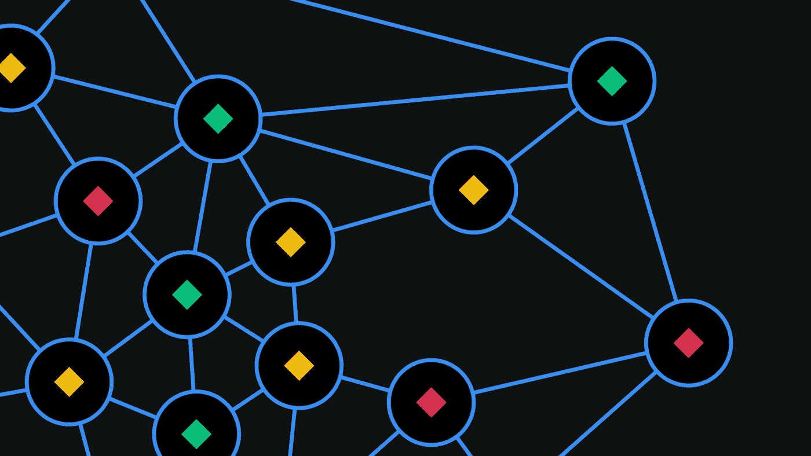

# 区块链道:是什么？

> 原文：<https://medium.com/coinmonks/blockchain-dao-what-is-it-4281e38d5205?source=collection_archive---------35----------------------->

[**Visual Representation of a DAO**](https://www.google.com/url?sa=i&url=https%3A%2F%2Facademy.binance.com%2Fen%2Farticles%2Fdecentralized-autonomous-organizations-daos-explained&psig=AOvVaw208pweTcz9Mo7NRKIo-YKJ&ust=1647497853295000&source=images&cd=vfe&ved=0CAsQjRxqFwoTCPjyl_v9yfYCFQAAAAAdAAAAABAD)

随着技术在我们的日常生活中变得越来越重要，我们不断被公司创造新软件和数字平台或创造像元宇宙这样的全新数字世界的例子轰炸。这些进步令人兴奋，为技术人员和非技术人员沉浸在技术世界铺平了道路。如果您对区块链、加密货币或 DeFi 感兴趣，那么您可能会经常遇到一些名称中带有“道”的项目或组织。本文旨在分解什么是道，并提供关于它的使用的相关信息。

# 关键信息

*   道的定义及其工作原理
*   道成员资格
*   刀的用途
*   道需要
*   现有 Dao

# 这是什么？

一个**分散的自治组织**，或 DAO，是一个使用区块链技术通过代码运行的组织或项目。Dao 不是由董事会成员、委员会和其他高管管理，而是由他们的社区集体拥有和管理。Dao 是基于网络的企业，由所有成员所有，而不是一个集中的层级结构。

Dao 是开源的，建立在不同的区块链网络上，这使得它们完全透明。任何拥有计算机并能访问互联网的人都可以查看构建和维护 DAO 的代码。

Dao 使用智能合约运行，智能合约是一种代码，只要满足一组标准，就会自动执行。智能合约建立了道的规则和条例，并持有其金库。一旦合同在区块链网络上生效，除非社区成员投票同意，否则没有人可以更改。

# 道成员资格

DAO 有不同的成员模型，这些模型会影响 DAO 的关键方面，包括投票的工作方式。两种主要的会员制模式是 [**代币制和**](https://ethereum.org/en/dao/) 。

在基于令牌的成员资格中，持有由 DAO 创建的令牌可以让用户进行投票。用户拥有的令牌越多，他们拥有的投票权就越多。用户可以利用他们在组织中的利益，通过决定或创建新的治理提案来影响组织的运作方式。

在股份会员制中，潜在成员提交加入"道"组织的申请。作为成员资格的交换，潜在客户以令牌或作品的形式向 DAO 提供一些价值。与代币类似，股票代表投票权和所有权。

# 道在现实世界中的应用

Dao 的工作不需要分层管理，并且有广泛的用途。根据 [**以太坊社区**](https://ethereum.org/en/dao/) 的说法，慈善机构可以使用 DAOs 在全球范围内接受会员和捐款，同时允许会员投票决定所赚的钱将如何使用。自由职业承包商可以使用 DAO 将他们的资金集中在一起，使他们能够将它用于多种目的，例如支付软件订阅费或资助办公空间。有人可以创建一个风险基金，汇集投资资本并投票支持风险企业。

Dao 的一些其他用例包括付费即服务。你可以用组织 [**Slock.it**](https://blog.slock.it/) 作为指路明灯。这个 DAO 将区块链与物联网(IoT)结合起来，创建了一个通用的共享网络，这是一种安全和分散的方式，供租户和所有者支付和访问任何被租用的东西。Dao 一般为众筹 [**首发币(ico)**](https://www.investopedia.com/terms/i/initial-coin-offering-ico.asp)。这个想法是，一家公司提供代币来换取资金。DAOs 也可以应用于治理的几乎每个方面。从理论上讲，成员国可以在完全透明的情况下对政府提出的新政策或法律进行投票。提案可以由该国人民提交并投票表决。可能性是无限的。

# 一把刀需要什么？

Dao 是组织由相同使命驱动的事业或社区的有用方式。Dao 允许志同道合的人通过使用 [**不可信技术**](https://academy.binance.com/en/articles/how-to-create-a-dao) 走到一起并组织起来。一把刀需要的五个关键要素包括:

*   **目的** —刀需要一个使命来驱动它的使用。
*   **社区** —社区支持、促进和建议推动 DAO 成功的变化。
*   **投票机制** —这是成员与 DAO 互动并提出修改建议的主要方式。
*   **治理令牌/共享系统** —令牌非常常见，令牌通常也可能是实用令牌。a 股系统在基金中更常见，用户将加密货币存入 DAO 进行投资。
*   **国库** —控制如何管理道收取的资金

# 现有 Dao

*   [**Aragon DAO**](https://aragon.org/) —一个提供在以太坊区块链上运行 DAO 所需功能的组织。
*   [**破折号**](https://www.dash.org/)——由用户管理的开源 altcoin，名为“masternodes”。
*   [**IBC 刀**](https://www.ibcdao.xyz/)——此刀欲引领游戏未来的创新。它位于现实生活和元宇宙的交汇处，建立了一个游戏公会。
*   [**Flamingo DAO**](https://flamingodao.xyz/)——一个旨在支持、购买、存档、收集并可能标记 NFT 生态系统重要部分的组织。
*   [**Gnosis DAO**](https://gnosis.io/gnosisdao/) —利用区块链技术的去中心化、透明和不可变的特性来获得任何人都可以访问的预测，以便创建预测市场。

# 结论

如果你是一个区块链或密码爱好者，学习 DAOs 应该是你的任务清单。然而，尽管 DAOs 有一些好处，但也有一些 [**的缺点**](https://taxbit.com/blog/what-is-a-dao) 给他们使用，就像任何技术或进步一样。记住，朋友，做或不做；没有尝试。做你的研究，得出你自己的结论。快乐学习！

> 加入 Coinmonks [电报频道](https://t.me/coincodecap)和 [Youtube 频道](https://www.youtube.com/c/coinmonks/videos)了解加密交易和投资

# 另外，阅读

*   [CoinDCX 评论](/coinmonks/coindcx-review-8444db3621a2) | [加密保证金交易交易所](https://coincodecap.com/crypto-margin-trading-exchanges)
*   [红狗赌场评论](https://coincodecap.com/red-dog-casino-review) | [Swyftx 评论](https://coincodecap.com/swyftx-review) | [CoinGate 评论](https://coincodecap.com/coingate-review)
*   [Bookmap 点评](https://coincodecap.com/bookmap-review-2021-best-trading-software) | [美国 5 大最佳加密交易所](https://coincodecap.com/crypto-exchange-usa)
*   [如何在 FTX 交易所交易期货](https://coincodecap.com/ftx-futures-trading) | [OKEx vs 币安](https://coincodecap.com/okex-vs-binance)
*   [CoinLoan 评论](https://coincodecap.com/coinloan-review) | [YouHodler 评论](/coinmonks/youhodler-4-easy-ways-to-make-money-98969b9689f2) | [BlockFi 评论](https://coincodecap.com/blockfi-review)
*   [XT.COM 评论](https://coincodecap.com/profittradingapp-for-binance)币安评论 |