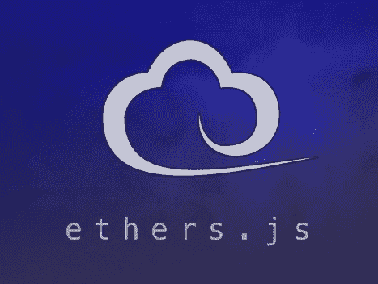

# 区块链:第二天— EtherJS + VueJS

> 原文：<https://medium.com/coinmonks/blockchain-day-2-etherjs-vuejs-4a2896a50ef2?source=collection_archive---------2----------------------->



# #概述

在之前的帖子中，我们讨论了在 Ganache 上使用 [Hardhat](https://hardhat.org/) 创建和部署智能合约。我们还使用`hardhat console`测试了简单智能契约的功能。控制台工具对于测试目的是好的，但是迟早我们需要建立真正的应用程序，它可以与我们创建的契约进行交互。有一些图书馆可以帮助我们完成这项任务，其中我找到了那两个著名的

*   [Web3JS](https://web3js.readthedocs.io/en/v1.5.2/) :这是一个库的集合，允许你使用 HTTP、IPC 或 WebSocket 与本地或远程以太坊节点进行交互。
*   [Ether](https://docs.ethers.io/v5/)s:ethers . js 库旨在成为一个完整而紧凑的库，用于与以太坊区块链及其生态系统进行交互。

根据描述，很难说哪一个更好，但是根据我的调查，ethers 似乎有一些 web3js 没有的高级特性。

 [## 宣布 ethers . js—web 3 的替代方案

### L4 Ventures 和毛利小五郎很自豪地宣布 ethers.js 的最新版本，这是一个功能完整的库…

medium.com](/l4-media/announcing-ethers-js-a-web3-alternative-6f134fdd06f3) 

> ethers.js 和 web3 之间的一个主要区别是它们如何处理密钥管理和与以太坊区块链的交互。Web3 假设有一个本地节点连接到应用程序。假设该节点存储密钥、签署交易、与以太坊区块链交互并读取以太坊。实际上，情况并不总是这样——大多数用户并不在本地运行 geth。Metamask 通过浏览器应用程序有效地模拟了那个环境，因此大多数 web3 应用程序需要 Metamask 来保存密钥、签署交易以及与以太坊主网交互。([引 L4V](/@l4v) )

所以我决定使用 etherjs 来构建我们的前端应用程序。我也决定选择 [**VueJS**](https://vuejs.org/) 作为前端框架。这并不是因为 VueJS 有一些支持 etherjs 的突出特性，而仅仅是因为我曾经在 VueJS 上工作过。

*   [化]醚
*   VueJS

# #前端应用程序设置

第一步是创建前端应用程序，我们已经在以前的职位。

```
$vue create hello-blockchain 
$cd hello-blockchain
```

然后我们需要安装乙醚:

```
$npm install --save ethers
```

根据[乙醚的手册](https://docs.ethers.io/v5/getting-started/#installing)，导入乙醚并在我们的应用程序中使用非常简单:

```
import { ethers } from "ethers";
```

所以我试着在我的 main.js 中导入 ethers，如下所示，但是没有成功。

```
import Vue from 'vue'import router from './router'**import { ethers } from "ethers";**import App from './App.vue'Vue.config.productionTip = falseVue.use(**ethers**);new Vue({ router, render: h => h(App),}).$mount('#app')
```

我不能在我的 Vue 组件中使用醚，既不使用`this.ethers`也不使用`Vue.ethers`。我意识到问题可能不在于 Vue 插件的形状。所以我决定创建自己的 ethers 插件。

*   创建插件文件夹

```
$mkdir plugins
$cd plugins 
```

*   创建一个名为 ethers.js 的 ethers 插件

```
touch ethers.js 
```

*   我做了一个简单的技巧来包装 ethers 库并将其作为 Vue 插件安装:

```
"use strict";import { ethers } from 'ethers';Plugin.install = function(Vue) { Vue.prototype.ethers = ethers; Object.defineProperties(Vue.prototype, { $ethers: { get() { return ethers; } }, });};export default Plugin;
```

*   使用新创建的 ethers 插件，而不是在 main.js 中导入 ethers 库:

```
import Vue from 'vue'import router from './router'**import ethers from "./plugins/ethers";**import App from './App.vue'Vue.config.productionTip = falseVue.use(ethers);new Vue({ router, render: h => h(App),}).$mount('#app')
```

从现在开始，我可以在我的组件中使用`this.$ethers`。

# **#连接设置**

现在是时候做一些基本的步骤，将我们的应用程序连接到 ganache，并使用代码与我们的合同进行交互。现在让我们使用现有的组件 HelloWorld.vue。

*   定义组件数据结构:

```
data() { return { currentAccount: null, currentContract : null, contractAddress: "<Your deployed contract Address>" };},
```

*   我们希望在每次安装组件时检查我们的应用程序是否连接到元掩码，因此我们如下所示:

```
mounted(){ this.checkConnectedWalletExist();},
```

*   `checkConnectedWalletExists()`在组件的`methods`部分定义。如果我们已经连接到元掩码，这个函数返回`true`,如果没有，返回`false`。

```
methods:{ checkConnectedWalletExist: async function(){ try { const { ethereum } = window; if (!ethereum) { alert("Make sure you have metamask!"); return false; } else { console.log("We have the ethereum object", ethereum); } const accounts = await ethereum.request({ method: "eth_accounts" }); if (accounts.length !== 0) { const account = accounts[0]; console.log("Found an authorized account:", account); this.currentAccount = account; return true; } else { console.log("No authorized account found"); return false; } } catch (error) { console.log(error); return false; }},
```

*   如果我们没有连接到元掩码，我们要求用户通过单击连接钱包按钮来连接

```
<h3>Connect Wallet</h3>**<div v-if="!currentAccount">** <button class="primaryButton" @click="**connectWallet**">Connect Wallet</button></div>
```

*   点击连接钱包按钮将依次触发方法`connectWallet()`，定义如下:

```
connectWallet: async function (){ try { const { ethereum } = window; if (!ethereum) { alert("Get MetaMask!"); return; } const accounts = await ethereum.request({ method: "eth_requestAccounts", }); console.log("Connected", accounts[0]); this.currentAccount = accounts[0]; } catch (error) { console.log(error); }},
```

*   现在我们已经连接到 wallet，是时候参考我们部署的合同了:

```
<div v-if="!currentContract"> <button class="primaryButton" @click="attachContract">Attach Contract</button></div>
```

*   合同参考:

```
attachContract: async function() {const provider = new this.$ethers.providers.JsonRpcProvider("http://127.0.0.1:7545");const signer = provider.getSigner()//const network = await provider.getNetwork();//console.log(network);const abi = Greeter.abi;// The Contract objectthis.currentContract = new this.$ethers.Contract(this.contractAddress, abi, signer);console.log(await this.currentContract.symbol());}
```

请注意`http://127.0.0.1:7545`是 Ganache 的 RCP 地址。当然，在这里创建提供者是不方便的，我们稍后会把它放在商店里，但现在还可以。我把`blockchain`文件夹放在 Vue 文件夹项目下的原因是为了方便参考组合 ABI

```
import Greeter from '../../blockchain/artifacts/contracts/Greeter/Greeter.json'
```

# #结束

因此，我们完成了配置 EtherJS 以与我们的 VueJS 项目一起工作的第 2 步。第三天见。