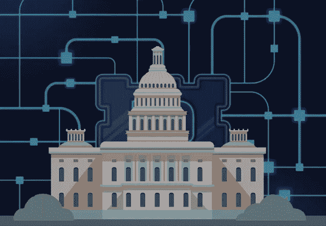

# 区块链解密——推动商业发展

> 原文：<https://medium.com/coinmonks/blockchain-deciphered-propelling-businesses-5ac30dd1aec?source=collection_archive---------9----------------------->

在这个关于区块链技术的系列中，我们将讨论这个网络的基本原理，它对受监管行业的业务的影响，它相对于传统交易技术的优势——同时涵盖了为什么它会存在的不同方面！

> **在我们进入** :-
> [区块链解密——基础知识](https://blog.cryptostars.is/blockchain-deciphered-fundamentals-b5bd83d8b4b9)之前，请务必查看我之前在这个系列中的文章

Blockchain technologies find applications in almost all businesses

# **是什么让区块链适合商业？**

## 1.共享分类帐

正如在以前的文章中所讨论的，使用共享分类帐，交易只记录一次，消除了传统业务网络中典型的重复工作，作为所有参与者的唯一真实来源。

## 2.许可

区块链可以是**有权限**或**无权限**。

在许可的区块链中，每个成员都有一个唯一的身份——允许使用策略来**限制网络参与**和**访问交易细节**。有了这些功能，企业可以更容易地**遵守数据保护法规**。这些在控制区块链内的数据一致性方面也更加有效。此外，一些成员可能被**授权**仅查看某些交易，而其他成员(如审计员)可能被授权查看更广泛的交易。

> 在一个公开的区块链——比如**比特币**——交易细节的**级别可能会受到限制**以保护机密性和匿名性。

## 3.共识；一致

交易可以通过各种协商一致的方式进行验证和提交，例如—

## **a .股权证明**:

为了验证交易，验证者必须持有网络总价值的一定百分比。通过**减少攻击的动机**并使执行攻击变得非常昂贵，利益相关证明可能提供对网络上恶意攻击的增强保护。

## **b .多重签名**

相当多的验证者(例如，10 个中有 6 个)必须就交易的验证达成一致。

## **c .实用拜占庭容错(PBFT)**

这是一种算法，旨在当一组节点中的一个节点生成与该组中其他节点不同的输出时，解决计算节点(网络参与者)之间的争议。

## 4.智能合同

这是存储在区块链上的一组规则，作为交易的一部分自动执行。传统上用于**管理**目的，它们也提供了优于基本合同法的安全性，同时降低了与此类传统合同相关的成本和延迟。

# 实施区块链的缺点

## 工作证明—共识技术

In a blockchain with anonymous members — such as in Bitcoin, **commitment is expensive**

> 对于匿名会员——比如比特币,**承诺是昂贵的**。在比特币网络上，**通过工作证明**达成共识。该网络要求每一台存储分类账副本的机器根据其分类账版本解决一个复杂的难题。拥有相同账本副本的机器“合作”解决他们被赋予的难题。第一个解决难题的团队获胜，所有其他机器更新它们的分类帐以匹配获胜团队的分类帐。这个想法是多数人赢了，因为它有最强的计算能力先解决它的难题。
> 
> **工作证明**在公共区块链上很有用，比如用于比特币的那种，但是它**消耗相当多的计算能力**和**电力**，使得它成为达成共识的昂贵方式。在所有参与者都是已知的私有商业网络中，这样的开销是不必要的。

# 行业范围—业务使用案例

# 金融服务

## 贸易融资

企业可以使用区块链来简化从多个法律实体(海关、港务局、卡车或铁路运输公司等)获得跨境货物运输批准的流程。签署所有批准文件，当收到货物时，以及当付款从进口商的银行转移到出口商的银行时，通知所有相关方批准状态。

1.  **复杂的流程简化为单个流程**，所有流程都访问影子分类账
2.  **获得资本的最佳途径**，因为它不会陷入漫长的结算时间或错误和纠纷
3.  **企业、监管者和消费者之间更好的信任和责任**

## 商业融资

正是在这一点上，区块链实施的好处本质上将简化端到端的行为—

1.  增加了**订单到交付渠道的可见性**
2.  **提交的纠纷**数量减少
3.  解决争议所需的时间更短

# 保险

保险业通常需要一种有效的方法来处理索赔，验证可保事件(如事故)是否真的发生了，并为客户提供公平及时的赔付。

> 随着**自动化保险索赔处理**，**保单条件被写入存储在区块链上的智能合同**。每当可保事件发生并由可信来源报告时，就会自动触发保险单，根据智能合同中指定的保单条款处理索赔，并向客户付款。

保险福利如下:

1.  **消除处理保险索赔的成本**
2.  减少保险欺诈的机会

# 卫生保健

具体来说，这个行业需要一个更高效、更安全的系统来管理医疗记录(T6)、预授权支付(T9)、保险理赔(T10)、执行和记录其他复杂交易(T11)。

## 电子医疗记录

区块链可以保存每个患者的完整病史，患者、医生、监管机构、医院、保险公司等可以进行多种粒度的控制，提供一种安全的机制来记录和**维护每个患者的综合病史。**

1.  **防篡改**存储病史的手段
2.  **缩短解决保险索赔的时间**并提高提供保险报价的效率
3.  **患者的完整病史，供医生用于准确的药物推荐**

## 医疗支付

在保险理赔过程中，通常会用到术语**临床附件**。提交的保险索赔通常没有所有必需的支持细节，因此付款人需要请求额外的细节，这增加了结算过程的成本和延迟。

此外，将索赔与支持信息进行匹配对所有相关方来说都是一项挑战。实施区块链的概念将有效地否定这些特征。

1.  **保险理赔**可以更加**高效**快速的审核和赔付。
2.  该系统可以建议具有更好覆盖范围的替代服务。

# 政府

由于各国将区块链纳入治理战略的可能性极小，它具有根除腐败、建立身份证明的巨大潜力，并为建立一个更真实的福利国家提供了有效的手段。

## 组织可以通过签发**数字认证的出生证明**来申请区块链，这种出生证明是不可伪造的，带有时间戳，并且世界上的任何人都可以访问。

> 相当多的治理涉及记录交易和跟踪资产所有权的过程，所有这些都可以通过使用区块链系统变得更加高效和透明。由于伪造和验证所需的昂贵背景调查，建立可信身份仍然是一个问题。全球数百万人可能伪造了他们的身份文件，并且可能与他们自称的身份不符。
> 
> **数百万难民和他们的孩子没有合法证件。世界上较贫困地区的人们可能没有足够的证据来证明某些服务提供商所要求的身份；例如，银行通常要求提供居住证明或公用事业账单来证明身份，而这两样在发展中国家可能都不存在。**

> 加入 Coinmonks [电报频道](https://t.me/coincodecap)和 [Youtube 频道](https://www.youtube.com/c/coinmonks/videos)了解加密交易和投资

## 另外，阅读

*   [Coldcard 评论](https://coincodecap.com/coldcard-review) | [BOXtradEX 评论](https://coincodecap.com/boxtradex-review)|[uni swap 指南](https://coincodecap.com/uniswap)
*   [阿联酋 5 大最佳加密交易所](https://coincodecap.com/best-crypto-exchanges-in-uae) | [SimpleSwap 评论](https://coincodecap.com/simpleswap-review)
*   [7 大副本交易平台](https://coincodecap.com/copy-trading-platforms) | [BuyCoins 点评](https://coincodecap.com/buycoins-review)
*   《XT.COM 评论》的[《币安评论》的](https://coincodecap.com/profittradingapp-for-binance)|
*   [SmithBot 评论](https://coincodecap.com/smithbot-review) | [4 款最佳免费开源交易机器人](https://coincodecap.com/free-open-source-trading-bots)
*   [光宗耀祖 vs 比特币基地](https://coincodecap.com/uphold-vs-coinbase) | [坎加交易所点评](https://coincodecap.com/kanga-exchange-review)
*   [比诺莫评论](https://coincodecap.com/binomo-review) | [斯多葛派 vs 3Commas vs TradeSanta](https://coincodecap.com/stoic-vs-3commas-vs-tradesanta)
*   【Capital.com】|[港加密借贷平台](https://coincodecap.com/crypto-lending-hong-kong)
*   [最佳加密 RSS 源](https://coincodecap.com/crypto-rss-feeds) | [最佳 eToro 替代品](https://coincodecap.com/etoro-alternative)
*   [红狗赌场评论](https://coincodecap.com/red-dog-casino-review) | [Swyftx 评论](https://coincodecap.com/swyftx-review) | [CoinGate 评论](https://coincodecap.com/coingate-review)