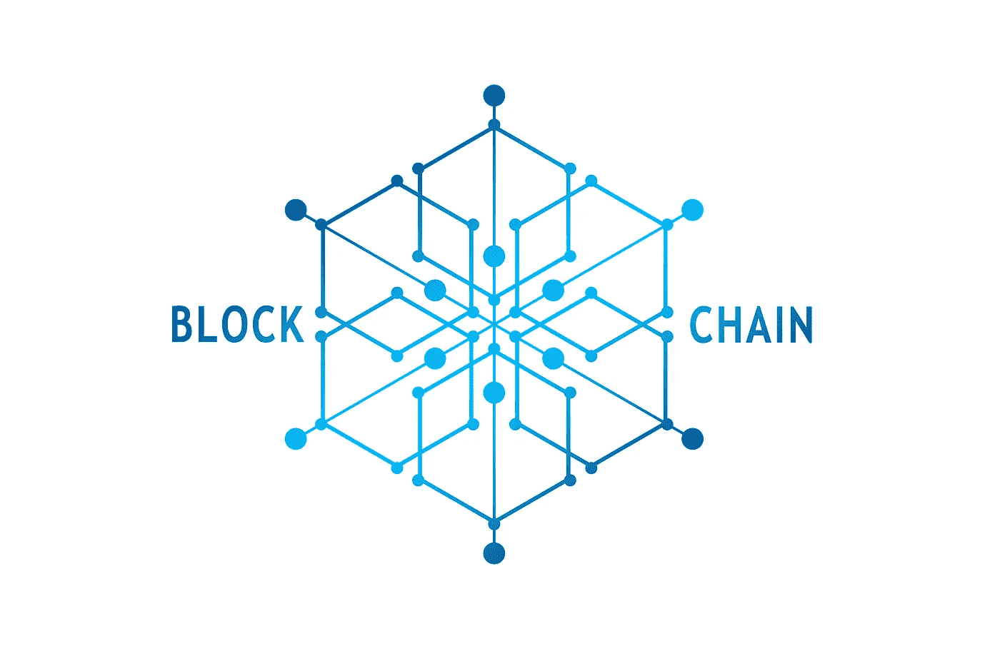
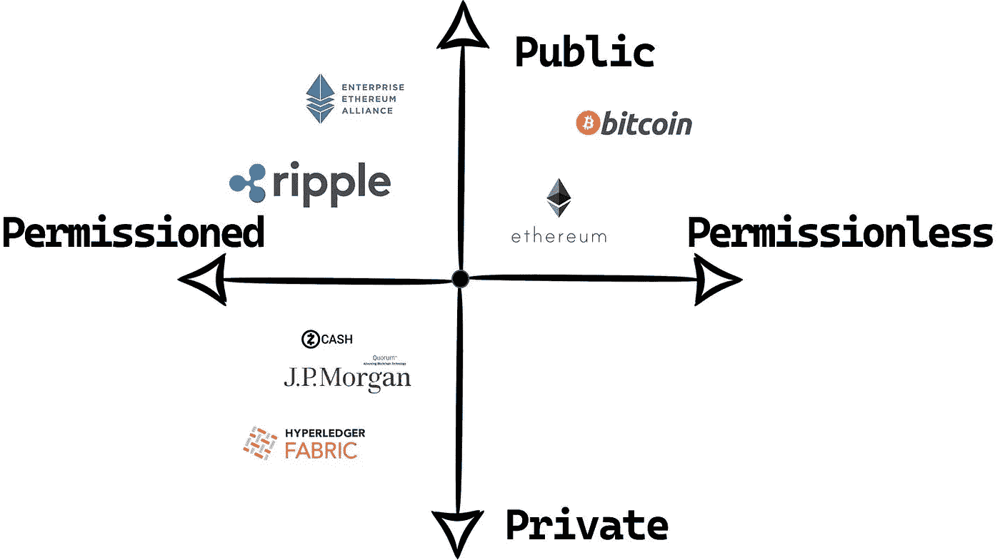
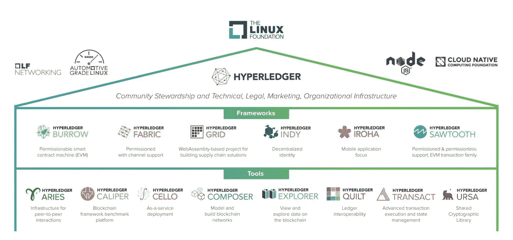
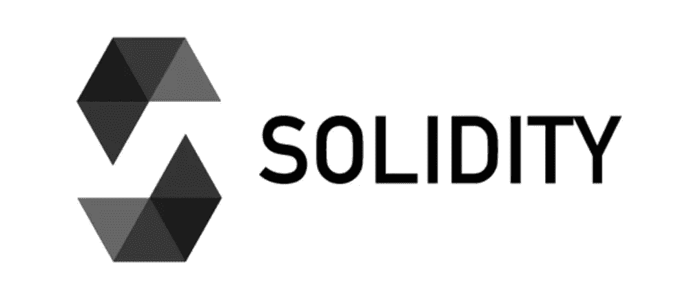

# 区块链发展:充满希望的未来

> 原文：<https://medium.com/coinmonks/blockchain-development-a-promising-future-d71570b4ceaf?source=collection_archive---------14----------------------->

民主是在参与其中的每个成员之间分配权力的一种方式。然而，每当涉及到私人或公共客户服务部门的内部组织结构时，很少使用分布式系统。

在大多数情况下，使用的是中央系统，这导致安全风险、透明度降低，有时还会导致腐败。即使使用分布式系统，也会导致完整性问题以及高基础设施成本，这使得它们在大多数情况下不可行。在这里，区块链可以发挥重大作用。

# 区块链定义

区块链是一个纯粹的分布式对等分类帐系统，它利用一个由算法组成的软件单元，该算法通过加密和安全技术协商有序和连接的数据块的信息内容。

Blockchain-Type Quadrant

## 区块链的类型

区块链有两种类型:

1.  未经许可的区块链
2.  被许可的区块链

**无权限区块链**是像比特币和以太坊一样的公共区块链，向匿名的每个人授予写权限。每个用户或节点都可以验证事务数据，并在区块链数据结构中创建和添加新块。

**有权限的区块链**类似于区块链的 Ripple，只向有限的一组预选节点或用户授予写访问权限，这些节点或用户通过入职流程被确定为可信的。

此外还有**私有区块链**，它非常适合那些寻求受限访问协议的公司和其他组织。它是邀请型的，中央权威机构控制谁被允许加入网络并给他们分配角色。

# 未来在前方

这是区块链的私人领域，下一场革命将在这里发生，对即将到来的“区块链工程师”来说，这是一个巨大的机会。像区块链应用、智能合同、金融证券等机会。

> [根据 Grand View Research，Inc .的一份新报告，预计到 2030 年，全球区块链技术市场规模将达到 14，315.4 亿美元，从 2022 年到 2030 年将以 85.9%的 CAGR 增长](https://www.bloomberg.com/press-releases/2022-02-09/blockchain-technology-market-size-worth-1-431-54-billion-by-2030-grand-view-research-inc)

# 以太坊

以太坊是一个去中心化的开源区块链，具有智能合约功能，由 Vitalik Buterin 于 2013 年开发。**ETH**(**ETH**或**ξ**)为平台原生加密货币。以太坊配有运行在区块链上的编程语言，使开发人员能够构建和运行分布式应用程序。以太坊是一个可编程的区块链，在许多领域都有应用，包括 *Defi* ，智能合约和 *NFTs* 。

# 智能合同

智能合同是自动执行的合同，双方之间有谨慎的协议条款。该协议直接写入代码行，这些合同使交易可追踪、透明且不可逆转。

**智能合约举例说明:**

# 区块链的应用

区块链可以用于多种应用

1.  **文件验证**:证明身份和认证，以及数字化、存储和验证文件或合同以及所有权或转让证明。
2.  **政府补贴分配**:过滤掉不需要补贴的人的系统，可以根据人的进步自动撤销和分配补贴。
3.  **小额支付**:通过传统转账方式转移成本过高的小额资金。
4.  **税收**:按交易或独资计税，减少避税或双重征税。

# 需要二等兵区块链

比特币区块链等传统区块链只存储交易数据，为交易提供便利，但你不能在那里编程。因此，为了与分散的互联网互动，我们必须编写在分散的互联网上运行的软件，为此，我们必须创建分散的软件，也称为 *DApps* 。

就以太坊而言，我们可以在区块链上存储数据，也可以编写软件，但有一个限制，那就是它是一个公共区块链。透明度是公共区块链的一个特点，也是一个缺点。在公共区块链中，节点所做的任何事务对整个网络都是可见的，这对于企业市场来说是不合适的特征。企业市场要求以最佳效率和低成本保护他们的数据隐私和安全。因此，为了创建专用区块链的框架，使用了*超级分类帐结构*。

Hyperledger Project

## 超分类帐结构

Hyperledger Fabric 是 Hyperledger 项目的一部分。Hyperledger Fabric 是一个模块化的区块链框架，它是使用面向私营企业的即插即用组件开发基于区块链的产品、解决方案和应用程序的基础。

# 区块链编程

您还需要在技术上熟悉一种用于编写智能合同的编程语言。你想写的区块链技术生态系统将决定语言的选择。如果你想为以太坊网络开发，一个很好的起点是 *Solidity* 编程语言。

**Solidity** 是以太坊开发的原创智能合约开发语言。这是一种高级的、面向对象的编程语言，用于在以太坊这样的区块链平台上创建智能合同和 *dApps* 。如果你想成为一名区块链开发者，这门语言是必不可少的。

您还需要了解或熟悉密码学的概念。*密码学*是区块链的基石，理解这一点是必须的。

# 要读的书

书籍是区块链未来的入门指南:

1.  区块链基础知识:丹尼尔·德雷舍所著《25 个步骤》一书中的非技术性介绍
2.  Elad Elrom 的区块链开发者

区块链是一个涉及面很广的话题，在这里我们只是为您提供了一些皮毛，让您将它视为发展机遇。我们仍在探索诸如 Hyperledger、DApps、NFTs 等主题。

## 参考

1.  区块链基础知识:丹尼尔·德雷舍所著《25 个步骤》一书中的非技术性介绍
2.  [Investopedia](https://www.investopedia.com/terms/b/blockchain.asp)
3.  [弗利&拉德纳·LLP](https://www.foley.com/en/insights)
4.  [Ethereum.org](https://ethereum.org/en/)
5.  [Hyperledger.org](https://www.hyperledger.org/)

> 加入 Coinmonks [电报频道](https://t.me/coincodecap)和 [Youtube 频道](https://www.youtube.com/c/coinmonks/videos)了解加密交易和投资

# 另外，阅读

*   [3 商业评论](/coinmonks/3commas-review-an-excellent-crypto-trading-bot-2020-1313a58bec92) | [Pionex 评论](https://coincodecap.com/pionex-review-exchange-with-crypto-trading-bot) | [Coinrule 评论](/coinmonks/coinrule-review-2021-a-beginner-friendly-crypto-trading-bot-daf0504848ba)
*   [莱杰 vs Ngrave](/coinmonks/ledger-vs-ngrave-zero-7e40f0c1d694) | [莱杰 nano s vs x](/coinmonks/ledger-nano-s-vs-x-battery-hardware-price-storage-59a6663fe3b0) | [币安评论](/coinmonks/binance-review-ee10d3bf3b6e)
*   [Bybit Exchange 评论](/coinmonks/bybit-exchange-review-dbd570019b71) | [Bityard 评论](https://coincodecap.com/bityard-reivew) | [Jet-Bot 评论](https://coincodecap.com/jet-bot-review)
*   [3 commas vs crypto hopper](/coinmonks/3commas-vs-pionex-vs-cryptohopper-best-crypto-bot-6a98d2baa203)|[赚取加密利息](/coinmonks/earn-crypto-interest-b10b810fdda3)
*   最好的比特币[硬件钱包](/coinmonks/hardware-wallets-dfa1211730c6) | [BitBox02 回顾](/coinmonks/bitbox02-review-your-swiss-bitcoin-hardware-wallet-c36c88fff29)