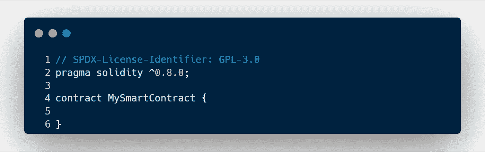
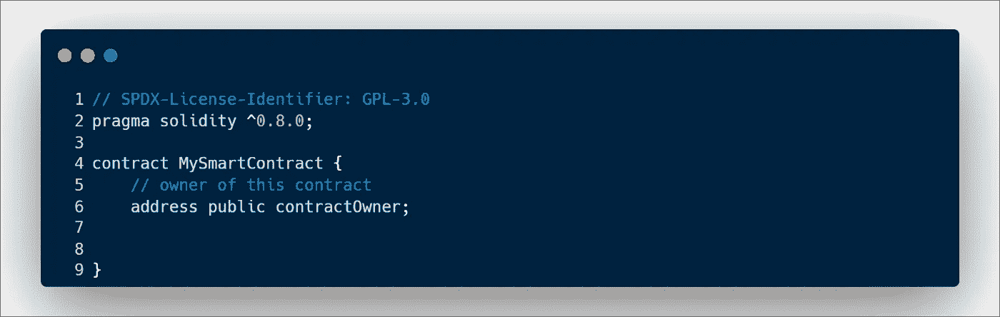
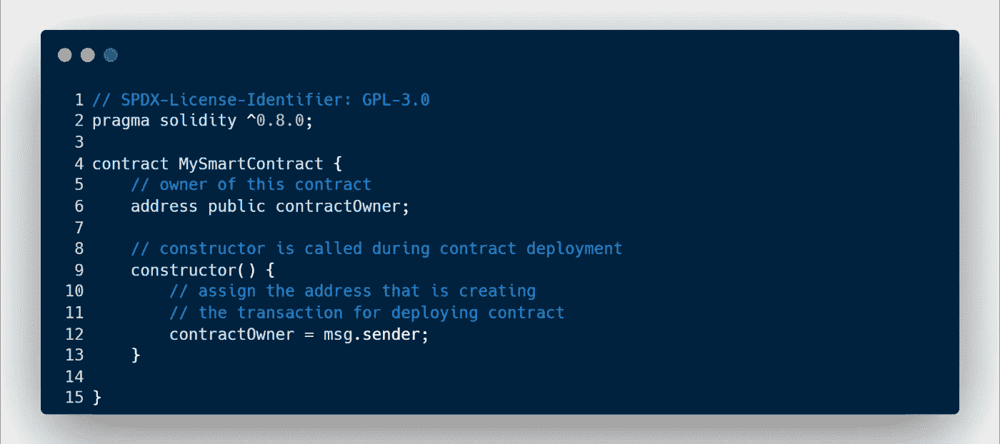
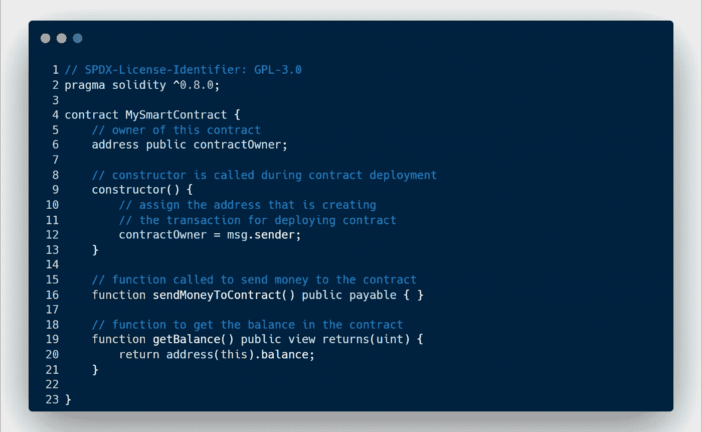
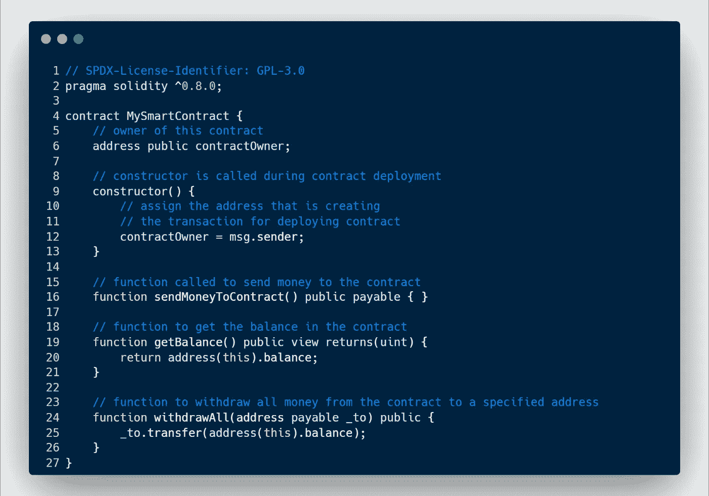
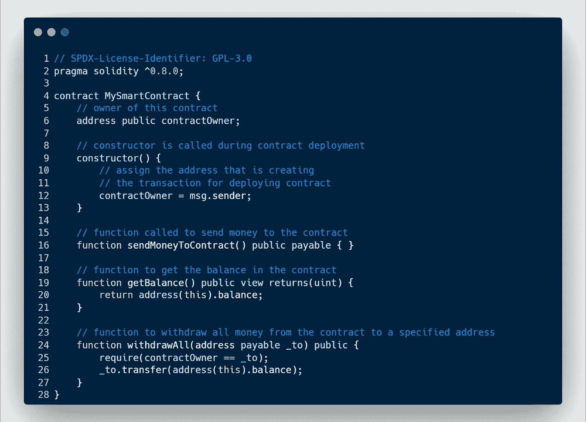

# 区块链开发——如何从 Solidity 智能合同中汇款和取款

> 原文：<https://medium.com/coinmonks/blockchain-development-how-to-send-and-withdraw-money-from-a-solidity-smart-contract-bcbbd27ec1aa?source=collection_archive---------5----------------------->

# 如何从智能合同中发送和撤回以太网

Solidity Ethereum image

在本文中，我们将检查一个智能契约的示例，只有当调用该函数的地址是所有者时，我们才能向该契约发送资金，检查其余额，然后将资金提取到某个地址，通常称为所有者模型。

这其实来自于我开发并围绕其建立的一个网站的银行智能合约。稍后会详细介绍

# 与所有者创建智能合同

首先，我们必须创建一个新文件，将其命名为 MySmartContract.sol(或者理想情况下，你可以选择 lol ),并添加 license 和 Solidity 版本声明，如下所示:

然后，我们创建一个地址变量来存储以下合同的所有者:

接下来，我们将创建一个构造函数，它将部署契约的地址存储为所有者。一个**构造函数**是一个特殊的函数，当契约被部署时只被调用一次。我们将使用**消息**对象的**发送者**属性。 **msg.sender** 是 solidity 中的内置变量，存储在任何给定时间与智能合约交互的地址。

继续保存合同，编译并部署。单击 contractOwner 按钮，查看部署合同的地址现在是所有者。

# 向智能合同汇款

接下来，我们将创建一个函数，允许任何地址向合同汇款。

我们可以用关键字`payable`来指定函数可以接收 Ether。

在 getBalance 函数中，关键字`this`指的是这个特定的契约(MySmartContract)。

现在，我们将继续部署合同并进行测试，您可以向合同发送以太网并检查合同的余额

# 从智能合同中提取所有资金

现在，创建一个 withdrawAll 函数，它也传递我们希望汇款的地址。

当您部署和测试合同时，您会注意到任何人都可以运行这个 withdrawAll 函数。我们只允许发送合同所有者来执行此功能。我们使用`require`来检查条件，如果条件不满足就抛出异常。只是为了保证安全

在这种情况下，我们检查调用该函数的地址是否与合同所有者相同。如果失败，它将回滚事务。这个契约现在满足了所有者模型，它检查调用函数的地址是否是所有者，然后才允许它继续。

这就是这个简单的智能契约，它允许将钱发送给它，并且只允许所有者从智能契约中提取所有的钱。

如果你觉得这篇文章有帮助，请随意给我一个**掌声**，因为这让我的一天变得明亮起来，因为我知道我可能已经帮助了一些人的制作之旅。

如果你需要任何进一步的帮助，你也可以给我发信息。我很乐意帮忙。

> *加入 Coinmonks* [*电报频道*](https://t.me/coincodecap) *和* [*Youtube 频道*](https://www.youtube.com/c/coinmonks/videos) *了解加密交易和投资*

# 另外，阅读

*   [3 商业评论](/coinmonks/3commas-review-an-excellent-crypto-trading-bot-2020-1313a58bec92) | [Pionex 评论](https://coincodecap.com/pionex-review-exchange-with-crypto-trading-bot) | [Coinrule 评论](/coinmonks/coinrule-review-2021-a-beginner-friendly-crypto-trading-bot-daf0504848ba)
*   [莱杰 vs n 格拉夫](/coinmonks/ledger-vs-ngrave-zero-7e40f0c1d694) | [莱杰纳诺 s vs x](/coinmonks/ledger-nano-s-vs-x-battery-hardware-price-storage-59a6663fe3b0) | [币安评论](/coinmonks/binance-review-ee10d3bf3b6e)
*   [Bybit Exchange 审查](/coinmonks/bybit-exchange-review-dbd570019b71) | [Bityard 审查](https://coincodecap.com/bityard-reivew) | [Jet-Bot 审查](https://coincodecap.com/jet-bot-review)
*   [3 commas vs crypto hopper](/coinmonks/3commas-vs-pionex-vs-cryptohopper-best-crypto-bot-6a98d2baa203)|[赚取加密利息](/coinmonks/earn-crypto-interest-b10b810fdda3)
*   最好的比特币[硬件钱包](/coinmonks/hardware-wallets-dfa1211730c6) | [BitBox02 回顾](/coinmonks/bitbox02-review-your-swiss-bitcoin-hardware-wallet-c36c88fff29)