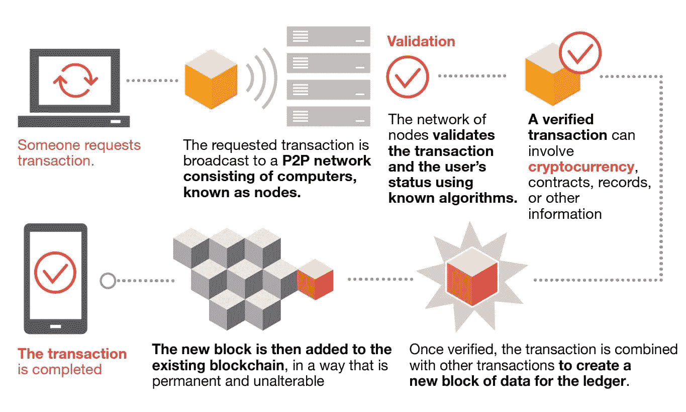
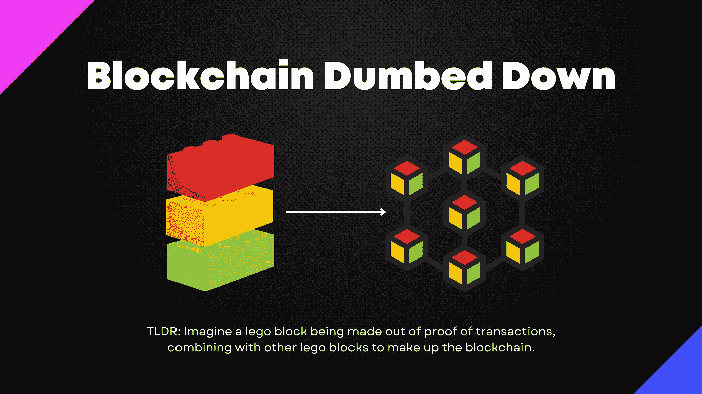

# 区块链变笨了

> 原文：<https://medium.com/coinmonks/blockchain-dumbed-down-831a1a592396?source=collection_archive---------18----------------------->

每个人都想从加密中赚点钱，但是有多少人理解加密货币的必要性呢？大多数人已经知道，加密货币本质上是存在于互联网上的货币，或者简单地说，“神奇的互联网货币”，讽刺的是，这是一种稳定的货币的名称(尽管它可能不像它声称的那样稳定，但那是另一个故事)。

那么，关于加密货币的要点是什么呢？加密货币是区块链科技的一个重要组成部分，是现在最热门的事物之一。它到底有什么了不起的？人们可以说它是高效的或透明的，还有许多其他的好处，但是它到底是如何工作的呢？我能找到的一个更简单的定义是:“区块链是一个点对点网络中所有交易的分散分类账。使用这项技术，参与者可以确认交易，而不需要中央结算机构。”下面的[图片](https://www.pwc.com/us/en/industries/financial-services/fintech/bitcoin-blockchain-cryptocurrency.html)展示了区块链是如何工作的。

但是，如果你在外面向一个陌生人口头解释这个问题(我肯定不会，自从我开始交易密码以来，我就没有离开过我的房间)，他们理解你所说的一半的可能性有多大？

为了让它变得更简单，让我们想象你走进一家商店。你想买一本书，所以你走向收银台说:“嘿，我想买这本书”。这将形成事务的请求。收银员(计算机/节点)接收您的请求，并通过从您处收取现金来验证交易，类似于使用加密货币验证区块链上的交易。这是为了确认特定的书已经被购买。然后，他在一块乐高积木上写下你的名字，其他几个从他那里买过书的人的名字已经被写下来了，作为购买的证明。因此，这将是新的数据块。乐高积木上再也没有空间让他挤进更多的名字，所以他把乐高积木放在其他已经写满名字的积木上面。因此，在现有的区块链中添加了一个新的积木，即其他乐高积木，它们共同显示了所有购买书籍的交易。

当然，这是对区块链运作方式的一个极其简化的解释。但它应该让你开始了解你买的是什么。现在，至少你可以说，你是根据基本面买入的，同时忍住了因投资组合损失 90%而流泪(HODL，我说得对吗？).

关注我在 Twitter 上的所有加密和更新！

如果你喜欢这篇文章，请给它鼓掌，并评论你可能有的任何建议/想法。

如果你对这些类型的文章感兴趣，请关注我，因为我会发布更多令人兴奋的内容！

如果你读到这里，非常感谢你的支持！

> 加入 Coinmonks [电报频道](https://t.me/coincodecap)和 [Youtube 频道](https://www.youtube.com/c/coinmonks/videos)了解加密交易和投资

# 另外，阅读

*   [如何匿名购买比特币](https://coincodecap.com/buy-bitcoin-anonymously) | [比特币现金钱包](https://coincodecap.com/bitcoin-cash-wallets)
*   [币安 vs FTX](https://coincodecap.com/binance-vs-ftx) | [最佳(SOL)索拉纳钱包](https://coincodecap.com/solana-wallets)
*   [比诺莫评论](https://coincodecap.com/binomo-review) | [斯多葛派 vs 3Commas vs TradeSanta](https://coincodecap.com/stoic-vs-3commas-vs-tradesanta)
*   [Capital.com 评论](https://coincodecap.com/capital-com-review) | [香港的加密借贷平台](https://coincodecap.com/crypto-lending-hong-kong)
*   [如何在 Uniswap 上交换加密？](https://coincodecap.com/swap-crypto-on-uniswap) | [A-Ads 评论](https://coincodecap.com/a-ads-review)
*   [WazirX vs CoinDCX vs bit bns](/coinmonks/wazirx-vs-coindcx-vs-bitbns-149f4f19a2f1)|[block fi vs coin loan vs Nexo](/coinmonks/blockfi-vs-coinloan-vs-nexo-cb624635230d)