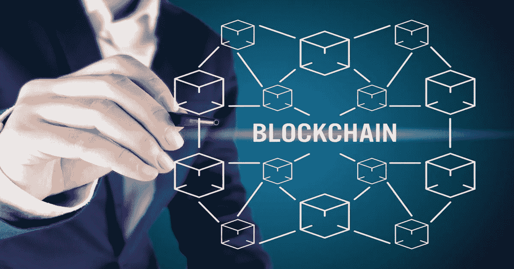

# 用通俗易懂的英语解释区块链

> 原文：<https://medium.com/coinmonks/blockchain-explained-in-plain-english-d7e926d44ed?source=collection_archive---------41----------------------->

## 区块链还是一个比较新的概念。准备好了解更多信息了吗？

[https://www.shutterstock.com/g/arbobii](https://www.shutterstock.com/g/arbobii)

无论你是在新闻中读到它，还是从你精通技术的朋友或配偶那里听说它，或者只是看到它在网上到处出现，你都会听说过“区块链”及其相关概念。

## 但是区块链到底是什么？