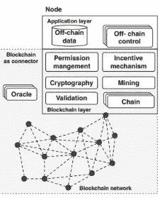
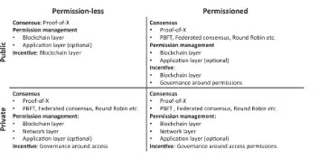
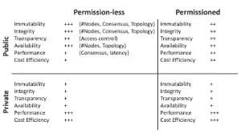

# 区块链

> 原文：<https://medium.com/coinmonks/blockchain-f32b5f0c90e7?source=collection_archive---------55----------------------->

## 区块链及相关概念介绍

Blockchain

## **区块链是一种新兴的数字技术，它结合了密码学、数据管理、网络和激励机制，以支持各方之间交易的检查、执行和记录。**

> **区块链分类账是一个交易组(“区块”)的列表(“链”)。这项技术的开发是因为我们不再信任第三方，而是信任共同运营区块链的集体以及他们共享的技术平台的正确性。**

## **定义区块链**

**定义 1:** (分布式分类帐)分布式分类帐是分布在许多机器上的交易的仅附加存储。

**定义 2:** (区块链)区块链是一个分布式账本，被结构化为一个区块链表。每个块包含一组有序的事务。典型的解决方案使用加密散列来保护从一个块到其前一个块的链接

注意，任何 ***区块链平台*** 必须具有客户端软件，处理节点可以利用该软件来操作网络，包括用于事务传播和块创建。还可以存在轻型客户端，例如，使移动设备能够向网络读写事务；这些通常不保存区块链数据结构的完整副本。可能存在用于处理和轻型节点的替代客户端，特别是如果协议被很好地指定的话。

# *为什么需要区块链？*

*   区块链，尤其是公共区块链，在实现分散应用时提供了颠覆性创新的机会。区块链为社会中的关系信任提供了一个新的基础，它可以允许现有的可信第三方组织被无利益中介。
*   在受信任的第三方并不总是值得信任的经济体中，区块链系统的一个重要优势可能在于它们可以提供不变性(不改变分类账上的先前记录)和不可否认性(不能否认分类账上的先前行为)。
*   区块链可以跨所有领域使用。目前，它被用于定义，数据管理，但人们相信它有很大的潜力和更大的用例。

# 区块链功能

The image is from book [**Architecture for Blockchain Applications**](https://www.amazon.com/exec/obidos/ASIN/3030030342/acmorg-20)

区块链是复杂的基于网络的软件组件，可以提供数据存储、计算服务和通信服务。区块链功能可以包括密码安全支付、挖掘、交易验证、激励机制和权限管理。所谓的 oracle 向区块链提供有关外部世界的信息，通常是通过将这些信息作为事务中的数据添加到区块链中。

# 区块链架构设计

# 区块链非功能属性

当指定一个系统时，软件工程师经常区分功能需求和非功能需求。对于计算机系统，简单的功能需求描述了可观察的输入和输出之间的关系。非功能需求是对非功能属性的需求表达，也称为“质量”或“能力”。这些特性包括成本、安全性(机密性、完整性、可用性、隐私性、不可否认性)、性能(延迟、吞吐量)、可修改性和可用性

## 区块链的非功能属性

*   与传统的集中式数据库和计算平台(onpremise 或 cloud)相比，区块链可以通过在组织之间提供中立区域来降低一些交易对手和运营风险。区块链技术可以为不变性、不可否认性、完整性、透明性和平等权利提供优势。
*   不变性、不可否认性、完整性、透明性和平等权利。如果数据包含在一个提交的事务中，它最终会变成不可变的。加密签名的历史事务的不可变链提供了存储数据的不可否认性。加密工具还支持数据完整性，公共访问提供了数据透明性，平等的权限允许每个参与者都有相同的能力访问和操作区块链。这些权利可以通过矿工拥有的计算能力或股份来衡量
*   区块链中的信任是通过网络中节点之间的交互来实现的。
*   数据隐私和可伸缩性是公共区块链的两个批评点。如前所述，在这种设置中，隐私是有限的:没有特权用户，每个参与者都可以加入网络来访问区块链上的所有信息并验证新的交易。

Non-functional properties of different types of blockchain

# 设计基于区块链的应用

1.  **处理节点准入:**在一个公共的区块链系统中，比如比特币，任何人都可能成为处理节点(或‘矿工’)。在专用区块链系统中，处理节点的准入由其管理机构控制。
2.  **共识机制:**大多数公共区块链使用 Nakamoto 共识，其中处理节点按照惯例将块的最长历史视为权威历史。
3.  **交易表示:**分布式分类账可以记录金融交易，比如比特币。然而，作为一个共享数据库，分布式分类账可能允许记录其他类型的数据。特别地，为交易记录的数据可以是计算机程序的文本，并且对该交易的完整性检查可以包括执行该程序。

更多资源:

YouTube 链接: [NPTEL](https://www.youtube.com/playlist?list=PLHRLZtgrF2jl8yqucJsMFqh5XpRLTgCI4)

Udemy: [区块链基础](https://www.udemy.com/share/102Udw3@NXfhYvqax1gJO_Ob48OX1HmLLdTa5QmT2gUAJLulyejU1leEfe06akhBSX_qC39e/)

图书:

区块链应用的架构

> 加入 Coinmonks [电报频道](https://t.me/coincodecap)和 [Youtube 频道](https://www.youtube.com/c/coinmonks/videos)了解加密交易和投资

# 另外，阅读

*   [3 商业评论](/coinmonks/3commas-review-an-excellent-crypto-trading-bot-2020-1313a58bec92) | [Pionex 评论](https://coincodecap.com/pionex-review-exchange-with-crypto-trading-bot) | [Coinrule 评论](/coinmonks/coinrule-review-2021-a-beginner-friendly-crypto-trading-bot-daf0504848ba)
*   [莱杰 vs n rave](/coinmonks/ledger-vs-ngrave-zero-7e40f0c1d694)|[莱杰 nano s vs x](/coinmonks/ledger-nano-s-vs-x-battery-hardware-price-storage-59a6663fe3b0) | [币安评论](/coinmonks/binance-review-ee10d3bf3b6e)
*   [Bybit Exchange 审查](/coinmonks/bybit-exchange-review-dbd570019b71) | [Bityard 审查](https://coincodecap.com/bityard-reivew) | [Jet-Bot 审查](https://coincodecap.com/jet-bot-review)
*   [3 commas vs crypto hopper](/coinmonks/3commas-vs-pionex-vs-cryptohopper-best-crypto-bot-6a98d2baa203)|[赚取秘密利息](/coinmonks/earn-crypto-interest-b10b810fdda3)
*   最好的比特币[硬件钱包](/coinmonks/hardware-wallets-dfa1211730c6) | [BitBox02 回顾](/coinmonks/bitbox02-review-your-swiss-bitcoin-hardware-wallet-c36c88fff29)
*   [block fi vs Celsius](/coinmonks/blockfi-vs-celsius-vs-hodlnaut-8a1cc8c26630)|[Hodlnaut 审核](/coinmonks/hodlnaut-review-best-way-to-hodl-is-to-earn-interest-on-your-bitcoin-6658a8c19edf) | [KuCoin 审核](https://coincodecap.com/kucoin-review)