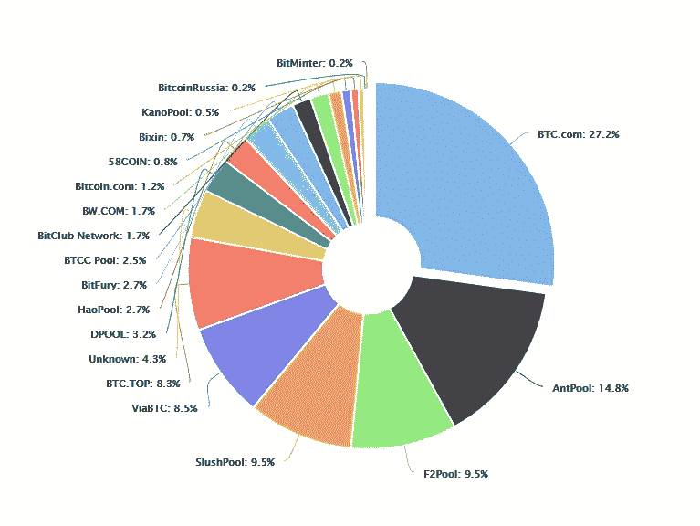
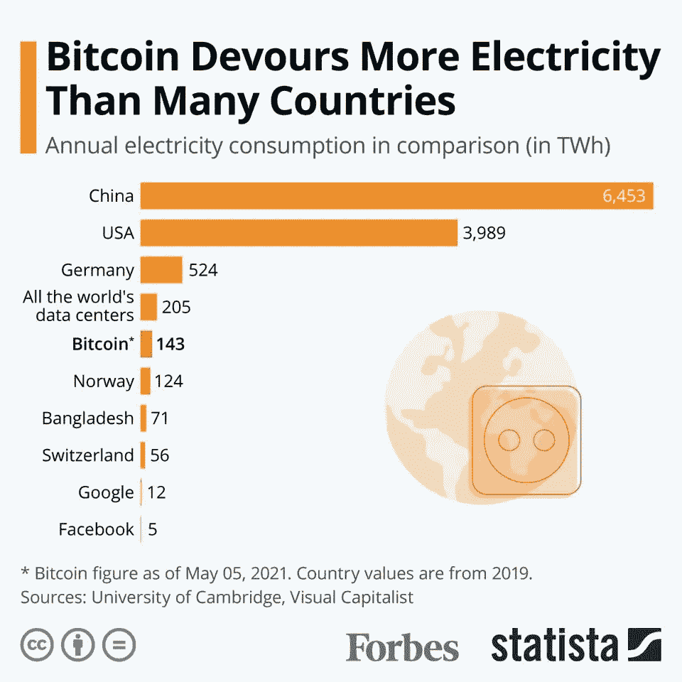
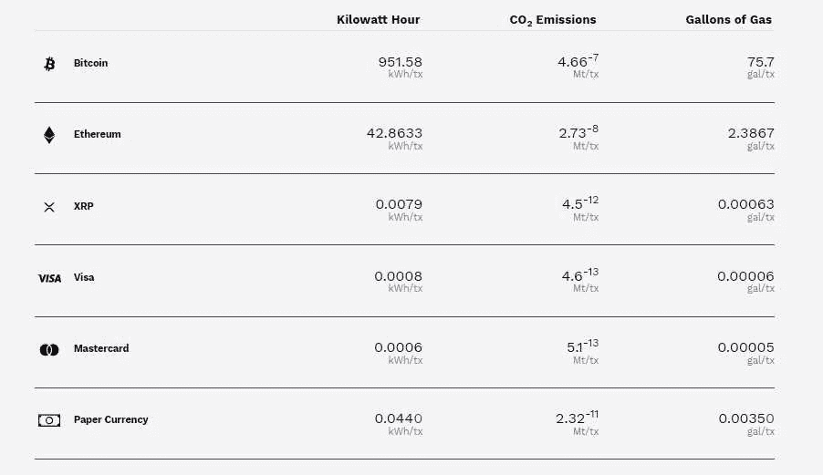
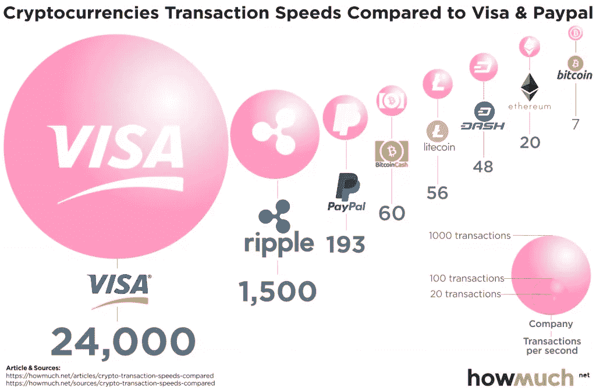

# 区块链文件:加密货币和能源问题

> 原文：<https://medium.com/coinmonks/blockchain-file-cryptocurrencies-and-energy-issue-cd08bded113e?source=collection_archive---------37----------------------->

**简介**

我们大多数人都记得 2008 年，当时美国的房地产泡沫在 2007 年爆发，一年后蔓延到世界各地，导致世界第四大投资银行雷曼兄弟破产，负债 6130 亿美元，美联储以廉价的流动性进行干预，我们还记得这场流动性导致通货膨胀的大危机。在那些年里，发生了另一件事，尽管它并没有被给予太多的重视。绰号“中本聪”的人发表了一份白皮书。在这份白皮书中，中本聪指出，这场金融危机是由世界上提供流动性的政府和分配这些流动性的银行造成的。白皮书中详细解释的加密货币旨在消除无能的政府和贪婪的银行，通过比特币与 P2P(点对点)方式进行交易。那天白皮书中出现了一种加密货币，但今天它的数量已经超过了一万种。当比特币最初出现时，它提供的自由主义结构给人们留下了深刻的印象，但后来，它的自由主义和值得信赖的结构带来了高交易成本和长交易时间。Ripple 实验室的首席执行官。用“你不能用比特币买咖啡，因为除非你付钱，否则你的咖啡会变冷”的比喻来比较比特币和 XRP。除了速度问题，最主要的问题是能源需求问题，这也是本文的主题，以及这个问题导致的高成本和高碳排放。

pixabay

**区块链技术及其工作原理**

区块链技术最早是随着比特币进入我们的生活的。中本聪在他当天发表的白皮书中介绍了一种去中心化的数字货币，这种货币的背后是区块链科技。这种技术提供了转移的可能性，在这方面，专家们不想将价值转移定性为信息转移，因为区块链技术提供了以比特币转移价值的机会。数字环境中的信息传输可以非常容易和简单地完成，但是突出区块链技术的分散化和可靠性特征使得这种传输过程不能像数字环境中的信息传输那样快。这些包括系统中的一些组件；块、分类帐、散列、节点、挖掘、无许可、共识、PoW(工作证明)、PoS(利益证明)。

这个系统，也就是链条，是由矿工创造的。比特币矿工每 10 分钟创造一系列数字。当矿工执行采矿操作时，块，以及当在这些块上创建的信息被处理时，分类帐被形成。我们称这个分类帐创建过程为哈希。我们可以将区块链比作杂货店的分类账，矿工每 10 分钟挖掘一页分类账，形成块，然后杂货店填充这些页并进行散列，这些填充的页创建分类账。这些记录现在由中央系统中管理该系统的机构保存和控制。目前，银行将客户的交易保存在自己的数据库中，并通过这些数据库管理这些交易。我们可以说，比特币的情况也是如此，在我们称之为数据库的块上记录数据形成的账本，以及这些账本创建的区块链，这个数据库中记录的数据，我们将其描述为价值，即加密货币，以及人，而不是管理这个数据库的人。这是该系统区别于中枢系统的最重要特征。这个系统不是由一个中心或中央权力机构管理的，而是由分散的、互不认识的人管理的。在管理方面有两种方法，一种是 PoW，另一种是 **PoS** ，即股权证明。 **PoW** ，或工作证明，是目前比特币和以太坊使用的系统。随着矿工挖掘系统，他们得到了对**总账**的管理。我们已经定义了记录数据的数据库。在这里，挖掘区块以形成分类账的矿工通过节点来完成这项工作。它不仅管理注册过程，还通过节点管理这些记录以及分类帐。比特币之所以安全，不仅仅是因为账本是多重且分散的，还因为管理账本的人是多重且分散的。节点执行这种混乱的管理工作。节点通过共识机制相互协调来完成这一管理工作。因为**节点**持有并控制分类账。由于交易是由多个节点进行的，经过一系列的查看和验证，它们之间的连接可以用共识机制来完成，我们把这种审批机制称为共识阶段。该系统位于数据库中，并管理多个节点，因此，如果不破坏系统中分散节点的所有分类帐，您就无法破坏系统，或者您必须控制 50%以上的节点，以便您可以打破共识机制。目前的技术不足以做到这一点。

Photo by [Kanchanara](https://unsplash.com/@kanchanara?utm_source=medium&utm_medium=referral) on [Unsplash](https://unsplash.com?utm_source=medium&utm_medium=referral)

另一种形式的管理是 PoS，也就是股权证明，这个系统是以太坊未来随着以太坊 2.0 更新承诺的管理类型。这种管理风格其实更符合比特币和区块链技术的理念。这种形式完全让系统的用户来管理系统。PoW 形式主要由系统创建者管理，在这种管理形式中，随着采矿池的合并，链的管理有可能被垄断者控制。如下图所示，如果做比特币挖矿最多的 3 个矿池成立一个财团，就可以接管整个系统的管理，把分散的系统变成集中的模式。

[https://academy.bit2me.com/en/what-is-cryptocurrency-mining-pool/](https://academy.bit2me.com/en/what-is-cryptocurrency-mining-pool/)

与 PoW 不同，PoS 方法将系统控制权交给系统上的加密货币持有者。在 PoW 方法中，有许多管理阶段，这些阶段的控制由挖掘者(即节点)执行，但是在 PoS 方法中，由加密货币持有者(或者更确切地说是那些存储加密货币以供管理的人)执行。系统管理和 PoW 完全一样，有愿景，有验证，有跨节点共识。该系统授权查看和批准在每笔交易中存储和锁定加密货币的人员中随机选择的人员，以进行管理，并且该系统通过以一致意见执行这些交易来管理。当然，这些事务是由节点执行的，就像在 PoW 中一样。系统和 PoW 的区别不在于节点的拥有者是挖矿者，而是加密货币的拥有者，挖矿越多，节点越多，而不是节点越多。另一个不同出现在开采阶段，没有用 PoS 系统管理的开采链，没有矿工和他们管理的系统，该系统完全由拥有加密货币的人管理。采矿和矿工管理不需要很高的能源需求、设备成本和很长的处理时间，我将在下面详细解释。

Photo by [Kanchanara](https://unsplash.com/@kanchanara?utm_source=medium&utm_medium=referral) on [Unsplash](https://unsplash.com?utm_source=medium&utm_medium=referral)

**加密货币的交易速度**

我在上面详细解释了 PoW 和 PoS 方法，另一种方法是 Ripple labs 在 Ripple 网上使用的加密货币 XRP 的管理方式。这个系统遵循一个稍微不同的方法。该系统仅处理向分类账的转账，因此每笔交易只有一个发送方和接收方。在第一次转账期间，为收款人和汇款人开立一个分类账，所有后续转账都通过该分类账进行。10 当分类帐打开时，XRP 连接到分类帐。此外，系统节点是由 Ripple Labs 确定的分散个体。并且挖掘过程在这个系统中是不可用的。所有加密货币最初都是由节点定期挖掘和发布的。与其他加密货币不同，XRP 不是分散的。由 Ripple Labs 控制的中央加密货币。因为 Ripple 并没有像其他公司一样挖掘这些加密资金来建立一个分散的金融系统，而是用区块链技术为支付系统带来了一种新的创新。但这些特性使 XRP 成为速度最快、成本最低的加密货币。如果你想了解更多关于 Ripple Labs 建立的支付和转账网络以及 XRP 加密货币的信息，我在这里留下了我之前发表的文章[的链接。](/@supertramp1/blockchain-file-ripple-and-xrp-case-d80b944acc21)

**加密货币和能源**

我试着详细解释了一些具体的管理方法，目前使用最多的方法是 PoW，然后是 PoS 方法。挖掘交易，然后保留账本记录，共识机制等交易降低了加密货币的交易速度，增加了能源成本。当系统在 PoW 阶段运行时，或者在 PoS 和它们的存储中上漆之前，并且将它们零零碎碎地投放到市场上，上漆产生了密集的设备和能量需求，并且这种上漆、存储和管理成本增加了链上的交易成本，并且导致过程变得复杂。延长处理时间。

forbes

如上图所示，比特币的能源使用量比世界上最大的科技公司多几十倍，甚至高于一些国家的能源使用量。图表是根据 2019 年各国的能源消耗和 2021 年比特币的能源消耗计算出来的。

xrpl.org

上表比较了 3 种特定加密货币、信用卡和纸币的年度能源消耗、碳排放和年度能源需求所需的化石燃料量。从表中可以清楚地看到，从碳排放和能源消耗来看，加密货币消耗的能源最多，排放的碳也最多。

howmuch.net

上图比较了一些特定加密货币和支付系统每秒的交易量。可以看出，交易笔数最低的首先是比特币，其次分别是以太坊和 Dash。一秒钟的最大交易量属于 Visa 的信用卡，其次是 Ripple Net 拥有的 XRP 加密货币，原因是管理方法不同。

当我们看上面的表格时，这个生态系统中交易量最大的比特币比金融和科技市场中的所有公司消耗的能量都多，甚至比许多国家都多。与金融和技术生态系统相比，所有加密货币都消耗更多的能源，并导致更多的碳排放。最后，如果从速度上比较的话，这个市场上交易量最高的比特币每秒最多可以进行 7 次交易。甚至有时会在速度方面造成问题的 Visa 也每秒执行 24，000 次交易。

**结论**

目前，数十亿人相信这项技术及其承诺的哲学，否则，成千上万的加密货币无法在市场上交易，但无论如何，对加密货币持现实态度是必要的。尽管成本如此之高，速度如此之慢，但它将取代今天的金融系统的事实只不过是一个梦想。但由于这些因素，远离区块链技术及其提供的创新是愚蠢的，因此我们需要利用这些系统的透明性、安全性和去中心化，并将它们集成到今天的生态系统中。未来，每个州都是一个节点，单一安全透明的加密货币是有效的，这不仅让我兴奋，我相信每个对金融市场或多或少感兴趣的人都会有和我一样的感受…

[*你可以访问链接阅读土耳其语的文章……*](https://www.hukukvebilisimdergisi.com/kripto-paralar-ve-enerji-sorunu/)

**参考文献**

1.  [比特币挖矿的能源消耗/剑桥经济学工作论文:1948/Sinan kufeo Lu，Mahmut oz kuran/2019 年 5 月 24 日](https://econpapers.repec.org/paper/camcamdae/1948.htm)
2.  [区块链技术的最新发展及其对能源消耗的影响/ Johannes Sedlmeir、Hans Ulrich Buhl、Gilbert Fridgen、Robert Keller/2021 年 2 月 24 日](https://dblp.org/rec/journals/corr/abs-2102-07886.html)
3.  [当前加密货币的对比分析/ ICISSP 2018/拉拉·毛里、斯泰尔维奥·西马图、埃内斯托·Damiani](https://www.researchgate.net/publication/322875051_A_Comparative_Analysis_of_Current_Cryptocurrencies)
4.  [加密货币理论、区块链和分布式系统以及环境影响/加密货币和区块链技术应用/p . Mary Jeyanthi/2020 年 5 月 22 日](https://www.semanticscholar.org/paper/THEORIES-OF-CRYPTOCURRENCY%2C-BLOCKCHAIN-AND-SYSTEMS-Jeyanthi/f35aedf0052ef21603e327e9973c8f3c563d31a7)
5.  【https://howmuch.net 号
6.  【https://xrpl.org 
7.  [https://www.forbes.com](https://www.forbes.com/)
8.  [https://france.bc.events](https://france.bc.events/)

> *加入 Coinmonks* [*电报频道*](https://t.me/coincodecap) *和* [*Youtube 频道*](https://www.youtube.com/c/coinmonks/videos) *了解加密交易和投资*

# 另外，阅读

*   [3 商业评论](/coinmonks/3commas-review-an-excellent-crypto-trading-bot-2020-1313a58bec92) | [Pionex 评论](https://coincodecap.com/pionex-review-exchange-with-crypto-trading-bot) | [Coinrule 评论](/coinmonks/coinrule-review-2021-a-beginner-friendly-crypto-trading-bot-daf0504848ba)
*   [莱杰 vs n rave](/coinmonks/ledger-vs-ngrave-zero-7e40f0c1d694)|[莱杰 nano s vs x](/coinmonks/ledger-nano-s-vs-x-battery-hardware-price-storage-59a6663fe3b0) | [币安评论](/coinmonks/binance-review-ee10d3bf3b6e)
*   [Bybit Exchange 审查](/coinmonks/bybit-exchange-review-dbd570019b71) | [Bityard 审查](https://coincodecap.com/bityard-reivew) | [Jet-Bot 审查](https://coincodecap.com/jet-bot-review)
*   [3 commas vs crypto hopper](/coinmonks/3commas-vs-pionex-vs-cryptohopper-best-crypto-bot-6a98d2baa203)|[赚取加密利息](/coinmonks/earn-crypto-interest-b10b810fdda3)
*   最好的比特币[硬件钱包](/coinmonks/hardware-wallets-dfa1211730c6) | [BitBox02 回顾](/coinmonks/bitbox02-review-your-swiss-bitcoin-hardware-wallet-c36c88fff29)
*   [BlockFi vs Celsius](/coinmonks/blockfi-vs-celsius-vs-hodlnaut-8a1cc8c26630)|[Hodlnaut 点评](/coinmonks/hodlnaut-review-best-way-to-hodl-is-to-earn-interest-on-your-bitcoin-6658a8c19edf) | [KuCoin 点评](https://coincodecap.com/kucoin-review)
*   [Bitsgap 审查](/coinmonks/bitsgap-review-a-crypto-trading-bot-that-makes-easy-money-a5d88a336df2) | [Quadency 审查](/coinmonks/quadency-review-a-crypto-trading-automation-platform-3068eaa374e1) | [Bitbns 审查](/coinmonks/bitbns-review-38256a07e161)
*   [密码本交易平台](/coinmonks/top-10-crypto-copy-trading-platforms-for-beginners-d0c37c7d698c) | [Coinmama 审核](/coinmonks/coinmama-review-ace5641bde6e)