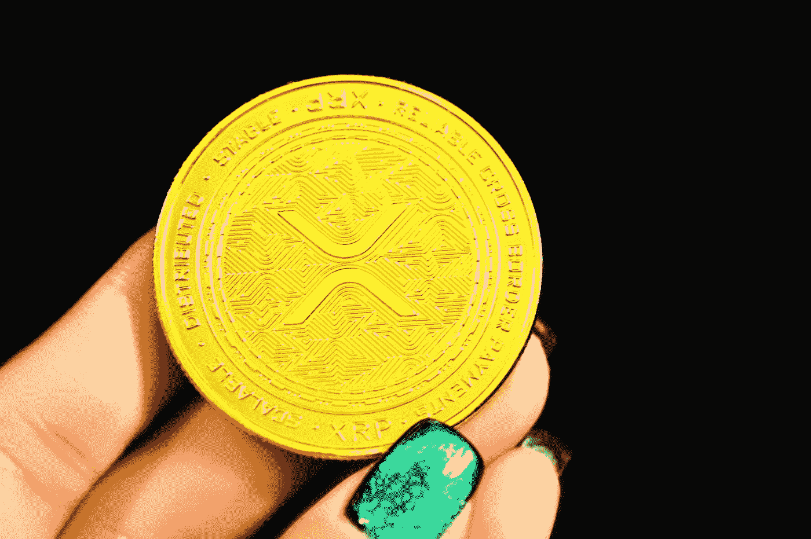
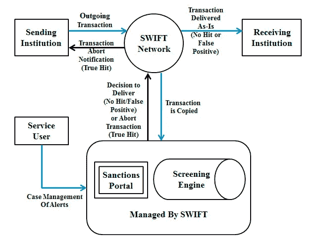
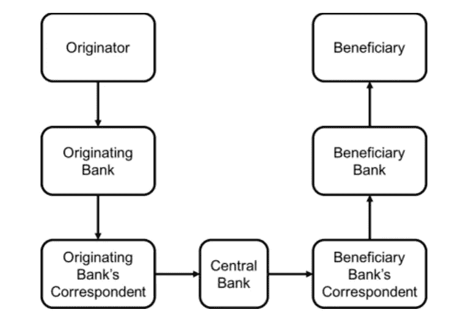
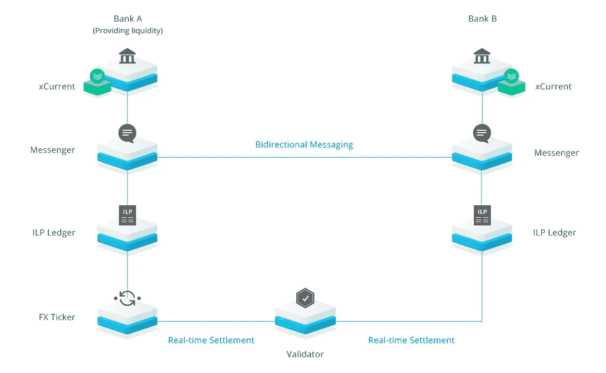

# 区块链文件(瑞波和 XRP 案)

> 原文：<https://medium.com/coinmonks/blockchain-file-ripple-and-xrp-case-d80b944acc21?source=collection_archive---------24----------------------->

> 我在这篇文章中描述的不是投资建议！

**简介**

我们大多数人都记得 2008 年，当时美国的房地产泡沫在 2007 年爆发，一年后蔓延到世界各地，导致世界第四大投资银行雷曼兄弟破产，负债 6130 亿美元，美联储以廉价的流动性进行干预，我们还记得这场流动性导致通货膨胀的大危机。在那些年里，发生了另一件事，尽管它并没有被给予太多的重视。绰号“中本聪”的人发表了一份白皮书。在这份白皮书中，中本聪指出，这场金融危机是由世界上提供流动性的政府和分配这些流动性的银行造成的。白皮书中详细解释的加密货币旨在消除无能的政府和贪婪的银行，并通过比特币以 P2P(点对点)方式进行交易。比特币和区块链技术是那一天出现的这场革命的第一束火花，成为今天许多创新的先驱。在这篇文章中，我将解释 ripple，它使用区块链技术快速、安全、廉价地转移资金，XRP 硬币，它是这种转移的桥梁，以及 SEC(证券交易委员会)对这种硬币提起的诉讼。

Photo by [Kanchanara](https://unsplash.com/@kanchanara?utm_source=medium&utm_medium=referral) on [Unsplash](https://unsplash.com?utm_source=medium&utm_medium=referral)

**涟漪**

随着国际贸易的发展，国际货币转移已经成为行动者最重要的问题之一。直到 1973 年，资金转移和支付都是通过电传系统进行的。1973 年后，SWIFT(环球银行间金融电信协会)方法开始用于转账和支付，这种方法一直持续到今天，但由于其成本和速度慢，已经失去了它的普及性。使用 SWIFT 方式转账有时需要一周时间，而且费用高昂。转账和支付需要几天时间，这是公司在国际舞台上做生意的最大问题之一，在这个时代，甚至几秒钟就能赚上百万。Ripple Labs 成立于 2012 年。该公司能够通过其利用区块链技术和分布式总账系统建立的系统，在几秒钟内以非常低的费用安全地进行这些转账和支付。

如今，使用最广泛的 SWIFT 系统是通过代码进行通信的报文传送系统。如下图所示，SWIFT 流程由多个阶段组成。服务用户向发送金融机构申请向另一个国家和金融机构汇款。转账详情通过系统自动转换为 SWIFT 代码，该代码通过 SWIFT 网络发送给收款组织。在接收组织收到报文之前，代码到达 SWIFT 终端，服务用户和发送组织可以查看所有阶段。

Ripple vs. SWIFT: Transforming Cross Border, Remittance Using Blockchain Technology/ Tianyi Qiu

根据 2021 年的数据，每天执行 4600 万笔 SWIFT 交易。我在上面解释了消息传递过程，现在我将解释资金转移过程。如下图可以看到，是分层进行的。汇款人将钱存入汇款银行，汇款银行将钱汇给汇款银行的代理行，代理行将钱汇给收款银行的代理行，但这一过程是通过中央银行进行的。收款代理行到达收款银行，款项从收款银行到达收款人。

Ripple vs. SWIFT: Transforming Cross Border, Remittance Using Blockchain Technology/ Tianyi Qiu

SWIFT 系统包含优势和劣势、威胁和机遇。SWIFT 代码的优势在于它是国际性的，可以通过简单的操作安全地执行，但它的缺点是转移需要几天时间，而且成本很高。采用新技术及其潜力被视为机遇，但所有控制权都在银行手中的事实被视为威胁。

金融科技专家将 Ripple 系统比作哈瓦拉系统。哈瓦拉系统起源于 8 世纪的南亚。在该系统中，除了用户 A 和 B 之外，还有承包商 A 和 B。用户 A 联系城市 A 中的承包商 A，并表示您将在这一天和这一时间接受并向该城市的承包商 B 交付将交付给用户 B 的以下金额。在这一天和这一时间，承包商 A 前往该城市，联系承包商 B，并将资金交付给用户 B。在承包商 B 核实了用户 B 的身份后，他还用用户 A 发送的密码核实资金转移，并将资金交付给用户 B，反之亦然，资金从用户 B 转移到 A。哈瓦拉系统在建立在信任基础上的哈瓦拉网络上运作。

Ripple 系统的关键组件是分布式总账、区块链系统和加密货币。该系统提供了在几秒钟内同时发送转账信息和转账金额的机会。考虑到在 SWIFT 系统中消息和资金是同步发送的，ripple 系统提供了这一点。该系统使用加密货币和区块链技术通过 P2P 方法分散交易，因此一旦发送转账信息，就达成转账或支付协议，并通过加密货币发送资金。如下图所示，消息系统打开发送组织和接收组织之间的通信，并通过 ripple net 传输付款或运输详细信息。在相关细节中；外币汇率、付款明细、费用流程等。信息包括在内。ILP(内部分类帐协议)是用于跟踪信贷、借记和交易之间的资金转移的子分类帐。ILP 确保交易非常快速、准确地完成，并控制交易过程是否成功。另一方面，FX Ticker 允许系统监控硬币的汇率。另一方面，验证器提供交易是否成功的确认，从而避免协议的风险并节省时间。在发送方发送之前，发送组织请求通过区块链转到相关目的地，并通过消息系统从接收组织接收运费和不同汇率的信息，以便发送方选择最佳选项并发送。当交易由发送方发起时，交易由接收组织锁定，并且 FX 报价机显示发送方发送的货币和 XRP(ripple 系统用于发送的加密货币)的汇率。汇款机构将当地货币兑换并汇往 XRP，收款机构将汇款机构汇来的 XRP 兑换成收款人的当地货币，与此同时，在进行这些交易时，所有记录由独立调查办公室保存。

Ripple vs. SWIFT: Transforming Cross Border, Remittance Using Blockchain Technology/ Tianyi Qiu

目前，300 多家金融机构被纳入 ripple net 系统，通过该系统向超过 75 个国家的资金转移可以在几分之一秒内安全完成，最高可达 XRP 市场价值的十万分之一。像 SWIFT 系统一样，Ripple 系统包含弱点和优点、威胁和机会。该系统的优势在于，每周 7 天每天都可以使用，并提供实时转账和基于共识的交易。XRP 被公司控制是它的弱点。该系统将彻底改变汇款行业。XRP 作为中央货币的潜力是该系统带来的机遇，但与其他加密货币的竞争将始终是一种威胁。

**XRP 案**

2018 年 5 月 3 日，SEC(美国证券交易委员会)在美国加利福尼亚州法院对 Ripple Labs 提起诉讼。相关诉讼最初是针对 Ripple Labs 提起的。但后来被扩大，该公司的创始人也因为他们在 XRP 的销售卷入了诉讼。

SEC 的论点是，XRP 实际上不像其他加密货币，因为它由一家公司控制，它们是证券合同，在美国境内销售这些证券合同需要 SEC 的安全许可。针对 SEC 的这一论点，XRP Ripple Labs 公司和 Ripple Labs 之间有一套，并不像 SEC 声称的那样在我们的控制之下。

pixabay

*美国证券交易委员会进行豪威测试*，该测试开发于 20 世纪 40 年代，至今仍在使用，以确定金融工具是否为证券合同。该测试向相关仪器提出 4 个问题。我们将根据下面的 XRP 提出这些问题并评价他们的答案。

*1。有没有可能把钱投资到相关的工具上？*

我们的答案当然是肯定的，如果不能存款，无论如何也不能称之为金融工具。与此同时，在进入其他问题之前，Ripple Labs 公司对这项测试的真实程度表示怀疑，因为他们表示 *Howey 测试*是根据 70 年前的金融市场设计的，这样一个过时的测试不足以评估由今天的技术创造的仪器。

*2。相关票据是否来自共同企业？*

在这个问题中，各方被分开，XRP 实际上似乎被用于 ripple 支付和货币转移系统，但正如在这个测试中所质疑的那样，它没有作为一种可以与公司一起估价的工具出现。Ripple Labs 公司从未给 XRP 设定目标，而且在每一个机会，他们都声明 XRP 和 Ripple 不应该混为一谈，Ripple 的成就和 XRP 的价值之间没有联系。

*3。当相关工具被引入市场时，相关机构是否承诺盈利，或者投资者是否将其盈利预期归因于该机构的成功？*

自 XRP 首次发布以来，Ripple Labs 一直将其作为支付和转账系统的一部分，但从未将其作为投资工具进行推广，也曾声明不会将其变成投资工具。为了使系统更具功能性，可以在 ripple 系统中以其他货币进行转账和支付。

*4。利润是由第三方的劳动和努力产生的吗？*

各方在这个问题上也有分歧，XRP 包括第三方的劳动力，但 Ripple Labs。由于 XRP 一开始并没有提供任何盈利预期，虽然有第三方的努力和付出，但盈利并不是靠这些人的努力和付出取得的。利润的原因是供给和需求，就像其他加密资产一样。

虽然由于美国正在进行的诉讼，XRP 尚未被接受为加密货币，但瑞士、英国和日本等主要经济体已经接受该工具为加密货币。同样在这起诉讼在美国和 Ripple Labs 提起之前。在另一个案件中，与美利坚合众国财政部达成了一项协议(双方当事人的协议),根据该协议，接受 XRP 为加密货币。

**结论**

区块链技术正在像雪崩一样增长，没有一个国家能够抵抗这项将彻底改变本世纪的技术，他们知道这一点。通过这项服务，Ripple Labs 提供了世界贸易多年来一直在观察的快速、安全和廉价的转移。各国有责任采取行动应对这场雪崩，跟上这场革命，而不是与之对抗。如果他们能够接受并跟上这场革命，他们就可以用这个生态系统所需要的法规来为这场技术革命做好准备。这是当一些机会主义者无法通过操纵这场革命来承担他们公司的火箭成本时，如果他们这样做了，他们会找到真正保护其公民的国家。

[*你可以访问链接阅读土耳其语的文章……*](https://www.ikonionhukukvekariyerdernegi.com/post/blockchain-dosyas%C4%B1-ripple-ve-xrp-davas%C4%B1)

**参考文献**

1.[www.ripple.com](http://www.ripple.com/)

2.[www.SEC.gov](http://www.sec.gov/)

3.[www.finanacefeeds.com](http://www.finanacefeeds.com/)

4.[www.forbes.com](http://www.forbes.com/)

5.[Ripple 的油井提交材料摘要(Ripple Labs Inc.)](https://ripple.com/wp-content/uploads/2020/12/Ripple-Wells-Submission-Summary.pdf)

6.[白皮书/比特币](https://bitcoin.org/bitcoin.pdf)

7.[白皮书/XRP](https://whitepaper.io/coin/ripple)

8. [Ripple vs. SWIFT:转型跨境，利用区块链技术汇款/邱添一](https://www.sciencedirect.com/science/article/pii/S1877050919302820)

9.[涟漪效应:Ripple Labs Inc .的诉讼如何预示着支付平台的终结/ Lindsay Martin](https://scholarship.law.duke.edu/dltr/vol19/iss1/1/)

> *加入 Coinmonks* [*电报频道*](https://t.me/coincodecap) *和* [*Youtube 频道*](https://www.youtube.com/c/coinmonks/videos) *了解加密交易和投资*

# 另外，阅读

*   [Cloudbet 赌场评论](https://coincodecap.com/cloudbet-casino-review) | [点火赌场评论](https://coincodecap.com/ignition-casino-review)
*   [加密套利](/coinmonks/crypto-arbitrage-guide-how-to-make-money-as-a-beginner-62bfe5c868f6)指南| [如何做空比特币](/coinmonks/how-to-short-bitcoin-568a2d0b4ae5)
*   [比特币基地 vs 瓦济克斯](https://coincodecap.com/coinbase-vs-wazirx) | [比特鲁点评](https://coincodecap.com/bitrue-review) | [波洛涅克斯 vs 比特鲁](https://coincodecap.com/poloniex-vs-bittrex)
*   [德国最佳加密交易所](https://coincodecap.com/crypto-exchanges-in-germany) | [Arbitrum:第二层解决方案](https://coincodecap.com/arbitrum)
*   [币安交易机器人](/coinmonks/binance-trading-bots-d0d57bb62c4c) | [OKEx 评论](/coinmonks/okex-review-6b369304110f) | [阿塔尼评论](https://coincodecap.com/atani-review)
*   [最佳加密交易信号电报](/coinmonks/best-crypto-signals-telegram-5785cdbc4b2b) | [MoonXBT 评论](/coinmonks/moonxbt-review-6e4ab26d037)
*   [如何在 Bitbns 上购买柴犬(SHIB)币？](https://coincodecap.com/buy-shiba-bitbns) | [买弗洛基](https://coincodecap.com/buy-floki-inu-token)
*   [CoinFLEX 评论](https://coincodecap.com/coinflex-review) | [AEX 交易所评论](https://coincodecap.com/aex-exchange-review) | [UPbit 评论](https://coincodecap.com/upbit-review)
*   [十大最佳加密货币博客](https://coincodecap.com/best-cryptocurrency-blogs) | [YouHodler 评论](https://coincodecap.com/youhodler-review)

[https://medium . com/coin monks/pionex-review-exchange-with-crypto-trading-bot-1e 459d 0191 ea](/coinmonks/pionex-review-exchange-with-crypto-trading-bot-1e459d0191ea)

[https://medium . com/coin monks/top-3-telegram-channels-for-crypto-traders-in-2021-8385 f 4411 ff4](/coinmonks/top-3-telegram-channels-for-crypto-traders-in-2021-8385f4411ff4)

[https://coincodecap.com/free-crypto-portfolio-trackers](https://coincodecap.com/free-crypto-portfolio-trackers)