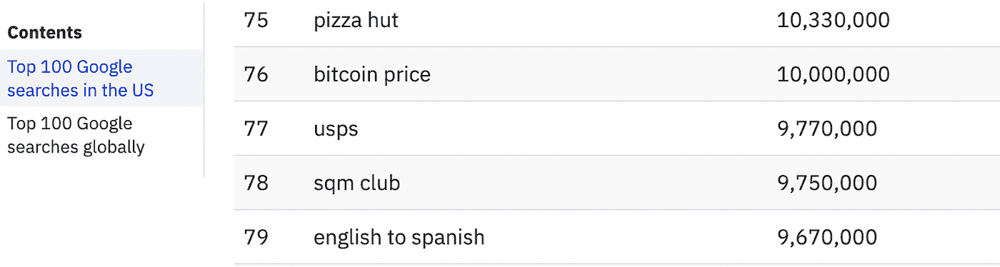

# 10 岁孩子的区块链；什么是区块链，它是如何工作的？

> 原文：<https://medium.com/coinmonks/blockchain-for-10-year-olds-c2728b94e00e?source=collection_archive---------7----------------------->

(image source; [https://www.istockphoto.com/](https://www.istockphoto.com/))

> 相当多的人仍然无法理解“区块链”这个术语。这可能是围绕该技术的复杂术语的结果。然而，我已经尽可能地简化区块链，以便即使是 10 岁的孩子也能理解这项技术的含义和工作原理。

2021 年，与加密货币，尤其是比特币相关的订单是谷歌上[搜索最频繁的话题之一。](https://ahrefs.com/blog/top-google-searches/)

[以太坊和 Dogecoin 位列 2021 年全球十大搜索新闻](https://trends.google.com/trends/yis/2021/GLOBAL/)。而[比特币目前在全球每天产生超过 1200 万的搜索流量](https://www.semrush.com/analytics/keywordoverview/?q=bitcoin&db=us)。

一般来说，互联网上最常见的定义是“区块链是交易的数字分类账，它被复制并分布在基于分散的对等网络的计算机网络节点中。”

这个定义不太容易理解，尤其是当考虑到那些对技术进化知之甚少或一无所知的人时。出于这个原因，我用一个非常贴切的例子打破了区块链的定义。

# 区块链技术简单解释

想象一下，如果有 20，000 人正在上一堂数学课，而这门课的召集人决定以一种任何人都无法编辑、删除或篡改出勤登记表上的名字的方式来记录出勤登记表。现在，想象一下每个寄存器一次只能接受 10 个名字。这将需要总共提供 2，000 份出席登记册。如此大量的登记册提出了一些非常困难的挑战；

1.  召集人如何保证出席不搞混？
2.  他/她如何确保登记册上的名字永远不会被编辑或替换？
3.  他/她如何确保在任何时候他/她希望查看任何特定的登记簿时，都能够方便快捷？
4.  谁将持有这些文件，如何激励他们？

**挑战 1 解决方案；数字总账**

区块链交易存储在所谓的块中。块具有特定的存储能力，当它们满了时，它们被矿工关闭，并使用加密技术连接到前一个块，产生一个被称为区块链的数据链。

使用我们的例子，这仅仅意味着每个寄存器，一旦它们变满(10 个名字被写入)，就被提交，并且下一个空的寄存器被链接到刚刚提交的寄存器的底部。这是以这样一种方式完成的，它们是永远联系在一起的，永远不会被切断。

> *“简单来说，链条贴在寄存器 1 的底部和寄存器 2 的顶部，寄存器 2 的底部和寄存器 3 的顶部。如此继续下去，直到最后一个寄存器(寄存器 1999)的底部链接到寄存器 2000 的顶部。”*

我们的例子和真正的区块链技术之间的唯一区别是没有最后的寄存器(块),它们是使用加密技术安全地链接在一起的[。](https://www.nist.gov/itl/csd/cryptographic-technology#:~:text=The%20Cryptographic%20Technology%20(CT)%20Group's,authentication%2C%20and%20random%20number%20generation.)区块链以这样一种方式建造，新的街区将无限地被创造出来。

**挑战二解；分散网络和分布式账本技术(DLT)**

区块链在以块为单位记录事务后，将块分布在区块链上的节点网络中，以至于网络上的每个人都持有事务的相同副本。允许在跨越多个实体或地点的网络上以不变的方式同时访问、验证和记录更新的技术架构和协议[被称为分布式账本技术(DLT)](https://www.investopedia.com/terms/d/distributed-ledger-technology-dlt.asp) 。

将此与我们的出勤登记示例联系起来，想象一下，每条记录一旦提交，就会被立即扫描并上传到分散在世界各地的成千上万人的驱动器上。这些人既不认识，也不知道对方的位置。

> *“持有同一交易登记簿的扫描件可确保任何人都无法篡改登记簿上的详细信息”*

因为整个网络中保存的所有副本必须同时受到攻击，攻击或黑客攻击才会有效，所以分散的账本不会受到网络犯罪、编辑、更改或任何形式的欺诈活动的影响。

**挑战 3 方案；加密哈希函数**

加密哈希函数是一种机制，它接受大量数据并生成固定大小的加密文本输出，显示为字母和数字的组合，称为哈希值，简称为“哈希”然后，可以保存该加密文本而不是交易，并随后用于验证交易和块。

与我们的例子相关，在登记册上写下他/她的名字的每个人被提供一个唯一的代码(散列),该代码直接链接到写有他/她的名字的登记册(块)。为了证明他们参加了这个活动，他们需要做的就是向询问的人提供代码。在区块链上搜索该代码时，会提供该块的全部细节，并显示用户的确切数据。

每当需要取出特定数据并确认交易时，所需要的只是输入散列，并且将提供散列所附的特定块。

**挑战 4 解决方案；节点网络**

区块链由许多数据块组成。这些数据块保存在节点上，类似于分散在世界各地的微型服务器。在区块链上，所有节点都相互连接，并不断交换区块链的最新信息。这保证了所有节点都保持最新。

在我们的示例中，我们可以将节点与世界各地的人的驱动器相关联，在这些驱动器上将上载和保护注册表的扫描副本。

对于包含在块中的交易，用户必须支付少量费用。这些费用用于奖励那些为保证区块链网络安全做出贡献的诚实节点。这意味着，为了让你的名字出现在注册簿上，你必须支付一笔小额费用，这笔费用将用于奖励向区块链添加新注册簿(块)的节点。

# 最后的想法

区块链技术是一种突破性的技术，发展速度非常快，对于个人来说，加入这一发展并了解该技术的工作原理非常重要。这篇文章简化了技术和一些关键术语，通过将它们与真实场景联系起来，人们可以很容易地理解它们。虽然这可能不能 100%地理解这项技术是如何工作的，但是，它为这个主题的进一步研究提供了一个坚实的基础。

> 如果你还有任何问题，请留下评论，或者更好的是，在 Twitter ( [@lanre_aderemi](http://twitter.com/lanre_aderemi) )上直接给我留言，我会尽快回复。感谢您的阅读，如果您能为我鼓掌，那就太好了！

不要忘了点击关注按钮来阅读更多像这样的故事；-)

> 加入 Coinmonks [电报频道](https://t.me/coincodecap)和 [Youtube 频道](https://www.youtube.com/c/coinmonks/videos)了解加密交易和投资

# 另外，阅读

*   [最佳期货交易信号](https://coincodecap.com/futures-trading-signals) | [流动性交易所评论](https://coincodecap.com/liquid-exchange-review)
*   [火币加密交易信号](https://coincodecap.com/huobi-crypto-trading-signals) | [Swapzone 审查](/coinmonks/swapzone-review-crypto-exchange-data-aggregator-e0ad78e55ed7)
*   最佳[密码交易机器人](https://coincodecap.com/best-crypto-trading-bots) | [购买索拉纳](https://coincodecap.com/buy-solana) | [矩阵导出审查](https://coincodecap.com/matrixport-review)
*   [Coldcard 评论](https://coincodecap.com/coldcard-review) | [BOXtradEX 评论](https://coincodecap.com/boxtradex-review)|[uni swap 指南](https://coincodecap.com/uniswap)
*   [比特币基地评论](/coinmonks/coinbase-review-6ef4e0f56064) | [德里比特评论](/coinmonks/deribit-review-options-fees-apis-and-testnet-2ca16c4bbdb2) | [FTX 评论](/coinmonks/ftx-crypto-exchange-review-53664ac1198f)