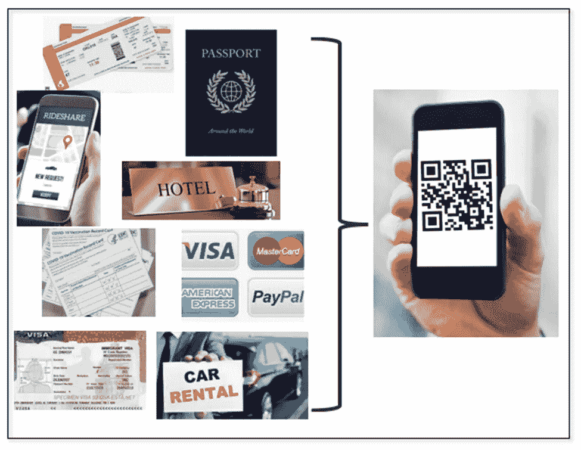
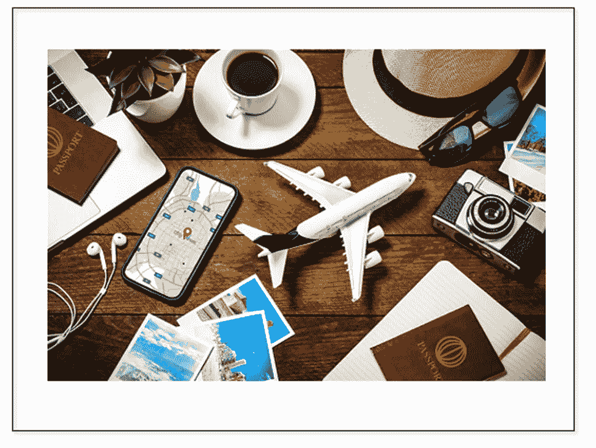

# 用于分散身份的区块链— dApp —旅行

> 原文：<https://medium.com/coinmonks/blockchain-for-decentralized-identity-dapp-travel-4cae8d5aca28?source=collection_archive---------3----------------------->

在这篇文章中，让我们想象一下分散身份使用 SSI(自我主权身份在第一篇博客中解释)来扰乱旅游行业体验的潜力。

如果你可以使用智能手机完成整个国际旅行，而无需拿出任何物理文件——非接触式——会怎么样？让我们想象一下这些经历。

1.登录航空公司网站订票不需要用户名/密码。取而代之的是，你可以使用储存在电子钱包中的会员卡(假设你有)来预订航班。在购买机票时(通过数字钱包中的金融工具支付——参见[关于数字钱包的第四篇博客](/blockchain-for-decentralized-identity/blockchain-for-decentralized-identity-layer-2-digital-wallets-872cc67174b8)),你会收到相同的旅行详细信息(预订号、日期、航班、座位号)。此外，在您旅行之前，您从 Timatic、IATA2 处获得目的地国家的任何法律要求，以便为旅行做准备(Covid 疫苗接种、签证等)。).

2.同样，您在目的地预订租车和酒店。同样，不需要登录密码；使用你的信息最少的忠诚卡(零知识证明，如在[第五篇博客](https://rao-anita.medium.com/blockchain-for-decentralized-identity-layer-3-the-trust-triangle-c5ed7965b470)中所解释的)来完成你的数字钱包中由金融工具支付的交易。

3.你的护照细节，包括你的照片，按照 ICAO(国际民用航空组织 1)的标准，作为可验证的凭证存储在你智能手机的数字钱包中(详见第五篇博客)。所以它是一个数字护照。

4.如果需要，领取您的签证。你从网上获得它，并将其存储为可通过智能手机访问的可验证凭证(VC)。

5.旅行前，您办理航班登机手续，并收到使用 IATA2(国际航空运输协会)标准的二维码形式的登机牌。

6.你通过手机上的 rideshare 应用程序叫车，然后使用该应用程序附带的金融工具支付费用，就可以到达机场。

7.一个定位应用程序决定你到达机场。然后，您的手机会自动为您创建一份证明(参见[第五篇博客](https://rao-anita.medium.com/blockchain-for-decentralized-identity-layer-3-the-trust-triangle-c5ed7965b470))，其中包含入住所需的声明。最后，您接受并出示它以办理登机手续。

8.您可以提供带有 QR 码的即时机票证明，以及带有护照和签证信息的复合证明。它是零知识证明，符合 SSI 最小化原则(参见[的第一篇博客](/blockchain-for-decentralized-identity/blockchain-for-decentralized-identity-self-sovereign-identity-de-mystified-f9bebd006e84))。该证明仅包含来自完成交易所需的你的数字钱包中的可验证凭证(参见[第五篇博客](/blockchain-for-decentralized-identity/blockchain-for-decentralized-identity-self-sovereign-identity-de-mystified-f9bebd006e84))的声明。

9.接下来，你使用电子钱包中的金融工具为你的包付款。

10.如果需要 Covid 疫苗接种卡，该卡也会自动包含在证明中。授权实验室最近的 Covid 疫苗接种测试结果是存储在数字钱包中的可验证凭证。每个国家的疫苗接种规则是从 IATA2 的 Timatic 中自动获取的，并在上面的步骤 1 中提供，以帮助您为旅行做准备。

11.在通过移民和海关时，您使用基于您的位置从您的数字钱包中自动生成的复合证明证明，该证明是使用零知识证明的最小化原则生成的。你在经历中没有任何摩擦。

12.接下来，在通过安检时，你使用一个二维码，根据你在电子钱包中的位置生成证明。该证明包含来自您的数字钱包中的可验证凭证的声明，需要完成该过程。你的体验是无缝和快速的。

13.到达目的地后，利用位置信息，您的应用程序使用您的护照和签证申请，从您的钱包中创建复合证明。你接受，使用二维码向移民官出示，然后通过移民和海关。

14.使用您的智能手机和位置来取车时，您会收到一份复合证明，证明您的预订、护照上的您的姓名、有效的驾照号码和付款的金融工具。你接受，展示，然后离开。

15.在酒店，使用您的位置，您的智能手机会向您显示您的预订、所需护照的足够索赔以及支付的金融工具——covid 疫苗接种卡，如果有必要，根据当地规则，从 IATA2 的 Timatic 收集。您接受复合证明，使用 QR 码在接待处出示它，并收集您的数字密钥，将其存储在您的数字钱包中，并使用它进入您的房间。

16.还可以使用存储在数字钱包中的支付工具和智能手机上的任何身份声明来支付餐饮、游览和购物等旅行费用。

上述体验通过设计将隐私和信任嵌入到每个检查点中，其中仅共享完成该步骤所需的信息，而不是整个纸质文档。随着更多的智能内置，证明证据会自动创建，供您在智能手机上的定位应用程序测量的每个检查点进行审查。这种体验减少了各点的摩擦，提高了效率，同时降低了成本。业务流程符合 GDPR(通用数据保护法规)的要求。向这种体验的过渡将是渐进的，而不是革命性的。随着标准的发展，已经开始有了具体的实施经验(参见第七篇博客中的标准)。在此过程中，流程中的一些步骤可能需要与遗留应用程序集成。例如，如今，IATA2 旅行通行证使航空公司、政府和组织能够即时验证健康旅行证件。截至发稿时，已有七家航空公司实施了这一计划，还有五十家航空公司处于试验阶段。国际航空运输协会在确定旅游业自主身份标准方面发挥着领导作用。

在下一篇文章中，我将介绍欧盟。

要参考以前的帖子，请参考这个[链接](/blockchain-for-decentralized-identity/blockchain-for-decentralized-identity-7ed6d030db1d)。再次，我会建议连续阅读帖子。

> 交易新手？试试[密码交易机器人](/coinmonks/crypto-trading-bot-c2ffce8acb2a)或[复制交易](/coinmonks/top-10-crypto-copy-trading-platforms-for-beginners-d0c37c7d698c)

**术语表**

**数字钱包**

数字钱包是一种用于以数字方式存储(通常在智能手机中)钱包内容的软件，如身份证、会员卡和用于支付的金融工具。本质上，它是一个实体钱包的数字版本。

**陈述或证明**

该证明证明了持有人对验证人的一项索赔或复合索赔，以证明完成交易的某种形式的身份。所有这些都是在不与发行人联系的情况下实现的。

**自我主权身份(SSI):**

一种管理实体身份的分散方式，建立在透明性、互操作性、可移植性和所有者同意的原则上，所有者控制他们所拥有、知道和拥有的东西。

**可验证的凭证**

证书是由授权方(发行人)向实体(持有人)提供的权威、能力或资格的证明。它由元数据、声明和证据组成，并且有一个或多个与实体身份相关的声明。它是对索赔证明的回应。来自多个可验证凭证的声明被合并以响应证明请求，这被称为复合可验证凭证。

**零知识证明**

零知识证明是一种使用加密技术的身份验证方法，允许一个实体向另一个实体证明交易的特定要求得到满足，而不是披露所有数据(选择性披露)。

**参考文献**

1.[https://icao.int/](https://icao.int/)

2.[www.iata.org](http://www.iata.org)

**联系人**

领英[https://www.linkedin.com/in/anitarao/](https://www.linkedin.com/in/anitarao/)，

推特@anitaprao，

博客[https://rao-anita.medium.com/](https://rao-anita.medium.com/)

# SSI#分散化 did entity；#区块链；#数字身份；# selfsovereignidentity#身份；# dlt# web3# web3.0# dApps#数字钱包；#分布式边缘