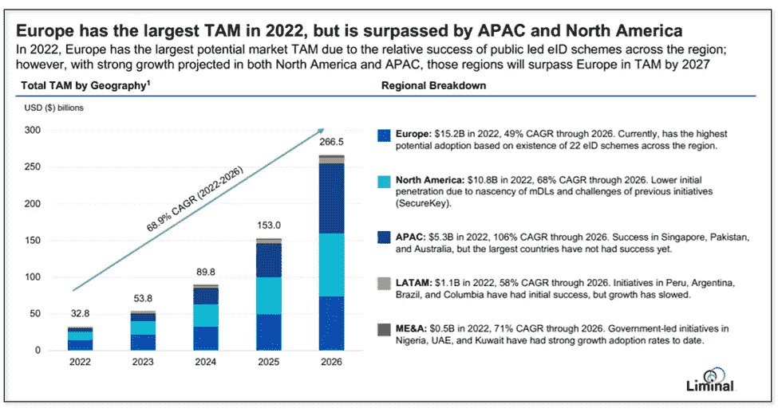
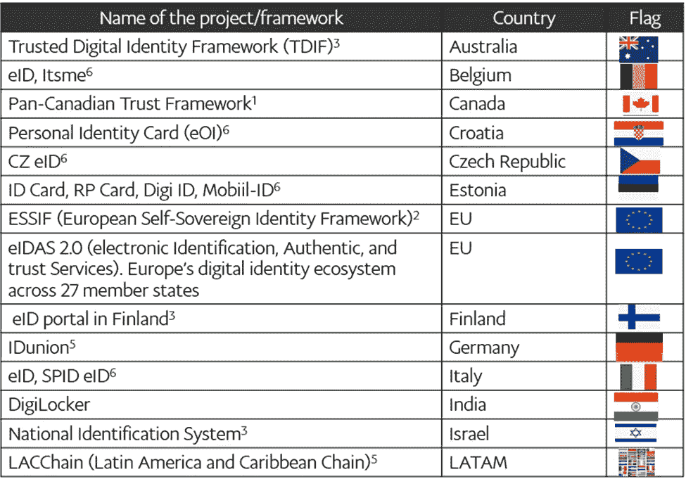
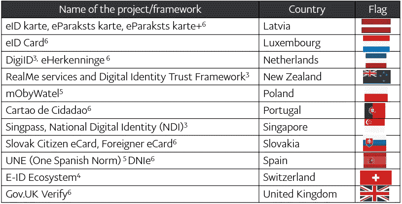

# 面向去中心化身份的区块链—公共部门

> 原文：<https://medium.com/coinmonks/blockchain-for-decentralized-identity-the-public-sector-6977ad05fdbb?source=collection_archive---------11----------------------->

分散身份在政府的公共部门中有着巨大的机会(参见下面正在进行的全球项目)。根据 Liminal 的数据，2022 年 SSI(自我主权身份)的总可寻址市场(TAM)为 328 亿美元，以 68.9%的 CAGR 增长到 2027 年的 2665 亿美元 11。公共部门最初将主导市场，但到 2027 年，私营部门 SSI 将占市场的 60%。公共部门和私营部门之间的合作将推动这一增长。例如，政府及其部门可以有一个许可的区块链，可供乘务员和授权人员使用。

此外，这些有可能被高度治理和监管。大多数情况下，我们从一些受控的政府部门颁发的证书开始。凭证及其声明在公共和私营部门的各种身份验证业务流程中得到使用。

例如，政府机构签发护照和驾照，用于在各种私营部门进行旅行或驾驶汽车的验证。此外，拥有可验证凭证的公民使用中央门户访问政府提供的服务。它消除了各种表单的输入和验证。因此，它的效率更高，错误更少。从下面的例子可以看出，在政府的帮助下，新冠肺炎引发的公共部门的进步正在一些国家进行。

政府还可以用它来跟踪法律文件，例如保存财产契约、税收和公民福利支出的记录。Blockcerts7 是一个开放标准，用于构建发布和验证区块链官方记录的应用程序。这些证书可能包括公民档案、学术证书、职业执照等等。它确保了这些正式记录的互操作性。

> 交易新手？试试[加密交易机器人](/coinmonks/crypto-trading-bot-c2ffce8acb2a)或者[复制交易](/coinmonks/top-10-crypto-copy-trading-platforms-for-beginners-d0c37c7d698c)

一些国家已经通过政府赞助的项目实施数字身份。其他国家采取了混合办法，由私营部门出资。因此，公共和私营部门正在以更高的安全性和隐私性自动验证业务流程中的凭据。

以下是一些正在进行的工作的不完整列表:

*注意:这个列表中的一些还没有实现所有的 SSI 原则。加拿大和欧盟是先进的。*

EBSI(欧洲区块链服务基础设施)是欧盟委员会和欧盟区块链伙伴关系(EBP)8 的合作伙伴。其使命是利用区块链加速公共和私营部门的跨境服务。从 2020 年开始，EBSI 在整个欧盟部署了区块链节点，以验证申请的凭证。此外，它还将区块链技术用于公共部门验证身份信息，从而建立对服务的信任。所有 27 个欧盟国家以及挪威和列支敦士登都支持 EBSI。更多关于欧盟的信息将在下一篇博客中发布。

英国政府在与文化和媒体部(DCMS)协商后，公布了一项计划，通过新的立法在护照和驾照的物理文件中引入数字身份。此外，数字身份和属性办公室(ODIA)将对处理数字身份的公司进行充分的监管 9。

印度有超过 10 亿人口，致力于数字化和存储超过 560 种不同的文档，其中包括 DigiLocker 应用程序中的政府颁发的身份证。在撰写本文时，已经有超过 1 亿的用户采用了它。一些记录包括驾驶执照、教育证书和政府身份证。通过 API，DigiLocker 保存这些文档，保险公司、金融服务等。，接受完成业务流程以提供服务 10。

我们在选举中使用政府颁发的与个人身份相关的文件。如果实施得当，SSI 可以减少选民欺诈，并使系统更高效、更具成本效益。

政府实施 SSI 将对私营部门产生飞轮效应(见即将推出的博客示例)。需要凭证的过程的自动化将具有新的意义和许多可能性。国际可信区块链应用协会(NATBA)是一个在全球范围内促进信任和互操作性的多利益相关方组织，它的成立已经引发了这一现象。

我将在下一篇文章中讨论 SSI 的社会影响。要参考以前的帖子，请参考此[链接](/blockchain-for-decentralized-identity/blockchain-for-decentralized-identity-7ed6d030db1d)。再次，我会建议连续阅读帖子。

**参考文献**

1.【https://diacc.ca/trust-framework/pctf-overview/ 

2.[https://essif-lab.eu/](https://essif-lab.eu/)

3.2022，数字化转型机构；回应新冠肺炎的数字身份；DGX 数字身份工作组；数字政府交换机

4.2022 年 2 月 18 日，Kate Gorien 实施瑞士 SSI 生态系统——双流方法

5.ENISA 报告，数字身份—利用 SSI 概念建立信任

6.SSI 会议介绍 SSI eIDAS 法律报告— Ignacio Alamillo

7.[https://www.blockcerts.org/](https://www.blockcerts.org/)

8. [https://ec.europa.eu](https://ec.europa.eu)

9.英国政府公布全国数字身份计划，IT 专业；康纳·琼斯，2022 年 3 月 11 日

10.印度发布和验证文件的应用程序 DigiLocker 拥有超过 1 亿用户，Manish Singh，TechCrunch，2022 年 3 月 18 日

11.可重复使用身份的市场机会以及如何实现——Liminal 行业报告，2022 年 2 月

**联系人**

领英[https://www.linkedin.com/in/anitarao/](https://www.linkedin.com/in/anitarao/)，

推特@anitaprao，

博客[https://rao-anita.medium.com/](https://rao-anita.medium.com/)

# SSI#分散化 did entity；#区块链；#数字身份；# selfsovereignidentity#身份；# dlt# web3# web3.0# dApps#数字钱包；#分布式边缘