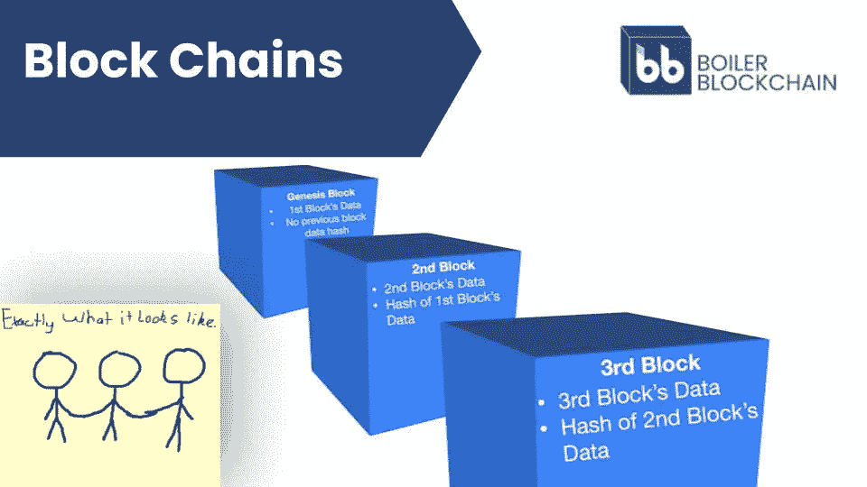
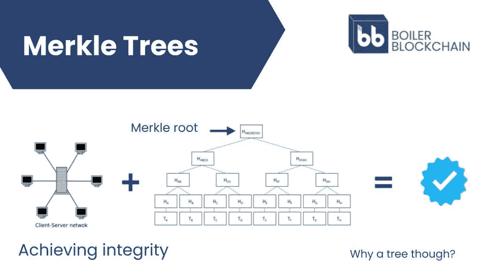
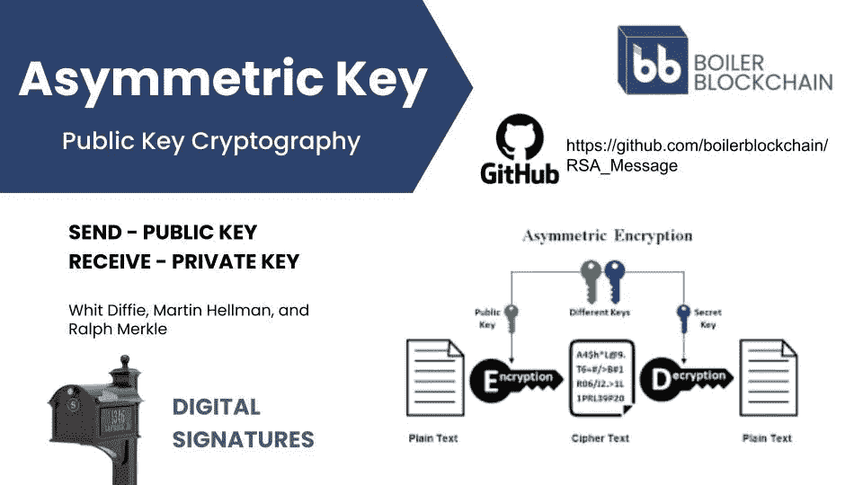
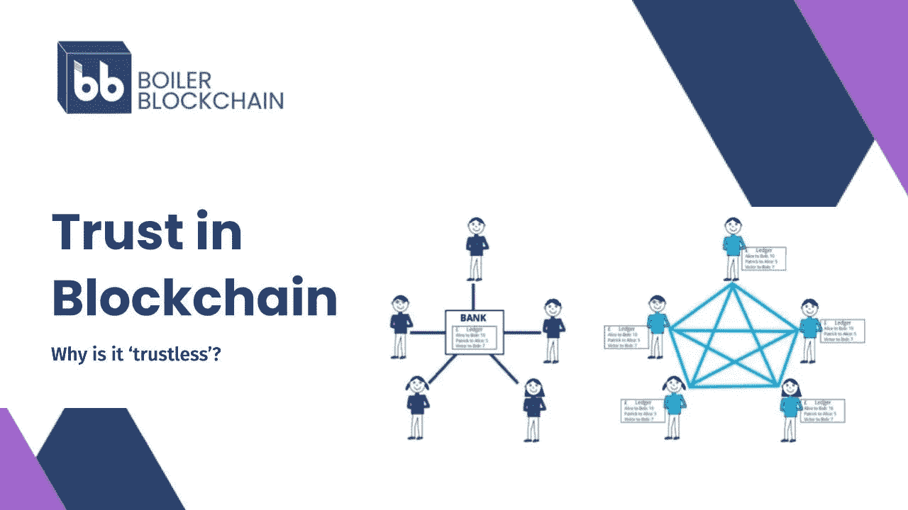

# 区块链基础:密码学和共识协议

> 原文：<https://medium.com/coinmonks/blockchain-fundamentals-cryptography-consensus-protocols-cbd4a24cdf1a?source=collection_archive---------35----------------------->

社区教育是锅炉区块链使命的核心。每周二晚上，我们都会在普渡大学举办一次俱乐部会员大会，讨论一个教育话题。最近，该团队介绍了区块链网络的两个基本组成部分:密码学和共识协议。我们总结了以下要点。

在你潜水之前…

*   如果需要，你可以在这里快速回顾一下区块链是什么。
*   如果您有建议、意见或要求，我们希望听到它们！请给我们留言或在 Twitter (@BoilerChain)上找到我们。

**区块链基础:密码学和共识协议**

最近几个月，许多人都听说过“加密”这个词，无论是从家人、朋友还是新闻中。2021 年底，媒体对加密货币领域给予了特别密切的关注。在此期间，比特币(世界上最受欢迎的加密货币)的价格达到了创纪录的 65，000 美元。使用加密货币购买的不可替代代币也引起了名人、品牌和投资者的极大兴趣。在一片喧嚣中，很少有人问一个开创性的问题:“crypto”这个名字是怎么来的？

答案就在密码学领域，这门艺术人类已经实践了至少[几千年](https://en.wikipedia.org/wiki/Cryptography#History_of_cryptography_and_cryptanalysis)。在计算机出现之前，密码学专注于发送和接收安全信息(想想看:凯撒使用只有罗马军队才能破译的代码与他的将军们交流)。多年来，该领域取得了进步，但计算技术开创了一个真正的密码发现新时代。研究人员和从业者不再只关注信息的保密性，而是利用数学、计算机科学和电子工程来扩大密码学的应用范围。几十年的密码学研究为比特币的匿名创始人中本聪开发并发布著名的[比特币白皮书](https://bitcoin.org/en/bitcoin-paper)铺平了道路。从那里，加密货币诞生了。

幸运的是，你不必成为数学家或计算机科学家就能理解比特币、点对点交易和区块链网络的基础知识。然而，您确实需要了解加密的三个关键组成部分:散列函数、Merkle 树和非对称密钥。让我们依次检查每一个。

*哈希函数*

散列法使得区块链网络不可变(即，不能被改变)。不变性对网络功能至关重要，我们将在本文后面看到。目前，需要理解的重要一点是,“哈希”是指将任何数据输入转换为固定长度输出的过程。

在区块链网络中，新的数据块包含一个链接回前一个数据块的散列。这些哈希是不可逆的，即使是微小的变化也会极大地改变链中的其他环节。因此，区块链网络中的其他节点会很快识别出另一个节点是否发布了与它们的链版本不匹配的数据。

*Merkle Trees*

Merkle 树是区块链网络中组织数据的一种方式。不同的数据元素通过哈希算法链接在一起，创建特定的数据节点。该结构允许区块链系统通过安全有效地验证大量数据来实现完整性。更详细的讲解可以在[这里](https://www.blockchain-council.org/blockchain/what-is-a-merkle-tree/)找到。

*非对称密钥*

非对称密钥加密对区块链功能至关重要。基本概念是生成两个密钥——一个私钥和一个公钥(因此是非对称的)。公钥应该广为人知，但私钥应该只有所有者知道。

非对称密钥支撑着区块链交易和区块链钱包的使用。区块链钱包地址本质上是源于公钥的数字和字母的代码。任何人都可以向该公共地址发送邮件。但是，只有相应私钥的所有者才能控制该钱包中的资产。

当你把以上三个项目放在一起，你就可以开始理解区块链网络是如何运作的，以及它们如何在敌对的环境中实现点对点的互动。

**共识协议:建立信任**

共识协议代表了区块链功能的另一个基础。共识协议旨在克服对等交互的一个关键挑战:信任。对于我们的直系亲属和朋友，信任是理所当然的。如果你请你的朋友吃午饭，他们主动提出还钱，你相信他们会兑现承诺。然而，如果一个陌生人要求同样的待遇，你可能会持怀疑态度。毕竟，你怎么知道陌生人会遵守他们的约定呢？

为了克服信任问题，个人倾向于依靠第三方来协调与他人的交易和交流。银行就是这样一个例子。银行记录账户余额，确保没有人能花掉他们没有的钱。如果我向一个供应商支付 100 美元，但我的银行账户中只有 50 美元，银行将拒绝这笔交易(或者可能向你提供一张高利率的信用卡，但我们跑题了……)。将支票存入你的备用账户也遵循类似的逻辑。在您存入支票后，银行会确保您的帐户余额增加，而汇款人的帐户余额会减少相同的金额。

区块链网络采取了不同的方法。公共区块链网络不依赖第三方中介，而是通过共享的计算机网络分发数据。该网络维护一个公共分类账，让每个人都能看到所有权、余额和交易的可验证记录。这听起来可能很简单，但也带来了一些挑战:

*   网络如何同意发布正确的信息？
*   网络如何防止诈骗和重复消费？
*   网络如何防范攻击？

我们之前提到的比特币创始人中本聪创造了一种创新的方法来克服这些挑战。所谓的中本共识是比特币网络背后的引擎(你可以在这里阅读关于它的深度帖子[)。简而言之，共识协议被称为工作证明。它要求比特币网络中的“矿工”解决数学难题，最终导致数据块之间的联系。该系统激励链接到正确的区块链，并防止网络攻击。由于相关的计算成本，改变已经同意的交易是不可行的。](/nakamo-to/nakamoto-consensus-21cd304f96ff#:~:text=The%20Nakamoto%20Consensus%20Algorithm%20is%20the%20engine%20that,the%20network%2C%20and%20this%20is%20how%20it%20works%3A)

自从比特币网络推出以来，许多人继续建立在纳卡马托共识的基础上。还开发了新的共识协议，包括利害关系证明、历史证明和覆盖范围证明。每种不同的共识协议都有优点和缺点。所有这些都是为了同样的目的而设计的:为分布式区块链网络提供一组通用的程序，以同意向链中添加数据。

***

我们希望您喜欢阅读与区块链技术相关的两个关键概念。你还想了解什么？请在评论或推特上告诉我们(你可以通过@BoilerChain 找到我们)！

> *加入 Coinmonks* [*电报频道*](https://t.me/coincodecap) *和* [*Youtube 频道*](https://www.youtube.com/c/coinmonks/videos) *了解加密交易和投资*

# 另外，阅读

*   [Bookmap 评论](https://coincodecap.com/bookmap-review-2021-best-trading-software) | [美国 5 大最佳加密交易所](https://coincodecap.com/crypto-exchange-usa)
*   最佳加密[硬件钱包](/coinmonks/hardware-wallets-dfa1211730c6) | [Bitbns 评论](/coinmonks/bitbns-review-38256a07e161)
*   [新加坡十大最佳加密交易所](https://coincodecap.com/crypto-exchange-in-singapore) | [购买 AXS](https://coincodecap.com/buy-axs-token)
*   [红狗赌场评论](https://coincodecap.com/red-dog-casino-review) | [Swyftx 评论](https://coincodecap.com/swyftx-review) | [CoinGate 评论](https://coincodecap.com/coingate-review)
*   [投资印度的最佳密码](https://coincodecap.com/best-crypto-to-invest-in-india-in-2021)|[WazirX P2P](https://coincodecap.com/wazirx-p2p)|[Hi Dollar Review](https://coincodecap.com/hi-dollar-review)
*   [加拿大最佳加密交易机器人](https://coincodecap.com/5-best-crypto-trading-bots-in-canada) | [库币评论](https://coincodecap.com/kucoin-review)
*   [用于 Huobi 的加密交易信号](https://coincodecap.com/huobi-crypto-trading-signals) | [HitBTC 审查](/coinmonks/hitbtc-review-c5143c5d53c2)
*   [如何在 FTX 交易所交易期货](https://coincodecap.com/ftx-futures-trading) | [OKEx vs 币安](https://coincodecap.com/okex-vs-binance)
*   [OKEx vs KuCoin](https://coincodecap.com/okex-kucoin) | [摄氏替代度](https://coincodecap.com/celsius-alternatives) | [如何购买 VeChain](https://coincodecap.com/buy-vechain)