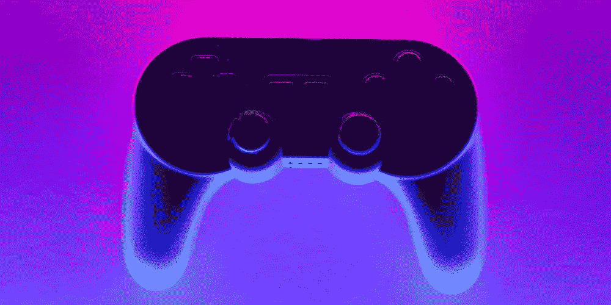

# 区块链游戏:下一个大趋势

> 原文：<https://medium.com/coinmonks/blockchain-gaming-next-big-trend-c8b8377b7122?source=collection_archive---------60----------------------->

Gaming Controller on a Purple Background by By [corelens](https://www.canva.com/p/corelens/)

区块链是游戏行业的最新趋势。区块链博彩公司的理念是利用区块链技术提高博彩交易的完整性，并拥有数字资产。

这使得游戏玩家对他们的交易更有信心，并确保他们的数据是安全的。因此，游戏公司开始采用这项技术，因为它提供了许多好处，如增加信任和透明度。

这些功能有助于改善用户体验、安全性和信任度。此外，区块链博彩也可能为游戏开发商和发行商带来新的收入来源。

# 什么是区块链，它是如何工作的？

简而言之，区块链技术是一种分布式数据库，允许对资产进行安全、透明和防篡改的跟踪。此外，区块链的去中心化架构使其免受攻击，并确保所有数据实时更新。

块是使用加密技术链接在一起的记录的集合。每个块都包含前一个块的加密哈希、时间戳和事务数据。网络上的每个节点都会用新的区块更新其区块链副本，从而创建一个不断增长的数字记录链。

# 区块链在游戏中是如何工作的

游戏已经存在了几个世纪，每一个新版本都有新的玩法。游戏改变的一种方式是通过使用区块链技术。

使用区块链技术的游戏可以在没有第三方的情况下跟踪网络上的所有资产、用户和交易。这使得开发者可以创建一个更安全的游戏环境，同时消除中间商成本。

这使得它成为游戏应用程序的理想工具，这些应用程序经常涉及交换金钱或其他有价值的物品。此外，任何人都可以通过互联网访问该分类帐，这使其成为记录和跟踪游戏数据的完美解决方案。

博彩业规模庞大，每年产生数十亿美元的收入。有这么多游戏可供选择，很难找到真正独特的游戏。但区块链有可能彻底改变我们做生意和与数字世界互动的方式。

几个基于区块链的游戏和平台是可用的，包括 CryptoKitties，分散的土地和沙盒。

区块链在游戏中的首批应用之一是 CryptoKitties，这是一款允许玩家使用加密货币买卖虚拟猫的在线游戏。以太坊区块链被用来跟踪这些交易，使其非常安全。

[**CryptoKitties**](https://www.cryptokitties.co/) 是一款玩家利用加密货币收集并繁殖数字猫的游戏。这款游戏由加拿大公司 [**Axiom Zen Inc**](https://www.axiomzen.com/) 打造。并于 2017 年 12 月下旬发布。

[**分散的土地**](https://decentraland.org/) 是一个虚拟现实世界，它使用区块链技术为其所有资产创建一个不可改变的所有权记录。这些游戏只是开始；已经有计划开发更多基于区块链的游戏。

[**沙盒**](https://www.sandbox.game/en/) 是一个新概念，允许游戏玩家无风险地尝试不同的区块链游戏。沙盒由其他游戏的集合组成，用户无需注册或验证即可访问。沙盒的创造者希望它能帮助人们了解区块链以及如何在游戏中使用它。

区块链在游戏中还有其他一些应用。例如， [**金恩币**](https://enjin.io/enjin-coin) 是一个允许用户创建自己定制的游戏加密货币的平台。这个平台使用[T21 以太坊](https://ethereum.org/en/)区块链来存储用户数据和管理交易。

很快，我们可能会看到区块链技术在游戏中的更多创新应用。

# 区块链游戏中的 NFTs

**不可替代代币(NFTs)是区块链奥运会使用的一种新的数字资产。NFT 是唯一的，其所有者不能更改或转让。这使得它们非常适合游戏应用，因为它们为玩家提供了对游戏中物品的拥有感。**

**NFTs 也可以用来创造更公平的游戏体验。例如，一个玩家可能拥有游戏中所有的剑，但是另一个玩家可能只有一把剑。如果 NFTs 为游戏提供动力，剑的所有者可以在公开市场上出售它，为玩家提供更多的机会来获得对对手的优势。**

**NFTs 已经在几个区块链游戏中实现了。 [**金恩的区块链游戏平台**](https://enjin.io/) 允许开发者创建定制的 NFT 代币，并在他们的游戏中使用。**

# **区块链博彩的优势和挑战**

**区块链技术有可能通过为游戏玩家提供安全透明的交互方式来彻底改变游戏行业。区块链在游戏中的优势包括:**

1.  ****减少欺诈**:区块链上的交易是不可逆的，防止恶意玩家欺骗或窃取信息。**
2.  ****更大的透明度**:区块链上的所有交易都被公开记录，允许玩家验证游戏结果并跟踪玩家进度。**
3.  ****更高效的游戏**:区块链技术可以帮助减少游戏过程中必要的中间商数量，节省玩家的时间和金钱。**

**尽管有这些好处，但在将区块链应用到游戏中时，必须考虑一些挑战。**

**游戏行业区块链面临的最大挑战之一是其颠覆现有商业模式的潜力。为了让区块链技术在游戏中取得成功，开发者需要找到一种方法在不破坏玩家体验的情况下集成它。此外，如果不安全地实施，区块链也可能带来安全风险。**

**大多数区块链应用都专注于金融交易或资产管理。在区块链成为游戏行业的主流之前，还有一些工作要做，但一些令人兴奋的项目已经在进行中。**

**例如，游戏制作者正在测试一个新平台，该平台允许玩家通过向网络贡献他们的计算能力来为他们的游戏赢得奖励。这可能会彻底改变游戏玩家与游戏的互动方式，并产生激励机制，推动更大的参与度和货币化。**

**游戏玩家对区块链技术的颠覆性力量并不陌生。凭借其彻底改变游戏设计、游戏和货币化方式的潜力，有理由相信区块链可能会对游戏行业产生重大影响。**

**这可能会导致更可持续的游戏经济，开发者可以减少对第三方支付处理器的依赖，游戏玩家可以相信他们的支出将用于他们真正想要体验的内容。**

# **结论**

**区块链游戏是一种新的和创新的游戏方式，有许多潜在的应用。它仍处于早期阶段，但一些游戏已经在使用区块链技术。**

**随着技术的发展，越来越多的游戏可能会开始使用它。因此，如果你对游戏或区块链技术感兴趣，你应该看看一些可用的区块链游戏，甚至开始在分散土地或沙盒上开发你的想法。**

> **加入 Coinmonks [电报频道](https://t.me/coincodecap)和 [Youtube 频道](https://www.youtube.com/c/coinmonks/videos)了解加密交易和投资**

# **另外，阅读**

*   **[7 个最佳零费用加密交换平台](https://coincodecap.com/zero-fee-crypto-exchanges)**
*   **[氹欞侊贸易评论](https://coincodecap.com/anny-trade-review) | [火币保证金交易](/coinmonks/huobi-margin-trading-b3b06cdc1519)**
*   **[分散交易所](https://coincodecap.com/what-are-decentralized-exchanges) | [比特 FIP](https://coincodecap.com/bitbns-fip) | [Pionex 评论](https://coincodecap.com/pionex-review-exchange-with-crypto-trading-bot)**
*   **[用信用卡购买密码的 10 个最佳地点](https://coincodecap.com/buy-crypto-with-credit-card)**
*   **[最好的卡达诺钱包](https://coincodecap.com/best-cardano-wallets) | [Bingbon 副本交易](https://coincodecap.com/bingbon-copy-trading)**