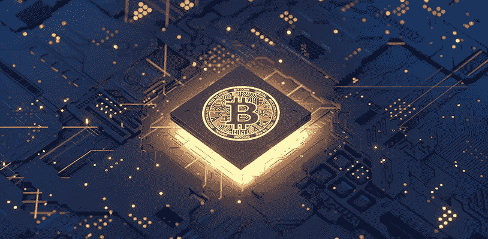

# 2022 年的区块链:将金融服务推向新的高度

> 原文：<https://medium.com/coinmonks/blockchain-in-2022-pushing-financial-services-to-new-heights-a28f105fbb3a?source=collection_archive---------26----------------------->

> 预计区块链技术将在 2022 年蓬勃发展，并改变金融服务，为用户提供尖端体验。

金融行业的一个流行术语是区块链技术。它承诺减少欺诈，确保安全和快速的交易和交易。简而言之，它有助于在相互关联的全球金融体系中管理风险。先进的加密技术有助于区块链基于抗黑客攻击和交易生态系统内信任的整合来实现这些目标。

## **区块链是什么概念？**

区块链是去中心化网络中被记录和跟踪的交易的数字积累。没有网络中心授权的分布式分类帐是其独特之处。它禁止单个个人或实体导致网络崩溃。每个块包含按时间顺序连接的数据块，并包含信息记录。不能修改链接的特征建立了网络内部的信任。[区块链是一个颠覆性的解决方案](https://www.indusnet.co.in/disruptive-innovation-payments/)，用于管理数据交易并实时保护它们。它旨在降低交易成本，提高效率。

## **区块链技术在金融行业的应用**

区块链是一种分布式、去中心化的公共账本，用于记录跨多台计算机的单个网络内的交易。由于其属性和设计，它是透明的、安全的，并且几乎不可更改。在金融行业，下划线技术确保了货币交易的可靠性和安全性。

它提供了多种优势，可在 2022 年将金融服务推向新的高度，具体取决于以下特性:

*   **不变性:**区块链技术提供了按时间顺序排列的准确的交易历史，不能被擦除或更改。
*   **分配:**该网络由大量重复的总账组成。在每一个新的交易之后，一个块被添加，并且一个新的拷贝被发送给网络中的每个人。它向每个人提供类似的信息，禁止任何特定个人的额外访问。

## **2022 年区块链技术将如何把金融服务推向新的高度？**

不可变和分布属性今年将在以下方面为金融服务带来主要好处:

**转账**

金融公司和个人在向其他国家汇款时面临巨大障碍。国际汇款既费时又费钱，而且容易出错。使用区块链技术进行国际支付可以帮助缓解一些问题。2022 年，通过移动设备的[区块链资金转移](https://www.infosys.com/industries/cards-and-payments/resources/documents/cross-border-money-transfer.pdf)将允许用户完成这一过程，而不必面对麻烦。

**划算的直接支付**

大多数金融交易是由信用卡处理中心和银行处理的。人们发现，每一个过程都增加了额外的复杂性，导致成本增加。区块链有可能降低电子支付的相关费用，同时简化转账流程。它还提供支付状态的实时信息。它还提供了支付可逆性选项，这有助于防止诈骗。

**金融新增**

客户们目前正在避开银行的喧嚣和排队。因此，他们期待着替代金融服务的出现。他们还必须应对最低余额要求、银行费用和有限的准入。为了让客户免受这些问题的困扰，区块链获得了使用移动设备和数字身份的能力。最终，几家银行正在鼓励将区块链技术整合到他们的服务中，以此作为启动重大变革的一种方式。

**加密货币**

数字货币是最新一代的资产，完全基于区块链技术。通过降低准入门槛，区块链使执行顺畅的数字货币交易成为可能。随着时间的推移，预计它将在 2022 年下半年表现得比银行更好。

**减少欺诈和增加安全性**

众所周知，区块链将信息存储在分布式分类账中，由每个区块中的交易信息组成，每个区块都有链接到前一个区块的唯一哈希。网络中的每个人都获得交易的副本。这就是区块链如何防止像分布式拒绝服务(DDoS)和黑客产生网络欺诈这样的网络攻击。

**区块链技术在金融服务中的未来**

面对严格的限制和规则，金融机构看到了区块链技术的潜力。金融业的主要参与者正在进行测试，以确定创新潜力和用例。这是区块链未来增长的一个信号，因为它有能力提供易于访问、透明和可靠的金融解决方案。

> *加入 Coinmonks* [*电报频道*](https://t.me/coincodecap) *和* [*Youtube 频道*](https://www.youtube.com/c/coinmonks/videos) *了解加密交易和投资*

# 另外，阅读

*   [Bookmap 评论](https://coincodecap.com/bookmap-review-2021-best-trading-software) | [美国 5 大最佳加密交易所](https://coincodecap.com/crypto-exchange-usa)
*   最佳加密[硬件钱包](/coinmonks/hardware-wallets-dfa1211730c6) | [Bitbns 评论](/coinmonks/bitbns-review-38256a07e161)
*   [新加坡十大最佳加密交易所](https://coincodecap.com/crypto-exchange-in-singapore) | [购买 AXS](https://coincodecap.com/buy-axs-token)
*   [红狗赌场评论](https://coincodecap.com/red-dog-casino-review) | [Swyftx 评论](https://coincodecap.com/swyftx-review) | [CoinGate 评论](https://coincodecap.com/coingate-review)
*   [投资印度的最佳密码](https://coincodecap.com/best-crypto-to-invest-in-india-in-2021)|[WazirX P2P](https://coincodecap.com/wazirx-p2p)|[Hi Dollar Review](https://coincodecap.com/hi-dollar-review)
*   [加拿大最佳加密交易机器人](https://coincodecap.com/5-best-crypto-trading-bots-in-canada) | [库币评论](https://coincodecap.com/kucoin-review)
*   [用于 Huobi 的加密交易信号](https://coincodecap.com/huobi-crypto-trading-signals) | [HitBTC 审查](/coinmonks/hitbtc-review-c5143c5d53c2)
*   [如何在 FTX 交易所交易期货](https://coincodecap.com/ftx-futures-trading) | [OKEx vs 币安](https://coincodecap.com/okex-vs-binance)
*   [OKEx vs KuCoin](https://coincodecap.com/okex-kucoin) | [摄氏替代度](https://coincodecap.com/celsius-alternatives) | [如何购买 VeChain](https://coincodecap.com/buy-vechain)