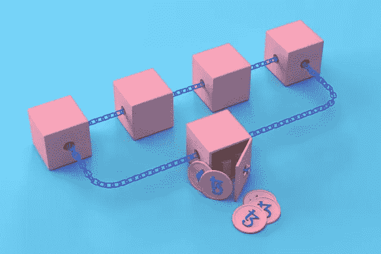

# 会计中的区块链。怎么用？

> 原文：<https://medium.com/coinmonks/blockchain-in-accounting-how-can-it-be-used-a7180e08b5d8?source=collection_archive---------52----------------------->

2022 年 5 月 15 日[(编辑)](https://stage.blufolio.indulgemedia.co.uk/wp-admin/post.php?post=2142&action=edit)

许多迹象表明，基于新技术的会计，包括区块链技术，是不远的将来。使用分布式分类账和智能合约记账可以显著改善企业的运作。但是，**区块链怎么用在会计上**？它在哪些任务中找到应用程序？这些和其他问题的答案可以在文章的下一部分找到。

会计中的区块链实例

# 会计界的区块链是什么？

区块链可以被称为数字的、分散的分类账，其中数据存储在相互关联的块中。新记录由节点或用户添加，其数量是无限的。用户可以位于世界上的任何地方。在分散记录中没有控制权限，所有过程都是自动发生的。

区块链的操作基于几种机制，这些机制使得存储在其上的数据几乎完全不会被篡改。其中之一是工作证明(PoW)，或共识算法。区块链的安全也受到其主要优势之一，即权力下放的影响。权力下放确保区块链不会被移走或接管。

# 会计中的区块链技术

使用分布式分类账记账使得登记簿中的数据不可擦除且不可替换。此外，所有数据都是实时更新的。这保证了透明度和问责制。数字区块链数据库高效稳定，包含详细的、按时间顺序组织的、不可更改的交易相关信息。

同样重要的是，会计中的**区块链**也意味着许多流程的自动化和几乎完全消除人为错误。此外，容易获得最新和真实的信息，防止操纵，以及更高的工作效率也是优点。

# 区块链在会计上的好处

虽然区块链技术目前在会计行业没有得到充分利用，但很难不看到它的潜力。使用它可以保护数据并以电子形式安全发送。这可能是消除会计办公室中流通的纸质文件的又一步骤。

因此，会计领域的区块链技术可用于各种任务，无论是保存日常账目还是执行审计。集中式数据存储通常使用文件夹和电子表格来完成，会计人员可以在其中输入信息。希望访问数据库的主管或客户必须提出适当的请求，然后等待会计师找到并向他们提供所需的记录。在现代会计模式中，情况有所不同。所有实时更新的数据都存储在一个分布式账本中，每个相关方都有一份相同的副本。此外，区块链上的记录在进入网络时是加密的，并精确地打上了时间戳。

**契约也是其使用的一个重要方面**。在区块链起草的协议实时更新，交易也很快。与纸质合同不同，它们不容易出现人为错误或打字错误。智能合同本身控制着商业流程，并验证记录的正确性。**智能合同在会计中的使用可以用于，例如，向员工自动付款，前提是已经过了一定的时间或者员工已经完成了特定的任务**。

# 会计中的区块链实例

会计和税务领域的四大一直对基于区块链网络的解决方案感兴趣。德勤、安永、普华永道和毕马威甚至在我们大多数人知道区块链是什么之前就开始投资分布式账本技术了。许多这样的公司已经有了他们的原型区块链。互联网和 IT 行业最进步的代表也采用现代技术。

与此同时，加密货币融入全球金融机构的步伐正在加快。此外，州政府越来越多地引入或计划引入数字货币，以获得商业优势。

> 加入 Coinmonks [电报频道](https://t.me/coincodecap)和 [Youtube 频道](https://www.youtube.com/c/coinmonks/videos)了解加密交易和投资

# 区块链会计面临的挑战

实施以区块链为基础的会计制度还可以降低维护成本。**因此，所有迹象表明，随着会计行业在企业家中获得认可，会计行业将不得不调整其服务以适应这一趋势。此外，在会计、数据存储和区块链技术的工作流程方面引入一个新的组织当然也是一个挑战。提高效率，减少错误，消除欺诈或精简审计，肯定会使区块链在未来几年成为会计行业的一部分。**

在 ir@blufol.io 上询问我们