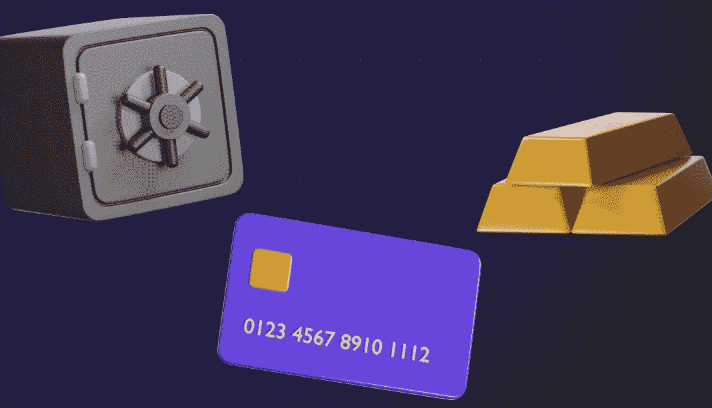

# 银行业中的区块链

> 原文：<https://medium.com/coinmonks/blockchain-in-banking-146a3d88f3e1?source=collection_archive---------34----------------------->

除了加密货币，区块链应用最受欢迎的领域是金融领域。

每个银行公司都应该独立地不断检查和核对数据，以维护其数据库中数据的相关性。当需要双向交换时，这些过程太慢且无效。区块链可以通过使其成为交易处理例程的一部分来大大简化数据对账过程。

降低成本也提高了银行系统的效率。由于新业务模式和区块链产品的出现，银行可以创造额外的收入来源。

# 区块链在银行业的优势

**实现更快、更便宜的转账**

这对于跨境转账和小额支付尤其有利，因为银行手续费与转账金额相当。

在银行，这种交易需要很长时间(长达 3-5 个工作日)并且很昂贵(从金额的 1%开始)。

**不可能伪造数据**

几乎每天你都能听到一些黑客从一些银行账户里偷钱。这主要是因为信息容易获取。银行业的区块链让访问数据和窃取信息成为不可能。问题是，新块的代码不同于其他块的序列，不可能重写整个链。

**自动化流程和快速处理交易的能力**

这可以让你减少成本和人员。区块链让摆脱复杂的单据流转成为可能，因为任何操作都是可以追溯的。技术本身保证了数据的不变性，排除了人为因素。

**确保交易的不变性**

不能追溯更改和伪造报告。银行系统不透明。区块链将使所有行动更加透明，并增加所有参与者之间的信任度。

# 银行业中区块链的弊端

区块链的本质在于分权，而银行体系的本质在于完全集权和完全控制。

如果区块链不负众望，银行将能够更快、更便宜、更容易地提供服务，这将导致它们的收入下降。此外，数百万份工作可能面临风险。

尽管现有银行体系存在严重缺陷，但它有其优势:

*   发达的监管框架，
*   存款保险，
*   取消错误交易的能力，
*   在黑客攻击的情况下接收退款的能力。

区块链网络还不具备这一切。相反，他们有需要解决的问题:可伸缩性、带宽和安全性的问题。

我们专门从事[区块链开发](https://crypton.studio/blog/Blockchain-in-Banking)。我们已经做了 100 多个不同的项目。联系我们，让我们一起开始你的项目！ [https://crypton.studio](https://crypton.studio)

> 加入 Coinmonks [电报频道](https://t.me/coincodecap)和 [Youtube 频道](https://www.youtube.com/c/coinmonks/videos)了解加密交易和投资

# 另外，阅读

*   [折叠 App 回顾](https://coincodecap.com/fold-app-review) | [本地比特币回顾](/coinmonks/localbitcoins-review-6cc001c6ed56) | [Bybit vs 币安](https://coincodecap.com/bybit-binance-moonxbt)
*   [加密保证金交易交易所](/coinmonks/crypto-margin-trading-exchanges-428b1f7ad108) | [赚取比特币](/coinmonks/earn-bitcoin-6e8bd3c592d9) | [Mudrex 投资](https://coincodecap.com/mudrex-invest-review-the-best-way-to-invest-in-crypto)
*   [WazirX vs coin dcx vs bit bns](/coinmonks/wazirx-vs-coindcx-vs-bitbns-149f4f19a2f1)|[block fi vs coin loan vs Nexo](/coinmonks/blockfi-vs-coinloan-vs-nexo-cb624635230d)
*   [比斯勒评论](https://coincodecap.com/bitsler-review)|[WazirX vs coin switch vs coin dcx](https://coincodecap.com/wazirx-vs-coinswitch-vs-coindcx)
*   [7 大副本交易平台](https://coincodecap.com/copy-trading-platforms) | [BuyCoins 点评](https://coincodecap.com/buycoins-review)
*   [XT.COM 评论](https://coincodecap.com/profittradingapp-for-binance) | [币安评论](https://coincodecap.com/xt-com-review)