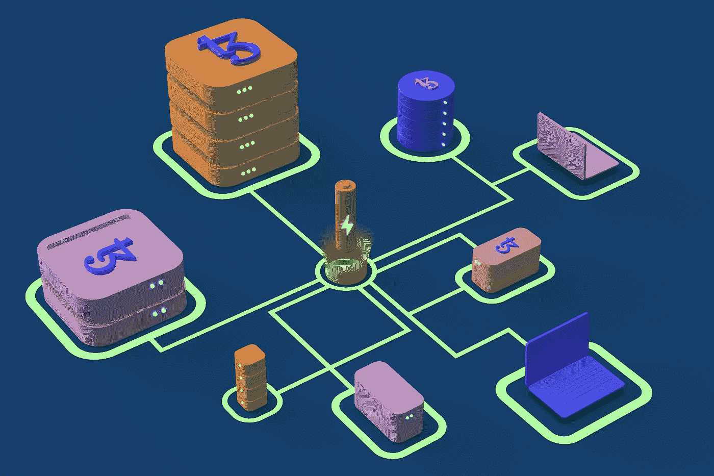

# 深度区块链:主节点，它们是什么？

> 原文：<https://medium.com/coinmonks/blockchain-in-depth-master-nodes-what-are-they-52088807060f?source=collection_archive---------27----------------------->

## 为什么主节点对利益证明算法如此重要？

Photo by [Tezos](https://unsplash.com/@tezos?utm_source=medium&utm_medium=referral) on [Unsplash](https://unsplash.com?utm_source=medium&utm_medium=referral)

# 什么是主节点？

## 主节点自成一类，被认为是节点的“黄金标准”。