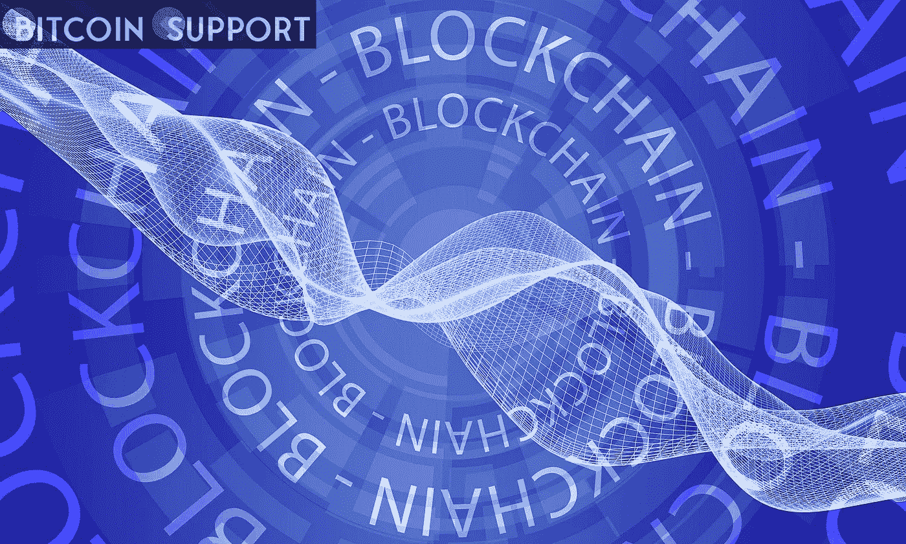

# 欧洲医疗保健中的区块链:六大要点

> 原文：<https://medium.com/coinmonks/blockchain-in-european-healthcare-six-crucial-takeaways-acf97b6b6291?source=collection_archive---------67----------------------->

**Visit our website for full blog:-**[**https://bitcoinsupports.com/blockchain-in-european-healthcare-six-crucial-takeaways/**](https://bitcoinsupports.com/blockchain-in-european-healthcare-six-crucial-takeaways/)

The European Union’s Blockchain Observatory foresee distributed ledger technology ushering in the era of Healthcare 4.0.

The EU Blockchain Observatory just released its sixth study, titled “Blockchain Applications in Healthcare.” The document emphasises the critical nature of distributed ledger technology for the European healthcare sector, which is now facing a number of obstacles on its path to “Healthcare 4.0.”

On April 11, the EU Blockchain Observatory announced the publication of the 66-page document through Twitter. The authors adopt a positive view on blockchain technology’s implementation in healthcare, emphasising its compliance with “Healthcare 4.0” fundamental characteristics such as interoperability, virtualization, decentralisation, real-time capabilities, service orientation, and modularity. The following are seven significant findings from the report.

**An ageing system, new difficulties**

The healthcare sector becomes more complex as it becomes more knowledge-based — the abundance of tools and processes also makes it more prone to errors. As a result, having a flexible and digitalized knowledge and data management system is critical. Such a system should enable patients to easily and intuitively access their own health information, as their interest in doing so continues to grow.

And, of course, there is an enduring issue — the data housed in today’s healthcare systems is frequently segregated. According to the paper, a well-designed healthcare application built on a distributed ledger can address a number of these difficulties.

**Centralization, as it should be**

While some centralization is desirable in healthcare, efficient centralization is difficult to achieve. As a result, DLT becomes a nearly inescapable solution. For instance, as the research notes, distributed ledgers might be used to track the usage of medical equipment by healthcare facilities, identifying device shortages or surpluses in various geographic locations, or to direct patients to the facilities best equipped to treat them.

**Combating counterfeiting**

Perhaps the most generally acknowledged benefit of blockchain in healthcare is its capacity to combat counterfeiting — a historically sensitive issue for the industry — by tracking the data associated with each and every item in the supply chain. The paper verifies this characteristic once more, emphasising the logistical benefits as well:

**“By utilising blockchains as a ledger for tracking provenance, vaccinations and other life-saving drugs can be tracked and monitored from their origin to their current locations, hence eliminating medication misplacement or mislabelling and the possibility of counterfeit.”**

In the face of epidemic outbreaks such as the one humanity has just encountered, this capability may become critical for both national and global healthcare systems.

**To go worldwide, adopt blockchain technology.**

Human health is a critical issue that will require the broadest possible worldwide engagement. Again, the blockchain technology comes to the rescue with its capacity to automate the exchange of information on a huge scale.

As with any other high-tech business, healthcare’s future is in artificial intelligence (AI) and machine learning. When data about medical use cases from a variety of organisations is consolidated, it can be utilised to train machine learning algorithms:

**“Blockchain mitigates the difficulties associated with federated learning and enables fairness, accountability of processes, threat mitigation, and organisational collaboration by serving as a global model from locally trained models and allowing model exchange without transferring the dataset.”**

**Data security**

The analysis casts doubt on the premise that blockchain is incompatible with the required privacy for patient data due to the immutability of data stored in distributed ledgers. According to the authors, blockchain technology might be used in conjunction with an off-chain solution:

**“To comply with GDPR, products can leverage blockchain as a layer above databases, allowing for the monitoring of data exchange transactions and access to information while keeping all personal health data off the blockchain.”**

**A heartening conclusion**

In general, the report’s authors recommend the European Commission to enable future legislation that promotes innovation in health information technology, such as blockchain. They emphasise the DLT’s potential to be more than technology infrastructure; they envision it as a new way to regulate data interactions and a vehicle for economic progress.

A potential challenge to blockchain-based innovation could come from legislators, who could stymie the technology’s adoption by enacting overly conservative regulatory restrictions. As a result, the paper argues for periodic review of legislation to ensure they remain current with the latest debates and advancements around DLT:

**“Supervision of decentralised blockchain technologies demands a fresh viewpoint and ongoing education on new developments in order to identify how to integrate this technology into existing and future legal frameworks.”**

The European Blockchain Observatory is a European Commission initiative aimed at facilitating blockchain innovation and igniting discussion among European stakeholders around distributed ledger technology.

**Visit our website for full blog:-**[**https://bitcoinsupports.com/blockchain-in-european-healthcare-six-crucial-takeaways/**](https://bitcoinsupports.com/blockchain-in-european-healthcare-six-crucial-takeaways/)

**Disclaimer: These are the writer’s opinions and should not be considered investment advice. Readers should do their own research.**

> 加入 Coinmonks [电报频道](https://t.me/coincodecap)和 [Youtube 频道](https://www.youtube.com/c/coinmonks/videos)了解加密交易和投资

# 另外，阅读

*   [TraderWagon 回顾](https://coincodecap.com/traderwagon-review) | [北海巨妖 vs 双子星 vs BitYard](https://coincodecap.com/kraken-vs-gemini-vs-bityard)
*   [如何在 FTX 交易所交易期货](https://coincodecap.com/ftx-futures-trading) | [OKEx vs 币安](https://coincodecap.com/okex-vs-binance)
*   [OKEx vs KuCoin](https://coincodecap.com/okex-kucoin) | [摄氏替代品](https://coincodecap.com/celsius-alternatives) | [如何购买 VeChain](https://coincodecap.com/buy-vechain)
*   [ProfitFarmers 点评](https://coincodecap.com/profitfarmers-review) | [如何使用 Cornix 交易机器人](https://coincodecap.com/cornix-trading-bot)
*   [如何匿名购买比特币](https://coincodecap.com/buy-bitcoin-anonymously) | [比特币现金钱包](https://coincodecap.com/bitcoin-cash-wallets)
*   [瓦济里克斯 NFT 评论](https://coincodecap.com/wazirx-nft-review)|[Bitsgap vs Pionex](https://coincodecap.com/bitsgap-vs-pionex)|[坦吉姆评论](https://coincodecap.com/tangem-wallet-review)