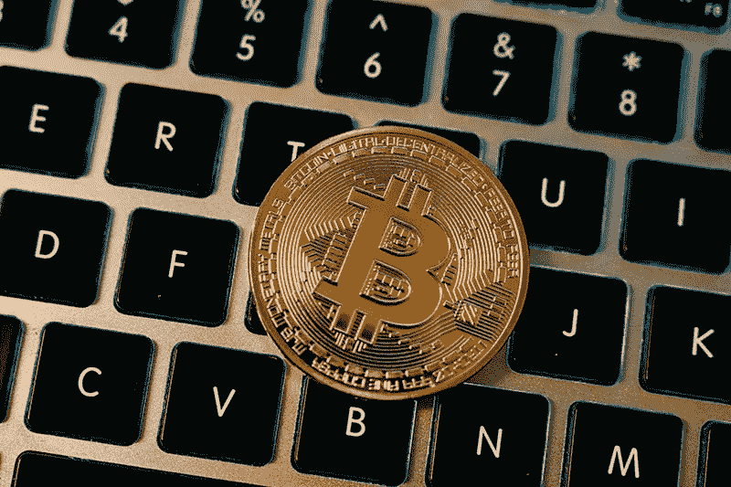
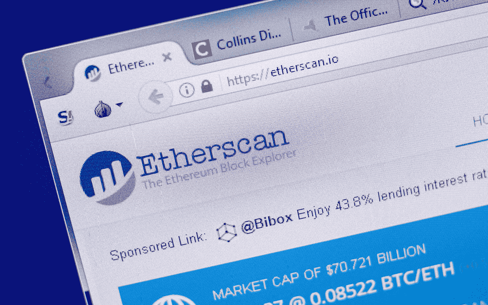
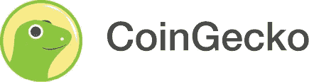
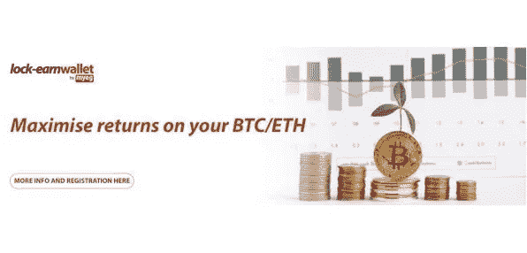

# 马来西亚的区块链

> 原文：<https://medium.com/coinmonks/blockchain-in-malaysia-a4fb7785d91c?source=collection_archive---------25----------------------->

人们不会因为认为马来西亚在采用区块链技术方面落后于潮流而受到指责。作为加密货币的普通投资者，我当然是这么认为的。鉴于对币安等交易平台的禁令，以及马来西亚对数字资产的严格监管，我的自然假设是，马来西亚政府不打算在短期内接受区块链技术，从而抑制了该领域的创新。

伙计，我错了。

这篇文章简要地介绍了一些在马来西亚和即将在马来西亚出现的有前途的和成熟的与区块链有关的项目。

***以太扫描***

如果你在区块链和加密货币的世界里呆上一分钟，你肯定会遇到 Etherscan。

以太扫描本质上是以太坊网络的区块链探索者，以太坊网络是市值第二大的加密货币，它允许用户以整洁的索引和可展示的方式查看以太坊区块链上的链上数据，如公共钱包地址、钱包地址的交易历史、实时发生的交易、智能合同等。

他们是**区块链以太坊的**搜索引擎，在这里可以找到区块链以太坊公开记录的任何东西。以太扫描每月拥有超过 500 万用户，是以太坊社区发展的坚实基础，也是确保区块链以太坊透明度的关键。

大多数人不知道的是，以太扫描由 Matthew Tan 于 2015 年创立，总部完全设在马来西亚。

**

*由 TM Lee 和 Bobby Ong 在马来西亚创建的 CoinGecko 的崛起确实是一个鼓舞人心的故事。两人在 2014 年开始了这个项目，最初投资 100 美元。当时，两位创始人都还在从事全职工作。时至今日，CoinGecko 是完全自举的，也就是说 CoinGecko 完全由创始人和业务本身产生的收入资助。*

*CoinGecko 可以获取、跟踪和展示超过 7000 种加密货币的相关数据。他们被称为*数据聚合器*。您将能够在 CoinGecko 的网站上找到关于市场上几乎任何加密货币的各种数据点，包括加密货币的价格、市值、交易量和其他不太常见的指标，如围绕项目的社区增长和开源代码开发，CoinGecko 认为这对于评估任何加密货币至关重要。*

*CoinGecko 每月有超过 2 亿的页面浏览量，现在被认为是世界上最大的独立数据聚合商，该公司自豪地保持着这一声望。*

*Bitwise Asset Management 在 2019 年的一份报告中强调，比特币上 95%的交易量是假的。这些发现得到了包括中国国家互联网金融协会(NIFA)在内的各方的响应。2020 年，币安收购了业内最大的数据聚合商 CoinMarketCap，这进一步加剧了人们对数据聚合平台上数据操纵的担忧。许多人过去和现在都担心，币安的个人利益可能会损害 CoinMarketCap 数据的完整性。*

*输入 CoinGecko。该公司承诺完全独立和中立。*

*以人为本、独立透明。马来西亚的失败者有能力与该行业的巨头一起登台吗？*

***马来西亚疫苗接种认证***

**

*在马来西亚疫苗证书被伪造的事件曝光后，我发现马来西亚政府利用区块链技术来跟踪和验证我们的疫苗证书。*

*疫苗管理系统(VMS)是更广泛的国家区块链路线图的一部分，旨在将区块链等先进技术融入经济。*

*渔船监测系统是由财政部全资拥有的公共实体 MIMOS 开发的。VMS 主要跟踪疫苗接种过程中的两个组成部分*

1.  *疫苗物流:每种疫苗从制造商到分销商，再到诊所或医院的旅程；和*
2.  *疫苗接种后和疫苗接种证明:以安全的方式存储和记录个人的疫苗接种状态，并且信息不能被修改并且可以容易地被检索到(MySejahtera)。*

*在区块链分类账中记录和存储疫苗接种信息有助于确保个人数据的安全，并防止假冒疫苗接种证书被使用。*

***MyEG Lock-Earn Wallet DeFi Services***

**

*DeFi 或分散金融指的是在分散的区块链网络上提供的金融产品和服务。DeFi 重新创建了传统的金融系统，如贷款和借款，但以分散的方式进行，即不需要中央机构(如银行)的监督、批准和昂贵的费用。*

**挑战传统银行业**

*说到借款，传统上你必须走进一家银行，申请贷款，确保你有良好的信用评分，并为你打算借款的金额提供抵押品。根据你的信用评分和抵押品的数量，利率可能会很高。*

*然而，DeFi lending dApps 允许用户在没有任何 KYC(了解你的客户)或第三方批准的情况下以较低的利率借款(一些 dapp 甚至提供 0%的利率)。这里唯一的问题是，行业惯例是对借款金额提供 150%的超额抵押。这确保了贷款偿还是安全的。虽然还没有广泛流行，但 DeFi 特别有用，因为它是那些无法通过传统银行系统获得贷款的人的可行替代方案。相反，DeFi dApps 还允许用户将他们的加密货币借出并赚取利息。*

*MyEG 现在是第一个进入马来西亚 DeFI 领域的主要机构。锁定赚取计划本质上允许加密货币持有者(在受监管的 DAX 上)将他们的比特币或以太坊存储在锁定赚取钱包中，以换取 6%的年化租赁费。然而，有一个 1-3 个月的锁定期。*

***玩赢游戏***

**

*“玩即赚”( P2E)游戏最近在这个领域风靡一时。谁会想到玩游戏会得到报酬？一些人仍然质疑这怎么可能。*

*通过发行每个游戏固有的代币，玩家能够在玩游戏时赚取代币。这些代币可以在公开市场上买卖——这是赚钱的地方。这个领域仍处于起步阶段，目前正经历一段艰难时期。大多数代币已经跌至历史最低点，并试图恢复。至少可以说，我们仍然没有找到一个可持续的游戏。*

*尽管如此，P2E 空间已经产生了一些有趣的机会，导致了 P2E 行会的出现。*

*不像你的传统游戏公会或部落，P2E 公会有额外的动机和赚钱的目标。这些公会通过购买各种游戏内资产或 NFT 向各种 P2E 游戏投入数十万美元。最近，澳大利亚公会 Polemos 成功筹集了 200 万美元用于即将到来的游戏 Illuvium。随着这些类型的投资进入游戏公会，一个新的游戏时代即将到来，这个时代将由专注于提高收入的富裕公会主导。*

*一些著名的 P2E 行会就在我们自己的后院成立。*

*马来西亚游戏公会 Genxies 积极关注 Pegaxy 和 Axie Infinity，在其 Discord 服务器上有一个超过 1700 人的不断增长的社区。像 Genxies 这样的 P2E 行会购买游戏资产(NFTs ),然后“贷款”给他们的学者。然后，学者们利用 NFT 来玩游戏并获得代币。然后利润在行会和学者之间分配。随着积极的兴趣分支到各种游戏和其他潜在领域的空间，这将是令人兴奋地看着 Genxies 和其他马来西亚 P2E 公会在未来几年扩大。*

***最后的想法***

*马来西亚在社区和国家层面都取得了意想不到的进步，将区块链技术融入我们的日常生活。虽然该领域人才短缺，但马来西亚人显然渴望探索和穿越这个充满机遇的新市场。*

*分析师认为，区块链技术可以在未来十年将全球国内生产总值提高 1.76 万亿美元，政府在财政和政策层面的持续支持对于确保区块链相关技术在马来西亚的持续发展至关重要。*