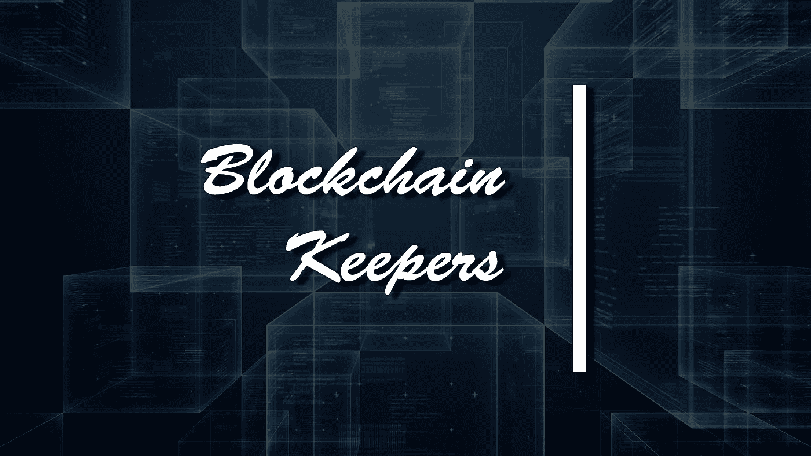

# 区块链守护者——让网络保持清醒

> 原文：<https://medium.com/coinmonks/blockchain-keepers-keep-the-network-awake-faed96126305?source=collection_archive---------8----------------------->

*“山核桃小船坞。老鼠爬上时钟
时钟敲了一点。老鼠走下
山核桃小船坞*

但是，等等，这里的鼠标有一个问题，我们不是正在向 WEB3 发展吗？不是所有的事情都使用智能合约来完成吗？他如何跟踪何时将时钟上移。智能合约是完整的，它们是安全的，它们可以解决协议等等。但事实仍然是，智能合约不能自己执行，智能合约中执行功能的唯一方式是使用事务。最终看来，聪明的合约并没有那么聪明(不相信我？见下面维塔利克本人的推文)

智能合约本身不能在任意时间或任意条件下触发或启动自己的功能。只有当事务由另一个帐户(如用户、oracle 或合同)启动时，才会发生状态更改。为了执行功能，因此有必要从另一个帐户启动它们。

不，这似乎是一个简单的问题，部署一个调用所需函数的客户机是轻而易举的事情。但这里需要回答的问题是，我们如何维持信任。我们怎么能相信一段向我们承诺“诚实”工作的外部代码呢？难道这不是唯一的原因吗，去中心化首先变得如此广泛地被使用？当推特上所有的密码朋克不停地讨论时，管理员给了我们想要的完美解决方案。

使用 Keepers，开发人员不需要执行手动流程，不需要依赖集中式服务，也不需要实施深入的协议更改来围绕预定义的条件自动化链上功能——他们可以简单地外包工作。

在所有实现 Keeper 的工作中，Chainlink 在以太坊主网上部署了 Keeper 智能合约，占据了中心位置。

 [## 链节保持器介绍

### 智能合约本身不能在任意时间或任意条件下触发或启动自己的功能…

doc . chain . link](https://docs.chain.link/docs/chainlink-keepers/introduction/) 

Chainlink 及其 oracle 服务已经为混合智能合约打开了大门，这种合约利用链外计算和链上验证来实现无人能想到的智能合约功能。管理员只是完成了整个混合智能合同工作中缺少的一部分。

Chainlink Keepers 标志着一系列离线计算服务的重大升级，混合智能合约开发人员可以通过 chain link Decentralized Oracle Networks(DONs)获得这些服务，特别是基于预定义条件的自动化智能合约功能。开发人员可以创建与 Keeper 兼容的智能契约，指示链节 Keeper 使用它们的可靠性代码来验证各种条件，然后用离线计算的输入来广播事务，以触发链上功能。保管员的工作可能各不相同，从在交易所执行限价单，每周在特定时间调用一次产量收获功能，到更高级的用例，如在需要时随时从用户转移资产。

 [## Chainlink 推出加密“保管者”和反欺诈区块链桥

### “它分散了代码，分散了控制代码的所有系统。因为如果…

www.coindesk.com](https://www.coindesk.com/tech/2021/08/05/chainlink-unveils-crypto-keepers-and-anti-fraud-blockchain-bridges/) 

Chainlink Keepers 使用可信的分散式提供商网络，这些提供商已经在为 Chainlink 价格馈送提供服务，并且已经被证明对 Keepers 来说是安全和诚实的。这些节点是基于具有内置的基于时间的自动故障转移的轮换作业的框架来选择的，以避免由于竞争作业而导致的用户成本上升。因此，链节保持器确保了高正常运行时间、低成本、分散执行、透明信誉和可扩展计算。

总的来说，这些保持器为用户提供了自动执行智能合同功能的能力，而不必手动发送交易。这允许在保持区块链网络完整性的同时，使用任何人都想不到的用例。因此，守门员被证明是区块链领域最有趣的创新之一，这在大肆宣传的情况下很难实现。

> 加入 Coinmonks [电报频道](https://t.me/coincodecap)和 [Youtube 频道](https://www.youtube.com/c/coinmonks/videos)了解加密交易和投资

## 另外，阅读

*   [加密保证金交易交易所](/coinmonks/crypto-margin-trading-exchanges-428b1f7ad108) | [赚取比特币](/coinmonks/earn-bitcoin-6e8bd3c592d9) | [Mudrex 投资](https://blog.coincodecap.com/mudrex-invest-review-the-best-way-to-invest-in-crypto)
*   [WazirX vs coin dcx vs bit bns](/coinmonks/wazirx-vs-coindcx-vs-bitbns-149f4f19a2f1)|[block fi vs coin loan vs Nexo](/coinmonks/blockfi-vs-coinloan-vs-nexo-cb624635230d)
*   [比斯勒评论](https://blog.coincodecap.com/bitsler-review)|[WazirX vs coin switch vs coin dcx](https://blog.coincodecap.com/wazirx-vs-coinswitch-vs-coindcx)
*   [7 大顶级副本交易平台](https://blog.coincodecap.com/copy-trading-platforms) | [BuyCoins 审核](https://blog.coincodecap.com/buycoins-review)
*   [XT.COM 评论](https://blog.coincodecap.com/profittradingapp-for-binance)币安评论 |
*   [SmithBot 评论](https://blog.coincodecap.com/smithbot-review) | [4 款最佳免费开源交易机器人](https://blog.coincodecap.com/free-open-source-trading-bots)
*   [杠杆代币](/coinmonks/leveraged-token-3f5257808b22) | [最佳密码交易所](/coinmonks/crypto-exchange-dd2f9d6f3769) | [Paxful 点评](/coinmonks/paxful-review-4daf2354ab70)
*   [加密套利](/coinmonks/crypto-arbitrage-guide-how-to-make-money-as-a-beginner-62bfe5c868f6)指南| [如何做空比特币](/coinmonks/how-to-short-bitcoin-568a2d0b4ae5)
*   [币安期货交易](https://blog.coincodecap.com/binance-futures-trading)|[3 commas vs Mudrex vs eToro](https://blog.coincodecap.com/mudrex-3commas-etoro)
*   [如何购买 Monero](https://blog.coincodecap.com/buy-monero) | [IDEX 评论](https://blog.coincodecap.com/idex-review) | [BitKan 交易机器人](https://blog.coincodecap.com/bitkan-trading-bot)
*   [尤霍德勒 vs 科恩洛 vs 霍德诺特](/coinmonks/youhodler-vs-coinloan-vs-hodlnaut-b1050acde55a) | [Cryptohopper vs 哈斯博特](https://blog.coincodecap.com/cryptohopper-vs-haasbot)