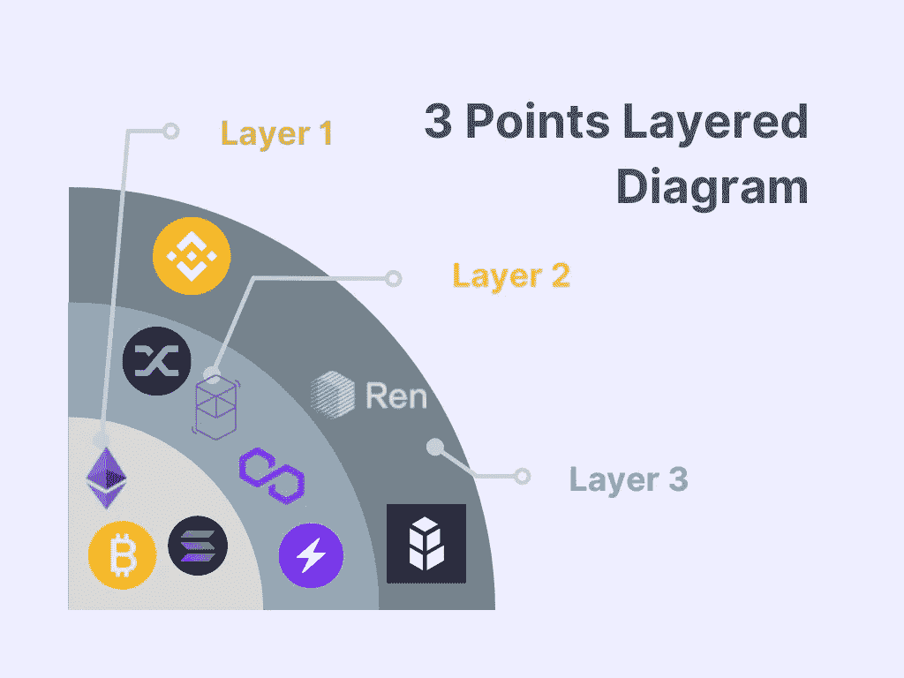

# 基于区块链层的框架

> 原文：<https://medium.com/coinmonks/blockchain-layer-based-framework-c1f71a9fcb8f?source=collection_archive---------13----------------------->

区块链层帮助我们理解不同区块链、dApps 项目和其他开发工具的更大图景。

区块链平台分为 3 个不同的层次。

Layer based blockchain diagram

第 1 层指的是实际的底层区块链及其核心架构和功能。第一层网络的例子有**比特币、以太坊和索拉纳区块链。**

第 2 层协议通常结合使用链上和链下操作来提供扩展的功能。比特币第二层项目的例子包括**闪电网络、以太坊多边形和 Fantom。**

第 3 层指的是在区块链上启用 DApps 的协议。一些知名的基于 fantom 的 dapp 有[任](https://renproject.io/)、[多链. xyz](https://multichain.xyz/) ，以及 polygon 拥有广泛[生态系统](https://polygon.technology/ecosystem/)的 dapp。

# 区块链可扩展性？

区块链技术奋力应对被称为 [**的独特挑战区块链三难困境**](https://finance.yahoo.com/news/layer-two-solutions-help-solve-144306678.html)；这是区块链基础设施中可扩展性、安全性和分散性之间的平衡因素。

*   可伸缩性是处理大量事务的能力。
*   安全性反映了区块链协议对恶意行为者和网络攻击的防御能力。
*   去中心化是计算能力的分配&网络内的共识。

## **第一层**

它是指一个基础网络，例如，比特币或以太坊&它遵循[工作证明](https://www.gemini.com/cryptopedia/bitcoin-mining-cost-proof-of-work-crypto-mining#section-bitcoin-mining-costs-and-proof-of-work-po-w) (PoW)块验证机制。

***挑战同层 1:-***

比特币遭遇了许多可扩展性问题。在网络拥塞期间，比特币的平均交易费用可能会飙升，就像 2017 年加密热潮期间一样，当时交易费用达到近 60 美元。比特币平均交易费目前处于 1.486 的水平，低于昨日的 1.872，也低于一年前的 21.11。这与昨天相比变化了-20.61%，与一年前相比变化了-92.96%。(来源——[区块链](https://ycharts.com/indicators/sources/blockchain))。这种提高导致块验证变慢&消耗能量。这就引出了第 2 层协议。

**第二层**

这一层完全建立在现有的区块链(第 1 层)之上。第二层是与第一层结合使用的第三方集成，用于增加节点数量，从而提高系统吞吐量。比特币的二层平台例子有 [**闪电网**](https://lightning.network/) 以太坊有[多边形](https://polygon.technology/)[Fantom](https://fantom.foundation/)等。

**第三层**

这是由区块链的应用程序，如 Defi 应用程序和游戏项目代表的。现在有许多应用程序支持跨链功能，允许用户从一个应用程序访问各种区块链平台。

***关键外卖:-***

第一层是去中心化系统的基础，这个系统遇到了很多可扩展性问题，这些问题通过第二层来解决。基于第三层的应用程序正在证明自己扮演着重要的角色，因为它们有助于开发真实世界的区块链用例。

> 加入 Coinmonks [电报频道](https://t.me/coincodecap)和 [Youtube 频道](https://www.youtube.com/c/coinmonks/videos)了解加密交易和投资

# 另外，阅读

*   [OKEx vs KuCoin](https://coincodecap.com/okex-kucoin) | [摄氏替代品](https://coincodecap.com/celsius-alternatives) | [如何购买 VeChain](https://coincodecap.com/buy-vechain)
*   [ProfitFarmers 回顾](https://coincodecap.com/profitfarmers-review) | [如何使用 Cornix Trading Bot](https://coincodecap.com/cornix-trading-bot)
*   [如何匿名购买比特币](https://coincodecap.com/buy-bitcoin-anonymously) | [比特币现金钱包](https://coincodecap.com/bitcoin-cash-wallets)
*   [瓦济里克斯 NFT 评论](https://coincodecap.com/wazirx-nft-review)|[Bitsgap vs Pionex](https://coincodecap.com/bitsgap-vs-pionex)|[丹吉尔评论](https://coincodecap.com/tangem-wallet-review)
*   [如何使用 Solidity 在以太坊上创建 DApp？](https://coincodecap.com/create-a-dapp-on-ethereum-using-solidity)
*   [币安 vs FTX](https://coincodecap.com/binance-vs-ftx) | [最佳(SOL)索拉纳钱包](https://coincodecap.com/solana-wallets)