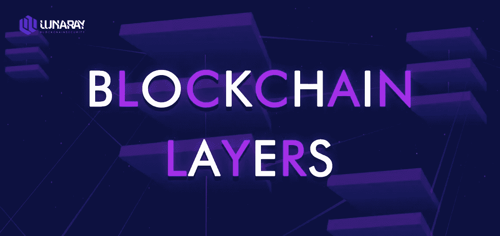
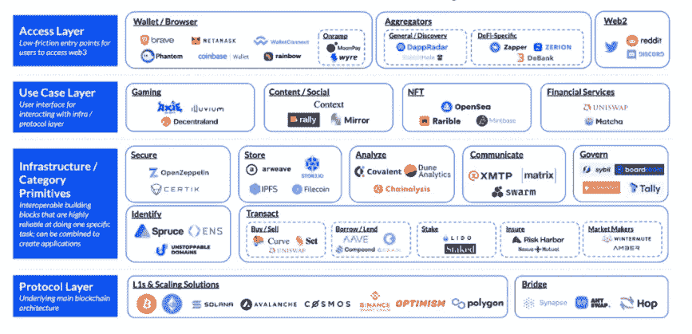
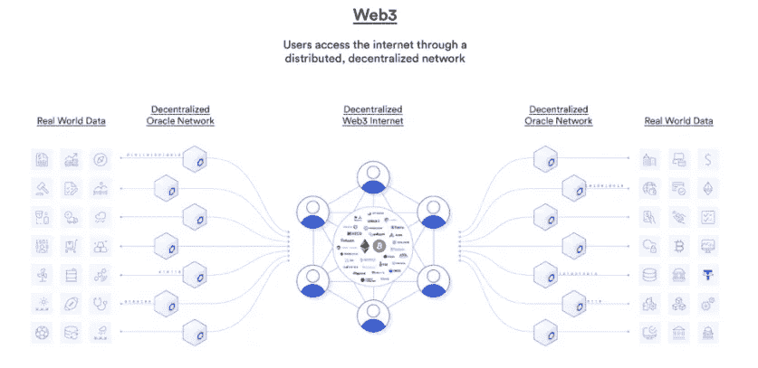

# 区块链层

> 原文：<https://medium.com/coinmonks/blockchain-layers-803942545503?source=collection_archive---------17----------------------->

## 0x01 预览 Web3 实用程序

Web3 已经成为一个包罗万象的术语，用来描述一个新的、更好的互联网。在其核心，Web3 使用区块链、加密货币和 NFTs **以所有权的形式把权力还给用户**。Twitter 上 2020 年的一篇帖子说得好:Web1 是只读的，Web2 是读写的，Web3 将是读写所有的。

你可能会问 Web3 的层次是什么？让我们深入了解区块链网络的更多细节

区块链技术是各种技术的融合，汇集在一个屋檐下，帮助系统平稳运行。数学计算、密码术、博弈论、对等系统和验证协议本质上联合起来推动了区块链操作。

但是，由于区块链消除了中央管理机构的存在，所有交易都必须得到可靠的保护，并且数据必须安全地存储在分布式分类帐中。分布式账本技术(DLT)根据预设协议工作，网络(或节点)中的各种计算机达成“共识”以验证交易数据。每个节点在条目到来时添加、检查和更新条目。

区块链有一个分层的体系结构来促进这种独特的交易认证方式。这里涉及五层，每层都有其独特的功能。

## **0x02 硬件基础层:**

硬件基础设施层

客户端在浏览网页或使用任何应用程序时，会向应用服务器请求内容或数据，这就是所谓的客户端-服务器架构。客户端现在可以与对等客户端连接并共享数据。点对点( **P2P** )网络是一大群共享数据的计算机。

区块链数据安全地存储在数据服务器中。当我们浏览网页或使用任何区块链应用程序时，我们的机器会向服务器请求访问这些数据。促进这种数据交换的框架被称为客户端-服务器架构。它只不过是一个庞大的设备网络，这些设备相互通信并相互请求数据。分布式分类帐就是这样创建的。与网络上另一台设备通信的每台设备都是一个节点。每个节点随机验证交易数据。

## **0x03** 数据层

数据层:这一层**充当区块链数据结构和物理存储**。账本是用块的链表或**默克尔树**建立的，这些块是用非对称加密法加密的。

Merkle tree **以高效安全的方式对区块链数据进行编码**。它能够快速验证区块链数据，以及在对等区块链网络上将大量数据从一个计算机节点快速移动到另一个节点。

区块链不过是一长串包含交易数据的“块”。当节点验证一定数量的事务时，数据被捆绑到“块”中，添加到区块链，并与前一个数据块链接。**创世纪区块是链中的第一个区块，因此不需要与任何先前的区块链接。**取而代之的是，后续块与起源块链接，并且每次添加新块时重复该过程。这就是区块链的形成和不断成长的过程。

每笔交易都用发送者钱包的私钥进行了数字签名**。只有发送方可以访问这个密钥，从而确保数据既不能被其他任何人访问也不能被篡改。用区块链的术语来说，这叫做“终结”。数字签名还保护所有者的身份，它本身是加密的，从而确保最大的安全性。**

## 0x04 网络层

以太坊网络，或者说第一层，就是人们所说的以太坊。这一层负责共识过程、编程语言、阻塞时间、争议解决以及维护区块链网络基本功能的规则和参数。它也被称为实现层。

P2P 框架使各种节点能够交换交易数据，以就交易的有效性达成共识。这意味着每个节点必须能够发现网络上的其他节点，以便快速通信。正是网络层促进了这种“节点间通信”。**作为节点发现**、**块创建**、**块添加**也是由该层管理的**，也称为“**传播层**”**

## 0x05 共识层

共识层是任何区块链中最必要也是最关键的一层，无论是以太坊、超账本还是其他。共识层负责验证这些块，对它们进行排序，并保证每个人都同意。

这是区块链行动中最关键的一层。**这一层负责验证交易，没有它，整个系统将会失败**。这一层运行需要一定数量的节点来验证一个事务的协议。因此，每个事务都由多个节点处理，这些节点必须得出相同的结果，并就其有效性达成一致。该框架保持了区块链的分散性质，因为没有节点对任何事务性数据拥有唯一的控制权，并且角色是分布式的。这被称为共识机制。

由于有如此多的节点处理事务，将它们捆绑起来并添加到区块链，因此可能会同时创建多个块，从而在区块链产生一个分支。然而，必须总是添加单个链块，并且共识层也确保这种冲突得到解决

## 0x06 应用层:

智能合约、链码和分散式应用程序(DApps)构成了应用层。应用层协议进一步细分为应用层和执行层。应用层包括最终用户用来与区块链网络通信的程序。

这是智能合同和分散应用程序(dApps)运行的层。智能合约基于某些触发因素做出决策，如合约到期日、现货价格的实现等。这些决定之后的行动由 dApps 执行。所有这些都发生在应用层。

dApps 还促进了用户设备和区块链之间的通信。因此，应用程序就像是面向用户的前端，而主区块链是后端，数据安全地存储在这里。

所以，你有了它——帮助它平稳运行的区块链的 5 层。然而，如果你一直在阅读有关区块链的书籍，你一定也遇到过类似于**第 0 层**、**第 1 层**、**第 2 层**等术语。那么这些层是什么呢？让我们找出答案。

## 0x07 第 0 层

第 0 层是区块链的初始阶段，允许各种网络运行，如比特币、以太坊等。第 0 层还为区块链提供了从顶层到不同层的跨链互操作性通信设施。第 0 层为区块链提供底层基础设施。

## 0x08 第 1 层

第 1 层区块链是一组改进基本协议本身的解决方案，使整个系统更具可扩展性。有两种最常见的第 1 层解决方案，它们是**共识协议变更**以及**分片**。这一层管理确保区块链网络安全的协议。第 1 层包括共识机制、编码语言和嵌入在区块链操作代码中的所有规则。因此，有时这也被称为“实现层”**当用户提到比特币区块链时，他们指的就是这一层。**

## 0x09 第 2 层

第 2 层是指建立在现有区块链系统之上的二级框架或协议。这些协议的主要目标是解决主要加密货币网络面临的交易速度和扩展困难。第 2 层是一个新的网络，处理所有的交易认证并解除第 1 层的拥塞。第 1 层仅处理块的创建和向区块链的添加。新的第二层网络位于第一层网络之上，并与第一层网络持续通信。

闪电网络是坐在比特币区块链上的第二层区块链的一个例子。

## 0x10 第 3 层

第 3 层通常被称为应用层。这是一个托管 DApps 和支持应用的协议的层。虽然以太坊(Ethereum)或 Solana (SOL)等一些区块链拥有各种各样的第三层应用，但比特币并没有为托管此类应用进行优化。

**智能合同和 dApps 仅处理第 3 层的决策和后续行动的执行。**由于区块链的最大功能源自 dApps 的创新，这是现实世界应用程序和底层之间的接口层，为一切提供便利。

**以上这些都是乏味的概念，现在我们有一些有趣的部分(希望如此):)**

首先，我们来看看 Web3 的组成。根据比特币基地的分类，Web3 大致可以分为 4 层。协议层、基础设施/类别原语、用例层、访问层

Coinbase

Web3 的核心元素:区块链、加密资产、智能合约和甲骨文

## Web 3.0 架构的层次

*   应用层将拥有 dApp 浏览器、应用托管、dApp 和用户界面应用，作为各种 Web3 活动的入口点。
*   层的第二阶段基本上进入技术层。这一层涵盖了创建和运行应用层所涉及的所有重要工具。它通常涵盖数据馈送、链外计算、治理(DAOs)、状态通道和侧链。
*   协议层涵盖了不同的共识算法、参与要求、虚拟机等等。
*   网络层充当对等网络的传输介质和接口，并决定数据如何打包、寻址、传输、路由和接收。它主要由 RLPx、Rolls your Own 和可信执行环境(TEE)组成。
*   在堆栈的底部，我们有基础架构层。这是由底层的区块链架构组成的，其他一切都建立在它的上面。

# 结论

如果这一切让你头晕目眩，你并不孤单！将所有这些工具拼凑在一起是复杂的，可能会给开发人员带来痛苦的体验。

随着人们对数据隐私的日益关注，web3 创新将会比以往任何时候都来得更快。重要的是，你要对这个领域有一个基本的了解，因为它将影响我们的工作方式。

ref:[https://www . cnbctv 18 . com/cryptocurrency/how-does-work-and-what-its-different-layers-explained-12686212 . htm](https://www.cnbctv18.com/cryptocurrency/how-does-blockchain-work-and-what-are-its-different-layers-explained-12686212.htm)

> 加入 Coinmonks [电报频道](https://t.me/coincodecap)和 [Youtube 频道](https://www.youtube.com/c/coinmonks/videos)了解加密交易和投资