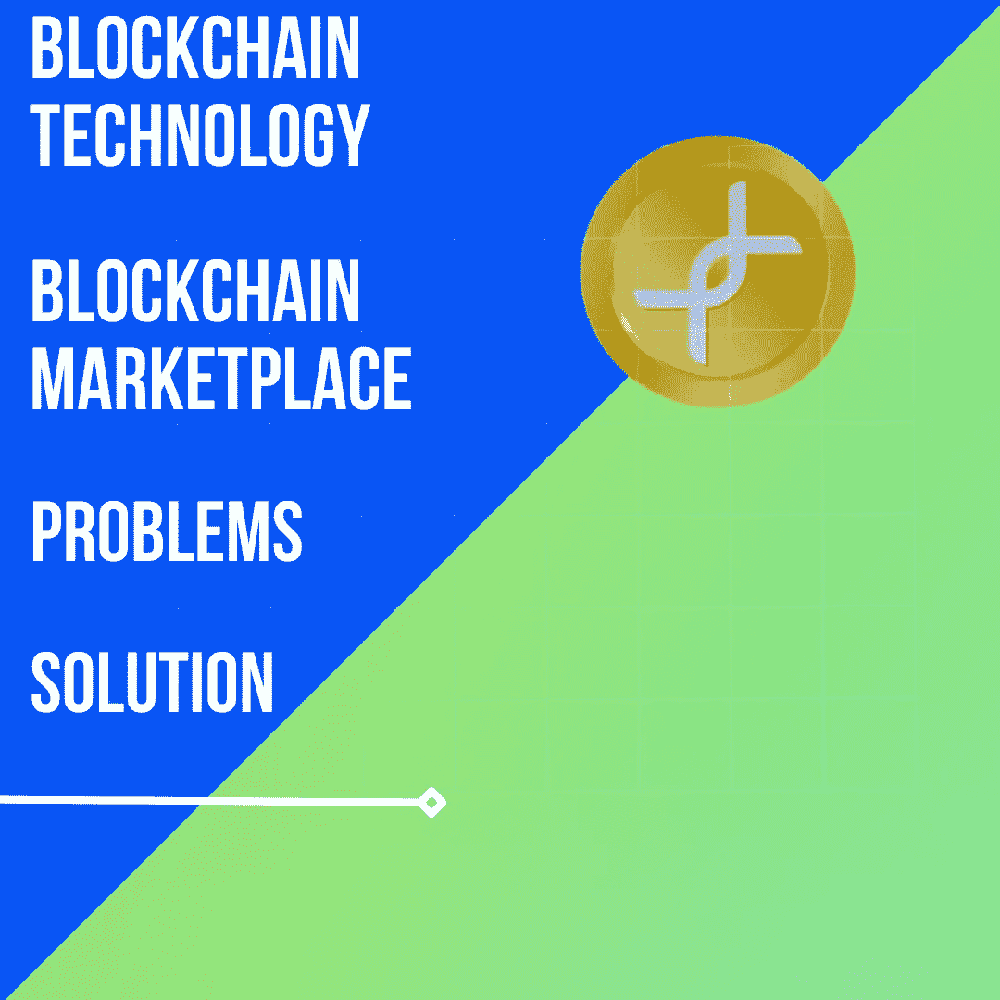

# 区块链市场|区块链技术|问题|解决方案

> 原文：<https://medium.com/coinmonks/blockchain-marketplace-blockchain-technology-problems-solution-e4ee5eeeac60?source=collection_archive---------56----------------------->

Blockchain Marketplace | Blockchain Technology | Problems | Solution

# 什么是区块链？

区块链是一个分散的数据库，在计算机网络节点之间共享。区块链充当数据库，以数字格式存储信息。区块链因其在比特币等加密货币系统中保持安全和分散的交易记录的功能而得到广泛认可。区块链的独创性在于，它确保了数据记录的准确性和安全性，同时还在不需要可信第三方的情况下产生信任。

# 区块链技术

区块链技术是一个对等节点网络，它在各种数据库(也称为“链”)中保存公众的交易记录(也称为块)这种存储方式有时被称为“数字账本”该分类账中的每一笔交易都有所有者的数字签名，以验证交易并防止交易被操纵。因此，数字账本中的数据极其安全。

换句话说，数字账本类似于谷歌电子表格，在网络中的几台计算机之间共享，并存储基于实际购买的交易信息。有趣的是，每个人都可以查看数据，但不能更改/编辑它。

# 区块链技术的主要问题

**昂贵:**

将区块链技术投入使用的成本是巨大的。尽管事实上包括 Hyperledger 在内的大多数区块链解决方案都是开源的，但它们需要希望采用它们的公司进行大量投资。

雇佣开发人员，维持一个专门研究区块链技术各个方面的团队，如果你选择付费的区块链解决方案，还需要支付许可费用，等等，这些都是有成本的。您还必须考虑与解决方案相关的维护成本。喜欢区块链的想法，但缺乏资金或预算来实施它的企业可能要等更长时间才能加入。

**安检:**

*   在 51 %攻击中，如果一个实体可以控制 51 %或更多的网络节点，它就可以获得对网络的控制。他们可以更改分类账中的数据，并因此重复支出。这在矿工或节点可能被控制的网络上是可以想象的。这表明专用网络更能抵抗 51 %的攻击，而公共网络更容易受到攻击。
*   现有区块链技术的另一个问题是重复支出。为了避免重复支出，区块链网络使用了各种共识方法，包括利害关系证明和工作证明。只有易受 51 %攻击的网络才能进行双重支出。
*   在 DDoS 攻击中，节点受到类似请求的攻击，堵塞网络并使其瘫痪。
*   区块链技术采用的加密解决方案是另一种不安全的方式。量子算法或计算机能够破解密码破解。然而，量子验证加密技术目前正在区块链应用中实施。

**隐私:**

创建区块链的目的是为了广泛分发。这意味着每个人都可以看到存储在区块链上的信息。尽管数据通过使用区块链钱包地址作为标识符而被匿名化，但交易的其他细节是可见的。

私有区块链限制谁可以作为节点加入以及谁可以访问事务。私人区块链是公司使用区块链技术而不用担心信息泄露给公众的一种方式，但它也有缺点。一个私人区块链并不是完全去中心化的，因为它有一个决定谁能和谁不能参与的权威。这可能会削弱公众对区块链产品的信心。

# 解决办法

目前还没有任何解决方案，这就是我们推出 Uniblok 的原因，我们将改变你对区块链的感觉。

**查看我们:**

[**Instagram**](https://www.instagram.com/uniblok_techpvtltd/)

[**推特**](https://twitter.com/UniblokPVTLTD)

[**Linkedin**](https://www.linkedin.com/company/uniblok-tech-pvt-ltd)

[**脸书**](https://www.facebook.com/Uniblok-Tech-Pvt-Ltd-115934447782742/)

[**Pinterest**](https://pin.it/2GgpV3f)

> 交易新手？尝试[加密交易机器人](/coinmonks/crypto-trading-bot-c2ffce8acb2a)或[复制交易](/coinmonks/top-10-crypto-copy-trading-platforms-for-beginners-d0c37c7d698c)