# 区块链资金流动

> 原文：<https://medium.com/coinmonks/blockchain-money-moves-8e8522c2ec4e?source=collection_archive---------44----------------------->

## 什么是链上分析

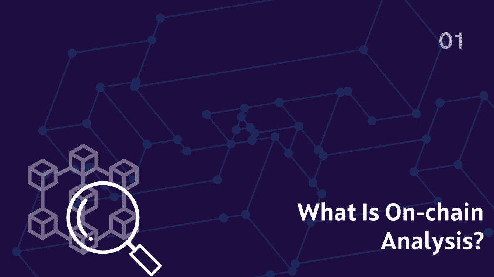

What is on-chain analysis

像[区块链](https://en.wikipedia.org/wiki/Blockchain)和 [DAGs(有向无环图)](https://en.wikipedia.org/wiki/Directed_acyclic_graph)这样的分布式账本技术最近已经成为支付的首选解决方案，因为它们的公共性质是由去中心化方式实现的。

与传统的财务系统不同，没有第三方参与，用户可以轻松地验证交易和查询区块链的状态，帮助他们做出财务决策和结论。

本出版物将带您了解链上分析，这是一种用于从区块链活动、平台和指标中获取洞察力的技术，以便根据区块链的状态做出决策。

**本出版物讨论了以下内容**。

*   什么是链上分析？
*   链上分析平台。
*   链上指标和比率。

# 什么是链上分析

**连锁分析**是一种基于研究的分析技术，将资产的基本面及其交易数据考虑在内，以得出结论并做出决策。

链上分析平台使用区块链刮刀、oracles 和 API 来整理各种来源的数据以进行分析。

随着区块链被采用，交易数据从不同背景的个人那里得到整理，这些数据被当作研究的蓝图，以聚集事件。

# 链上分析平台

在初级水平上，最重要的链上分析平台是区块链探索者，如 Etherscan 和 Cardanoscan，它们提供原始交易数据和可替代、不可替代的令牌统计数据。

像 [Glassnode](http://glassnode.com/) 和 [IntoTheBlock](http://intotheblock.com/) 这样的二级链上分析平台更具描述性和实用性。他们使用各种来源，包括区块链探索者，来整理用于创建洞察指标和比率的数据。

在本书中，我们将以 [Solscan](http://solscan.com/) (索拉纳·区块链探险家) [Glassnode](http://glassnode.com/) 、 [IntoTheBlock](http://intotheblock.com/) 、 [Cryptoquant、](http://cryptoquant.com/)和 [Sanbase](https://app.santiment.net/) 为例，回顾链上分析平台，并讨论它们的特性。

# 索尔斯坎

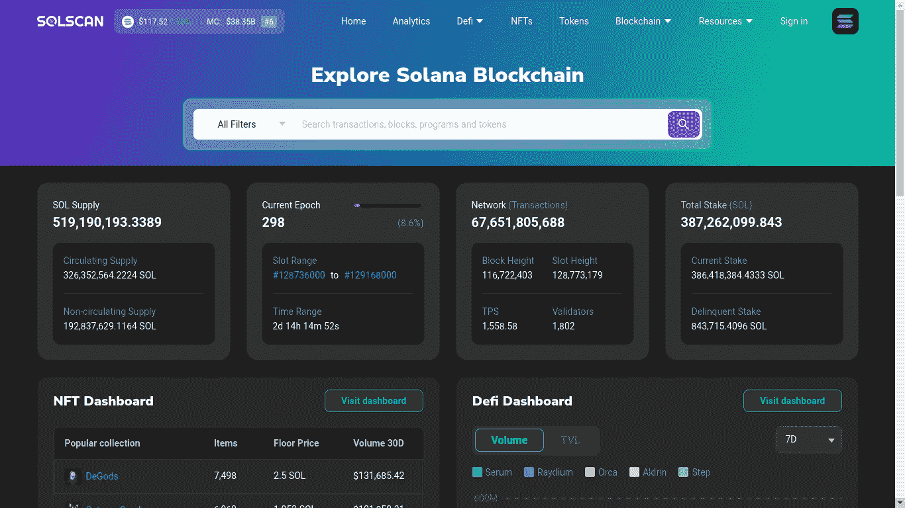

Solscan

Solscan 是索拉纳生态系统中最受欢迎的区块链探险家。Solscan 在网页上提供交易数据、索拉纳区块链数据、NFT 和 DEFI 仪表板以及索拉纳分析。个人可以审计智能合同令牌，并使用 Solscan 提供的许多其他功能。

像[以太扫描](http://etherscan.io/)、 [Bscscan](http://bscscan.com/) 和 [Cardanoscan](http://cardanoscan.io/) 这样的区块链探索者构建类似，并提供类似的功能。

# 玻璃节点

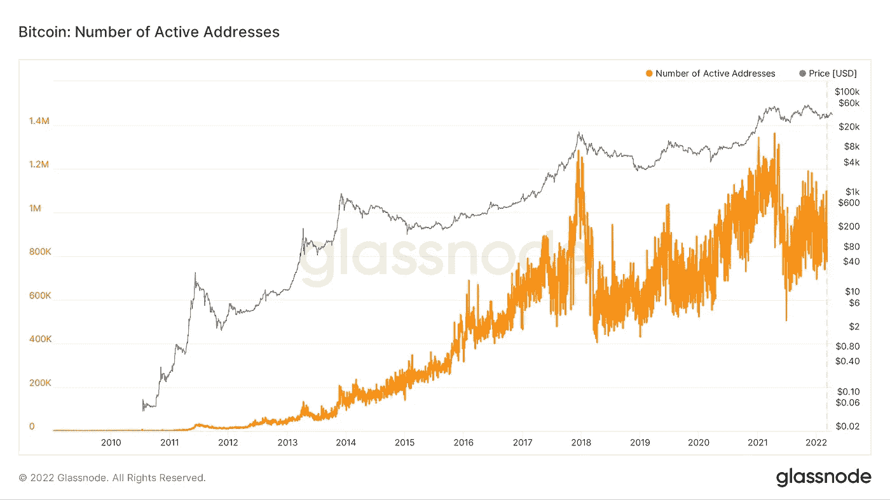

glassnode

[Glassnode](https://glassnode.com/) 是一个流行的链上智能平台，具有专门的分析工作室和各种链上指标。Glassnode 支持不同的区块链、令牌和资产以及衍生品。

Glassnode 还允许其用户结合指标和比率进行洞察，使其更加灵活。

# IntoTheBlock

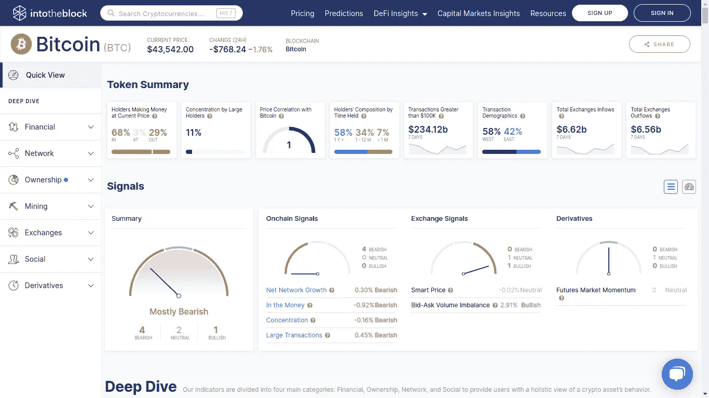

intotheblock

[IntoTheBlock](https://www.intotheblock.com/) 是一个区块链智能平台，使用数据科学和人工智能来收集和分析区块链数据。

IntoTheBlock 为用户提供区块链、市场和 DEFI 分析和价格预测，指标超过 257 个，支持九个区块链。

# 三碱

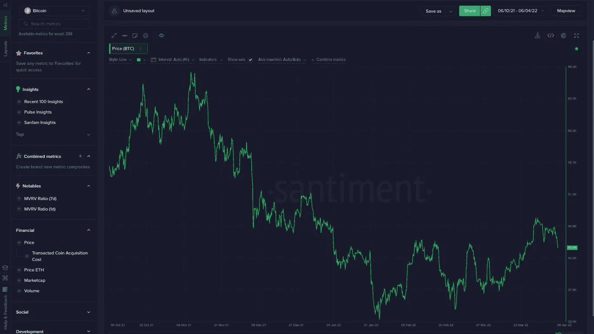

sanbase

[Sanbase](https://app.santiment.net/) 是一个行为分析平台，它结合了链上分析和情感分析，使用机器努力和人类直觉来得出结论。

Sanbase 用户可以访问各种数据源，如价格和数量、开发活动、社交媒体活动、持有者行为活动以及价格和趋势分析。

# 密码量子

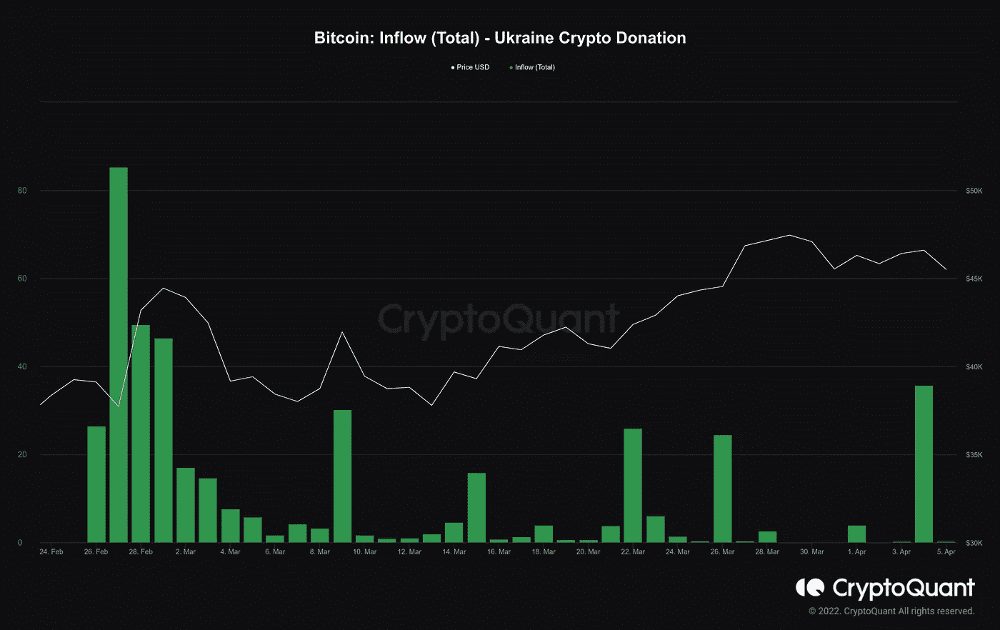

cryptoquant

Cryptoquant 是一个成熟的链上分析平台，拥有大多数链上分析指标和比率。

与大多数链上分析平台不同，Cryptoquant 支持区块链上的各种令牌，而不仅仅是区块链的底层加密货币。

# 链上指标和比率

不同的链上分析平台提供了大量的链上指标和比率；然而，在这份出版物中，我们将讨论最流行的关于它们是如何产生的以及它们意味着什么。

链上指标和比率在更老的区块链和加密货币上表现更好，如[比特币](http://bitcoin.org/)和[以太坊](http://ethereum.org/)，它们拥有更长时期的历史数据。

# MVRV 比率

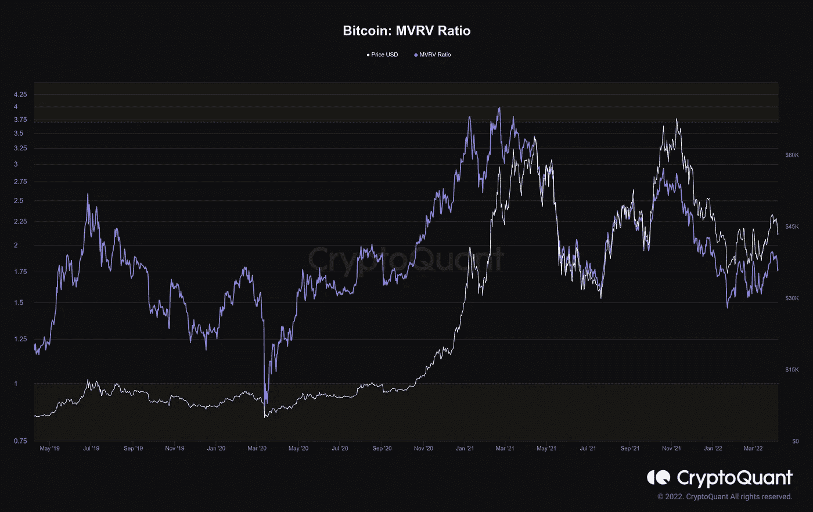

MVRV ratio

**MVRV(市值与已实现价值)比率**是一项资产的**市值**与其**已实现市值**的链上分析比率。在计算资产的 MVRV 比率时，我们得到了价格的公平性，因为它表明了资产在流通中的平均损益。

MVRV 比率超过 3.7 表明可能的市场顶部，比率低于 1 表明可能的市场底部。

# 库存流量比

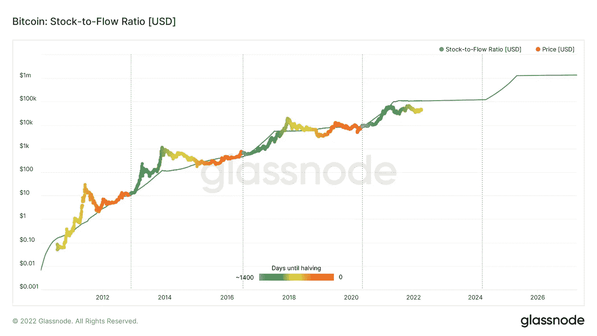

stock to flow ratio

**存量-流量比率(S/F)** 是一项资产的**流通供应量**与**新供应量**的比率。这一比例有助于比特币等加密货币，在这些货币中，新的硬币被挖掘出来。

如图所示，库存流量比率用于根据市场稀缺程度对资产价值进行数学评估；当新的硬币和代币被供应时，这个比例增加，反之亦然。

# NVT 比率

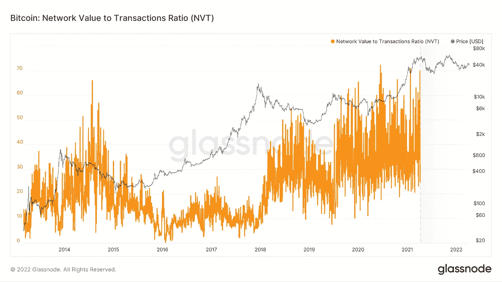

glassnode

**净值对交易(NVT)比率**是特定时间范围内某项资产的市值与交易量的比率。稀缺性和需求是该指标中考虑的情感因素。

高 NVT 比率表明网络价值过高，可能达到市场顶部，反之亦然，因为减少网络交易表明用户不感兴趣。

# 交换流量指标

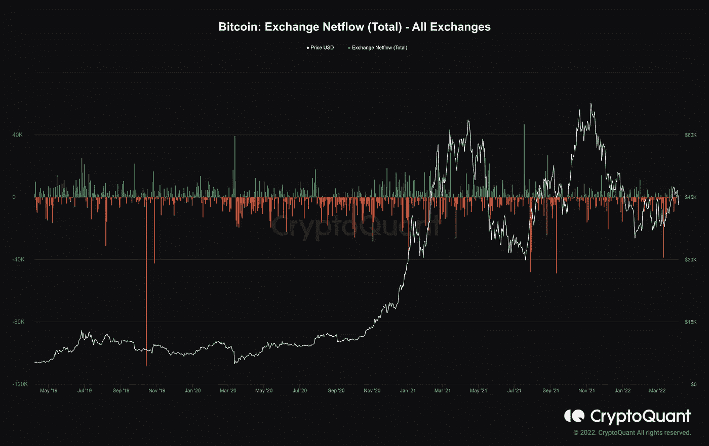

cryptoquant

**集中式交换的交换流指标**是最流行和最重要的链上分析指标之一。交换流量指标，如交换储备、交换流入、交换流出和交换净流量，有助于了解网络上资产和价值的移动。

**交易所流入**是从钱包送到交易所的资产价值。不断增加的外汇流入表明抛售和可能的市场顶部。

外汇储备通常以美元等稳定货币计算，是集中交易所的资产价值。大规模抛售将增加外汇储备，外汇储备可用于日后购买或转换为法定货币。

**外汇流出**是离开交易所流向钱包的资产价值。外汇外流增加表明投资者持有他们的资产，可能不会很快抛售。

**汇兑净流量是**汇兑流入与流出的差额。这在市场动荡和波动时很有用。

# NUPL 比率

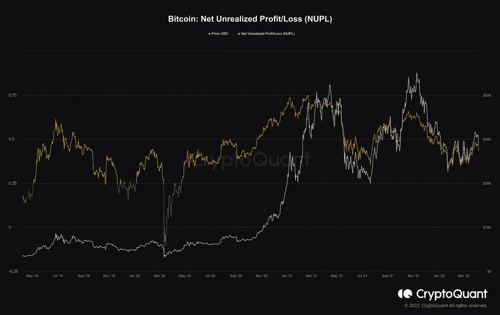

NUPL ratio

**NUPL(未实现净损益)**是一项资产的市值和已实现市值之差与市值之比。NUPL 比率提供了一个评估资产投资者购买资产的损益百分比的指标。

如果大多数投资者获利，这将促使他们卖出并获得利润，从而降低资产价格。随着 NUPL 比率从 0 到 1，越来越多的投资者获利，反之亦然。

# 结论

执行链上分析需要对基本面分析、链上指标以及如何使用链上分析平台有一个基本的了解。链上分析平台通常有资源和文档来解释指标，如何使用它们，以及如何导航他们的平台。

链上分析是加密货币的新功能，新的区块链可能无法很好地反映这些指标；此外，使用第 2 层解决方案对区块链进行的链上分析可能不准确，尤其是在累计和解决方案签署离线交易的情况下。

链上分析非常有用，结合基本面分析和技术分析可以帮助扩大选择和投资决策。

***没有 FTX 户口？这个链接给你 20%的交易费用。***

 [## FTX

### FTX 加密货币衍生品交易所，由交易商建立，面向交易商。买卖 BTC，瑞士联邦理工学院，溶胶代币和期货…

ftx.com](https://ftx.com/#a=17138232) 

> 免责声明:这是用于基本面分析目的的教育内容，本出版物中的任何内容都不应被视为财务建议。

> 加入 Coinmonks [电报频道](https://t.me/coincodecap)和 [Youtube 频道](https://www.youtube.com/c/coinmonks/videos)了解加密交易和投资

# 另外，阅读

*   [印度最佳 P2P 加密交易所](https://coincodecap.com/p2p-crypto-exchanges-in-india) | [柴犬钱包](https://coincodecap.com/baby-shiba-inu-wallets)
*   [八大加密附属计划](https://coincodecap.com/crypto-affiliate-programs) | [eToro vs 比特币基地](https://coincodecap.com/etoro-vs-coinbase)
*   [最佳以太坊钱包](https://coincodecap.com/best-ethereum-wallets) | [电报上的加密货币机器人](https://coincodecap.com/telegram-crypto-bots)
*   交易杠杆代币的最佳交易所 | [购买弗洛基](https://coincodecap.com/buy-floki-inu-token)
*   [3Commas 对 Pionex 对 Cryptohopper](https://coincodecap.com/3commas-vs-pionex-vs-cryptohopper)|[Bingbon Review](https://coincodecap.com/bingbon-review)
*   [加密复制交易平台](/coinmonks/top-10-crypto-copy-trading-platforms-for-beginners-d0c37c7d698c) | [如何在 WazirX 上购买比特币](/coinmonks/buy-bitcoin-on-wazirx-2d12b7989af1)